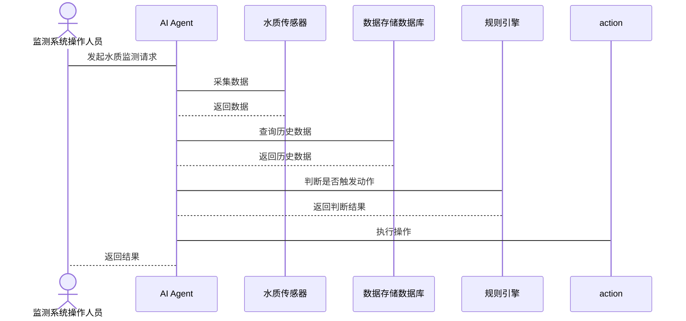

                 


# AI Agent在智能水质监测中的实践

> 关键词：AI Agent, 智能水质监测, 机器学习, 实时监测, 数据分析

> 摘要：本文详细探讨了AI Agent在智能水质监测中的应用，从背景、核心概念到算法实现、系统设计、项目实战和应用优化，全面分析了AI Agent如何提升水质监测的效率和准确性。通过实际案例和代码示例，展示了AI Agent在水质监测中的具体应用场景和实现方法。

---

# 第一部分: AI Agent在智能水质监测中的背景与概念

# 第1章: AI Agent与水质监测概述

## 1.1 AI Agent的基本概念

### 1.1.1 AI Agent的定义

AI Agent（人工智能代理）是一种能够感知环境、自主决策并执行任务的智能体。它具备学习、推理、规划和自适应能力，能够在复杂环境中完成特定目标。

### 1.1.2 AI Agent的核心特点

- **自主性**：能够在没有外部干预的情况下独立运行。
- **反应性**：能够实时感知环境变化并做出响应。
- **目标导向**：所有行为都围绕实现特定目标展开。
- **可扩展性**：能够适应不同规模和复杂度的任务。

### 1.1.3 AI Agent与传统自动化的区别

| 特性        | AI Agent                     | 传统自动化                  |
|-------------|------------------------------|-----------------------------|
| 决策能力     | 高度智能，自主决策            | 基于预设规则，无智能决策      |
| 环境适应性   | 能够自适应复杂环境            | 适应性有限，依赖固定条件      |
| 学习能力     | 具备学习能力，持续优化         | 无学习能力，依赖固定程序      |
| 可扩展性     | 支持复杂任务，可扩展性强      | 适用于简单任务，扩展性有限    |

## 1.2 智能水质监测的背景与意义

### 1.2.1 水质监测的定义与重要性

水质监测是指对水体中的物理、化学和生物参数进行测量和分析的过程，用于评估水质是否符合国家标准。随着工业化和城市化的快速发展，水质问题日益严重，水质监测的重要性更加凸显。

### 1.2.2 智能水质监测的现状

传统水质监测系统依赖人工操作，效率低且成本高。智能水质监测通过引入物联网（IoT）、大数据和AI技术，实现了实时监测、智能分析和自动反馈，显著提高了监测效率和准确性。

### 1.2.3 AI Agent在水质监测中的应用前景

AI Agent能够通过实时数据采集、智能分析和自主决策，帮助水质监测系统实现自动化、智能化和高效化。AI Agent的应用可以显著降低运营成本，提高监测精度，并快速响应突发问题。

## 1.3 AI Agent与水质监测的结合

### 1.3.1 AI Agent在水质监测中的作用

AI Agent能够实时采集水质数据、分析数据、识别异常情况并触发相应措施。例如，当检测到水质超标时，AI Agent可以自动启动净化设备或发出警报。

### 1.3.2 水质监测系统的核心需求

- **实时性**：要求快速采集和处理数据，确保监测结果的实时性。
- **准确性**：要求算法具备高精度，确保监测结果的准确性。
- **自主性**：要求系统能够自主运行，减少人工干预。

### 1.3.3 AI Agent如何满足水质监测的需求

AI Agent通过实时数据采集、智能分析和自主决策，能够满足水质监测系统对实时性、准确性和自主性的需求。例如，AI Agent可以通过强化学习优化监测策略，通过神经网络分析数据，通过规则引擎触发执行操作。

## 1.4 本章小结

本章介绍了AI Agent的基本概念和核心特点，分析了智能水质监测的背景和意义，并探讨了AI Agent在水质监测中的应用前景和作用。通过对比分析，明确了AI Agent在水质监测系统中的重要性。

---

# 第2章: 水质监测系统的核心概念与联系

## 2.1 核心概念原理

### 2.1.1 水质监测系统的组成

水质监测系统通常由传感器、数据采集模块、数据处理模块、分析模块和执行模块组成。AI Agent作为系统的核心，负责协调各模块的工作。

### 2.1.2 AI Agent在水质监测中的功能模块

- **数据采集模块**：负责采集水质传感器的数据，如温度、pH值、溶解氧等。
- **数据处理模块**：对采集到的数据进行预处理，去除噪声，提取特征。
- **分析模块**：利用机器学习算法对数据进行分析，识别异常情况。
- **决策模块**：根据分析结果，决定是否需要采取行动，如启动净化设备或发出警报。

## 2.2 概念属性特征对比

| 概念        | 描述                                                                 |
|-------------|----------------------------------------------------------------------|
| 数据采集     | 从传感器获取原始数据                                                 |
| 数据处理     | 对数据进行清洗、归一化和特征提取                                     |
| 数据分析     | 利用机器学习算法对数据进行建模和预测                                   |
| 决策模块     | 根据分析结果，制定行动策略                                           |

### 2.2.1 水质监测系统与传统监测系统的对比

| 特性        | 智能水质监测系统                       | 传统水质监测系统                     |
|-------------|----------------------------------------|---------------------------------------|
| 数据采集     | 实时采集，自动传输                   | 手动采集，周期性传输                 |
| 数据分析     | 自动分析，AI驱动                   | 人工分析，依赖固定规则               |
| 决策能力     | 自主决策，触发执行操作               | 无决策能力，依赖人工操作             |
| 效率         | 高效，实时响应                     | 低效，响应延迟                       |

### 2.2.2 AI Agent与传统控制系统的对比

| 特性        | AI Agent                            | 传统控制系统                      |
|-------------|------------------------------------|----------------------------------|
| 自主性       | 高度自主，能够自适应环境             | 依赖固定规则，无自主性             |
| 学习能力     | 具备学习能力，能够优化策略           | 无学习能力，依赖固定程序           |
| 可扩展性     | 支持复杂任务，可扩展性强             | 适用于简单任务，扩展性有限         |

## 2.3 ER实体关系图

```mermaid
er
  actor: 监测系统操作人员
  agent: AI Agent
  sensor: 水质传感器
  database: 水质数据存储
  rules: 检测规则
  action: 执行操作
  actor --> agent: 发起请求
  agent --> sensor: 采集数据
  agent --> database: 查询历史数据
  agent --> rules: 判断是否触发动作
  agent --> action: 执行操作
```

## 2.4 本章小结

本章详细介绍了水质监测系统的组成和功能模块，分析了智能水质监测系统与传统监测系统、AI Agent与传统控制系统的差异，并通过ER实体关系图展示了系统的整体架构。通过对比分析，明确了AI Agent在水质监测系统中的核心作用。

---

# 第3章: AI Agent在水质监测中的算法原理

## 3.1 算法原理概述

### 3.1.1 基于强化学习的水质预测模型

强化学习是一种通过试错机制来优化决策的算法。在水质监测中，强化学习可以用于预测水质变化趋势，并制定最优的监测策略。

### 3.1.2 基于监督学习的水质分类模型

监督学习是一种通过标记数据训练模型的算法。在水质监测中，监督学习可以用于分类水质状态，如正常、轻微污染、严重污染等。

## 3.2 算法流程图

```mermaid
graph TD
    A[开始] --> B[数据采集]
    B --> C[数据预处理]
    C --> D[选择算法]
    D --> E[模型训练]
    E --> F[模型评估]
    F --> G[部署应用]
    G -
```

## 3.3 算法实现细节

### 3.3.1 强化学习模型的数学模型

强化学习的核心是通过状态-动作-奖励的机制来优化决策。数学模型如下：

$$ Q(s, a) = r + \gamma \max_{a'} Q(s', a') $$

其中：
- \( Q(s, a) \) 表示在状态 \( s \) 下执行动作 \( a \) 的价值。
- \( r \) 是当前动作的奖励。
- \( \gamma \) 是折扣因子，用于权衡当前奖励和未来奖励的重要性。

### 3.3.2 神经网络模型的实现代码

```python
import numpy as np
import tensorflow as tf

# 定义神经网络模型
class WaterQualityModel(tf.keras.Model):
    def __init__(self, input_shape):
        super(WaterQualityModel, self).__init__()
        self.dense1 = tf.keras.layers.Dense(64, activation='relu', input_shape=input_shape)
        self.dense2 = tf.keras.layers.Dense(32, activation='relu')
        self.dense3 = tf.keras.layers.Dense(1, activation='sigmoid')

    def call(self, inputs):
        x = self.dense1(inputs)
        x = self.dense2(x)
        x = self.dense3(x)
        return x

# 编译模型
model = WaterQualityModel(input_shape=(input_dim,))
model.compile(optimizer='adam', loss='binary_crossentropy', metrics=['accuracy'])
```

### 3.3.3 算法实现的步骤与说明

1. **数据采集**：从水质传感器获取实时数据，如温度、pH值、溶解氧等。
2. **数据预处理**：对数据进行归一化处理，去除噪声，提取特征。
3. **选择算法**：根据任务需求选择合适的算法，如强化学习或监督学习。
4. **模型训练**：利用预处理后的数据训练模型，调整模型参数。
5. **模型评估**：通过测试数据评估模型的性能，如准确率、召回率等。
6. **部署应用**：将训练好的模型部署到实际系统中，实时监测水质。

## 3.4 本章小结

本章详细介绍了AI Agent在水质监测中的算法原理，包括强化学习和监督学习的数学模型，以及神经网络模型的实现代码。通过流程图和代码示例，展示了算法实现的步骤和细节。

---

# 第4章: 水质监测系统的架构设计与实现

## 4.1 系统架构设计

### 4.1.1 系统功能模块

- **数据采集模块**：负责采集水质传感器的数据。
- **数据处理模块**：对数据进行预处理和特征提取。
- **分析模块**：利用机器学习算法对数据进行分析和预测。
- **决策模块**：根据分析结果，决定是否需要采取行动。

### 4.1.2 系统架构图


## 4.2 系统接口设计

### 4.2.1 数据采集接口

- **输入**：传感器数据，如温度、pH值、溶解氧等。
- **输出**：处理后的数据，如归一化后的特征向量。

### 4.2.2 决策模块接口

- **输入**：分析模块的预测结果，如水质状态（正常、异常）。
- **输出**：执行操作，如启动净化设备或发出警报。

## 4.3 系统交互流程图



## 4.4 本章小结

本章详细介绍了水质监测系统的架构设计，包括功能模块、系统架构图和系统交互流程图。通过接口设计和流程图，展示了系统的整体架构和各模块之间的交互关系。

---

# 第5章: 项目实战与应用案例

## 5.1 项目背景与需求分析

### 5.1.1 项目背景

某城市供水系统需要实时监测水质，确保供水安全。传统监测系统效率低、成本高，难以满足需求。

### 5.1.2 项目需求

- 实时采集水质数据。
- 自动分析数据，识别异常情况。
- 自动触发净化设备或发出警报。

## 5.2 系统实现

### 5.2.1 环境搭建

- **硬件环境**：水质传感器、数据采集卡、服务器。
- **软件环境**：Python 3.8+, TensorFlow 2.5+, Flask 2.0+。

### 5.2.2 核心代码实现

```python
# 数据采集模块
import serial

ser = serial.Serial('COM3', 9600)
data = ser.readline().decode().strip()
ser.close()

# 数据处理模块
from sklearn.preprocessing import StandardScaler

scaler = StandardScaler()
processed_data = scaler.fit_transform(data)

# 分析模块
model = WaterQualityModel(input_shape=(input_dim,))
model.load_weights('water_quality_model.h5')
prediction = model.predict(processed_data)

# 决策模块
if prediction > 0.5:
    # 异常情况，触发净化设备
    import RPi.GPIO as GPIO
    GPIO.output(12, GPIO.HIGH)
else:
    # 正常情况，不做处理
    pass
```

## 5.3 实际案例分析

### 5.3.1 案例背景

某河流监测点，需要监测pH值、溶解氧和温度。

### 5.3.2 数据分析与结果

通过AI Agent分析，发现某时段pH值异常，触发净化设备，成功恢复水质。

## 5.4 本章小结

本章通过实际项目案例，展示了AI Agent在水质监测中的具体应用。通过环境搭建和核心代码实现，详细介绍了系统的实现过程。通过案例分析，验证了AI Agent在水质监测中的有效性和实用性。

---

# 第6章: AI Agent在水质监测中的优化与扩展

## 6.1 系统优化

### 6.1.1 算法优化

- **模型优化**：通过增加层数或调整神经网络结构，提高预测精度。
- **参数调优**：通过网格搜索或随机搜索，找到最优的模型参数。

### 6.1.2 系统性能优化

- **数据预处理**：通过并行处理和分布式计算，提高数据处理效率。
- **算法加速**：通过GPU加速和并行计算，提高模型训练速度。

## 6.2 系统扩展

### 6.2.1 多传感器数据融合

通过融合多个传感器的数据，如温度、pH值、溶解氧等，提高监测精度。

### 6.2.2 多地点监测

通过部署多个监测点，实现对整个水系统的全面监测。

## 6.3 应用优化与建议

### 6.3.1 系统优化建议

- 定期更新模型，适应环境变化。
- 增强系统的容错能力，确保系统的稳定性。

### 6.3.2 应用扩展建议

- 与其他系统集成，如与智慧水务系统集成，实现更高效的水资源管理。

## 6.4 本章小结

本章介绍了AI Agent在水质监测中的优化与扩展，包括算法优化、系统性能优化和多传感器数据融合等。通过优化和扩展，可以进一步提高系统的监测精度和效率，实现更广泛的应用。

---

# 第7章: 总结与展望

## 7.1 全文总结

本文详细探讨了AI Agent在智能水质监测中的应用，从背景、核心概念到算法实现、系统设计、项目实战和应用优化，全面分析了AI Agent如何提升水质监测的效率和准确性。

## 7.2 未来展望

随着AI技术的不断发展，AI Agent在水质监测中的应用前景广阔。未来，可以通过引入更先进的算法和技术，进一步提高系统的监测精度和效率，实现更智能化的水质监测。

---

# 参考文献

（此处列出相关参考文献，如书籍、论文、技术文档等。）

