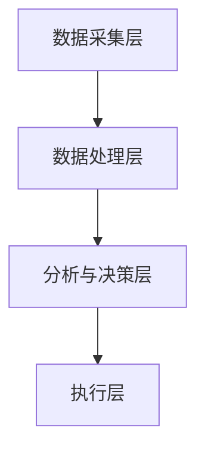
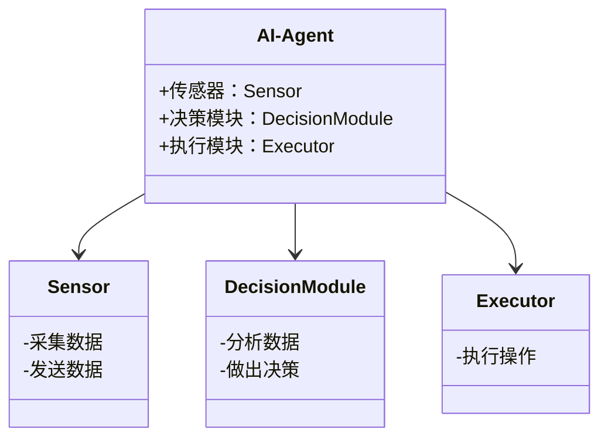

                 


# AI Agent在智能水质预警系统中的角色

## 关键词：AI Agent，水质预警系统，智能监测，机器学习，系统架构

## 摘要：AI Agent在智能水质预警系统中扮演着关键角色，通过数据采集、分析和决策，实现对水质的实时监测和异常预警。本文详细探讨了AI Agent的核心概念、工作原理、系统架构以及实际应用，展示了如何利用AI技术提升水质监测的效率和准确性。

---

## 第1章: AI Agent与智能水质预警系统背景

### 1.1 AI Agent的基本概念

#### 1.1.1 AI Agent的定义
AI Agent（人工智能代理）是指能够感知环境、做出决策并执行任务的智能实体。它能够通过传感器获取信息，利用算法进行分析，并根据结果采取行动。

#### 1.1.2 AI Agent的核心特征
- **自主性**：能够在没有外部干预的情况下独立运作。
- **反应性**：能够实时感知环境变化并做出反应。
- **目标导向**：具备明确的目标，所有行为都围绕目标展开。
- **学习能力**：能够通过数据和经验不断优化自身的决策能力。

#### 1.1.3 AI Agent与传统自动化的区别
| 特性          | AI Agent                   | 传统自动化         |
|---------------|---------------------------|-------------------|
| 智能性        | 高度智能，能够自主决策     | 机械化，按固定规则运行 |
| 学习能力      | 具备学习能力，能自适应变化 | 无法自适应变化     |
| 灵活性        | 具备灵活性，能应对复杂场景 | 灵活性有限         |

---

### 1.2 智能水质预警系统的背景

#### 1.2.1 水质监测的重要性
水质监测是保障水资源安全的重要手段，能够帮助我们及时发现和处理水质问题，预防水污染对环境和人类健康的影响。

#### 1.2.2 传统水质监测的局限性
传统水质监测主要依赖人工采样和实验室分析，存在效率低、成本高、实时性差等问题。

#### 1.2.3 智能水质预警系统的概念
智能水质预警系统是一种基于人工智能技术的实时监测系统，能够自动采集数据、分析异常、发出预警。

---

## 第2章: AI Agent的核心概念与原理

### 2.1 AI Agent的核心概念

#### 2.1.1 知识表示
知识表示是AI Agent理解环境的基础。常用的表示方法包括符号逻辑、概率模型和神经网络等。

#### 2.1.2 感知与推理
AI Agent通过传感器获取数据（如温度、pH值、溶解氧等），利用推理算法（如逻辑推理、机器学习）分析数据。

#### 2.1.3 行动决策
AI Agent根据推理结果做出决策，并通过执行器（如警报系统、自动调节装置）采取行动。

---

### 2.2 AI Agent的分类与特点

#### 2.2.1 分类
AI Agent可以分为以下几类：
1. **简单反射型**：基于固定的规则做出反应。
2. **基于模型的反应型**：利用环境模型进行决策。
3. **基于效用的**：通过优化目标函数进行决策。
4. **学习型**：通过机器学习不断优化自身能力。

#### 2.2.2 各类AI Agent的特点对比
| 类型           | 简单反射型 | 基于模型的反应型 | 基于效用的 | 学习型 |
|----------------|------------|------------------|------------|--------|
| 决策方式       | 基于规则    | 基于环境模型      | 基于效用函数 | 基于数据 |
| 适应性         | 低          | 中                | 高          | 极高    |
| 应用场景       | 简单任务    | 中等复杂任务      | 复杂任务     | 高度复杂任务 |

---

### 2.3 AI Agent的原理与工作流程

#### 2.3.1 数据输入与感知
AI Agent通过传感器获取水质数据，例如温度、pH值、溶解氧等。

#### 2.3.2 知识推理与决策
利用机器学习算法（如随机森林、神经网络）对数据进行分析，识别异常情况。

#### 2.3.3 行动执行与反馈
根据推理结果采取行动，例如发出警报或调节设备，并将结果反馈到系统中。

---

## 第3章: 智能水质预警系统的原理与架构

### 3.1 水质监测的基本原理

#### 3.1.1 数据采集
通过传感器实时采集水质参数，例如：
- 温度
- pH值
- 溶解氧
- 电导率
- 悬浮物浓度

#### 3.1.2 数据预处理与特征提取
对采集到的数据进行清洗、归一化等处理，提取关键特征用于后续分析。

#### 3.1.3 数据分析与异常检测
利用统计方法或机器学习算法（如孤立森林）识别异常数据点。

---

### 3.2 AI Agent在水质预警中的角色

#### 3.2.1 数据采集与处理
AI Agent负责实时采集水质数据，并对数据进行预处理和特征提取。

#### 3.2.2 异常检测与预测
AI Agent通过分析历史数据，学习正常水质的模式，识别潜在的异常情况。

#### 3.2.3 预警决策与执行
当检测到异常时，AI Agent会发出警报，并根据预设策略采取相应的措施，例如调整设备参数。

---

### 3.3 智能水质预警系统的架构设计

#### 3.3.1 分层架构设计
智能水质预警系统通常采用分层架构，包括：
1. **数据采集层**：负责数据的采集和预处理。
2. **分析与决策层**：利用AI算法进行数据分析和决策。
3. **执行层**：根据决策结果执行相应操作。

#### 3.3.2 各模块的功能与交互
- **数据采集模块**：与传感器通信，获取实时数据。
- **分析模块**：对数据进行分析，识别异常。
- **决策模块**：根据分析结果做出决策。
- **执行模块**：执行决策操作，例如发出警报。

#### 3.3.3 系统的可扩展性与维护性
系统设计应具备良好的可扩展性，能够方便地添加新的传感器或算法。同时，系统应支持远程维护和更新。

---

## 第4章: AI Agent在水质预警中的算法原理

### 4.1 算法选择与原理

#### 4.1.1 机器学习算法的选择
随机森林是一种常用的算法，适合处理水质数据中的多变量问题。

#### 4.1.2 随机森林算法的原理
随机森林是一种基于决策树的集成学习算法，通过构建多棵决策树并取其预测结果的平均值来提高准确性。

#### 4.1.3 随机森林的数学模型
$$ \text{随机森林} = \{\text{决策树}_1, \text{决策树}_2, ..., \text{决策树}_n\} $$
预测结果为各决策树预测结果的多数投票。

---

### 4.2 算法实现与代码示例

#### 4.2.1 环境安装
需要安装以下Python库：
```bash
pip install numpy pandas scikit-learn
```

#### 4.2.2 数据预处理
```python
import pandas as pd
from sklearn.ensemble import RandomForestClassifier
from sklearn.model_selection import train_test_split
from sklearn.metrics import accuracy_score

# 加载数据
data = pd.read_csv('water_quality.csv')

# 分割特征与目标变量
X = data.drop('class', axis=1)
y = data['class']

# 划分训练集与测试集
X_train, X_test, y_train, y_test = train_test_split(X, y, test_size=0.2)

# 初始化模型
model = RandomForestClassifier(n_estimators=100)

# 训练模型
model.fit(X_train, y_train)

# 预测
y_pred = model.predict(X_test)

# 评估准确率
print(accuracy_score(y_test, y_pred))
```

---

## 第5章: 智能水质预警系统的架构设计

### 5.1 系统功能设计

#### 5.1.1 数据采集模块
- 与多种传感器通信，获取实时数据。
- 支持多种数据格式的转换和存储。

#### 5.1.2 数据分析模块
- 利用机器学习算法进行异常检测和预测。
- 提供可视化的数据展示界面。

#### 5.1.3 预警与决策模块
- 根据分析结果发出警报。
- 执行预设的应对策略。

---

### 5.2 系统架构设计

#### 5.2.1 分层架构设计


#### 5.2.2 实体关系图


---

## 第6章: 项目实战与案例分析

### 6.1 项目环境安装
需要安装以下Python库：
```bash
pip install numpy pandas scikit-learn
```

### 6.2 系统核心实现源代码
```python
import pandas as pd
from sklearn.ensemble import RandomForestClassifier
from sklearn.model_selection import train_test_split
from sklearn.metrics import accuracy_score

# 加载数据
data = pd.read_csv('water_quality.csv')

# 分割特征与目标变量
X = data.drop('class', axis=1)
y = data['class']

# 划分训练集与测试集
X_train, X_test, y_train, y_test = train_test_split(X, y, test_size=0.2)

# 初始化模型
model = RandomForestClassifier(n_estimators=100)

# 训练模型
model.fit(X_train, y_train)

# 预测
y_pred = model.predict(X_test)

# 评估准确率
print(accuracy_score(y_test, y_pred))
```

### 6.3 实际案例分析
以某工业园区的水质监测为例，系统能够实时监测水质数据，识别异常情况，并及时发出警报，避免水质污染事件的发生。

---

## 第7章: 最佳实践与小结

### 7.1 注意事项
- 数据质量是影响系统性能的关键，需确保数据的准确性和完整性。
- 系统的可扩展性和维护性需重点关注，以便后续升级和优化。

### 7.2 未来展望
- 引入更先进的AI技术（如深度学习、强化学习）进一步提升系统的智能性。
- 结合物联网技术，构建更完善的水质监测网络。

---

## 第8章: 总结与参考文献

### 8.1 总结
本文详细探讨了AI Agent在智能水质预警系统中的角色与应用，分析了系统的架构设计、算法原理及实际案例。通过AI技术的引入，水质监测的效率和准确性得到了显著提升。

### 8.2 参考文献
1. 《机器学习实战》
2. 《人工智能：一种现代方法》
3. 相关学术论文与技术文档

---

通过以上章节的详细分析和讲解，我们可以看到AI Agent在智能水质预警系统中的巨大潜力和重要作用。希望本文能够为相关领域的研究和实践提供有价值的参考。

