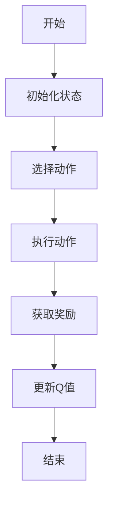

                 


# AI Agent在智能水资源分配预测中的实践

## 关键词：
AI Agent, 智能水资源分配, 预测模型, 强化学习, 系统架构设计, 实践案例

## 摘要：
本文深入探讨了AI Agent在智能水资源分配预测中的应用，结合实际案例，详细讲解了AI Agent的核心原理、算法实现、系统架构设计以及项目实战。通过强化学习算法和数学模型的结合，展示了如何利用AI Agent实现高效、智能的水资源分配预测。文章内容丰富，涵盖了从理论到实践的全过程，为读者提供了一套完整的解决方案。

---

# 第一部分: AI Agent与智能水资源分配预测概述

## 第1章: 背景介绍

### 1.1 水资源分配问题背景
#### 1.1.1 水资源短缺的全球挑战
水资源是人类生存和发展的基础，但全球水资源分布不均，干旱地区水资源短缺问题日益严重。传统水资源分配方法依赖于固定的规则和经验模型，难以应对复杂的动态变化。

#### 1.1.2 水资源分配的传统方法与局限性
传统方法主要基于统计分析和简单的数学模型，缺乏灵活性和实时性。例如，基于历史数据的线性回归模型无法捕捉复杂的非线性关系，且难以适应外部环境的变化。

#### 1.1.3 智能化水资源管理的必要性
随着人工智能技术的发展，利用AI Agent实现智能化水资源分配预测成为可能。AI Agent可以通过实时数据采集、动态推理和自适应调整，提高水资源分配的效率和准确性。

### 1.2 AI Agent的基本概念与特点
#### 1.2.1 AI Agent的定义与核心功能
AI Agent是一种具有感知环境、自主决策和执行动作能力的智能体。其核心功能包括感知、推理、决策和执行。

#### 1.2.2 AI Agent的分类与应用场景
AI Agent可以分为简单反射型、基于模型的反应型、目标驱动型和实用驱动型。在水资源分配预测中，目标驱动型AI Agent最为常用。

#### 1.2.3 AI Agent与传统算法的区别
传统算法（如随机森林、支持向量机）依赖于静态数据和固定的模型结构，而AI Agent具有动态适应性和自主决策能力。

### 1.3 智能水资源分配预测的核心要素
#### 1.3.1 数据来源与特征分析
水资源分配预测的数据来源包括气象数据、水质数据、用水需求数据等。特征分析需要考虑数据的时序性、相关性和异质性。

#### 1.3.2 预测模型的选择与优化
预测模型的选择需要综合考虑数据特征、预测精度和计算效率。优化方法包括参数调优和模型集成。

#### 1.3.3 AI Agent在水资源分配中的角色定位
AI Agent在水资源分配中的角色是通过实时数据采集、动态推理和自适应调整，优化水资源分配策略。

### 1.4 本章小结
本章从全球水资源短缺问题出发，介绍了AI Agent的基本概念和特点，分析了智能水资源分配预测的核心要素，为后续章节的展开奠定了基础。

---

## 第2章: AI Agent的核心概念与联系

### 2.1 AI Agent的核心原理
#### 2.1.1 知识表示与推理机制
知识表示是AI Agent的核心，常用的方法包括符号表示和语义网络。推理机制包括逻辑推理和概率推理。

#### 2.1.2 多智能体协作与通信
在水资源分配预测中，多个AI Agent需要协作完成任务。通信机制包括基于消息传递和基于共享知识库。

#### 2.1.3 动态环境下的自适应能力
AI Agent需要能够根据环境变化自适应调整策略，常用的方法包括强化学习和基于模型的规划。

### 2.2 水资源分配预测的系统架构
#### 2.2.1 数据流与信息处理流程
数据流包括数据采集、数据预处理、特征提取和数据存储。信息处理流程包括数据融合和知识推理。

#### 2.2.2 多层次预测模型的构建
多层次预测模型包括短期预测和长期预测，短期预测用于实时调整，长期预测用于战略规划。

#### 2.2.3 AI Agent与水资源分配系统的交互关系
AI Agent与水资源分配系统的交互关系包括数据输入、状态反馈和策略调整。

### 2.3 AI Agent与水资源分配预测的ER实体关系图
```mermaid
er
actor: 用户
agent: AI Agent
model: 预测模型
data_source: 数据源
action: 行为
```

### 2.4 本章小结
本章详细讲解了AI Agent的核心原理和系统架构，分析了AI Agent与水资源分配系统的交互关系，为后续章节的算法实现奠定了基础。

---

## 第3章: AI Agent的算法原理

### 3.1 基于强化学习的AI Agent算法
#### 3.1.1 强化学习的基本原理
强化学习是一种通过试错学习的方法，AI Agent通过与环境交互，获得奖励或惩罚，从而优化策略。

#### 3.1.2 Q-learning算法在水资源分配中的应用
Q-learning算法通过状态-动作-奖励机制，实现水资源分配策略的优化。例如，在水资源分配中，状态是当前的水量和需求，动作是分配策略，奖励是分配效果的评估。

#### 3.1.3 算法实现步骤与流程图


### 3.2 水资源分配预测的数学模型
#### 3.2.1 时间序列预测模型
时间序列预测模型包括ARIMA和LSTM。LSTM模型更适合处理水资源分配中的时间依赖性。

#### 3.2.2 多变量回归模型
多变量回归模型考虑多个因素对水资源分配的影响，例如气象条件、用水需求和水质指标。

#### 3.2.3 算法数学公式
$$ Q(s,a) = Q(s,a) + \alpha (r + \max Q(s',a') - Q(s,a)) $$

### 3.3 算法实现与优化
#### 3.3.1 算法优化策略
优化策略包括经验回放和目标网络。经验回放可以提高算法的泛化能力，目标网络可以加速收敛。

#### 3.3.2 算法实现代码示例
```python
def q_learning(state, action, reward, next_state):
    g
```

