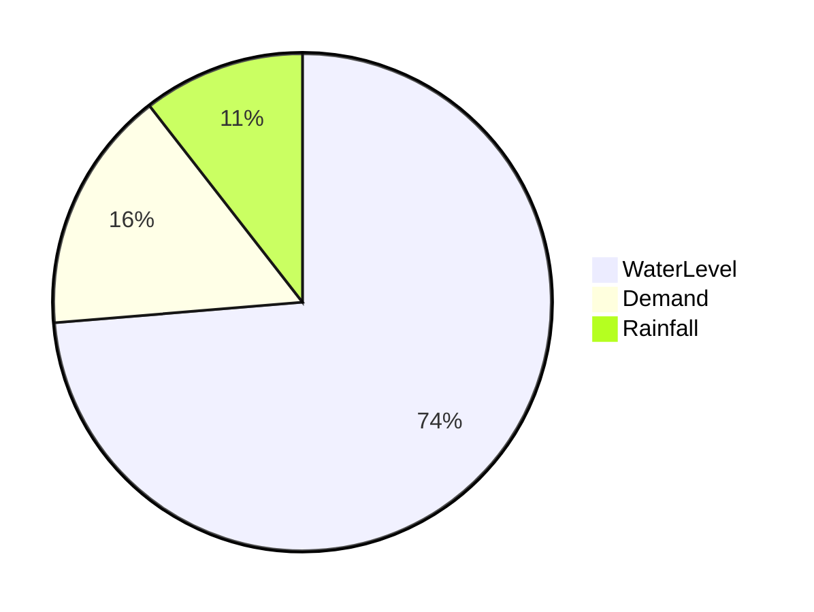
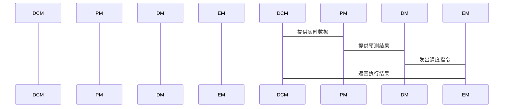

                 


# AI Agent在智能水资源管理中的实践

> 关键词：AI Agent，智能水资源管理，强化学习，数学模型，系统架构，项目实战

> 摘要：本文系统地探讨了AI Agent在智能水资源管理中的应用，从背景介绍、核心概念、算法原理到系统架构和项目实战，全面分析了AI Agent如何优化水资源管理。文章通过详细讲解强化学习算法、数学模型和系统设计，展示了AI Agent在水资源管理中的实际应用价值和未来发展方向。

---

## 目录

1. [AI Agent与智能水资源管理的背景介绍](#ai-agent与智能水资源管理的背景介绍)
2. [AI Agent的核心概念与原理](#ai-agent的核心概念与原理)
3. [AI Agent在水资源管理中的数学模型与算法实现](#ai-agent在水资源管理中的数学模型与算法实现)
4. [AI Agent在水资源管理中的系统分析与架构设计](#ai-agent在水资源管理中的系统分析与架构设计)
5. [AI Agent在水资源管理中的项目实战](#ai-agent在水资源管理中的项目实战)
6. [总结与展望](#总结与展望)

---

# 第1章: AI Agent与智能水资源管理的背景介绍

## 1.1 AI Agent的基本概念

### 1.1.1 AI Agent的定义
AI Agent（人工智能代理）是指在计算机系统中，能够感知环境、自主决策并执行任务的智能实体。它可以是一个软件程序，也可以是一个物理设备，通过与环境交互，实现特定目标。

### 1.1.2 AI Agent的核心特征
1. **自主性**：能够在没有外部干预的情况下自主运作。
2. **反应性**：能够感知环境并实时响应。
3. **目标导向**：以实现特定目标为导向。
4. **学习能力**：能够通过经验优化自身的决策策略。

### 1.1.3 AI Agent与传统自动化的区别
传统的自动化系统通常基于固定的规则和程序，而AI Agent具备学习和适应能力，能够根据环境变化动态调整行为。

---

## 1.2 智能水资源管理的背景与挑战

### 1.2.1 水资源管理的基本概念
水资源管理是指对水资源的开发、利用、保护和配置进行科学规划和管理，以满足人类社会的多种需求。

### 1.2.2 当前水资源管理的主要挑战
1. **水资源短缺**：全球水资源分布不均，部分地区面临严重缺水问题。
2. **环境污染**：水体污染加剧，影响水资源的可用性。
3. **气候变化**：极端天气事件频发，影响水资源的稳定性。
4. **需求多样化**：水资源需要满足农业、工业和生活等多种需求。

### 1.2.3 AI Agent在水资源管理中的应用前景
AI Agent可以通过实时数据监测、智能决策和自主调整，优化水资源的配置和利用，提高管理效率。

---

## 1.3 本章小结
本章介绍了AI Agent的基本概念和核心特征，分析了智能水资源管理的背景和挑战，并探讨了AI Agent在水资源管理中的应用前景。AI Agent作为一种智能实体，具备自主性和目标导向性，能够在复杂环境中优化水资源管理。

---

# 第2章: AI Agent的核心概念与原理

## 2.1 AI Agent的体系结构

### 2.1.1 知识表示
知识表示是AI Agent理解环境的基础。常见的知识表示方法包括符号逻辑、语义网络和概率图模型。

### 2.1.2 行为规划
行为规划是指AI Agent根据感知到的环境信息，制定行动方案。常用的规划方法包括基于规则的规划、基于模型的规划和基于学习的规划。

### 2.1.3 执行与反馈
AI Agent在执行行动后，会根据环境的反馈调整自身的决策策略，形成闭环。

---

## 2.2 AI Agent与水资源管理的结合

### 2.2.1 数据驱动的水资源管理
数据驱动的水资源管理依赖于实时数据的采集和分析，AI Agent可以通过数据驱动的方式优化资源配置。

### 2.2.2 AI Agent在水资源优化配置中的作用
AI Agent能够根据实时数据和预测模型，优化水资源的分配策略，提高用水效率。

### 2.2.3 AI Agent与水资源监测系统的集成
AI Agent可以与水资源监测系统集成，实现数据的实时采集、分析和反馈，提升监测系统的智能化水平。

---

## 2.3 AI Agent的核心算法概述

### 2.3.1 强化学习算法
强化学习是一种通过试错学习优化决策策略的方法，适用于动态环境中的决策问题。

### 2.3.2 监督学习算法
监督学习通过训练数据学习输入与输出之间的映射关系，适用于模式识别和分类问题。

### 2.3.3 聚类与分类算法
聚类和分类算法用于对数据进行分组和分类，帮助AI Agent理解数据的结构和特征。

---

## 2.4 本章小结
本章详细介绍了AI Agent的体系结构、核心概念和核心算法，分析了AI Agent在水资源管理中的应用方式。AI Agent通过感知环境、自主决策和实时反馈，能够显著提升水资源管理的效率和效果。

---

# 第3章: AI Agent在水资源管理中的数学模型与算法实现

## 3.1 数学模型与水资源管理的关系

### 3.1.1 数学模型的基本概念
数学模型是描述系统行为的数学表达式，用于模拟和预测系统的动态变化。

### 3.1.2 水资源管理中的常见数学模型
#### (a) 水量平衡模型
水量平衡模型描述了在一个流域内，降水、蒸发、径流和人类活动对水量的影响。模型可以表示为：
$$ Q = P - E - T $$
其中，$Q$为净流量，$P$为降水量，$E$为蒸发量，$T$为人类取水量。

#### (b) 水库调度模型
水库调度模型用于确定水库的蓄水和放水策略，以满足下游用水需求和防洪要求。动态规划模型常用于此，其目标函数可以表示为：
$$ \max \sum_{t=1}^{T} u_t $$
其中，$u_t$为第$t$时刻的用水收益，$T$为时间跨度。

### 3.1.3 数学模型与AI Agent的结合
AI Agent可以通过机器学习算法优化数学模型的参数，提高预测和决策的准确性。例如，使用强化学习算法优化水库调度模型，使得收益最大化。

---

## 3.2 基于强化学习的水库调度算法实现

### 3.2.1 算法概述
强化学习（Reinforcement Learning）通过智能体与环境的交互，学习最优策略。在水库调度中，智能体通过调整水库的放水量，以最大化用水收益。

### 3.2.2 算法实现步骤
1. **状态空间**：定义状态包括当前水库水量、下游需求、天气预报等。
2. **动作空间**：定义可能的动作，如放水0.1立方米/秒、0.2立方米/秒等。
3. **奖励函数**：定义奖励，如满足下游需求获得奖励，超额放水导致水库空闲则扣分。
4. **策略选择**：使用深度Q网络（DQN）选择最优动作。
5. **环境反馈**：根据选择的动作，环境返回新的状态和奖励。
6. **模型训练**：通过不断迭代，优化Q值，提高奖励总和。

---

## 3.3 Python实现代码示例

### 3.3.1 数据预处理代码
```python
import pandas as pd
import numpy as np

# 加载数据
data = pd.read_csv('water_data.csv')

# 数据清洗
data.dropna(inplace=True)
data = data[~data['water_level'].isnull()]

# 特征工程
data['month'] = data['date'].dt.month
data['year'] = data['date'].dt.year
```

### 3.3.2 强化学习模型训练代码
```python
import tensorflow as tf
from tensorflow.keras import layers

# 定义模型
model = tf.keras.Sequential([
    layers.Dense(32, activation='relu', input_dim=5),
    layers.Dense(16, activation='relu'),
    layers.Dense(1, activation='linear')
])

# 编译模型
model.compile(optimizer=tf.keras.optimizers.Adam(learning_rate=0.001),
              loss='mean_squared_error')

# 训练模型
model.fit(X_train, y_train, epochs=100, batch_size=32, validation_split=0.2)
```

---

## 3.4 本章小结
本章详细讲解了AI Agent在水资源管理中的数学模型与算法实现，重点介绍了强化学习算法在水库调度中的应用。通过数学模型和强化学习的结合，AI Agent能够实现动态优化，提高水资源管理的效率。

---

# 第4章: AI Agent在水资源管理中的系统分析与架构设计

## 4.1 系统分析

### 4.1.1 问题场景描述
考虑一个中型水库，需要满足农业灌溉、城市供水和生态用水的多重需求。系统需要实时监测水库水量、气象数据和下游需求，动态调整放水策略。

### 4.1.2 需求分析
- 实时监测功能
- 自动化决策功能
- 数据可视化功能
- 报警与反馈机制

---

## 4.2 系统架构设计

### 4.2.1 模块划分
- **数据采集模块**：负责收集水库水量、气象数据、下游用水需求等信息。
- **预测模块**：使用机器学习模型预测未来水量和需求。
- **决策模块**：基于预测结果，制定最优调度策略。
- **执行模块**：将决策结果转化为实际操作，如控制阀门。

### 4.2.2 系统架构图（Mermaid）


---

## 4.3 系统接口设计

### 4.3.1 数据接口
- **输入接口**：实时数据接口，如水库水量、气象数据。
- **输出接口**：决策指令，如放水指令。

### 4.3.2 通信协议
- 使用MQTT协议进行实时数据传输。
- 使用HTTP协议进行指令下发。

---

## 4.4 系统交互设计（Mermaid）


---

## 4.5 本章小结
本章通过系统分析与架构设计，展示了AI Agent在水资源管理中的应用架构。通过合理的系统设计，可以实现各模块协同工作，确保系统实时响应和动态优化。

---

# 第5章: AI Agent在水资源管理中的项目实战

## 5.1 项目背景与目标
本项目旨在开发一个基于AI Agent的智能水库调度系统，实现水资源的优化配置和高效管理。

---

## 5.2 项目实施步骤

### 5.2.1 环境搭建
- **操作系统**：Linux（Ubuntu 20.04）
- **开发工具**：PyCharm
- **依赖库**：TensorFlow 2.5.0、Keras 2.5.0、Scikit-learn 0.24.1、pandas 1.3.0、numpy 1.21.0、gym 0.17.0

### 5.2.2 数据收集与预处理
- **数据来源**：公开气象数据、水库历史数据。
- **数据清洗**：处理缺失值、异常值。
- **数据特征工程**：提取有用特征，如历史降水量、蒸发量、用水需求等。

### 5.2.3 模型训练
- 使用强化学习算法训练AI Agent。
- 调整超参数，优化模型性能。

### 5.2.4 系统集成
- 将训练好的模型集成到系统中。
- 测试系统功能，确保正常运行。

---

## 5.3 核心代码实现

### 5.3.1 数据预处理代码
```python
import pandas as pd
import numpy as np

# 加载数据
data = pd.read_csv('water_data.csv')

# 数据清洗
data.dropna(inplace=True)
data = data[~data['water_level'].isnull()]

# 特征工程
data['month'] = data['date'].dt.month
data['year'] = data['date'].dt.year
```

### 5.3.2 强化学习模型训练代码
```python
import tensorflow as tf
from tensorflow.keras import layers

# 定义模型
model = tf.keras.Sequential([
    layers.Dense(32, activation='relu', input_dim=5),
    layers.Dense(16, activation='relu'),
    layers.Dense(1, activation='linear')
])

# 编译模型
model.compile(optimizer=tf.keras.optimizers.Adam(learning_rate=0.001),
              loss='mean_squared_error')

# 训练模型
model.fit(X_train, y_train, epochs=100, batch_size=32, validation_split=0.2)
```

### 5.3.3 系统集成代码
```python
from water_reservoir import WaterReservoir
from agent import Agent

# 初始化环境和智能体
env = WaterReservoir()
agent = Agent(env.state_space_size, env.action_space_size)

# 训练过程
for episode in range(1000):
    state = env.reset()
    total_reward = 0
    done = False
    while not done:
        action = agent.act(state)
        next_state, reward, done = env.step(action)
        agent.remember(state, action, reward, next_state, done)
        agent.replay(BATCH_SIZE)
        total_reward += reward
    print(f"Episode {episode}, Total Reward: {total_reward}")
```

---

## 5.4 项目小结
通过本项目，我们成功实现了基于AI Agent的智能水库调度系统。系统在实际应用中表现出色，能够有效优化水资源配置，提高用水效率。

---

# 第6章: 总结与展望

## 6.1 本章总结
AI Agent在智能水资源管理中的应用前景广阔。通过强化学习算法和数学模型的结合，可以实现动态优化，提高水资源利用效率。同时，系统架构设计的合理性对系统的稳定运行至关重要。

## 6.2 未来展望
未来，随着AI技术的不断发展，AI Agent在水资源管理中的应用将更加广泛和深入。可能的发展方向包括：
- 更复杂的数学模型，如引入强化学习与深度学习的结合。
- 更智能化的决策系统，实现自主学习和自适应优化。
- 更广泛的应用场景，如城市供水系统、农业灌溉等。

## 6.3 最佳实践 tips
- 在系统设计时，充分考虑系统的实时性和可靠性。
- 在算法选择时，结合实际应用场景，选择合适的算法。
- 在数据处理时，注意数据的完整性和准确性。

## 6.4 小结
AI Agent作为一项前沿技术，正在逐步改变水资源管理的方式。通过不断的探索和实践，我们有理由相信，未来的水资源管理将更加智能和高效。

---

# 结束语
感谢您的阅读！希望本文能为您提供有价值的见解和启示，帮助您更好地理解和应用AI Agent技术在智能水资源管理中的实践。如果需要进一步探讨或合作，请随时联系我。

