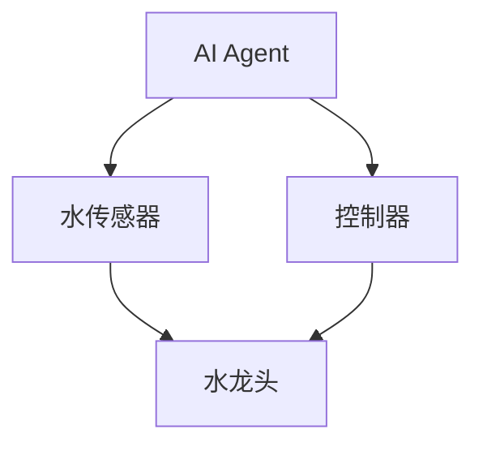
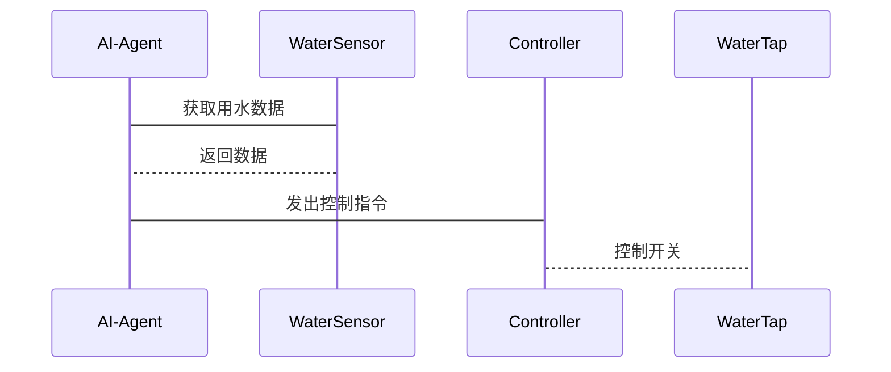

                 


## 第4章: 优化算法的数学模型与实现

### 4.1 算法原理
#### 4.1.1 强化学习的基本原理
强化学习是一种通过智能体与环境交互，学习最优策略以最大化累计奖励的方法。在智能水龙头的应用中，智能体（AI Agent）通过感知用水数据和环境信息，做出开关水的决策。

#### 4.1.2 遗传算法的应用
遗传算法是一种模拟自然选择和遗传的优化算法，适用于解决组合优化问题。在智能水龙头中，可以用来优化用水模式。

#### 4.1.3 其他优化算法的对比
对比强化学习和遗传算法在智能水龙头中的应用效果，分析其优缺点。

### 4.2 数学模型
#### 4.2.1 优化目标的数学表达
$$ \text{最小化用水量} \quad \min_{x} \sum_{t=1}^{T} x_t $$
其中，\( x_t \) 表示第 \( t \) 时刻的用水量。

#### 4.2.2 约束条件
$$ \sum_{t=1}^{T} x_t \leq W $$
其中，\( W \) 是预设的最大用水量。

### 4.3 算法实现
#### 4.3.1 强化学习算法实现
```python
class AI-Agent:
    def __init__(self, state_space, action_space):
        self.state_space = state_space
        self.action_space = action_space
        # 初始化策略网络
        self.policy_net = PolicyNetwork(state_space, action_space)

    def act(self, state):
        # 根据当前状态选择动作
        action = self.policy_net.predict(state)
        return action

    def update(self, state, action, reward):
        # 更新策略网络
        self.policy_net.update(state, action, reward)
```

## 第5章: 系统分析与架构设计方案

### 5.1 项目介绍
#### 5.1.1 项目背景
介绍智能水龙头优化项目的目的和意义。

#### 5.1.2 项目目标
明确项目要实现的优化目标。

### 5.2 系统功能设计
#### 5.2.1 系统功能模块
- 数据采集模块：采集用水数据
- 优化算法模块：执行优化算法
- 控制模块：控制水龙头的开关

### 5.3 系统架构设计


### 5.4 系统接口设计
定义AI Agent与水龙头、传感器之间的接口。

### 5.5 系统交互设计


## 第6章: 项目实战

### 6.1 环境安装
#### 6.1.1 安装Python环境
安装Python和必要的库，如TensorFlow、Keras等。

#### 6.1.2 安装智能水龙头硬件
安装水传感器和控制器硬件。

### 6.2 系统核心实现
#### 6.2.1 数据采集模块实现
编写代码采集水流量数据。

#### 6.2.2 优化算法实现
实现强化学习算法，训练AI Agent做出最优决策。

#### 6.2.3 系统控制实现
通过控制器实现对水龙头的开关控制。

### 6.3 代码解读与分析
解读关键代码，分析其功能和作用。

### 6.4 实际案例分析
分析一个实际案例，展示优化效果。

### 6.5 项目小结
总结项目实现的过程和成果。

## 第7章: 最佳实践 tips、小结、注意事项、拓展阅读

### 7.1 小结
总结全文内容，强调AI Agent在智能水龙头中的应用价值。

### 7.2 注意事项
提醒读者在实际应用中需要注意的问题。

### 7.3 拓展阅读
推荐相关领域的书籍和论文，供读者深入学习。

## 参考文献
列出文章中引用的文献和资料。

---

**附录: 代码示例**

```python
import numpy as np
import gym

class WaterTapEnv(gym.Env):
    def __init__(self):
        super().__init__()
        self.state = 0
        self.max_water = 100
        self.current_water = 0

    def reset(self):
        self.current_water = 0
        return self.state

    def step(self, action):
        if action == 1:
            self.current_water += 1
        reward = self.max_water - self.current_water
        done = self.current_water >= self.max_water
        return self.state, reward, done, {}

# 初始化环境和AI Agent
env = WaterTapEnv()
agent = AI-Agent(state_space=1, action_space=2)

# 开始训练
for episode in range(100):
    state = env.reset()
    while not done:
        action = agent.act(state)
        next_state, reward, done, _ = env.step(action)
        agent.update(state, action, reward)
        state = next_state
```

---

**摘要**

本文深入探讨了AI Agent在智能水龙头中的应用，通过强化学习算法优化用水量，提出了一种基于AI的智能水龙头优化方案。文章详细介绍了优化算法的数学模型、系统架构设计以及实际项目实现，为智能水龙头的优化提供了理论依据和实践指导。

---

**关键词**

AI Agent，智能水龙头，强化学习，用水优化，系统架构，项目实战

