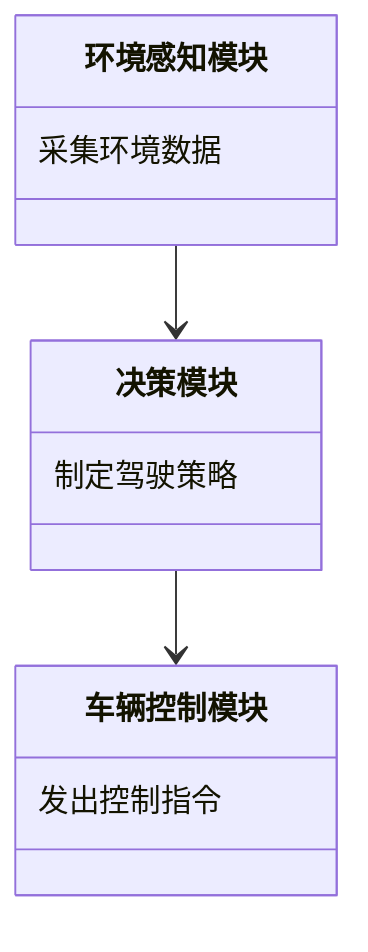
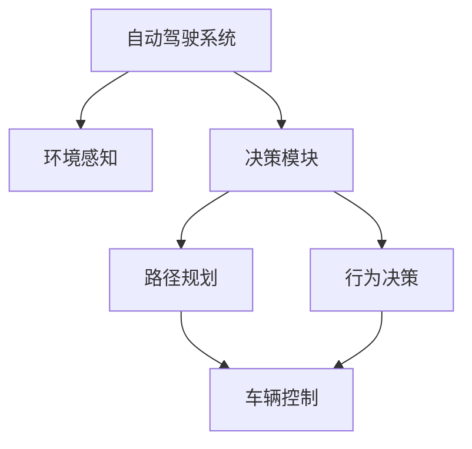
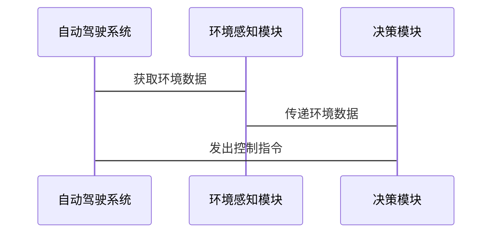

                 


# AI Agent在智能汽车中的应用：自动驾驶与车载助手

> 关键词：AI Agent，智能汽车，自动驾驶，车载助手，算法原理，系统架构，项目实战

> 摘要：本文详细探讨了AI Agent在智能汽车中的应用，特别是自动驾驶和车载助手方面。通过背景介绍、核心概念、算法原理、系统架构设计、项目实战等部分，全面分析了AI Agent在智能汽车中的技术实现和应用价值，为读者提供了深入的技术见解和实践指导。

---

## 第1章: AI Agent与智能汽车的背景介绍

### 1.1 AI Agent的基本概念

#### 1.1.1 AI Agent的定义与特点
AI Agent（人工智能代理）是指能够感知环境、自主决策并执行任务的智能实体。其特点包括：
- **自主性**：无需外部干预，自主完成任务。
- **反应性**：能够实时感知环境并做出反应。
- **目标导向**：基于目标驱动行为。
- **学习能力**：通过数据和经验优化性能。

#### 1.1.2 AI Agent的核心要素与组成
AI Agent主要由以下部分组成：
- **感知模块**：负责收集和处理环境信息。
- **决策模块**：基于感知信息制定行为决策。
- **执行模块**：将决策转化为具体动作。
- **学习模块**：通过反馈优化算法。

#### 1.1.3 AI Agent在智能汽车中的定位与作用
AI Agent在智能汽车中扮演着“智能大脑”的角色，负责处理来自传感器的数据，做出驾驶决策，并通过执行机构实现自动驾驶。

### 1.2 智能汽车的发展现状

#### 1.2.1 智能汽车的定义与分类
智能汽车是指通过先进的传感器、计算平台、执行机构和通信设备，实现车与车、车与路、车与云的智能交互的汽车。根据自动化程度，智能汽车分为L1到L5五个级别。

#### 1.2.2 当前智能汽车技术的发展趋势
目前，智能汽车技术主要集中在以下领域：
- **传感器技术**：如激光雷达、摄像头、毫米波雷达等。
- **计算平台**：高性能计算单元如GPU和TPU的应用。
- **通信技术**：V2X（车路协同）通信的发展。

#### 1.2.3 AI Agent在智能汽车中的应用现状
AI Agent已在智能汽车的自动驾驶、智能交互、路径规划等领域得到广泛应用。

### 1.3 自动驾驶与车载助手的定义与区别

#### 1.3.1 自动驾驶的定义与技术层次
自动驾驶是指车辆在无需人类干预的情况下，能够完成所有驾驶任务。技术层次包括环境感知、行为决策、路径规划和执行控制。

#### 1.3.2 车载助手的定义与功能特点
车载助手是基于语音交互的智能系统，提供导航、娱乐、信息查询等服务，提升驾驶体验。

#### 1.3.3 自动驾驶与车载助手的协同工作模式
自动驾驶负责车辆的运动控制，车载助手负责车内人机交互，两者协同工作，共同提升驾驶体验。

---

## 第2章: AI Agent的核心概念与原理

### 2.1 AI Agent的结构与功能模块

#### 2.1.1 感知层：环境信息的获取与处理
感知层通过多种传感器收集环境数据，如摄像头、激光雷达等，利用计算机视觉技术进行目标检测和跟踪。

#### 2.1.2 决策层：行为决策的制定与优化
决策层基于感知数据，结合规则库或机器学习模型，制定车辆的行驶策略，如路径规划和行为决策。

#### 2.1.3 执行层：决策的执行与反馈
执行层负责将决策转化为具体的动作，如转向、加速和刹车，并通过反馈机制优化决策过程。

### 2.2 AI Agent的工作流程

#### 2.2.1 信息感知与数据采集
通过传感器获取环境数据，如车道线、障碍物、交通标志等。

#### 2.2.2 数据分析与决策制定
利用算法对数据进行分析，做出驾驶决策，如变道、超车等。

#### 2.2.3 行为执行与结果反馈
将决策指令传递给执行机构，如转向系统和制动系统，并收集反馈数据优化算法。

### 2.3 AI Agent与传统算法的对比

#### 2.3.1 传统算法的特点与局限性
传统算法如规则引擎，依赖预定义规则，缺乏灵活性和自适应能力。

#### 2.3.2 AI Agent的优势与创新点
AI Agent具备自学习和自适应能力，能够处理复杂场景，提升系统性能。

#### 2.3.3 两者的应用场景对比
传统算法适用于规则明确的场景，AI Agent适用于复杂多变的环境。

---

## 第3章: AI Agent的算法原理与实现

### 3.1 常见的AI Agent算法介绍

#### 3.1.1 强化学习算法：Q-Learning
Q-Learning通过试错机制优化策略，适用于连续决策问题。

#### 3.1.2 监督学习算法：决策树与随机森林
监督学习算法适用于分类和回归问题，如道路识别。

#### 3.1.3 聚类算法：K-Means
聚类算法用于将相似数据点分组，如交通流量分析。

### 3.2 算法实现的详细步骤

#### 3.2.1 算法选择与问题建模
根据具体问题选择合适的算法，并建立数学模型。

#### 3.2.2 数据预处理与特征提取
对数据进行清洗、归一化处理，并提取关键特征。

#### 3.2.3 模型训练与参数调优
利用训练数据训练模型，并通过交叉验证优化参数。

#### 3.2.4 模型评估与优化
通过测试集评估模型性能，并进行调优以提升准确率。

### 3.3 算法实现的数学模型与公式

#### 3.3.1 Q-Learning算法的数学模型
$$ Q(s, a) = Q(s, a) + \alpha [r + \max Q(s', a') - Q(s, a)] $$

#### 3.3.2 决策树算法的特征选择
$$ \text{信息增益} = \sum p \log \frac{1}{p} $$

#### 3.3.3 K-Means算法的聚类优化
$$ \text{目标函数} = \sum_{i=1}^{n} \min_{k} \left\| x_i - c_k \right\|^2 $$

---

## 第4章: 系统分析与架构设计

### 4.1 问题场景介绍
自动驾驶系统需要处理多源异构数据，如传感器数据、地图数据、交通数据等。

### 4.2 系统功能设计

#### 4.2.1 领域模型设计


#### 4.2.2 系统架构设计


#### 4.2.3 接口设计与交互流程


---

## 第5章: 项目实战

### 5.1 环境安装与配置

#### 5.1.1 安装Python与相关库
```bash
pip install numpy
pip install scikit-learn
pip install matplotlib
pip install mermaid
```

#### 5.1.2 安装自动驾驶开发框架
```bash
pip install tensorflow
pip install pytorch
pip install carla
```

### 5.2 系统核心实现源代码

#### 5.2.1 Q-Learning算法实现
```python
import numpy as np

class QLearningAgent:
    def __init__(self, state_space, action_space):
        self.state_space = state_space
        self.action_space = action_space
        self.Q = np.zeros((state_space, action_space))

    def act(self, state, epsilon=0.1):
        if np.random.random() < epsilon:
            return np.random.randint(self.action_space)
        else:
            return np.argmax(self.Q[state, :])

    def update(self, state, action, reward, next_state, alpha=0.1, gamma=0.99):
        self.Q[state, action] = self.Q[state, action] + alpha * (reward + gamma * np.max(self.Q[next_state, :]) - self.Q[state, action])
```

#### 5.2.2 决策树实现
```python
from sklearn.tree import DecisionTreeClassifier

class DecisionTreeAgent:
    def __init__(self):
        self.model = DecisionTreeClassifier()

    def train(self, X, y):
        self.model.fit(X, y)

    def predict(self, X):
        return self.model.predict(X)
```

#### 5.2.3 K-Means实现
```python
from sklearn.cluster import KMeans

class KMeansAgent:
    def __init__(self, n_clusters):
        self.model = KMeans(n_clusters=n_clusters)

    def train(self, X):
        self.model.fit(X)

    def predict(self, X):
        return self.model.predict(X)
```

### 5.3 实际案例分析与代码解读
通过实际案例展示AI Agent在自动驾驶中的应用，详细解读代码实现和算法选择。

### 5.4 项目总结与优化建议
总结项目成果，提出优化建议，如引入深度学习模型提升性能。

---

## 第6章: 总结与展望

### 6.1 全文总结
总结全文内容，强调AI Agent在智能汽车中的重要性。

### 6.2 未来展望
展望AI Agent在智能汽车中的未来发展方向，如多模态感知、人机协作等。

### 6.3 最佳实践 tips
提供实际应用中的最佳实践建议，如数据质量的重要性、算法选择的策略等。

### 6.4 注意事项
提醒读者在实际应用中需要注意的问题，如数据隐私、算法安全性等。

### 6.5 拓展阅读
推荐相关领域的书籍和资源，供读者深入学习。

---

通过以上结构，您可以撰写一篇详细、全面的技术博客文章，深入探讨AI Agent在智能汽车中的应用。

