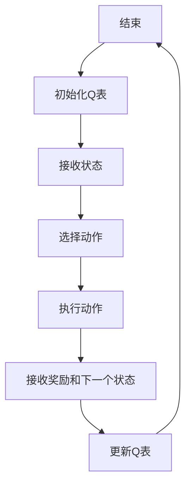

                 


# AI Agent在智能汽车中的驾驶辅助

## 关键词：
AI Agent, 智能汽车, 驾驶辅助, 自动驾驶, 机器学习

## 摘要：
本文深入探讨了AI Agent在智能汽车驾驶辅助系统中的应用，分析了其核心概念、算法原理、系统架构，并通过实际案例展示了其在智能驾驶中的应用与挑战。文章详细介绍了AI Agent在智能汽车中的角色，从信息处理到决策执行的整个流程，并通过项目实战和最佳实践为读者提供全面的指导。

---

## 第一部分: AI Agent与智能汽车驾驶辅助的背景介绍

### 第1章: AI Agent与智能汽车驾驶辅助概述

#### 1.1 AI Agent的基本概念
- AI Agent的定义与特点
  - AI Agent是一种智能体，能够感知环境并采取行动以实现目标。
  - 具有自主性、反应性、目标导向性和学习能力。
- AI Agent在智能汽车中的作用
  - 作为智能汽车的核心，负责数据处理、决策和执行。
- 驾驶辅助系统的概念与分类
  - 驾驶辅助系统（ADAS）：通过AI技术辅助驾驶员，如自适应巡航控制、车道保持辅助等。

#### 1.2 智能汽车的发展背景
- 智能汽车的定义与发展历程
  - 智能汽车是结合了人工智能、物联网和自动驾驶技术的新型汽车。
  - 从辅助驾驶到完全自动驾驶的发展趋势。
- 智能汽车与传统汽车的主要区别
  - 传统汽车依赖驾驶员操作，而智能汽车通过AI技术实现部分或全部自动驾驶。
- 驾驶辅助系统的应用现状与趋势
  - 当前主要应用于高级辅助驾驶系统（ADAS），未来目标是实现完全自动驾驶（SAE Level 5）。

#### 1.3 AI Agent在驾驶辅助中的应用前景
- AI Agent在智能汽车中的核心地位
  - AI Agent是智能汽车的“大脑”，负责处理传感器数据、做出决策并控制执行机构。
- 驾驶辅助系统的未来发展方向
  - 更高精度的传感器、更强大的AI算法、更高效的计算能力。
- 技术进步对驾驶体验的潜在影响
  - 提高驾驶安全、减少交通事故、提升驾驶舒适性。

---

### 第2章: AI Agent与智能汽车驾驶辅助的核心概念

#### 2.1 AI Agent的基本原理
- 信息感知与处理
  - 通过传感器（如摄像头、雷达、激光雷达）收集环境数据。
  - 数据处理包括目标检测、路径规划和决策制定。
- 决策与执行机制
  - 基于传感器数据和环境信息，AI Agent通过算法做出决策。
  - 执行机构（如方向盘、油门、刹车）根据决策进行操作。
- 自适应学习能力
  - 通过机器学习模型不断优化决策算法，提升系统性能。

#### 2.2 智能汽车驾驶辅助系统的结构
- 传感器系统
  - 包括摄像头、雷达、激光雷达等，用于收集环境数据。
- 数据处理与决策模块
  - 中央处理器或AI芯片，负责数据融合、处理和决策。
- 执行机构
  - 包括方向盘、油门、刹车等，根据决策执行动作。

#### 2.3 AI Agent与驾驶辅助系统的实体关系图
```mermaid
erDiagram
    actor 用户
    actor 环境
    class AI Agent
    class 传感器系统
    class 决策系统
    class 执行机构
    用户 -> AI Agent : 请求处理
    环境 -> AI Agent : 提供实时数据
    AI Agent -> 传感器系统 : 获取数据
    AI Agent -> 决策系统 : 生成决策
    AI Agent -> 执行机构 : 发出指令
```

---

## 第二部分: AI Agent的算法原理与实现

### 第3章: AI Agent的算法原理

#### 3.1 基于强化学习的AI Agent算法
- 强化学习简介
  - 强化学习是一种通过奖励机制来优化决策的机器学习方法。
- Q-learning算法
  - 状态（State）、动作（Action）、奖励（Reward）的基本概念。
  - Q-learning算法的公式：
    $$ Q(s, a) = Q(s, a) + \alpha (r + \gamma \max Q(s', a') - Q(s, a)) $$
  - 其中，$\alpha$是学习率，$\gamma$是折扣因子。

#### 3.2 深度强化学习的应用
- 使用深度神经网络作为价值函数的近似器。
- 使用Python实现的Q-learning算法示例：
  ```python
  import numpy as np

  class AI_Agent:
      def __init__(self, state_space, action_space):
          self.state_space = state_space
          self.action_space = action_space
          self.Q = np.zeros((state_space, action_space))

      def take_action(self, state):
          return np.argmax(self.Q[state])

      def update_Q(self, state, action, reward, next_state):
          self.Q[state, action] += 0.1 * (reward + 0.9 * np.max(self.Q[next_state]) - self.Q[state, action])
  ```

#### 3.3 算法流程图


---

## 第三部分: 智能汽车驾驶辅助系统的架构设计

### 第4章: 系统架构设计

#### 4.1 系统功能设计
- 领域模型
  - 驾驶辅助系统的核心功能包括目标检测、路径规划、决策控制。
  ```mermaid
  classDiagram
      class AI Agent {
          void process_data();
          void make_decision();
      }
      class 传感器系统 {
          void collect_data();
      }
      class 决策系统 {
          void plan_path();
      }
      class 执行机构 {
          void execute_action();
      }
      AI Agent --> 传感器系统 : 调用数据
      AI Agent --> 决策系统 : 获取路径
      AI Agent --> 执行机构 : 发出指令
  ```

#### 4.2 系统架构设计
- 分层架构
  - 数据采集层、数据处理层、决策控制层。
  - 使用Mermaid绘制架构图：
  ```mermaid
  architecture
      Client
      Server
      Database
  ```

#### 4.3 系统接口设计
- 接口定义
  - 传感器接口、决策系统接口、执行机构接口。
  - 使用Mermaid绘制交互流程图：
  ```mermaid
  sequenceDiagram
      participant 用户
      participant AI Agent
      participant 传感器系统
      participant 决策系统
      participant 执行机构
      用户 -> AI Agent: 发起请求
      AI Agent -> 传感器系统: 获取数据
      AI Agent -> 决策系统: 获取路径
      AI Agent -> 执行机构: 执行动作
      执行机构 -> 用户: 返回结果
  ```

---

## 第四部分: 项目实战

### 第5章: 项目实战

#### 5.1 环境搭建
- 安装必要的库
  - Python、NumPy、OpenCV、TensorFlow。
  - 示例代码：
  ```python
  import numpy as np
  import cv2
  ```

#### 5.2 核心实现
- 数据处理与决策算法
  - 使用OpenCV进行图像处理，TensorFlow进行模型训练。
  - 代码示例：
  ```python
  def process_image(image):
      # 图像预处理
      return image / 255.0
  ```

#### 5.3 功能测试与优化
- 测试结果分析
  - 通过实际道路测试评估系统性能。
  - 优化算法参数，提升系统响应速度和准确性。

#### 5.4 案例分析
- 实际案例：车道保持辅助系统
  - 使用AI Agent检测车道线，规划路径并控制方向盘。
  - 代码示例：
  ```python
  def detect_lane(image):
      # 使用OpenCV检测车道线
      return lane_info
  ```

---

## 第五部分: 最佳实践与总结

### 第6章: 最佳实践

#### 6.1 技术总结
- AI Agent在智能汽车中的核心作用
  - 提供高效、可靠的驾驶辅助，提升驾驶安全性和舒适性。
- 算法优化方向
  - 更高效的强化学习算法、更精确的传感器数据融合方法。

#### 6.2 实践技巧
- 数据质量的重要性
  - 高质量的数据是训练高效AI Agent的基础。
- 算法选择的影响
  - 根据具体场景选择合适的算法，如强化学习适用于动态环境。

#### 6.3 小结
- AI Agent在智能汽车中的应用前景广阔，但实现起来具有挑战性。
- 需要结合先进的算法、强大的硬件和高质量的数据，才能实现高效的驾驶辅助系统。

#### 6.4 注意事项
- 数据隐私和安全问题
  - 保护用户数据，防止数据泄露。
- 系统可靠性
  - 确保AI Agent在极端情况下的可靠性，避免系统故障导致危险。

#### 6.5 拓展阅读
- 推荐书籍：《Deep Learning》、《Reinforcement Learning》
- 推荐博客：介绍最新的AI技术进展和应用案例。

---

## 结语
AI Agent在智能汽车中的驾驶辅助是一个充满挑战和机遇的领域。随着技术的不断进步，AI Agent将更加智能化，为驾驶员提供更安全、更舒适的驾驶体验。希望本文能够为读者提供有价值的技术指导和启发，鼓励更多人加入这个激动人心的领域。

