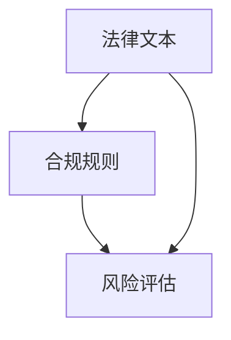
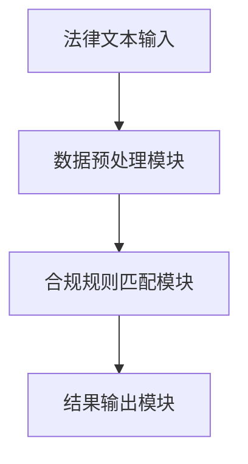

                 


# AI Agent在智能法律合规检查中的角色

## 关键词
AI Agent, 法律合规检查, 人工智能, 机器学习, 自然语言处理

## 摘要
本文探讨AI Agent在智能法律合规检查中的角色，分析其如何通过自然语言处理和机器学习技术，辅助法律专业人士高效、准确地进行合规性审查。文章详细介绍了AI Agent的核心概念、算法原理、系统架构，并通过项目实战展示其应用，最后总结了最佳实践和未来发展方向。

---

# 第1章: AI Agent与法律合规检查的背景

## 1.1 问题背景与问题描述

### 1.1.1 法律合规检查的传统模式
传统法律合规检查依赖人工审查，效率低、成本高，且容易出错。法律文本复杂，涉及大量条款和例外情况，人工处理难以覆盖所有可能的合规问题。

### 1.1.2 传统模式的局限性与挑战
- 人力资源消耗大，效率低下。
- 容易因主观因素导致遗漏或误判。
- 法律法规更新频繁，人工难以及时适应。

### 1.1.3 AI Agent的引入动机
AI Agent能够快速处理大量数据，提供自动化、智能化的合规检查服务，显著提高效率和准确性。

## 1.2 AI Agent的核心概念与属性

### 1.2.1 AI Agent的定义与特点
AI Agent是一种智能代理系统，能够感知环境、执行任务并做出决策。其特点包括自主性、反应性、社交性和学习能力。

### 1.2.2 法律合规检查中的AI Agent角色
AI Agent在法律合规中扮演辅助角色，帮助识别潜在风险，提供合规建议，并优化审查流程。

### 1.2.3 AI Agent与传统法律合规工具的对比
| 特性             | AI Agent                 | 传统工具               |
|------------------|--------------------------|------------------------|
| 自动化能力       | 高                      | 低                    |
| 学习能力         | 强                      | 无                    |
| 处理速度         | 快                      | 慢                    |
| 精确度           | 高                      | 中                    |

## 1.3 问题解决与边界外延

### 1.3.1 AI Agent在法律合规中的问题解决路径
1. 数据采集与预处理。
2. 法律文本分析。
3. 合规规则匹配。
4. 结果反馈与优化。

### 1.3.2 问题解决的边界与限制
AI Agent目前主要适用于标准化的合规检查，对于复杂案件仍需人工干预。

### 1.3.3 法律合规检查中的AI Agent应用范围
- 合同审查。
- 法律文档分类。
- 风险评估。

## 1.4 概念结构与核心要素

### 1.4.1 AI Agent的构成要素
- 感知模块：解析法律文本。
- 决策模块：匹配合规规则。
- 执行模块：输出结果。

### 1.4.2 法律合规检查的核心要素
- 法律文本。
- 合规规则。
- 风险评估标准。

### 1.4.3 AI Agent与法律合规要素的关联关系
AI Agent通过感知模块解析法律文本，决策模块匹配合规规则，执行模块输出风险评估结果。

---

# 第2章: AI Agent与法律合规检查的核心概念

## 2.1 核心概念原理

### 2.1.1 AI Agent的智能决策机制
AI Agent通过自然语言处理和机器学习模型，分析法律文本并匹配合规规则，生成决策建议。

### 2.1.2 法律合规规则的表示与推理
合规规则可以用逻辑表达式表示，AI Agent通过推理引擎匹配文本中的条款，判断是否合规。

### 2.1.3 AI Agent与法律知识库的交互
AI Agent通过API访问法律知识库，获取最新的法规信息，确保检查结果的准确性。

## 2.2 核心概念属性对比

| 特性             | AI Agent                 | 传统工具               |
|------------------|--------------------------|------------------------|
| 自动化能力       | 高                      | 低                    |
| 学习能力         | 强                      | 无                    |
| 处理速度         | 快                      | 慢                    |
| 精确度           | 高                      | 中                    |

## 2.3 ER实体



---

# 第3章: AI Agent的算法原理

## 3.1 算法原理

### 3.1.1 自然语言处理模型
使用BERT模型对法律文本进行语义分析，提取关键信息。

$$
\text{BERT模型的输入表示为：输入序列 + 位置编码}
$$

### 3.1.2 机器学习模型
通过训练数据，模型学习合规规则的匹配规律。

$$
\text{损失函数：} L = \sum_{i=1}^{n} (y_i - \hat{y}_i)^2
$$

### 3.1.3 算法流程
1. 数据预处理：清洗法律文本。
2. 模型训练：使用训练数据优化参数。
3. 推理阶段：处理新文本，生成合规结果。

## 3.2 代码实现

```python
import torch
from transformers import BertTokenizer, BertModel

tokenizer = BertTokenizer.from_pretrained('bert-base-uncased')
model = BertModel.from_pretrained('bert-base-uncased')

def process_legal_text(text):
    inputs = tokenizer(text, return_tensors='pt')
    outputs = model(**inputs)
    return outputs.last_hidden_state
```

---

# 第4章: 系统分析与架构设计

## 4.1 系统架构设计

### 4.1.1 系统架构图


### 4.1.2 接口设计
- 输入接口：接收法律文本。
- 输出接口：返回合规结果。

### 4.1.3 交互设计
- 用户输入文本。
- 系统处理并返回结果。

---

# 第5章: 项目实战

## 5.1 环境安装

```bash
pip install transformers
pip install torch
pip install mermaid
```

## 5.2 核心代码实现

```python
def main():
    import torch
    from transformers import BertTokenizer, BertModel

    tokenizer = BertTokenizer.from_pretrained('bert-base-uncased')
    model = BertModel.from_pretrained('bert-base-uncased')

    text = "合同条款需符合《民法典》第123条"
    inputs = tokenizer(text, return_tensors='pt')
    outputs = model(**inputs)
    print(outputs.last_hidden_state)
```

## 5.3 案例分析
通过案例分析，展示AI Agent如何识别潜在合规风险，并提供改进建议。

---

# 第6章: 最佳实践与小结

## 6.1 最佳实践
- 定期更新模型。
- 结合人工审查进行复核。

## 6.2 小结
AI Agent在法律合规检查中的应用显著提高了效率和准确性，但仍需注意其局限性，合理结合人工审查。

---

# 第7章: 注意事项与拓展阅读

## 7.1 注意事项
- 数据隐私问题。
- 模型的可解释性。

## 7.2 拓展阅读
- 《人工智能与法律》
- 《机器学习在法律领域的应用》

---

# 结语
AI Agent正在改变法律合规检查的方式，未来将更加智能化和高效化。

