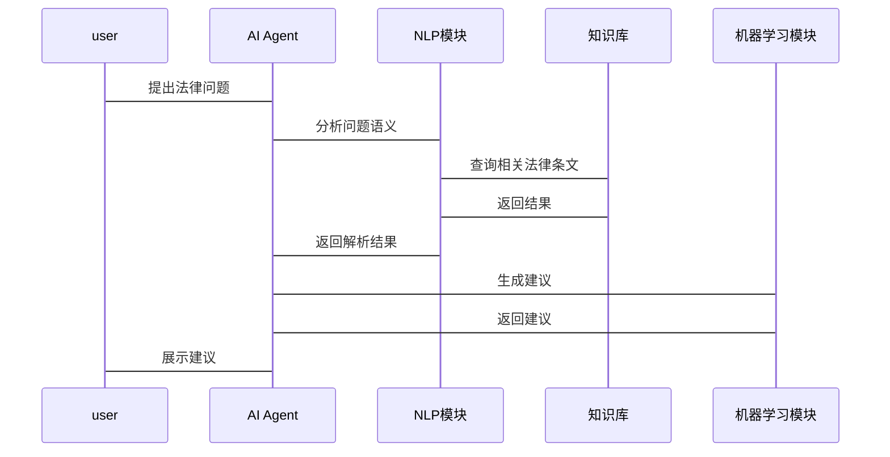

                 


# AI Agent在智能法律咨询中的角色

## 关键词
- AI Agent
- 智能法律咨询
- 自然语言处理
- 机器学习
- 系统架构

## 摘要
本文探讨AI Agent在智能法律咨询中的角色，从背景介绍、核心概念到算法原理、系统架构，再到项目实战，全面分析AI Agent如何提升法律咨询服务的效率和准确性。通过详细的技术解析和实际案例，展示AI Agent在法律咨询中的潜力和应用前景。

---

# 第一部分: AI Agent与智能法律咨询的背景介绍

## 第1章: AI Agent与法律咨询的概述

### 1.1 AI Agent的基本概念
#### 1.1.1 AI Agent的定义与特点
AI Agent（人工智能代理）是一种能够感知环境、自主决策并执行任务的智能实体。其特点包括自主性、反应性、目标导向和学习能力。

#### 1.1.2 法律咨询的基本概念与流程
法律咨询是通过法律专业知识解答用户的法律问题，通常包括问题分类、法律条文检索、案例分析和建议生成。

#### 1.1.3 AI Agent在法律咨询中的潜在价值
AI Agent可以提高法律咨询的效率，降低成本，并通过24/7可用性扩展服务范围。

---

## 第2章: AI Agent与法律咨询的结合背景

### 2.1 当前法律咨询服务的痛点
- 传统法律咨询依赖人工，效率低下。
- 用户需求多样，难以快速匹配专业律师。
- 法律信息繁杂，检索效率低。

### 2.2 AI技术在法律领域的应用现状
- 自然语言处理（NLP）用于法律文本分析。
- 机器学习用于法律案例分类和预测。

### 2.3 AI Agent在法律咨询中的应用场景
- 自动分类用户问题并匹配相关法律条文。
- 提供初步法律建议，辅助用户决策。
- 监测法律动态，提醒用户潜在风险。

---

# 第二部分: AI Agent的核心概念与原理

## 第3章: AI Agent的核心概念与原理

### 3.1 AI Agent的基本原理
#### 3.1.1 AI Agent的体系结构
AI Agent通常由感知层、推理层和执行层组成，能够处理输入、分析信息并执行操作。

#### 3.1.2 AI Agent的核心算法与模型
- 基于规则的推理：通过预设规则进行决策。
- 基于知识图谱的推理：利用语义网络进行复杂推理。

#### 3.1.3 AI Agent的决策机制
结合环境信息和历史数据，通过概率模型进行决策。

---

## 第4章: 法律咨询的核心要素

### 4.1 法律咨询的领域知识体系
- 法律领域涵盖刑法、民法、商法等多个分支。
- 每个领域都有复杂的法律条文和案例。

### 4.2 法律咨询的用户需求分析
- 用户可能需要解决问题、获取建议或了解法律程序。
- 用户需求可能涉及隐私，需严格保密。

### 4.3 法律咨询的流程与规范
- 收集用户信息。
- 分析问题并检索相关法律依据。
- 提供专业建议。

---

# 第三部分: AI Agent在法律咨询中的算法原理

## 第5章: 自然语言处理在法律咨询中的应用

### 5.1 自然语言处理的基本原理
- 词向量表示：将词语转化为向量，如Word2Vec。
- 语义理解模型：如BERT用于深度语义分析。
- 文本生成技术：如GPT生成法律建议。

### 5.2 法律咨询中的文本处理案例
- 法律条款的自动分类：使用NLP对法律条文进行分类。
- 法律问题的意图识别：通过意图识别技术理解用户需求。

---

## 第6章: 机器学习在法律咨询中的应用

### 6.1 机器学习的基本原理
- 监督学习：通过标注数据训练模型。
- 无监督学习：发现数据中的隐藏模式。
- 强化学习：通过奖励机制优化决策。

### 6.2 法律咨询中的机器学习案例
- 法律案例分类：使用SVM或随机森林进行分类。
- 法律预测：基于历史案例预测判决结果。

---

# 第四部分: 系统分析与架构设计

## 第7章: 智能法律咨询系统的架构设计

### 7.1 项目介绍
- 开发一个基于AI Agent的智能法律咨询系统，为用户提供实时法律建议。

### 7.2 系统功能设计
- 用户输入法律问题。
- 系统分析并提供初步建议。
- 结合知识库生成详细解答。

### 7.3 系统架构设计
- 前端：用户界面，接收输入并展示结果。
- 后端：AI Agent处理请求，调用NLP和机器学习模型。
- 数据库：存储法律知识库和用户历史记录。

---

## 第8章: 系统交互流程

### 8.1 系统交互流程
1. 用户输入问题。
2. AI Agent解析问题。
3. 调用NLP进行语义分析。
4. 调用机器学习模型生成建议。
5. 展示结果给用户。

### 8.2 交互流程图


---

# 第五部分: 项目实战

## 第9章: 项目实战

### 9.1 环境安装
- 安装Python、TensorFlow、Keras、Numpy、Scikit-learn。

### 9.2 核心代码实现

#### 9.2.1 NLP模块实现
```python
from tensorflow.keras.models import Model
from tensorflow.keras.layers import Input, Dense

# 定义模型
input_layer = Input(shape=(100,))
dense_layer = Dense(64, activation='relu')(input_layer)
output_layer = Dense(1, activation='sigmoid')(dense_layer)

model = Model(inputs=input_layer, outputs=output_layer)
model.compile(optimizer='adam', loss='binary_crossentropy')
```

#### 9.2.2 机器学习模块实现
```python
from sklearn.svm import SVC

# 训练模型
model = SVC()
model.fit(X_train, y_train)
```

### 9.3 案例分析
- 用户输入合同纠纷问题。
- 系统分析并调用NLP和机器学习模型生成建议。

### 9.4 项目小结
通过项目实战，展示了AI Agent在法律咨询中的实际应用，验证了技术可行性。

---

# 第六部分: 总结与展望

## 第10章: 总结与展望

### 10.1 本书内容总结
- AI Agent在法律咨询中的角色和价值。
- 关键算法和系统设计。

### 10.2 当前技术的优缺点
- 优点：高效、便捷、成本低。
- 缺点：准确性依赖训练数据，隐私保护挑战。

### 10.3 未来的发展方向
- 更复杂的NLP模型。
- 结合法庭判决数据提高准确性。

### 10.4 最佳实践 tips
- 数据隐私保护至关重要。
- 模型可解释性需加强。
- 多领域知识库整合。

---

# 结语

AI Agent正在改变法律咨询服务的方式，通过技术手段提高效率和准确性，未来随着技术进步，AI Agent将在法律咨询中发挥更大作用。

