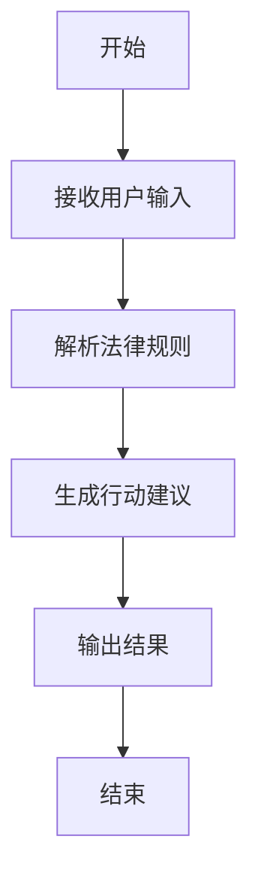
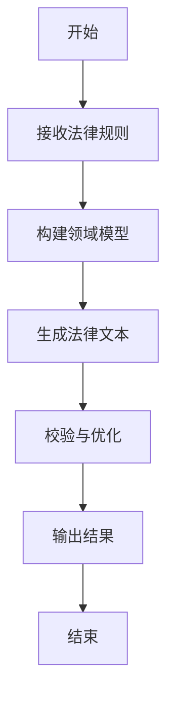
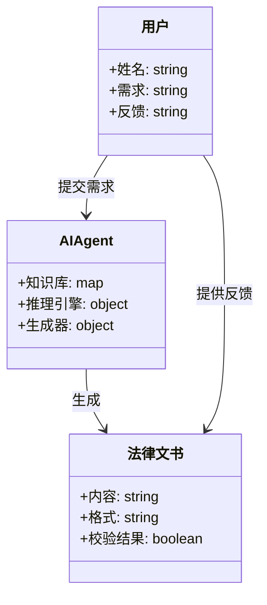
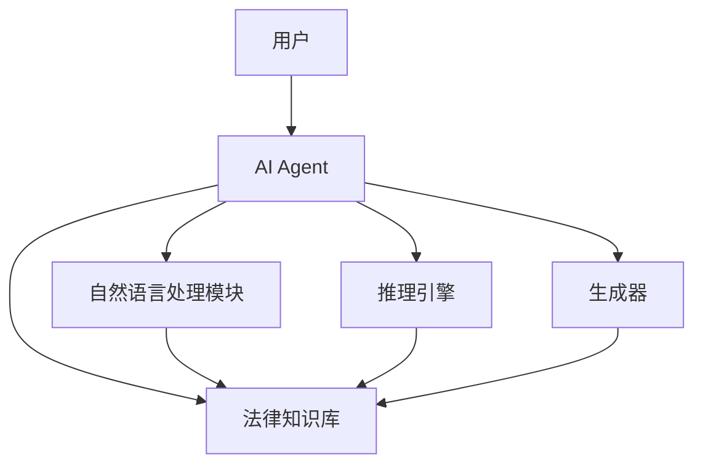
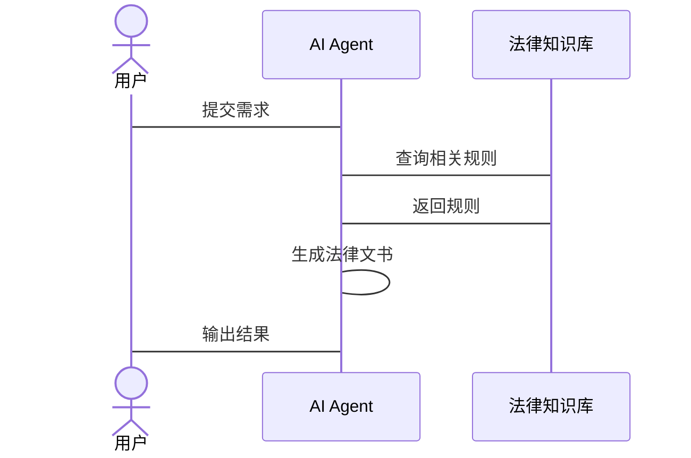

                 


# AI Agent在智能法律文书生成中的角色

> 关键词：AI Agent，法律文书生成，自然语言处理，智能决策，法律知识图谱

> 摘要：本文探讨AI Agent在智能法律文书生成中的角色，从背景、核心概念、算法原理、系统架构到项目实战，全面解析其应用与实现。

---

# 第一部分: AI Agent与智能法律文书生成的背景介绍

## 第1章: AI Agent的基本概念与法律文书生成的背景

### 1.1 AI Agent的核心概念

#### 1.1.1 AI Agent的定义与特点
AI Agent（人工智能代理）是指能够感知环境、自主决策并执行任务的智能体。其特点包括：
- **自主性**：无需外部干预，自主完成任务。
- **反应性**：能够实时感知环境变化并做出反应。
- **目标导向**：基于目标驱动行为。
- **学习能力**：通过数据学习改进性能。

#### 1.1.2 AI Agent的分类与应用场景
AI Agent主要分为以下几类：
1. **简单反射型**：基于规则执行任务，适用于简单场景。
2. **基于模型的反射型**：结合内部模型和外部信息进行决策。
3. **目标驱动型**：以目标为导向，主动规划行动。
4. **实用驱动型**：通过效用函数优化决策。

应用场景包括智能助手、自动驾驶、智能客服和法律咨询等。

#### 1.1.3 AI Agent在法律领域的潜力
法律领域对AI Agent的需求主要体现在：
- 法律咨询与建议。
- 法律文书自动化生成。
- 案件分析与风险评估。
- 法律规则的动态更新与应用。

---

### 1.2 法律文书生成的背景与挑战

#### 1.2.1 法律文书的基本类型与特点
法律文书包括判决书、起诉书、合同等，其特点为：
- **结构化**：格式固定，内容规范。
- **专业性**：涉及法律术语和条款。
- **逻辑性**：内容需符合法律逻辑。

#### 1.2.2 法律文书生成的传统方法与局限性
传统方法依赖人工编写，效率低且容易出错。主要局限性：
- **效率低下**：人工撰写耗时长。
- **一致性差**：不同人员生成的文书可能不一致。
- **难以标准化**：难以统一法律术语的使用。

#### 1.2.3 智能法律文书生成的需求与趋势
需求：
- 提高生成效率。
- 降低错误率。
- 便于大规模应用。

趋势：
- 基于AI技术的法律知识图谱构建。
- 法律文书生成的自动化与智能化。
- 结合区块链技术确保文书的可信性。

---

### 1.3 AI Agent在法律文书生成中的结合意义

#### 1.3.1 AI Agent与法律文书生成的结合点
- **需求分析**：AI Agent理解用户需求，生成符合要求的法律文书。
- **知识库调用**：利用AI Agent的知识库快速检索相关法律条文。
- **动态调整**：根据反馈实时优化生成内容。

#### 1.3.2 结合AI Agent的法律文书生成的优势
- **高效性**：快速生成法律文书。
- **准确性**：基于法律知识库，减少人为错误。
- **灵活性**：支持多种法律文书类型和格式。

#### 1.3.3 未来发展趋势与研究方向
- **多模态生成**：结合语音、图像等多模态信息。
- **可解释性**：生成过程和结果需要可解释。
- **人机协作**：AI Agent与法律专家协同工作。

---

## 第2章: AI Agent的核心原理与法律文书生成的关联

### 2.1 AI Agent的核心原理

#### 2.1.1 AI Agent的决策机制
决策机制包括感知、推理和行动三个步骤：
1. **感知**：通过传感器或数据接口获取环境信息。
2. **推理**：基于知识库和推理算法得出行动方案。
3. **行动**：执行最优动作并反馈结果。

#### 2.1.2 AI Agent的学习与推理能力
学习能力基于监督学习、强化学习和无监督学习：
- **监督学习**：基于标记数据训练模型。
- **强化学习**：通过奖励机制优化决策。
- **无监督学习**：从无标记数据中提取规律。

#### 2.1.3 AI Agent的自然语言处理能力
NLP技术包括分词、句法分析和语义理解，用于处理法律文本中的复杂语义。

---

### 2.2 法律文书生成的核心原理

#### 2.2.1 法律知识的结构化表示
结构化表示包括法律条文、案例和术语的数据库，便于快速检索和生成。

#### 2.2.2 法律文本的生成模型
生成模型基于RNN、LSTM和Transformer，用于法律文本的生成。

#### 2.2.3 法律文本的校验与优化
校验包括语法检查和法律术语一致性，优化包括文本流畅性和逻辑性。

---

### 2.3 AI Agent与法律文书生成的实体关系图

```mermaid
er
actor: 用户
agent: AI Agent
document: 法律文书
rule: 法律规则
action: 生成操作
```

---

### 2.4 AI Agent与法律文书生成的对比分析

#### 2.4.1 核心概念对比表

| 概念 | AI Agent | 法律文书生成 |
|------|----------|-------------|
| 核心功能 | 智能决策 | 文本生成     |
| 输入 | 用户需求 | 法律规则     |
| 输出 | 行动建议 | 法律文本     |

---

## 第3章: AI Agent的算法原理与实现

### 3.1 AI Agent的算法流程



---

### 3.2 法律文书生成的算法流程



---

### 3.3 算法实现的数学模型

#### 3.3.1 概率论基础

$$ P(\text{生成文本} | \text{输入条件}) = \frac{\text{符合输入条件的文本数量}}{\text{所有可能的文本数量}} $$

#### 3.3.2 神经网络模型

$$ \text{损失函数} = -\sum_{i=1}^{n} \text{log} P(y_i | x_i) $$

---

## 第4章: 系统架构设计与实现

### 4.1 应用场景介绍

#### 4.1.1 案例场景
用户输入需求，AI Agent生成法律文书。

#### 4.1.2 交互流程
用户输入需求 → AI Agent解析需求 → 生成法律文书 → 输出结果。

---

### 4.2 系统功能设计

#### 4.2.1 领域模型设计



---

### 4.3 系统架构设计



---

### 4.4 系统交互流程



---

## 第5章: 项目实战

### 5.1 环境安装

```bash
pip install numpy
pip install matplotlib
pip install transformers
```

---

### 5.2 系统核心实现源代码

#### 5.2.1 知识库构建

```python
import json

class LegalKnowledgeBase:
    def __init__(self):
        self.rules = {}

    def add_rule(self, case, rule):
        self.rules[case] = rule

    def get_rule(self, case):
        return self.rules.get(case, "")
```

---

#### 5.2.2 文本生成器

```python
from transformers import AutoTokenizer, AutoModelForSeq2Seq

class LegalDocumentGenerator:
    def __init__(self):
        self.tokenizer = AutoTokenizer.from_pretrained("facebook/legal-encoder")
        self.model = AutoModelForSeq2Seq.from_pretrained("facebook/legal-encoder")

    def generate_document(self, prompt):
        inputs = self.tokenizer.encode(prompt, return_tensors="pt")
        outputs = self.model.generate(inputs, max_length=500)
        return self.tokenizer.decode(outputs[0], skip_special_tokens=True)
```

---

### 5.3 案例分析

#### 5.3.1 案例场景
用户需求：生成一份合同违约条款。

#### 5.3.2 实施过程
1. 用户提交需求。
2. AI Agent解析需求。
3. 生成合同违约条款。
4. 输出结果。

---

### 5.4 最佳实践

#### 5.4.1 代码实现 tips
- 确保法律知识库的准确性和完整性。
- 优化生成模型的训练数据，提高生成质量。

#### 5.4.2 系统设计 tips
- 结合实际需求设计系统架构。
- 定期更新知识库，保持法律条款的时效性。

---

## 第6章: 总结与展望

### 6.1 小结
AI Agent在法律文书生成中的角色日益重要，通过技术手段提高生成效率和准确性。

### 6.2 注意事项
- 法律文书生成需结合专业法律知识。
- 确保生成结果的可解释性和合规性。

### 6.3 拓展阅读
- 探讨AI Agent在法律咨询中的应用。
- 研究法律知识图谱的构建与应用。

---

以上是完整的技术博客文章内容，希望对您有所帮助！

