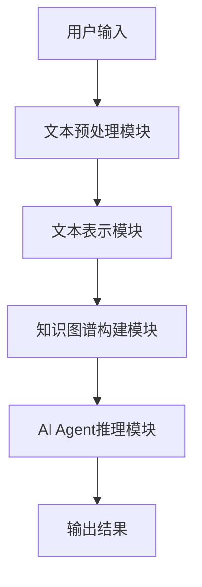

                 


# AI Agent在智能法律文档分析中的角色

> 关键词：AI Agent，智能法律文档分析，自然语言处理，知识图谱，法律术语识别，法律案例分析，法律自动化

> 摘要：本文探讨AI Agent在智能法律文档分析中的角色，结合技术背景、核心概念、算法原理、系统架构设计和实际案例，详细分析AI Agent如何提升法律文档分析的效率和准确性。

---

## 第1章: 问题背景与核心概念

### 1.1 问题背景

#### 1.1.1 法律文档分析的复杂性
法律文档分析涉及大量的法律术语、复杂的法律条文和案例分析，需要专业法律知识和丰富的经验。传统的人工分析效率低，且容易出错。

#### 1.1.2 AI技术在法律领域的潜力
AI技术，尤其是自然语言处理（NLP）和机器学习（ML），在法律领域展现出巨大潜力，能够帮助自动处理和分析法律文档，提升效率。

#### 1.1.3 AI Agent在法律文档分析中的独特优势
AI Agent是一种智能体，能够根据输入的法律文档，主动理解和分析内容，提供精准的法律建议和决策支持，显著提升法律分析的效率和准确性。

---

### 1.2 问题描述

#### 1.2.1 法律文档分析的主要挑战
- 大量的法律术语和复杂的法律条文导致人工分析耗时且容易出错。
- 法律文档的结构和格式多样，增加了自动分析的难度。
- 法律案例分析需要考虑上下文和先例，人工分析难以覆盖所有相关案例。

#### 1.2.2 AI Agent在法律文档分析中的角色定位
AI Agent作为法律文档分析的核心工具，能够实现以下功能：
- 自动抽取法律术语和关键信息。
- 识别法律条文之间的关系。
- 基于知识图谱进行法律案例分析和推理。
- 提供法律建议和决策支持。

#### 1.2.3 法律文档分析的边界与外延
法律文档分析的边界包括合同审查、法律条文解析和案例分析。外延则扩展到法律咨询、合规性审查和法律风险评估。

---

### 1.3 核心概念与联系

#### 1.3.1 AI Agent的定义与属性
AI Agent是一种智能体，具备以下核心属性：
- 感知能力：能够理解输入的法律文档内容。
- 学习能力：通过机器学习模型不断优化分析能力。
- 决策能力：基于分析结果做出合理的法律建议。

#### 1.3.2 法律文档分析的核心要素
法律文档分析的核心要素包括：
- 法律术语识别：准确识别和理解法律术语。
- 文本结构分析：解析法律文档的结构和格式。
- 案例分析：基于历史案例进行推理和分析。

#### 1.3.3 AI Agent与法律文档分析的关系
AI Agent通过自然语言处理、知识图谱和机器学习等技术，为法律文档分析提供技术支持，显著提升分析效率和准确性。

---

## 第2章: AI Agent的原理与技术

### 2.1 AI Agent的基本原理

#### 2.1.1 AI Agent的定义与分类
AI Agent可以分为简单反射式智能体、基于模型的反射式智能体和目标驱动智能体。在法律文档分析中，目标驱动智能体更为常用。

#### 2.1.2 AI Agent的核心技术
AI Agent的核心技术包括：
- 自然语言处理（NLP）：用于理解和分析法律文本。
- 机器学习（ML）：用于训练分类器和生成预测模型。
- 知识图谱：用于构建法律知识库和推理。

#### 2.1.3 AI Agent的决策机制
AI Agent通过输入法律文档内容，结合预训练的法律知识库，生成分析结果并提供决策建议。

---

### 2.2 自然语言处理在AI Agent中的应用

#### 2.2.1 NLP技术在法律文档分析中的作用
NLP技术用于法律文档的分词、句法分析和语义理解，帮助AI Agent准确提取法律信息。

#### 2.2.2 常见NLP模型及其特点
- BERT：适用于法律文本的上下文理解。
- LegalBERT：专为法律文本优化的模型。
- LSTM：适用于长文本的序列建模。

#### 2.2.3 NLP在法律术语处理中的挑战
法律术语的多样性和复杂性增加了NLP模型的训练难度，需要大量标注数据和领域知识。

---

### 2.3 知识图谱与法律文档分析

#### 2.3.1 知识图谱的定义与构建
知识图谱是一种结构化的知识表示方式，由实体和关系组成，能够帮助AI Agent理解法律术语之间的关联。

#### 2.3.2 知识图谱在法律文档分析中的应用
- 法律术语的关联推理。
- 法律条文的上下文分析。
- 法律案例的相似性分析。

#### 2.3.3 知识图谱与AI Agent的结合
AI Agent利用知识图谱进行法律术语的关联推理和案例分析，显著提升分析的深度和广度。

---

## 第3章: AI Agent与法律文档分析的结合

### 3.1 法律文档分析的流程

#### 3.1.1 文本预处理
- 分词：将法律文本分割成词语。
- 去停用词：去除无意义的词汇。
- 词干提取：提取词语的根形式。

#### 3.1.2 文本表示
- 词嵌入：使用词向量表示词语含义。
- 句向量：使用句子嵌入表示句子含义。
- 文档表示：使用文档向量表示整个文档。

#### 3.1.3 文本匹配与推理
- 文本匹配：比较不同文本之间的相似性。
- 案例推理：基于历史案例进行法律推理。

---

### 3.2 AI Agent在法律文档分析中的具体应用

#### 3.2.1 法律合同审查
AI Agent可以自动审查合同中的关键条款，识别潜在的法律风险。

#### 3.2.2 法律条文解析
AI Agent能够解析复杂的法律条文，帮助理解其含义和适用范围。

#### 3.2.3 法律案例分析
AI Agent通过知识图谱和案例库，进行相似案例的分析和推理。

---

## 第4章: 算法原理与技术实现

### 4.1 自然语言处理模型的训练与优化

#### 4.1.1 数据预处理
- 分词：使用jieba库对法律文本进行分词。
- 去停用词：去除无意义的词汇。
- 词向量化：使用Word2Vec生成词向量。

#### 4.1.2 模型训练
- 使用预训练的法律BERT模型进行微调。
- 设计分类任务，如法律条款分类。
- 使用交叉验证优化模型参数。

#### 4.1.3 模型调优
- 调整学习率和批次大小。
- 增加正则化项防止过拟合。
- 使用早停法优化训练过程。

---

### 4.2 知识图谱构建与推理

#### 4.2.1 实体识别
- 使用NER（命名实体识别）模型识别法律文档中的实体。
- 使用规则库进行法律术语的识别。

#### 4.2.2 关系抽取
- 基于依存句法分析提取实体之间的关系。
- 使用远程监督方法构建关系三元组。

#### 4.2.3 知识图谱推理
- 使用图嵌入技术（如GraphSAGE）进行推理。
- 基于路径分析进行相似案例推理。

---

## 第5章: 系统架构与设计

### 5.1 系统架构设计

#### 5.1.1 项目背景
构建一个基于AI Agent的法律文档分析系统，旨在提升法律文档分析的效率和准确性。

#### 5.1.2 系统功能设计
- 文本预处理模块：负责文本的分词、去停用词等预处理。
- 文本表示模块：生成文本的词向量、句向量和文档向量。
- 知识图谱构建模块：构建法律知识图谱。
- AI Agent推理模块：基于知识图谱进行法律推理和决策。

#### 5.1.3 系统架构图


---

## 第6章: 项目实战

### 6.1 环境安装与配置

```bash
pip install jieba
pip install transformers
pip install networkx
pip install matplotlib
```

---

### 6.2 核心代码实现

#### 6.2.1 法律文本分词
```python
import jieba

def legal_text_segmentation(text):
    return jieba.lcut(text)
```

#### 6.2.2 法律知识图谱构建
```python
import networkx as nx

G = nx.Graph()
G.add_nodes_from(["合同", "条款", "责任"])
G.add_edges_from([("合同", "条款"), ("条款", "责任")])
nx.draw(G, with_labels=True, node_color="white", edge_color="black")
plt.show()
```

---

### 6.3 代码解读与分析

#### 6.3.1 法律文本分词
- 使用jieba库对法律文本进行分词，生成词语列表。
- 示例：输入“合同条款”，输出“[合同, 条款]”。

#### 6.3.2 法律知识图谱构建
- 使用networkx库构建法律知识图谱，节点表示法律术语，边表示术语之间的关系。
- 绘制图谱，展示法律术语之间的关联。

---

### 6.4 案例分析与总结

#### 6.4.1 案例分析
分析一份法律合同，使用AI Agent提取关键条款并识别潜在风险。

#### 6.4.2 代码实现与结果展示
展示AI Agent在合同审查中的具体应用，包括文本分词、知识图谱构建和案例推理。

---

## 第7章: 最佳实践与注意事项

### 7.1 小结
AI Agent在法律文档分析中具有重要作用，能够显著提升分析效率和准确性。

### 7.2 注意事项
- 数据质量：法律文本的数据质量和标注准确性直接影响模型性能。
- 模型调优：需要根据具体任务调整模型参数和优化策略。
- 领域适应：AI Agent需要针对具体法律领域进行优化和调整。

### 7.3 拓展阅读
- 《自然语言处理入门》
- 《知识图谱构建与应用》
- 《法律人工智能入门》

---

## 第8章: 总结与展望

### 8.1 总结
本文详细探讨了AI Agent在智能法律文档分析中的角色，分析了其核心技术和应用场景，展示了AI Agent在法律文档分析中的巨大潜力。

### 8.2 展望
未来，随着AI技术的不断发展，AI Agent在法律文档分析中的应用将更加广泛和深入，能够实现更复杂的法律推理和决策支持。

---

通过以上内容，您可以撰写一篇详细的、逻辑清晰的关于《AI Agent在智能法律文档分析中的角色》的技术博客文章。希望这些内容能够为您提供有价值的参考和启发。

