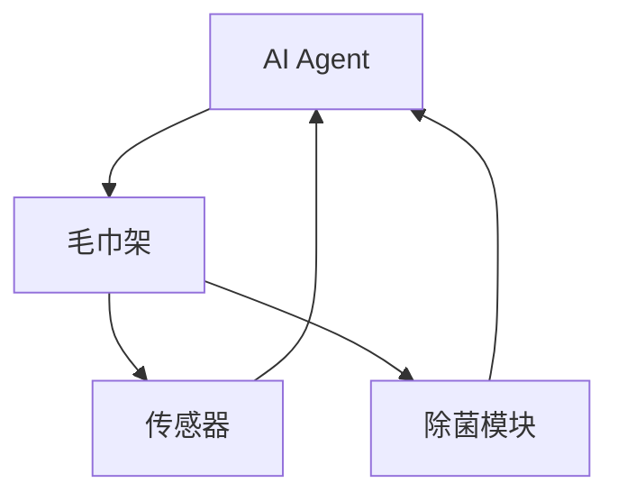
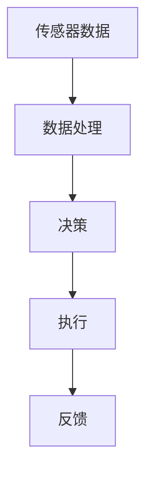
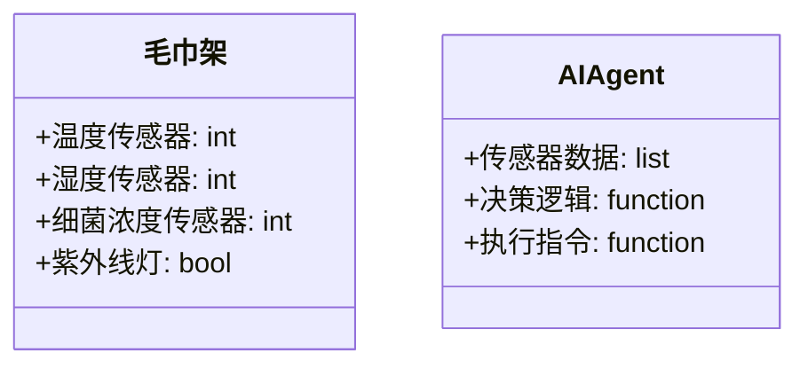
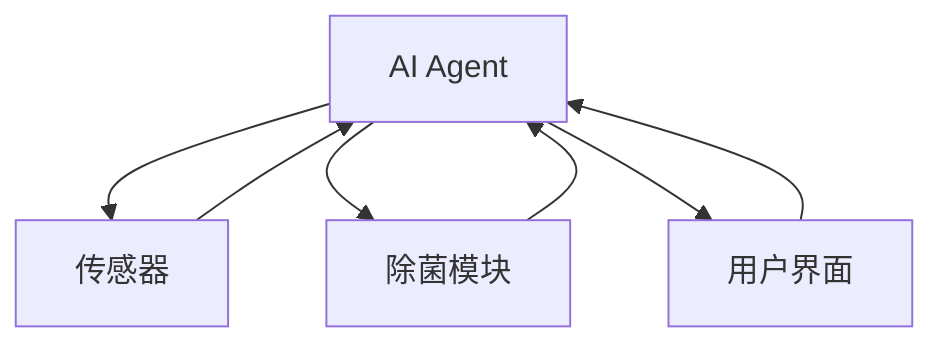
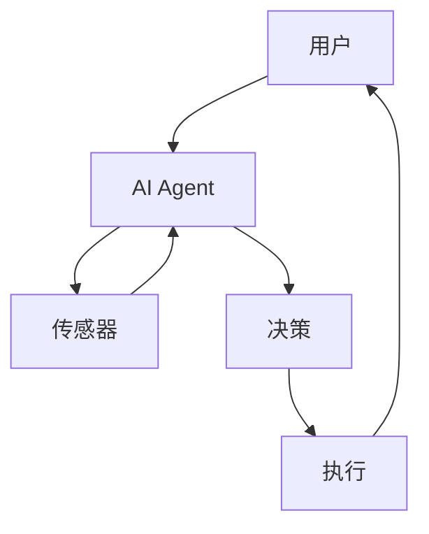

                 


# AI Agent在智能浴室毛巾架中的除菌功能

## 关键词：AI Agent, 智能浴室, 毛巾架, 除菌功能, 物联网, 传感器, 紫外线杀菌

## 摘要：本文详细探讨了AI Agent在智能浴室毛巾架中的除菌功能，从背景介绍到系统设计，再到项目实战，全面分析了如何利用AI技术提升浴室环境的卫生标准。通过传感器数据感知环境，AI Agent进行决策并执行除菌操作，结合物联网技术，实现了智能化、自动化的除菌功能，为用户提供健康安全的使用体验。

---

## 第一部分: AI Agent在智能浴室毛巾架中的除菌功能概述

### 第1章: 背景介绍

#### 1.1 AI Agent的基本概念
##### 1.1.1 AI Agent的定义与特点
- **AI Agent**（人工智能代理）是指能够感知环境、自主决策并执行任务的智能实体。它能够通过传感器获取信息，利用算法进行分析，并根据结果采取相应行动。
- **特点**：
  - **自主性**：能够在没有外部干预的情况下运行。
  - **反应性**：能够实时感知环境变化并做出反应。
  - **目标导向**：所有行动都是为了实现特定目标。
  - **学习能力**：通过数据和经验不断优化自身行为。

##### 1.1.2 AI Agent与传统自动化设备的区别
- **传统自动化设备**：基于固定的程序执行任务，无法自主决策。
- **AI Agent**：能够根据环境变化调整行为，具备学习和适应能力。

#### 1.2 浴室环境与毛巾架的功能需求
##### 1.2.1 浴室环境的特点
- **湿度高**：浴室环境中湿度较高，容易滋生细菌。
- **细菌易滋生**：温暖潮湿的环境是细菌繁殖的理想场所。
- **使用场景多样化**：浴室不仅用于洗漱，还可能用于洗澡或其他活动，使用场景复杂。

##### 1.2.2 毛巾架的功能需求
- **存储功能**：需要能够存储毛巾等物品。
- **除菌功能**：需要能够有效杀灭细菌，保持毛巾的卫生。
- **智能控制功能**：能够通过传感器和AI Agent实现智能化控制。

#### 1.3 除菌功能的重要性
##### 1.3.1 细菌传播的途径
- **空气传播**：细菌通过空气传播到毛巾上。
- **接触传播**：直接接触被污染的物品表面。
- **水源传播**：通过水传播细菌。

##### 1.3.2 除菌功能在浴室环境中的作用
- **减少细菌滋生**：通过除菌功能，有效抑制细菌的生长。
- **提高卫生标准**：为用户提供更健康的使用环境。
- **保护用户健康**：预防细菌感染，保护用户的健康。

---

### 第2章: 核心概念与联系

#### 2.1 AI Agent的工作原理
##### 2.1.1 感知环境
- **传感器的作用**：通过温度、湿度、细菌浓度等传感器感知环境数据。
- **数据采集与处理**：将传感器数据进行采集、处理和分析，为AI Agent的决策提供依据。

##### 2.1.2 决策与规划
- **算法选择**：根据传感器数据，AI Agent利用算法进行决策，例如基于规则的算法或机器学习算法。
- **执行策略**：根据决策结果，制定执行策略，例如启动紫外线灯进行除菌。

##### 2.1.3 执行操作
- **除菌模块的启动**：根据AI Agent的决策，启动紫外线灯或其他除菌设备。
- **执行结果的反馈**：将执行结果反馈给AI Agent，供其调整后续行动。

#### 2.2 核心概念对比
##### 2.2.1 基于规则的AI Agent与基于学习的AI Agent对比
| 对比维度 | 基于规则的AI Agent | 基于学习的AI Agent |
|----------|---------------------|---------------------|
| 决策方式 | 基于预设规则         | 基于数据学习模型     |
| 灵活性   | 较低                | 较高                |
| 适应性   | 较差                | 较好                |

##### 2.2.2 实体关系图


---

### 第3章: 算法原理讲解

#### 3.1 算法选择与流程
##### 3.1.1 算法选择
- **基于规则的算法**：适用于简单的决策逻辑，例如当细菌浓度超过阈值时启动紫外线灯。

##### 3.1.2 算法流程


#### 3.2 核心算法实现
##### 3.2.1 传感器数据处理
- **温度传感器**：测量环境温度。
- **湿度传感器**：测量环境湿度。
- **细菌浓度传感器**：测量空气中的细菌浓度。

##### 3.2.2 决策逻辑
- **条件判断**：如果细菌浓度 > 阈值，则启动除菌模块。
- **数学模型**：
  - 判断条件：$$ \text{if } (\text{细菌浓度} > \text{阈值}) \text{ then 启动紫外线灯} $$

##### 3.2.3 执行逻辑
- **启动紫外线灯**：通过信号控制紫外线灯的开关。
- **停止紫外线灯**：在完成除菌后停止紫外线灯。

#### 3.3 代码实现
##### 3.3.1 传感器数据处理
```python
import sensor

temperature = sensor.get_temperature()
humidity = sensor.get_humidity()
bacteria_level = sensor.get_bacteria_level()
```

##### 3.3.2 决策逻辑
```python
threshold = 100  # 示例阈值
if bacteria_level > threshold:
    execute消毒()
```

##### 3.3.3 执行逻辑
```python
def 消毒():
    # 启动紫外线灯
    紫外线灯.启动()
    # 等待一段时间
    time.sleep(5)
    # 关闭紫外线灯
    紫外线灯.关闭()
```

---

### 第4章: 系统分析与架构设计方案

#### 4.1 问题场景介绍
##### 4.1.1 浴室环境的特点
- **湿度高**：容易滋生细菌。
- **使用场景多样化**：需要灵活的控制功能。

#### 4.2 项目介绍
##### 4.2.1 项目目标
- 实现智能浴室毛巾架的除菌功能。
- 提供用户友好的操作界面。

#### 4.3 系统功能设计
##### 4.3.1 领域模型


##### 4.3.2 系统架构设计


#### 4.4 系统接口设计
##### 4.4.1 接口描述
- **传感器接口**：提供温度、湿度、细菌浓度数据。
- **执行机构接口**：控制紫外线灯的开关。
- **用户界面接口**：显示系统状态和用户操作。

#### 4.5 系统交互流程图


---

### 第5章: 项目实战

#### 5.1 环境安装
##### 5.1.1 硬件安装
- **安装传感器**：将温度、湿度、细菌浓度传感器安装在毛巾架上。
- **安装紫外线灯**：将紫外线灯安装在毛巾架内部或附近。

##### 5.1.2 软件安装
- **安装AI Agent**：部署AI Agent软件，连接传感器和执行机构。
- **安装用户界面**：提供用户友好的操作界面，方便用户查看和控制系统。

#### 5.2 系统核心实现
##### 5.2.1 核心代码实现
```python
import sensor
import time

class AIAgent:
    def __init__(self):
        self.sensor = sensor.Sensor()
        self.disinfection_module = UVLight()

    def 感知环境(self):
        temperature = self.sensor.get_temperature()
        humidity = self.sensor.get_humidity()
        bacteria_level = self.sensor.get_bacteria_level()
        return temperature, humidity, bacteria_level

    def 决策(self, bacteria_level):
        if bacteria_level > 100:
            return True
        else:
            return False

    def 执行(self, execute):
        if execute:
            self.disinfection_module.start()
            time.sleep(5)
            self.disinfection_module.stop()

    def 运行(self):
        while True:
            temp, hum, bacteria = self.感知环境()
            execute = self.决策(bacteria)
            self.执行(execute)
            time.sleep(60)

# 使用示例
agent = AIAgent()
agent.运行()
```

##### 5.2.2 代码解读
- **AIAgent类**：负责感知环境、决策和执行。
- **运行方法**：持续循环运行，定期感知环境并执行除菌操作。
- **传感器类**：提供温度、湿度、细菌浓度数据。
- **UVLight类**：控制紫外线灯的开关。

#### 5.3 实际案例分析
##### 5.3.1 案例描述
- **场景**：浴室环境中细菌浓度突然升高。
- **系统反应**：AI Agent感知到细菌浓度超过阈值，启动紫外线灯进行除菌。

##### 5.3.2 详细讲解
- **感知阶段**：传感器检测到细菌浓度为120，超过阈值100。
- **决策阶段**：AI Agent决定启动紫外线灯。
- **执行阶段**：紫外线灯运行5秒，有效降低细菌浓度。

#### 5.4 项目小结
- **项目目标**：实现智能浴室毛巾架的除菌功能。
- **项目成果**：成功开发并部署了一个基于AI Agent的智能除菌系统。
- **经验总结**：传感器的准确性、系统的稳定性是关键因素。

---

## 第六部分: 最佳实践与总结

### 第6章: 最佳实践

#### 6.1 小结
- **总结**：本文详细探讨了AI Agent在智能浴室毛巾架中的除菌功能，从背景介绍到系统设计，再到项目实战，全面分析了如何利用AI技术提升浴室环境的卫生标准。

#### 6.2 注意事项
- **传感器的选择**：选择高精度的传感器，确保数据的准确性。
- **系统的稳定性**：确保系统的稳定运行，避免因故障导致除菌失败。
- **用户的安全性**：确保紫外线灯的安全使用，避免对人体造成伤害。

#### 6.3 拓展阅读
- **AI在物联网中的应用**：进一步了解AI在物联网中的其他应用。
- **复杂算法的实现**：探索更复杂的算法，如机器学习算法，提高系统的智能化水平。

---

## 结语

本文通过详细分析AI Agent在智能浴室毛巾架中的除菌功能，展示了如何利用人工智能技术提升浴室环境的卫生标准。通过传感器数据感知环境、AI Agent进行决策并执行除菌操作，结合物联网技术，实现了智能化、自动化的除菌功能。未来，随着技术的不断发展，AI Agent在浴室环境中的应用将更加广泛和智能。

