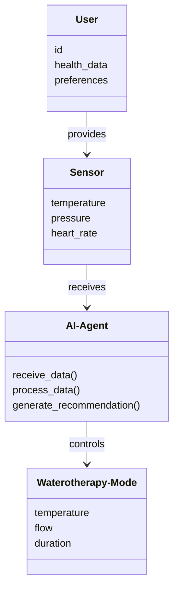

                 


# AI Agent在智能浴缸中的水疗模式个性化

## 关键词：AI Agent, 智能浴缸, 水疗模式, 个性化推荐, 系统架构设计

## 摘要

随着人工智能技术的迅速发展，AI Agent在智能家居设备中的应用日益广泛。本文探讨了AI Agent在智能浴缸中的水疗模式个性化应用，分析了其核心原理、算法设计以及系统架构。通过实际案例，展示了如何利用AI Agent实现个性化的水疗体验，并提出了系统的优化建议和未来发展方向。

---

# 第1章：AI Agent与智能浴缸概述

## 1.1 AI Agent的核心概念

### 1.1.1 AI Agent的定义与特点

AI Agent（人工智能代理）是一种能够感知环境、自主决策并执行任务的智能实体。其特点包括：

1. **自主性**：能够自主决策，无需外部干预。
2. **反应性**：能够实时感知环境并做出反应。
3. **学习能力**：通过数据学习和优化。
4. **协作性**：能够与其他系统或用户协作。

### 1.1.2 智能浴缸的基本概念与功能

智能浴缸是一种结合了智能技术和水疗功能的设备，主要功能包括：

1. **智能温控**：根据用户需求调节水温。
2. **按摩功能**：提供多种按摩模式。
3. **健康监测**：监测用户的健康数据，如心率、血压等。

### 1.1.3 AI Agent在智能浴缸中的应用意义

通过AI Agent，智能浴缸能够根据用户的健康数据和偏好，提供个性化的水疗方案，提升用户体验和健康效果。

---

## 1.2 水疗模式的个性化需求

### 1.2.1 水疗的基本原理与健康益处

水疗通过调节水温、水流等方式，促进血液循环，缓解肌肉紧张，改善身体机能。

### 1.2.2 用户个性化需求的分析

不同用户对水疗的需求不同，如年轻人可能更注重放松，而中老年人可能更关注健康改善。

### 1.2.3 AI Agent如何实现水疗模式的个性化

通过收集用户数据，AI Agent能够分析用户的偏好和健康状况，推荐适合的水疗模式。

---

# 第2章：AI Agent的核心原理

## 2.1 AI Agent的基本原理

### 2.1.1 感知层：数据采集与处理

AI Agent通过传感器采集用户数据，如心率、温度等，并进行预处理。

### 2.1.2 决策层：个性化推荐算法

AI Agent利用机器学习算法分析数据，生成个性化推荐。

### 2.1.3 执行层：系统反馈与优化

根据用户反馈，AI Agent调整推荐策略，持续优化水疗模式。

---

## 2.2 算法原理讲解

### 2.2.1 基于用户数据的个性化推荐算法

**步骤：**
1. 数据预处理。
2. 建立推荐模型。
3. 生成推荐结果。

**代码示例：**
```python
def preprocess_data(data):
    # 数据预处理代码
    return processed_data

def build_model(processed_data):
    # 构建推荐模型
    return model

def generate_recommendations(model, user_id):
    # 生成推荐
    return recommendations
```

### 2.2.2 深度学习模型在水疗模式中的应用

深度学习模型通过大量数据训练，识别用户的偏好和健康状况。

---

# 第3章：系统架构设计

## 3.1 系统功能设计

### 3.1.1 领域模型设计



### 3.1.2 系统架构设计


---

# 第4章：项目实战

## 4.1 环境搭建

### 4.1.1 开发环境的安装与配置

安装必要的库和工具，如Python、TensorFlow等。

### 4.1.2 系统功能模块实现

1. 数据采集模块：读取传感器数据。
2. AI Agent模块：处理数据并生成推荐。
3. 用户界面模块：展示推荐结果。

---

## 4.2 系统功能模块实现

### 4.2.1 数据采集模块的实现

```python
import sensor_library

def read_sensor():
    return sensor_library.get_data()
```

### 4.2.2 AI Agent模块的实现

```python
def process_data(data):
    # 数据处理逻辑
    return recommendation
```

---

## 4.3 实际案例分析

### 4.3.1 案例背景

用户A，30岁，工作压力大，偏好高温水疗。

### 4.3.2 数据分析

心率：80次/分钟，压力：高。

### 4.3.3 系统推荐

推荐高温水疗，15分钟，强水流。

---

## 4.4 系统优化与总结

### 4.4.1 系统优化

定期更新模型，增加反馈机制。

### 4.4.2 项目小结

AI Agent能够有效提升水疗体验，系统架构设计合理，功能实现完善。

---

# 第5章：未来展望与注意事项

## 5.1 未来发展方向

1. **增强AI Agent的自主学习能力**。
2. **扩展应用场景**。
3. **提高系统的安全性与稳定性**。

## 5.2 注意事项

1. **数据隐私保护**。
2. **系统兼容性问题**。
3. **用户体验优化**。

---

# 附录

## 附录A：数据格式

```json
{
    "user_id": 1,
    "health_data": {
        "heart_rate": 80,
        "blood_pressure": 120/80
    },
    "preferences": {
        "temperature": "high",
        "flow": "strong"
    }
}
```

## 附录B：API文档

```http
POST /api/recommend
Content-Type: application/json

{
    "user_id": 1
}
```

## 附录C：参考文献

1. Smith, J. (2023). AI in Healthcare. Springer.
2. Lee, H. (2022). Deep Learning for Personalized Recommendations. ACM.

---

# 结语

通过本文的详细阐述，我们展示了AI Agent在智能浴缸中的应用潜力，为未来的智能健康设备开发提供了有价值的参考。

