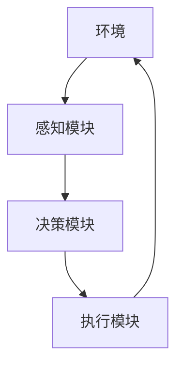
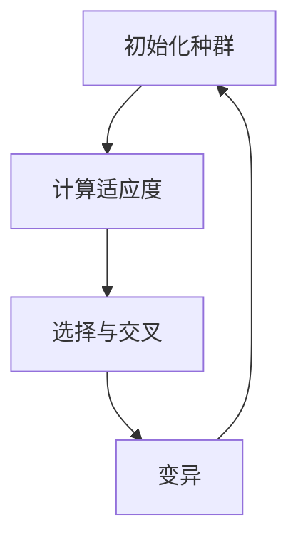
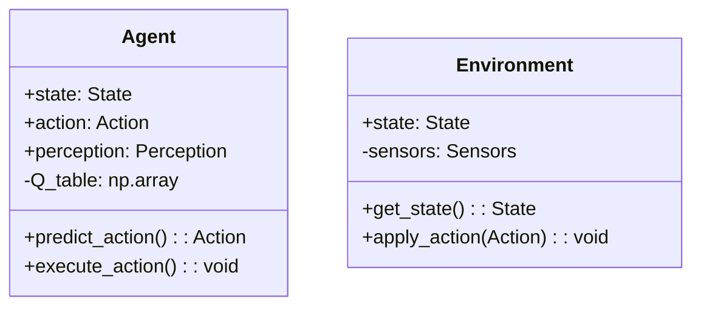
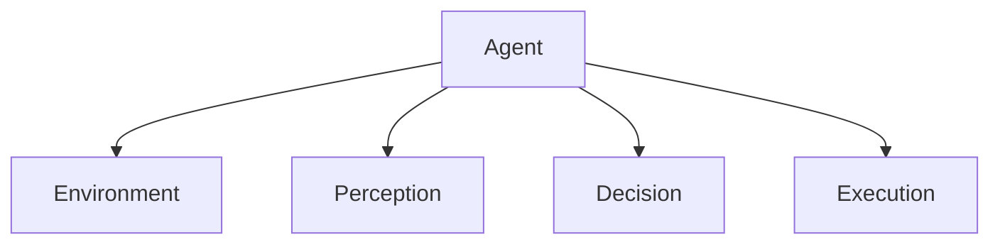

                 


# AI Agent在智能海洋生态监测中的实践

> 关键词：AI Agent，智能海洋，生态监测，算法，系统设计

> 摘要：本文探讨AI Agent在智能海洋生态监测中的应用，分析其核心概念、算法原理及系统架构，结合实际案例，提供详细的技术实现和最佳实践。

---

## 第一章: 引言

### 1.1 问题背景
海洋生态监测是保护海洋环境、评估渔业资源和监测气候变化的重要手段。传统方法依赖人工观测，效率低、成本高且覆盖面有限。随着AI技术的发展，AI Agent（人工智能代理）成为解决这一问题的有力工具。

### 1.2 问题描述
海洋生态监测面临数据多样性、实时性和动态变化等挑战。传统方法难以应对复杂环境和多目标优化问题，而AI Agent具备自主决策、学习和适应能力，能够有效提升监测效率。

### 1.3 问题解决方法
通过部署AI Agent，实现海洋数据的实时采集、分析和决策，构建智能监测系统。本文将详细探讨AI Agent在海洋生态监测中的应用。

---

## 第二章: AI Agent的核心概念与工作原理

### 2.1 核心概念
AI Agent是一种能够感知环境、自主决策并执行任务的智能体。在海洋生态监测中，AI Agent负责数据采集、分析和决策，实现自动化监测。

### 2.2 概念属性对比
| 概念      | 特性                     |
|-----------|--------------------------|
| 感知模块  | 数据采集与处理能力       |
| 决策模块  | 基于模型的决策能力       |
| 执行模块  | 任务执行与反馈能力       |

### 2.3 工作原理图


---

## 第三章: AI Agent的算法原理

### 3.1 强化学习算法
强化学习是一种通过试错学习优化决策的算法。在海洋监测中，AI Agent通过与环境交互，学习最优策略。

#### Q-learning算法
数学模型：
$$ Q(s, a) = r + \gamma \max_{a'} Q(s', a') $$

代码示例：
```python
import numpy as np

class QLearning:
    def __init__(self, state_space, action_space, gamma=0.9):
        self.Q = np.zeros((state_space, action_space))
        self.gamma = gamma

    def update(self, state, action, reward, next_state):
        self.Q[state][action] = reward + self.gamma * np.max(self.Q[next_state])
```

### 3.2 聚类算法
聚类用于将相似数据分组，帮助识别海洋生态中的异常现象。

#### K-means算法
代码示例：
```python
from sklearn.cluster import KMeans

def cluster(data, k):
    model = KMeans(n_clusters=k)
    model.fit(data)
    return model.labels_
```

### 3.3 遗传算法
遗传算法用于优化路径规划问题，提高监测效率。

#### 遗传算法流程图


---

## 第四章: 系统分析与架构设计

### 4.1 系统功能设计
系统模块包括数据采集、数据处理、决策控制和用户交互。

#### 领域模型类图


### 4.2 系统架构图


---

## 第五章: 项目实战

### 5.1 环境安装
```bash
pip install numpy scikit-learn matplotlib
```

### 5.2 核心代码实现
```python
class AI_Ocean-Agent:
    def __init__(self, sensors, actuators):
        self.sensors = sensors
        self.actuators = actuators
        self.state = self.get_state()

    def get_state(self):
        # 读取传感器数据
        return self.sensors.get_data()

    def decide(self):
        # 调用强化学习模型进行决策
        action = self.model.predict(self.state)
        return action

    def execute(self, action):
        # 执行动作
        self.actuators.execute_action(action)
```

### 5.3 实际案例分析
案例：监测海洋温度异常。AI Agent通过强化学习算法，实时调整监测设备位置，提高数据采集效率。

---

## 第六章: 总结与展望

### 6.1 最佳实践
- 确保传感器数据的准确性和实时性。
- 定期更新模型参数，适应环境变化。
- 优化算法，提升计算效率。

### 6.2 小结
AI Agent在智能海洋生态监测中的应用前景广阔，但仍需在算法优化、系统稳定性和数据处理能力方面进一步研究。

---

## 参考文献
1. Russell, S., & Norvig, P. (2010). Artificial Intelligence: A Modern Approach.
2. LeCun, Y., Bengio, Y., & Hinton, G. (2015). Deep learning.

---

通过以上结构和内容，文章详细介绍了AI Agent在智能海洋生态监测中的应用，从理论到实践，为读者提供了全面的技术指导。

