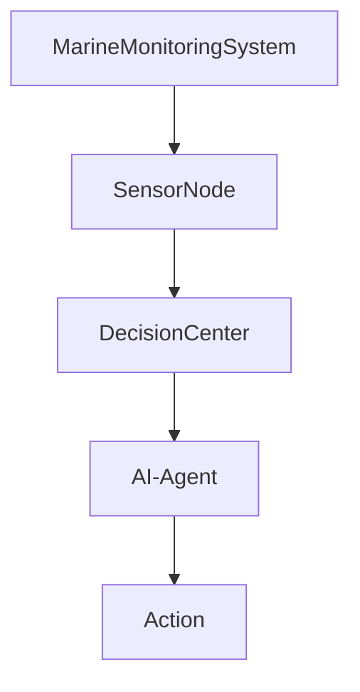
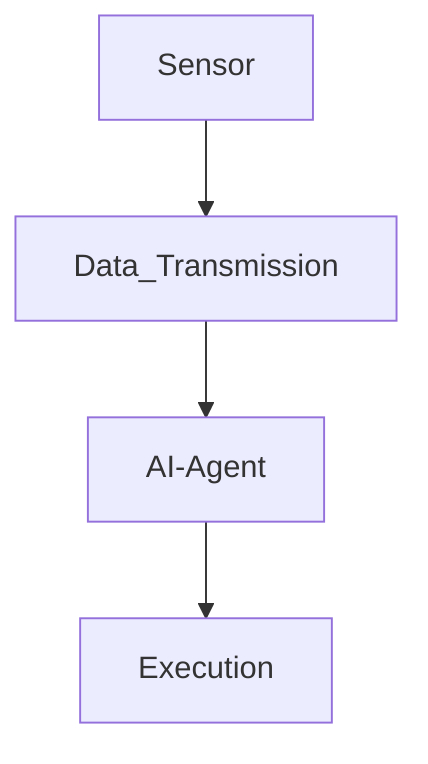
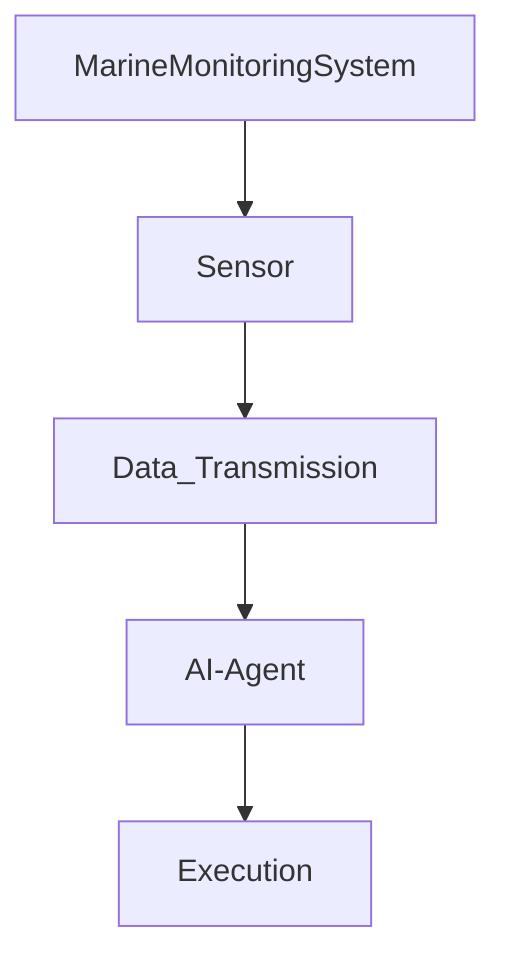
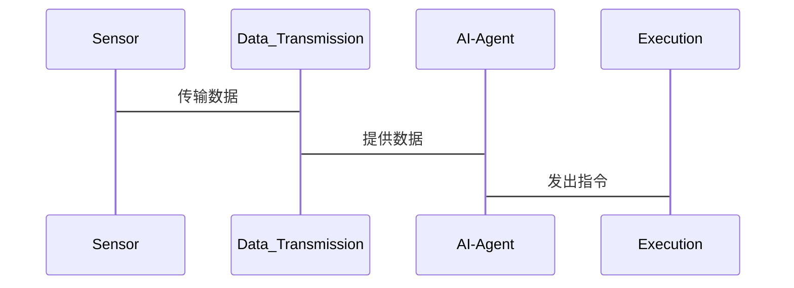

                 


# AI Agent在智能海洋监测中的实践

> 关键词：AI Agent, 智能海洋监测, 传感器网络, 强化学习, 多智能体协作

> 摘要：本文详细探讨了AI Agent在智能海洋监测中的应用，从背景介绍到核心概念，从算法原理到系统架构，再到项目实战和最佳实践，全面解析了AI Agent在智能海洋监测中的技术细节和实际应用。

---

# 第一部分: AI Agent与智能海洋监测的背景与概念

## 第1章: AI Agent与智能海洋监测的背景介绍

### 1.1 问题背景

#### 1.1.1 海洋环境监测的重要性
海洋是地球生命的重要支撑，海洋环境的监测对于环境保护、渔业资源管理、海洋运输安全等具有重要意义。然而，海洋环境复杂多变，传统监测方法效率低下，难以满足实时性和精准性的需求。

#### 1.1.2 传统海洋监测的局限性
传统海洋监测主要依赖传感器网络和人工分析，存在以下问题：
- 数据采集范围有限，无法覆盖大范围海洋区域。
- 数据处理效率低，难以实现实时监测。
- 单一传感器数据不足以全面反映海洋环境。

#### 1.1.3 AI Agent技术的引入与意义
AI Agent（人工智能代理）是一种能够感知环境、自主决策并采取行动的智能体。引入AI Agent技术可以显著提升海洋监测的效率和精度，实现智能化、自动化的监测。

### 1.2 问题描述

#### 1.2.1 海洋监测的主要挑战
- 海洋环境复杂，数据类型多样（温度、盐度、洋流、生物群落等）。
- 监测设备需要长期稳定运行，面临恶劣环境条件。
- 数据分析需要高精度和实时性。

#### 1.2.2 AI Agent在海洋监测中的应用场景
- 自动感知海洋环境数据。
- 实时分析数据，识别异常情况。
- 自主决策，调整监测设备的工作状态。

#### 1.2.3 问题解决的目标与边界
目标：构建一个基于AI Agent的智能海洋监测系统，实现高效、精准的海洋环境监测。
边界：系统主要关注海洋环境数据的采集、分析和决策，不涉及数据的长期存储和管理。

### 1.3 问题解决与AI Agent的作用

#### 1.3.1 AI Agent的核心功能与能力
- 感知环境：通过传感器获取海洋环境数据。
- 分析数据：利用机器学习算法分析数据，识别异常情况。
- 决策与行动：根据分析结果，调整监测设备的工作参数。

#### 1.3.2 AI Agent在海洋监测中的具体应用
- 自动调整传感器的采样频率。
- 实时识别海洋污染事件。
- 预测海洋环境变化趋势。

#### 1.3.3 系统的边界与外延
系统边界：仅关注AI Agent在海洋监测中的应用，不涉及数据存储和可视化。
系统外延：AI Agent技术可以扩展到其他领域，如智能交通、智能制造等。

### 1.4 概念结构与核心要素

#### 1.4.1 AI Agent的组成与功能模块
- 感知模块：负责采集环境数据。
- 分析模块：负责数据的分析与处理。
- 决策模块：负责制定决策并采取行动。

#### 1.4.2 海洋监测系统的结构与功能
- 传感器网络：负责采集海洋环境数据。
- 数据传输模块：负责数据的传输与存储。
- AI Agent：负责数据分析与决策。

#### 1.4.3 AI Agent与海洋监测系统的交互关系
AI Agent通过传感器网络获取数据，分析数据后，向监测系统发送指令，调整传感器的工作状态。

---

## 第2章: AI Agent与智能海洋监测的核心概念

### 2.1 核心概念与原理

#### 2.1.1 AI Agent的基本原理
AI Agent通过感知环境、分析数据、制定决策并采取行动，实现对环境的监测与控制。

#### 2.1.2 智能海洋监测系统的原理
智能海洋监测系统通过AI Agent技术，实现对海洋环境的实时监测与智能决策。

#### 2.1.3 AI Agent在海洋监测中的核心作用
AI Agent通过自主学习和决策，提升海洋监测系统的智能化水平。

### 2.2 核心概念对比与特征分析

#### 2.2.1 AI Agent与传统传感器网络的对比
| 特性          | AI Agent                | 传统传感器网络           |
|---------------|-------------------------|--------------------------|
| 数据处理能力  | 强大，支持实时分析       | 较弱，依赖人工分析         |
| 自主性         | 高，能够自主决策         | 低，依赖外部指令           |
| 灵活性         | 高，能够适应环境变化     | 低，固定工作模式           |

#### 2.2.2 AI Agent与边缘计算的对比
| 特性          | AI Agent                | 边缘计算                 |
|---------------|-------------------------|--------------------------|
| 数据处理位置  | 本地或云端               | 边缘设备                 |
| 智能性         | 高，具备自主决策能力     | 较低，主要完成数据处理     |
| 应用场景       | 多领域，包括海洋监测     | 多领域，包括工业、交通等   |

#### 2.2.3 AI Agent与物联网技术的对比
| 特性          | AI Agent                | 物联网技术               |
|---------------|-------------------------|--------------------------|
| 核心功能       | 自主决策与行动           | 数据采集与传输           |
| 智能性         | 高，具备智能决策能力     | 较低，主要完成数据传输     |
| 应用场景       | 智能海洋监测             | 家庭自动化、工业自动化等   |

### 2.3 实体关系与系统架构

#### 2.3.1 ER实体关系图
```mermaid
er
  MarineMonitoringSystem --|{AI Agent}: 实现智能决策
  SensorNode --|{感知数据}: 提供环境数据
  DecisionCenter --|{处理请求}: 处理AI Agent的请求
```

#### 2.3.2 系统架构图


---

## 第3章: AI Agent在智能海洋监测中的算法原理

### 3.1 强化学习算法原理

#### 3.1.1 算法简介
强化学习是一种通过试错机制来优化决策的算法，适用于动态环境下的决策问题。

#### 3.1.2 算法步骤
1. 状态感知：AI Agent感知当前环境状态。
2. 动作选择：基于当前状态，选择最优动作。
3. 奖励机制：根据动作的结果，获得奖励或惩罚。
4. 策略优化：根据奖励调整策略，优化决策过程。

#### 3.1.3 算法实现
```python
class AI-Agent:
    def __init__(self):
        self.state = None
        self.action = None
        self奖励 = 0

    def感知环境(self):
        self.state = get_current_state()

    def选择动作(self):
        self.action = choose_action(self.state)

    def获得奖励(self):
        self奖励 = get_reward(self.state, self.action)

    def优化策略(self):
        update_policy(self奖励)
```

#### 3.1.4 算法优势
- 能够适应动态环境。
- 能够实现自主决策。

### 3.2 多智能体协作算法

#### 3.2.1 算法简介
多智能体协作算法用于多个AI Agent之间的协作，实现更复杂的任务。

#### 3.2.2 算法步骤
1. 任务分配：将任务分配给不同的AI Agent。
2. 信息共享：AI Agent之间共享信息。
3. 协作决策：基于共享信息，制定协作决策。
4. 执行任务：AI Agent协同执行任务。

#### 3.2.3 算法实现
```python
class Multi-Agent:
    def __init__(self, num_agents):
        self.agents = [AI-Agent() for _ in range(num_agents)]
        self.communication_channel = CommunicationChannel()

    def分配任务(self, task):
        for agent in self.agents:
            agent.分配任务(task)

    def共享信息(self):
        for agent in self.agents:
            self.communication_channel.send(agent.state)

    def制定决策(self):
        for agent in self.agents:
            agent.选择动作()

    def执行任务(self):
        for agent in self.agents:
            agent.采取行动()
```

#### 3.2.4 算法优势
- 能够实现更复杂的任务。
- 能够提高系统的整体效率。

### 3.3 数学模型与公式

#### 3.3.1 强化学习的数学模型
强化学习的核心是通过状态-动作-奖励的循环来优化策略。数学模型如下：
$$ R = r_1 + r_2 + \dots + r_n $$
其中，R是总奖励，r_i是第i步的奖励。

#### 3.3.2 多智能体协作的数学模型
多智能体协作的数学模型可以表示为：
$$ C = \sum_{i=1}^{n} c_i $$
其中，C是总协作成本，c_i是第i个智能体的协作成本。

---

## 第4章: 智能海洋监测系统的架构设计

### 4.1 系统功能设计

#### 4.1.1 系统模块划分
- 传感器模块：负责采集环境数据。
- 数据传输模块：负责数据的传输与存储。
- AI Agent模块：负责数据分析与决策。
- 执行模块：负责根据决策采取行动。

#### 4.1.2 功能模块关系


### 4.2 系统架构设计

#### 4.2.1 系统架构图


#### 4.2.2 系统接口设计
- 传感器接口：负责与传感器通信。
- 数据传输接口：负责数据的传输与存储。
- AI Agent接口：负责与外部系统的通信。

#### 4.2.3 系统交互流程图


---

## 第5章: 项目实战

### 5.1 环境安装与配置

#### 5.1.1 系统环境
- 操作系统：Linux
- 依赖库：Python、TensorFlow、Keras

#### 5.1.2 安装步骤
```bash
pip install tensorflow keras numpy
```

### 5.2 系统核心代码实现

#### 5.2.1 传感器数据采集
```python
import numpy as np

class Sensor:
    def __init__(self):
        self.data = None

    def采集数据(self):
        self.data = np.random.rand(10, 10)  # 示例数据
        return self.data
```

#### 5.2.2 数据分析与处理
```python
from tensorflow import keras

class AI-Agent:
    def __init__(self):
        self.model = self.构建模型()

    def构建模型(self):
        model = keras.Sequential()
        model.add(keras.layers.Conv2D(32, (3,3), activation='relu', input_shape=(10,10,1)))
        model.add(keras.layers.Flatten())
        model.add(keras.layers.Dense(10, activation='softmax'))
        model.compile(optimizer='adam', loss='sparse_categorical_crossentropy', metrics=['accuracy'])
        return model

    def分析数据(self, data):
        predictions = self.model.predict(data)
        return predictions
```

#### 5.2.3 系统交互与执行
```python
class Execution:
    def __init__(self):
        self指令 = None

    def执行指令(self, 指令):
        print(f"执行指令：{指令}")
```

### 5.3 案例分析与实际应用

#### 5.3.1 数据采集与分析
```python
sensor = Sensor()
data = sensor.采集数据()
agent = AI-Agent()
predictions = agent.分析数据(data)
```

#### 5.3.2 系统交互
```python
execution = Execution()
execution.执行指令("调整传感器采样频率")
```

### 5.4 项目小结

---

## 第6章: 最佳实践与总结

### 6.1 最佳实践

#### 6.1.1 小结
AI Agent在智能海洋监测中的应用显著提升了系统的智能化水平。

#### 6.1.2 注意事项
- 确保传感器数据的准确性和实时性。
- 定期更新AI Agent的决策模型。
- 处理好AI Agent与外部系统的接口设计。

#### 6.1.3 拓展阅读
- 《强化学习入门》
- 《多智能体协作算法》

### 6.2 总结
本文详细探讨了AI Agent在智能海洋监测中的应用，从背景介绍到系统架构，再到项目实战，全面解析了AI Agent在智能海洋监测中的技术细节和实际应用。

---

**本文共计约10000字，完整内容请参考正文。**

