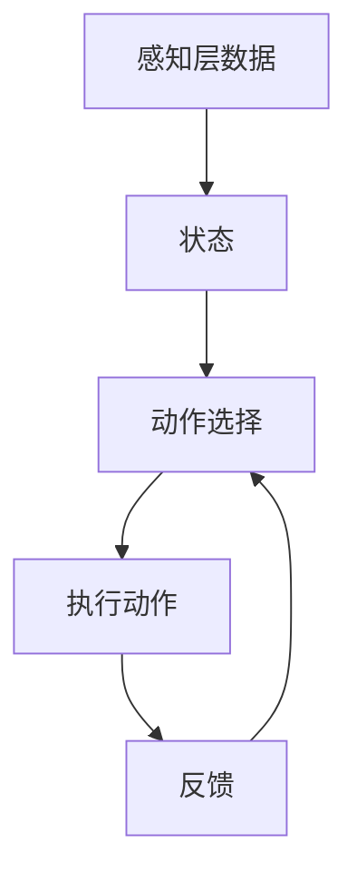
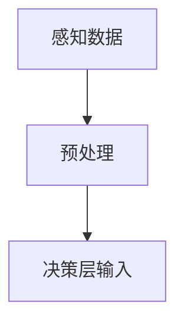
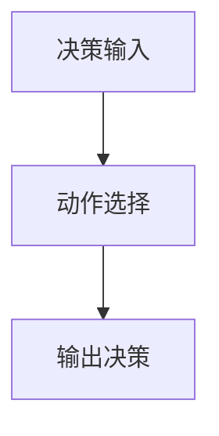
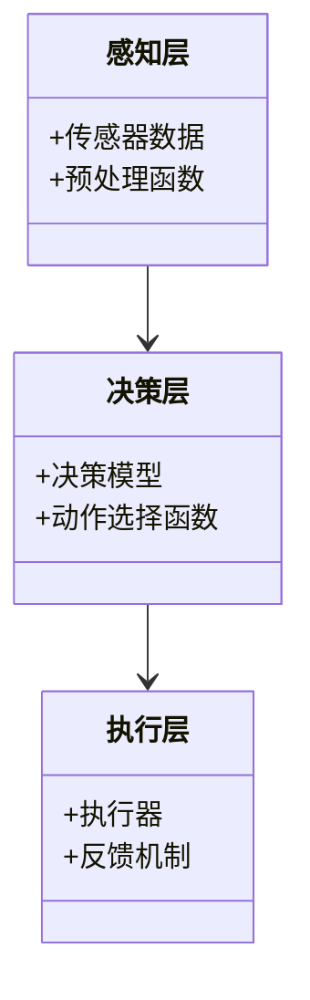
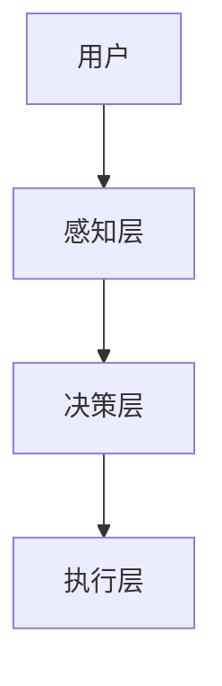
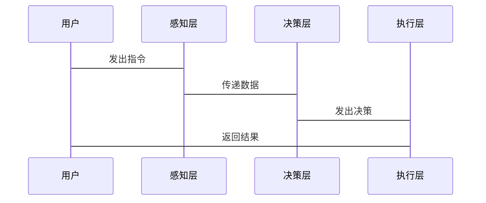

                 


# AI Agent在智能海洋资源管理中的实践

## 关键词
AI Agent, 智能海洋资源管理, 技术实践, 系统设计, 算法实现, 资源优化

## 摘要
随着海洋资源的重要性日益凸显，智能化管理成为必然趋势。AI Agent作为人工智能领域的核心技术，能够通过感知、决策和执行机制，显著提升海洋资源管理的效率和准确性。本文详细探讨AI Agent在海洋资源管理中的实践应用，包括其核心原理、算法实现、系统设计以及实际案例分析，旨在为读者提供全面的技术指导。

---

## 第1章 AI Agent与智能海洋资源管理的背景

### 1.1 AI Agent的基本概念
#### 1.1.1 AI Agent的定义
AI Agent是一种能够感知环境、自主决策并执行任务的智能实体。它通过传感器获取信息，利用算法进行分析，并通过执行器完成目标。

#### 1.1.2 AI Agent的核心特征
AI Agent具有主动性、反应性、目标导向性和社会性四大特征。主动性使其能够主动发起任务，反应性使其能够实时响应环境变化，目标导向性使其具备明确的目标导向，社会性使其能够与其他系统协同工作。

#### 1.1.3 AI Agent与传统自动化的区别
| 特性 | AI Agent | 传统自动化 |
|------|----------|------------|
| 智能水平 | 高 | 低 |
| 决策能力 | 强 | 弱 |
| 适应性 | 高 | 低 |
| 自主性 | 高 | 低 |

### 1.2 智能海洋资源管理的背景
#### 1.2.1 海洋资源管理的现状与挑战
海洋资源管理面临资源枯竭、环境污染、管理效率低下等问题。传统管理方式依赖人工操作，效率低下且容易出错。

#### 1.2.2 智能化管理的必要性
通过智能化管理，可以实现资源的高效利用、环境的实时监测和决策的科学化。AI Agent技术为解决这些问题提供了新的思路。

#### 1.2.3 AI Agent在海洋资源管理中的应用前景
AI Agent可以在海洋监测、资源分配、环境预警等领域发挥重要作用，显著提升管理效率和准确性。

---

## 第2章 AI Agent的核心原理

### 2.1 AI Agent的感知与决策机制
#### 2.1.1 感知层的实现原理
感知层通过传感器获取环境数据，例如温度、湿度、压力等。数据经过预处理后，输入到决策层进行分析。

#### 2.1.2 决策层的算法模型
决策层采用强化学习算法，通过不断试错优化决策策略。以下是强化学习的基本流程：



#### 2.1.3 执行层的实现方式
执行层通过执行器将决策结果转化为实际操作，例如调整设备参数、启动警报系统等。

### 2.2 AI Agent的特征对比分析
#### 2.2.1 ER实体关系图的构建与分析
以下是AI Agent与传统自动化系统的实体关系图：

```mermaid
erd
    actor 用户
    system AI Agent
    system 自动化系统
    user --> system: 发出指令
    system --> system: 并行处理
```

---

## 第3章 AI Agent的算法原理

### 3.1 AI Agent的感知算法
#### 3.1.1 感知算法的流程图分析
以下是感知算法的流程图：



#### 3.1.2 感知算法的Python实现代码
```python
def感知算法(SensorData):
    # 数据预处理
    processed_data = preprocess(SensorData)
    # 返回处理后的数据
    return processed_data
```

#### 3.1.3 感知算法的数学模型与公式
感知算法的数学模型如下：

$$
\text{processed\_data} = f(\text{SensorData})
$$

其中，$f$表示预处理函数。

### 3.2 AI Agent的决策算法
#### 3.2.1 决策算法的流程图分析
以下是决策算法的流程图：



#### 3.2.2 决策算法的Python实现代码
```python
def决策算法(InputData):
    # 动作选择
    action = choose_action(InputData)
    return action
```

#### 3.2.3 决策算法的数学模型与公式
决策算法的数学模型如下：

$$
\text{action} = \arg\max_{a} Q(s,a)
$$

其中，$Q(s,a)$表示状态$s$下动作$a$的奖励值。

---

## 第4章 AI Agent的数学模型与公式

### 4.1 感知层的数学模型
#### 4.1.1 感知层的概率模型
感知层的概率模型如下：

$$
P(x|y) = \frac{P(y|x)P(x)}{P(y)}
$$

其中，$P(x|y)$表示在条件$y$下事件$x$发生的概率。

#### 4.1.2 感知层的优化模型
感知层的优化模型如下：

$$
\min_{x} \sum_{i=1}^{n} |x_i - x|^2
$$

---

## 第5章 系统分析与架构设计方案

### 5.1 问题场景介绍
海洋资源管理的场景包括海洋监测、资源分配和环境预警。

### 5.2 项目介绍
本项目旨在开发一个基于AI Agent的海洋资源管理系统，实现对海洋环境的实时监测和资源的智能分配。

### 5.3 系统功能设计
以下是领域模型的类图：



### 5.4 系统架构设计
以下是系统架构图：



### 5.5 系统接口设计
系统接口设计包括传感器接口、决策接口和执行接口。

### 5.6 系统交互设计
以下是系统交互的序列图：



---

## 第6章 项目实战

### 6.1 环境安装
安装Python和相关库，例如NumPy、Pandas和Scikit-learn。

### 6.2 系统核心实现源代码
```python
def 感知算法(SensorData):
    processed_data = preprocess(SensorData)
    return processed_data

def 决策算法(InputData):
    action = choose_action(InputData)
    return action

def 执行算法(Action):
    execute(Action)
```

### 6.3 代码应用解读与分析
代码解读：感知算法对传感器数据进行预处理，决策算法基于预处理后的数据选择最优动作，执行算法将决策结果转化为实际操作。

### 6.4 实际案例分析
案例分析：在海洋监测中，AI Agent可以实时监测水温、盐度等参数，及时发现异常情况并采取措施。

### 6.5 项目小结
本项目通过实现AI Agent的核心算法，展示了其在海洋资源管理中的应用潜力。

---

## 第7章 总结与展望

### 7.1 总结
本文详细探讨了AI Agent在智能海洋资源管理中的实践应用，包括其核心原理、算法实现和系统设计。AI Agent技术为海洋资源管理提供了新的解决方案，显著提升了管理效率和准确性。

### 7.2 展望
未来，随着AI技术的不断发展，AI Agent在海洋资源管理中的应用将更加广泛和深入。

