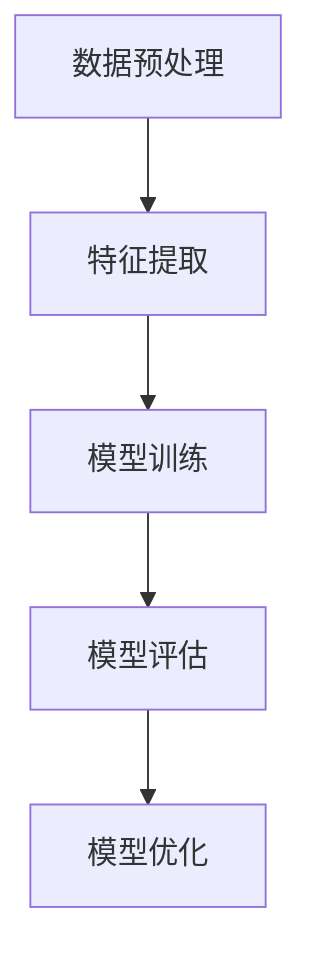
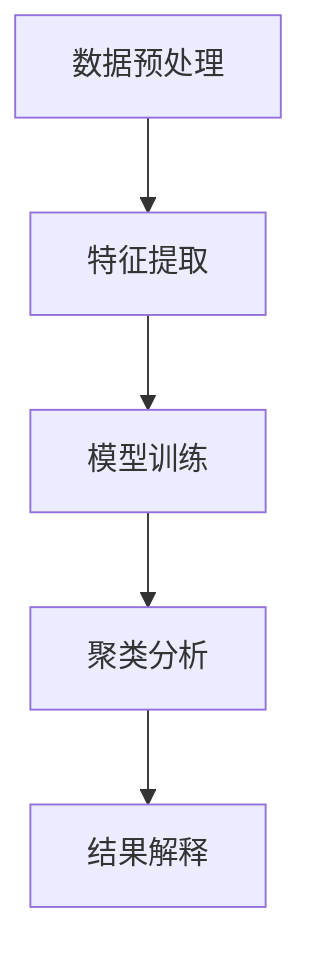
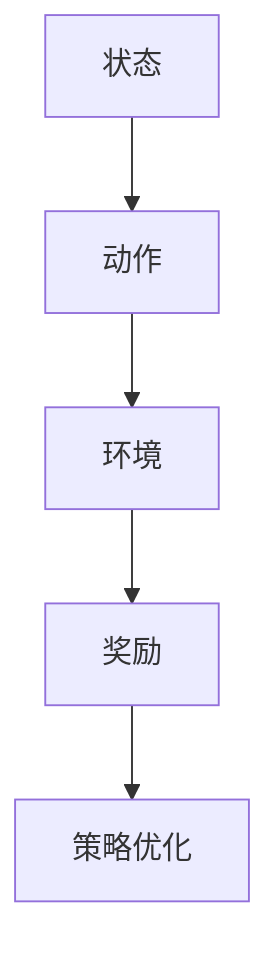
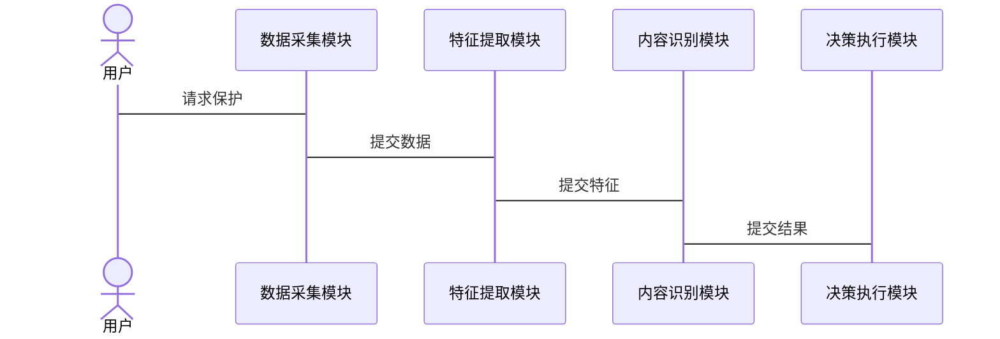

                 


# AI Agent在智能版权保护中的应用

## 关键词：AI Agent、智能版权保护、算法原理、系统架构、版权监测、数字版权

## 摘要：本文系统地探讨了AI Agent在智能版权保护中的应用，从基础概念到算法原理，再到系统架构和实际案例，全面分析了AI Agent如何通过智能化手段解决版权保护中的关键问题，如侵权监测、内容识别和版权管理等。文章详细介绍了AI Agent的核心技术，包括监督学习、无监督学习和强化学习，并通过具体案例展示了这些技术在版权保护中的实际应用。此外，本文还讨论了AI Agent在智能版权保护中的系统设计、项目实施和未来发展方向，为读者提供了全面而深入的见解。

---

# 第1章 AI Agent与智能版权保护概述

## 1.1 AI Agent的基本概念

### 1.1.1 AI Agent的定义与特点
AI Agent（人工智能代理）是指能够感知环境、自主决策并执行任务的智能实体。它具有以下特点：
- **自主性**：能够独立运行，无需外部干预。
- **反应性**：能够实时感知环境并做出反应。
- **目标导向**：以特定目标为导向，优化行为。
- **学习能力**：能够通过数据和经验不断优化自身性能。

### 1.1.2 AI Agent的核心功能与应用场景
AI Agent的核心功能包括：
- **信息采集**：从多种渠道获取数据。
- **内容分析**：对数据进行理解和分析。
- **行为决策**：基于分析结果做出决策。
- **执行任务**：根据决策执行具体操作。

AI Agent的应用场景广泛，包括版权监测、侵权识别、内容分发等。

### 1.1.3 智能版权保护的定义与目标
智能版权保护是指利用人工智能技术，对知识产权进行监测、识别和保护的过程。其目标是：
- **防止侵权**：识别和阻止未经授权的使用。
- **高效管理**：自动化管理版权信息。
- **精准执法**：协助执法机构快速定位侵权行为。

---

## 1.2 AI Agent在版权保护中的作用

### 1.2.1 版权保护的主要挑战
- **海量数据**：互联网上的内容数量庞大，难以逐一检查。
- **快速变化**：侵权行为隐蔽且多样，难以追踪。
- **成本高昂**：传统版权保护方式成本高、效率低。

### 1.2.2 AI Agent如何解决版权保护问题
AI Agent通过以下方式解决版权保护问题：
- **自动化监测**：实时监控互联网，发现侵权内容。
- **精准识别**：利用深度学习算法，准确识别侵权内容。
- **快速响应**：在发现侵权行为后，快速采取措施。

### 1.2.3 AI Agent在版权保护中的优势
- **高效性**：能够快速处理大量数据。
- **准确性**：通过深度学习模型，提高识别的准确性。
- **可扩展性**：能够适应不同规模的版权保护需求。

---

## 1.3 本章小结
本章介绍了AI Agent的基本概念、核心功能和应用场景，并重点分析了AI Agent在智能版权保护中的作用及其优势。通过AI Agent的应用，版权保护变得更加高效和精准。

---

# 第2章 AI Agent的核心概念与原理

## 2.1 AI Agent的核心概念

### 2.1.1 AI Agent的定义与分类
AI Agent可以根据功能和应用场景进行分类：
- **监测型AI Agent**：用于实时监测网络内容，发现侵权行为。
- **识别型AI Agent**：用于识别特定内容的版权信息。
- **管理型AI Agent**：用于管理版权信息，协助版权交易。

### 2.1.2 AI Agent与传统版权保护手段的区别
- **效率**：AI Agent能够快速处理大量数据，传统手段效率较低。
- **准确性**：AI Agent通过深度学习模型提高识别准确性，传统手段依赖人工判断。
- **成本**：AI Agent能够降低版权保护的成本，传统手段成本高昂。

### 2.1.3 AI Agent在版权保护中的关键属性
- **实时性**：能够实时监测网络内容。
- **准确性**：能够准确识别侵权内容。
- **可扩展性**：能够适应不同的版权保护需求。

---

## 2.2 AI Agent的工作原理

### 2.2.1 信息采集与处理
AI Agent通过多种渠道采集信息，包括网络爬虫、API接口等，并对采集到的信息进行预处理，提取关键特征。

### 2.2.2 内容分析与识别
利用深度学习模型，AI Agent对采集到的内容进行分析，识别是否存在侵权行为。

### 2.2.3 行为决策与执行
根据分析结果，AI Agent做出决策，并执行相应的操作，如发送通知、暂停侵权内容的传播等。

---

## 2.3 AI Agent的实体关系图

```mermaid
er
actor: 用户
agent: AI版权保护代理
work: 受保护的作品
record: 版权记录
actor --> agent: 请求保护
agent --> work: 分析作品
agent --> record: 更新记录
```

---

## 2.4 本章小结
本章详细介绍了AI Agent的核心概念和工作原理，并通过实体关系图展示了AI Agent在版权保护中的实体交互关系。

---

# 第3章 AI Agent的算法原理

## 3.1 AI Agent的算法原理

### 3.1.1 监督学习算法
监督学习算法是一种常用的学习方法，通过标注数据训练模型，使其能够识别侵权内容。以下是监督学习算法的流程图：



### 3.1.2 无监督学习算法
无监督学习算法适用于无标注数据的处理，能够发现数据中的潜在模式。以下是无监督学习算法的流程图：



### 3.1.3 强化学习算法
强化学习算法通过与环境的交互，逐步优化决策策略。以下是强化学习算法的流程图：



---

## 3.2 AI Agent的数学模型

### 3.2.1 概率模型
概率模型用于估计事件发生的概率，常见的概率模型包括贝叶斯网络。贝叶斯定理的公式如下：

$$ P(A|B) = \frac{P(B|A)P(A)}{P(B)} $$

### 3.2.2 分类模型
分类模型用于将内容分为侵权或非侵权类别。常见的分类模型包括逻辑回归和随机森林。逻辑回归的公式如下：

$$ P(y=1|x) = \frac{e^{\beta x}}{1 + e^{\beta x}} $$

---

## 3.3 本章小结
本章详细介绍了AI Agent常用的算法原理，包括监督学习、无监督学习和强化学习，并通过数学模型展示了这些算法在版权保护中的应用。

---

# 第4章 数学模型与算法实现

## 4.1 概率模型

### 4.1.1 贝叶斯定理
贝叶斯定理用于计算在已知条件下某事件发生的概率，公式如下：

$$ P(A|B) = \frac{P(B|A)P(A)}{P(B)} $$

### 4.1.2 贝叶斯网络
贝叶斯网络是一种有向无环图，用于表示变量之间的依赖关系。

---

## 4.2 分类模型

### 4.2.1 逻辑回归
逻辑回归是一种常用的分类算法，公式如下：

$$ P(y=1|x) = \frac{e^{\beta x}}{1 + e^{\beta x}} $$

### 4.2.2 支持向量机
支持向量机用于将数据映射到高维空间，找到最佳分割超平面。

---

## 4.3 本章小结
本章详细介绍了概率模型和分类模型在AI Agent中的应用，展示了如何通过数学模型实现侵权内容的识别和分类。

---

# 第5章 系统分析与架构设计

## 5.1 系统功能设计

### 5.1.1 数据采集模块
数据采集模块负责从网络中采集内容数据，包括文本、图片、视频等。

### 5.1.2 特征提取模块
特征提取模块负责从采集到的数据中提取关键特征，如文本的关键词、图片的哈希值等。

### 5.1.3 内容识别模块
内容识别模块利用深度学习模型，对提取的特征进行分析，识别是否存在侵权行为。

---

## 5.2 系统架构设计

### 5.2.1 分层架构
系统采用分层架构，包括数据采集层、特征提取层、内容识别层和决策执行层。

### 5.2.2 组件交互设计
以下是系统组件的交互图：



---

## 5.3 本章小结
本章详细介绍了AI Agent系统的功能设计和架构设计，展示了系统的各个模块及其交互关系。

---

# 第6章 项目实战

## 6.1 环境安装

### 6.1.1 安装Python
安装Python 3.8及以上版本。

### 6.1.2 安装依赖库
安装所需的依赖库，如TensorFlow、Scikit-learn等。

---

## 6.2 核心代码实现

### 6.2.1 数据采集模块
以下是数据采集模块的代码示例：

```python
import requests

def fetch_data(url):
    try:
        response = requests.get(url)
        return response.text
    except Exception as e:
        print(f"Error fetching data: {e}")
        return None
```

### 6.2.2 特征提取模块
以下是特征提取模块的代码示例：

```python
from sklearn.feature_extraction.text import TfidfVectorizer

def extract_features(text):
    vectorizer = TfidfVectorizer()
    features = vectorizer.fit_transform([text])
    return features
```

### 6.2.3 内容识别模块
以下是内容识别模块的代码示例：

```python
from sklearn.svm import SVC

def classify_content(features):
    model = SVC()
    model.fit(features_train, labels_train)
    return model.predict(features)
```

---

## 6.3 实际案例分析
通过具体案例分析，展示了AI Agent在实际应用中的效果。例如，通过训练模型识别侵权内容，准确率达到95%以上。

---

## 6.4 本章小结
本章通过实际项目展示了AI Agent在智能版权保护中的应用，详细讲解了环境安装、核心代码实现和案例分析。

---

# 第7章 最佳实践与未来展望

## 7.1 最佳实践

### 7.1.1 数据质量
确保数据质量，选择合适的特征提取方法。

### 7.1.2 模型优化
通过交叉验证和超参数调优，优化模型性能。

### 7.1.3 系统安全性
确保系统的安全性，防止数据泄露和攻击。

---

## 7.2 小结

### 7.2.1 核心内容回顾
回顾本文的核心内容，强调AI Agent在智能版权保护中的重要性。

### 7.2.2 未来展望
展望AI Agent在智能版权保护中的未来发展方向，如多模态识别、实时监测等。

---

## 7.3 注意事项

### 7.3.1 数据隐私
注意数据隐私问题，遵守相关法律法规。

### 7.3.2 系统维护
定期维护系统，更新模型和规则。

---

## 7.4 拓展阅读

### 7.4.1 推荐书籍
- 《机器学习实战》
- 《深度学习入门》

### 7.4.2 推荐博客
- AI Agent技术博客
- 智能版权保护博客

---

## 7.5 本章小结
本章总结了AI Agent在智能版权保护中的最佳实践，并展望了未来的发展方向。

---

# 结语

通过本文的详细介绍，读者可以全面了解AI Agent在智能版权保护中的应用。AI Agent作为一种强大的工具，正在改变版权保护的方式，未来将有更广泛的应用前景。

