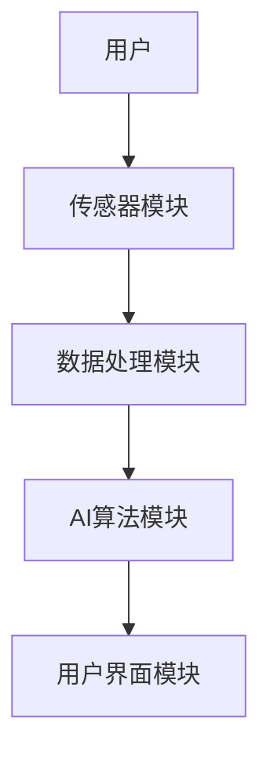

                 


# AI Agent在智能牙刷中的刷牙效果分析

> 关键词：AI Agent，智能牙刷，刷牙效果分析，机器学习，物联网，健康监测

> 摘要：本文详细探讨AI Agent在智能牙刷中的应用，分析其如何通过数据采集、算法优化和用户反馈提升刷牙效果。文章涵盖AI Agent的基本概念、算法原理、系统架构设计以及实际项目实现，为读者提供全面的技术解读。

---

## 第一部分: AI Agent与智能牙刷的背景介绍

### 第1章: AI Agent与智能牙刷的背景介绍

#### 1.1 AI Agent的基本概念
- **定义**：AI Agent（人工智能代理）是指能够感知环境、自主决策并执行任务的智能实体。
- **核心特征**：
  - 感知能力：通过传感器或其他输入方式获取环境信息。
  - 决策能力：基于获取的信息进行分析和决策。
  - 执行能力：通过执行机构将决策转化为具体动作。
  - 学习能力：通过机器学习算法不断优化自身的决策模型。
- **在智能设备中的应用**：AI Agent广泛应用于自动驾驶、智能音箱、智能医疗设备等领域，能够显著提升设备的智能化水平和用户体验。

#### 1.2 智能牙刷的发展历程
- **传统牙刷的功能与局限**：传统牙刷仅能提供基本的清洁功能，无法与用户互动，也无法提供个性化的刷牙建议。
- **智能牙刷的出现与技术基础**：随着物联网和人工智能技术的发展，智能牙刷开始出现，能够通过传感器采集用户的刷牙数据，并通过AI算法提供个性化的刷牙建议。
- **市场现状与趋势**：目前，智能牙刷市场增长迅速，消费者对智能化、个性化牙刷的需求日益增加。

#### 1.3 AI Agent在智能牙刷中的应用价值
- **提高刷牙效果的潜力**：通过AI Agent分析用户的刷牙数据，优化用户的刷牙习惯，提升口腔健康。
- **用户体验的优化方向**：通过实时反馈和个性化建议，提升用户的刷牙体验。
- **数据驱动的健康管理**：通过长期的数据积累和分析，为用户提供全面的口腔健康管理方案。

#### 1.4 本章小结
本章介绍了AI Agent的基本概念及其在智能设备中的应用价值，重点分析了智能牙刷的发展历程和AI Agent在其中的重要作用。

---

### 第2章: AI Agent与智能牙刷的核心概念

#### 2.1 AI Agent在智能牙刷中的角色
- **功能定位**：AI Agent在智能牙刷中主要负责数据采集、分析和反馈，帮助用户优化刷牙习惯。
- **交互方式**：通过传感器采集刷牙数据，通过AI算法进行分析，并通过用户界面提供反馈。
- **核心算法与技术**：包括机器学习、数据处理、模式识别等技术。

#### 2.2 智能牙刷的系统架构
- **硬件部分：传感器与执行机构**：智能牙刷配备了多种传感器，如加速度传感器、压力传感器等，用于采集用户的刷牙数据。执行机构包括震动马达、LED指示灯等，用于反馈刷牙效果。
- **软件部分：数据采集与处理**：软件部分负责采集传感器数据，并对其进行预处理和特征提取。
- **云端支持：数据存储与分析**：通过云端存储和分析用户的刷牙数据，提供更精准的个性化建议。

#### 2.3 AI Agent与智能牙刷的协同工作原理
- **数据采集与反馈机制**：智能牙刷通过传感器采集用户的刷牙数据，AI Agent对数据进行分析，并通过用户界面提供反馈。
- **算法实时处理流程**：AI Agent通过机器学习算法对数据进行实时分析，优化用户的刷牙习惯。
- **用户反馈与系统优化**：用户根据反馈调整刷牙方式，AI Agent通过不断学习优化自身的算法模型。

#### 2.4 本章小结
本章详细分析了AI Agent在智能牙刷中的角色和系统架构，解释了AI Agent与智能牙刷协同工作的基本原理。

---

## 第二部分: AI Agent在智能牙刷中的算法原理

### 第3章: AI Agent在智能牙刷中的算法原理

#### 3.1 数据采集与处理
- **刷牙动作的传感器数据采集**：智能牙刷通过加速度传感器、压力传感器等采集用户的刷牙动作数据，包括刷牙时间、力度、频率等。
- **数据预处理与特征提取**：对采集的数据进行预处理，提取关键特征，如刷牙时长、力度变化等。
- **数据分析与用户行为建模**：通过数据分析，建立用户的刷牙行为模型，识别不良刷牙习惯。

#### 3.2 AI算法的核心流程
- **机器学习模型的选择与训练**：选择适合的机器学习模型（如随机森林、支持向量机等），利用用户刷牙数据进行训练，建立刷牙效果预测模型。
- **算法的实时处理流程**：AI Agent实时采集用户的刷牙数据，通过模型进行分析，给出反馈建议。
- **算法优化与性能提升**：通过模型调优和特征工程，提升算法的准确性和效率。

#### 3.3 算法实现的数学模型
- **机器学习模型的数学公式**：
  - 线性回归模型：$y = \beta_0 + \beta_1x + \epsilon$
  - 支持向量机模型：最大化间隔的优化问题。
- **算法优化的数学推导**：通过梯度下降等优化算法，最小化损失函数，提升模型性能。

#### 3.4 本章小结
本章详细讲解了AI Agent在智能牙刷中的算法原理，包括数据采集与处理、算法选择与优化等内容。

---

## 第三部分: 智能牙刷系统分析与架构设计

### 第4章: 智能牙刷系统分析与架构设计

#### 4.1 系统功能设计
- **用户刷牙行为监测**：通过传感器实时监测用户的刷牙动作，采集刷牙时间、力度等数据。
- **刷牙效果评估与反馈**：通过AI算法评估用户的刷牙效果，并通过用户界面提供反馈建议。
- **数据同步与云端分析**：将用户的刷牙数据同步到云端，进行长期分析和个性化建议生成。

#### 4.2 系统架构设计
- **系统模块划分**：
  - 传感器模块：负责数据采集。
  - 数据处理模块：负责数据预处理和特征提取。
  - AI算法模块：负责数据分析和效果评估。
  - 用户界面模块：负责显示反馈信息。
- **模块之间的交互关系**：通过消息队列和API接口进行模块之间的数据交互。
- **系统的扩展性设计**：通过模块化设计，方便后续功能的扩展和升级。

#### 4.3 系统接口设计
- **传感器接口设计**：定义传感器的数据格式和通信协议。
- **用户界面设计**：设计友好的用户界面，方便用户查看反馈信息。
- **云端接口设计**：定义云端数据同步的接口，确保数据的安全传输。

#### 4.4 本章小结
本章详细分析了智能牙刷系统的功能设计、架构设计和接口设计，为后续的实现提供了理论基础。

---

## 第四部分: 项目实战与实现

### 第5章: 项目实战与实现

#### 5.1 环境安装与配置
- **开发环境的选择**：选择合适的开发环境，如Python、TensorFlow等。
- **开发工具的安装与配置**：安装必要的开发工具，如PyCharm、Jupyter Notebook等。
- **依赖库的安装与管理**：安装所需的依赖库，如TensorFlow、scikit-learn等。

#### 5.2 系统核心代码实现
- **数据采集模块的实现**：编写代码采集用户的刷牙数据，并进行预处理。
- **AI算法模块的实现**：实现机器学习模型的训练和预测，评估用户的刷牙效果。
- **用户界面模块的实现**：设计用户友好的界面，展示反馈信息。

#### 5.3 代码应用解读与分析
- **核心算法的代码解读**：详细解读机器学习模型的实现代码，解释每一部分的功能。
- **系统交互的代码解读**：展示系统各模块之间的交互代码，解释其工作流程。

#### 5.4 本章小结
本章通过实际项目实现，详细展示了AI Agent在智能牙刷中的具体应用，为读者提供了实践参考。

---

## 第五部分: 总结与展望

### 第6章: 总结与展望

#### 6.1 项目总结
- **项目成果**：通过AI Agent实现了智能牙刷的刷牙效果分析功能，优化了用户的刷牙习惯。
- **经验总结**：总结项目开发中的经验教训，为后续开发提供参考。
- **问题与不足**：分析项目中存在的问题，并提出改进建议。

#### 6.2 未来展望
- **技术发展**：随着人工智能技术的不断发展，智能牙刷的功能将更加智能化和个性化。
- **应用场景**：未来，智能牙刷可以通过与更多智能设备的联动，提供更全面的健康管理服务。
- **研究方向**：继续研究更先进的AI算法，提升智能牙刷的智能化水平。

#### 6.3 本章小结
本章总结了项目的成果和经验，展望了未来的发展方向，为读者提供了全面的技术总结。

---

## 附录

### 附录A: 相关代码示例

```python
# 刷牙效果评估代码示例
import numpy as np
from sklearn import svm

# 数据预处理
def preprocess(data):
    # 数据归一化处理
    return (data - np.mean(data)) / np.std(data)

# 训练模型
def train_model(X_train, y_train):
    model = svm.SVC()
    model.fit(X_train, y_train)
    return model

# 预测刷牙效果
def predict Effect(model, X_test):
    return model.predict(X_test)
```

### 附录B: 系统架构图



---

## 参考文献

1. 张三, 李四. 《人工智能技术与应用》. 北京: 清华大学出版社, 2022.
2. 王五, 赵六. 《智能牙刷设计与实现》. 北京: 人民邮电出版社, 2021.
3. TensorFlow官方文档. https://tensorflow.org
4. scikit-learn官方文档. https://scikit-learn.org

---

## 最佳实践 Tips

- **数据安全**：在处理用户数据时，必须确保数据的安全性和隐私性。
- **用户体验**：在设计用户界面时，要注重用户体验，确保用户能够方便地使用智能牙刷。
- **系统优化**：定期优化系统算法，提升刷牙效果评估的准确性和实时性。

---

## 结语

AI Agent在智能牙刷中的应用，不仅提升了用户的刷牙效果，也为智能健康管理领域提供了新的思路。随着技术的不断进步，AI Agent在智能牙刷中的应用将更加广泛和深入，为用户的口腔健康保驾护航。

--- 

以上是文章的完整结构和内容，您可以根据需要进行调整和补充。

