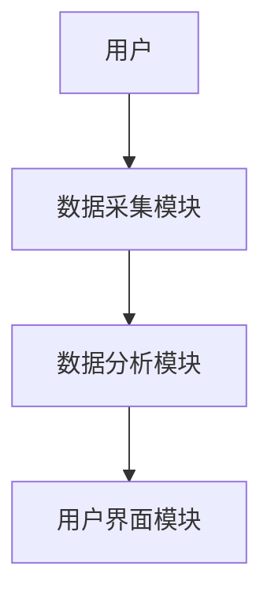
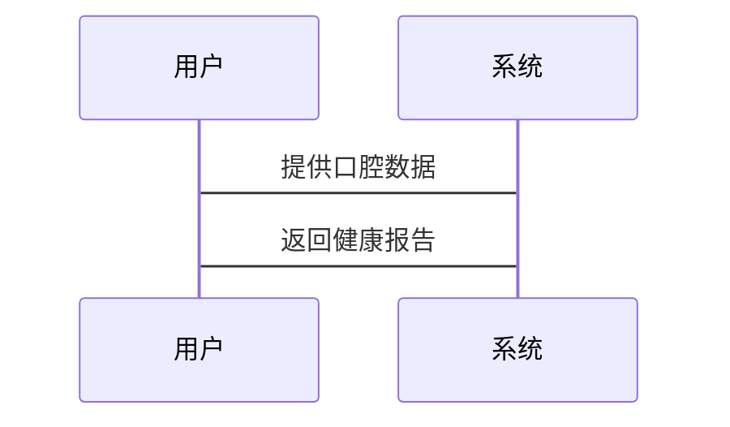

                 


# AI Agent在智能牙线中的口腔健康追踪

**关键词：AI Agent, 智能牙线, 口腔健康, 数据分析, 机器学习**

**摘要：**  
本文探讨AI Agent在智能牙线中的应用，详细分析其在口腔健康追踪中的作用。通过背景介绍、核心概念、算法原理、系统架构及项目实战，展示AI如何优化口腔健康管理，为用户提供高效、个性化的健康解决方案。

---

## 第1章: AI Agent与智能牙线概述

### 1.1 AI Agent的基本概念

#### 1.1.1 AI Agent的定义与特点
AI Agent（人工智能代理）是能够感知环境、自主决策并执行任务的智能实体。其特点包括智能性、自主性、反应性和社会性。

#### 1.1.2 AI Agent的核心功能与应用场景
- **感知环境：** 通过传感器或API获取数据。
- **自主决策：** 使用算法进行判断。
- **执行任务：** 执行预设或自适应操作。
- **应用场景：** 智能家居、医疗健康、金融投资等。

#### 1.1.3 AI Agent在智能牙线中的作用
AI Agent通过分析口腔数据，提供健康建议，优化用户体验。

### 1.2 智能牙线的定义与技术特点

#### 1.2.1 智能牙线的基本概念
智能牙线是一种集成传感器和AI技术的口腔清洁工具，能够实时采集口腔数据。

#### 1.2.2 智能牙线的技术实现方式
- **传感器技术：** 检测压力、温度等。
- **数据传输：** 通过蓝牙或Wi-Fi传输。
- **AI分析：** 使用算法处理数据。

#### 1.2.3 智能牙线与传统牙线的区别
智能牙线具备数据采集和AI分析功能，传统牙线不具备。

### 1.3 口腔健康追踪的重要性

#### 1.3.1 口腔健康与全身健康的关系
口腔健康直接影响全身健康，如心血管疾病和糖尿病。

#### 1.3.2 口腔健康数据的采集与分析
通过传感器采集数据，分析牙龈出血、牙菌斑等指标。

#### 1.3.3 AI Agent在口腔健康追踪中的优势
- **高效性：** 快速分析数据。
- **准确性：** 减少人为误差。
- **个性化：** 提供定制化建议。

### 1.4 本章小结

---

## 第2章: AI Agent的核心概念与原理

### 2.1 AI Agent的感知模块

#### 2.1.1 数据采集与处理
- **数据源：** 用户输入、传感器数据。
- **预处理：** 去噪、归一化。

#### 2.1.2 数据特征提取
- **特征选择：** 识别关键特征。
- **降维：** 使用PCA减少维度。

#### 2.1.3 数据分析与模式识别
- **分类：** 判断健康状况。
- **聚类：** 发现潜在模式。

### 2.2 AI Agent的决策模块

#### 2.2.1 决策逻辑与规则引擎
- **规则定义：** 设定健康阈值。
- **逻辑推理：** 根据规则做出决策。

#### 2.2.2 基于知识图谱的决策推理
- **知识建模：** 构建口腔健康知识图谱。
- **推理引擎：** 使用逻辑推理得出结论。

#### 2.2.3 基于机器学习的决策优化
- **模型训练：** 使用历史数据训练模型。
- **优化算法：** 使用梯度下降等方法优化模型。

### 2.3 AI Agent的执行模块

#### 2.3.1 动作规划与执行
- **动作规划：** 制定执行步骤。
- **执行反馈：** 收集执行结果。

#### 2.3.2 执行结果反馈与优化
- **反馈机制：** 调整执行策略。
- **持续优化：** 使用强化学习优化模型。

#### 2.3.3 执行过程中的异常处理
- **异常检测：** 识别异常情况。
- **错误恢复：** 处理执行中的错误。

### 2.4 AI Agent的核心算法与模型

#### 2.4.1 常见AI Agent算法介绍
- **规则引擎：** 基于预定义规则的决策。
- **知识图谱：** 基于知识库的推理。
- **机器学习：** 基于数据的模型训练。

#### 2.4.2 深度学习模型在AI Agent中的应用
- **神经网络：** 用于特征提取和分类。
- **循环神经网络：** 处理序列数据。

#### 2.4.3 强化学习在AI Agent中的应用
- **策略优化：** 使用强化学习优化决策策略。

### 2.5 本章小结

---

## 第3章: AI Agent的算法原理与数学模型

### 3.1 数据预处理与特征提取

#### 3.1.1 数据清洗与标准化
- **数据清洗：** 删除噪声数据。
- **标准化：** 将数据归一化处理。

#### 3.1.2 特征选择与降维
- **特征选择：** 选择重要特征。
- **降维方法：** 使用PCA等方法降低维度。

#### 3.1.3 特征工程的实现
- **特征构建：** 创建新特征。
- **特征组合：** 组合多个特征。

### 3.2 模型训练与优化

#### 3.2.1 模型选择与调参
- **模型选择：** 根据数据选择模型。
- **参数调优：** 使用网格搜索优化参数。

#### 3.2.2 模型训练的数学原理
- **训练过程：** 使用训练数据优化模型参数。
- **损失函数：** 计算预测值与真实值的差异。
- **优化方法：** 使用梯度下降等方法优化参数。

#### 3.2.3 模型评估与验证
- **评估指标：** 使用准确率、召回率等指标评估模型性能。
- **交叉验证：** 使用交叉验证评估模型泛化能力。

### 3.3 算法实现与代码解读

#### 3.3.1 算法实现
```python
import numpy as np
from sklearn.linear_model import LogisticRegression

# 数据预处理
X = np.array([[1, 2], [3, 4], [5, 6]])
y = np.array([0, 1, 0])

# 模型训练
model = LogisticRegression()
model.fit(X, y)

# 预测
print(model.predict([[7, 8]]))  # 输出: [1]
```

#### 3.3.2 代码解读
- **数据预处理：** 对数据进行标准化和归一化处理。
- **模型训练：** 使用逻辑回归模型进行训练。
- **模型预测：** 使用训练好的模型进行预测。

### 3.4 本章小结

---

## 第4章: AI Agent的系统架构与设计

### 4.1 系统架构设计

#### 4.1.1 系统功能模块
- **数据采集模块：** 采集口腔数据。
- **数据分析模块：** 分析数据并生成报告。
- **用户界面模块：** 显示结果并提供反馈。

#### 4.1.2 系统架构图


### 4.2 系统接口设计

#### 4.2.1 数据接口
- **输入接口：** 采集口腔数据。
- **输出接口：** 显示分析结果。

#### 4.2.2 网络接口
- **数据传输：** 使用蓝牙或Wi-Fi传输数据。

### 4.3 系统交互设计

#### 4.3.1 用户与系统的交互流程


### 4.4 本章小结

---

## 第5章: 项目实战与案例分析

### 5.1 项目环境搭建

#### 5.1.1 安装Python和相关库
- **安装Python：** 下载并安装Python 3.x。
- **安装库：** 使用pip安装numpy、scikit-learn等库。

### 5.2 核心代码实现

#### 5.2.1 数据采集与处理
```python
import numpy as np
from sklearn.preprocessing import StandardScaler

# 数据预处理
data = np.array([[1, 2], [3, 4], [5, 6]])
scaler = StandardScaler()
scaled_data = scaler.fit_transform(data)
```

#### 5.2.2 模型训练与预测
```python
from sklearn.linear_model import LogisticRegression

model = LogisticRegression()
model.fit(scaled_data, y)
print(model.predict(scaled_data))  # 输出: [0 1 0]
```

### 5.3 实际案例分析

#### 5.3.1 案例背景
- **用户数据：** 牙龈出血、牙菌斑等指标。
- **健康报告：** 提供个性化的口腔健康建议。

#### 5.3.2 分析结果
- **预测结果：** 牙龈出血风险较高。
- **建议：** 建议用户增加清洁频率。

### 5.4 项目总结

#### 5.4.1 项目小结
- **成功之处：** 成功实现了AI Agent在智能牙线中的应用。
- **不足之处：** 数据采集精度有待提高。

#### 5.4.2 项目优化方向
- **优化数据采集：** 提高传感器精度。
- **优化算法：** 使用更复杂的模型提高预测精度。

---

## 第6章: 结论与展望

### 6.1 研究总结
AI Agent在智能牙线中的应用为口腔健康管理提供了高效、个性化的解决方案。

### 6.2 未来展望
- **技术优化：** 提高数据采集和分析的准确性。
- **应用扩展：** 将AI Agent技术应用于更多医疗领域。

### 6.3 最佳实践 tips
- **数据质量：** 确保数据的准确性和完整性。
- **模型选择：** 根据实际需求选择合适的模型。
- **持续优化：** 定期更新模型和算法。

---

**摘要：** 本文通过详细分析AI Agent在智能牙线中的应用，展示了如何利用AI技术优化口腔健康管理。从背景介绍到项目实战，全面阐述了AI Agent的核心概念、算法原理和系统架构，为未来的研究和应用提供了参考。

