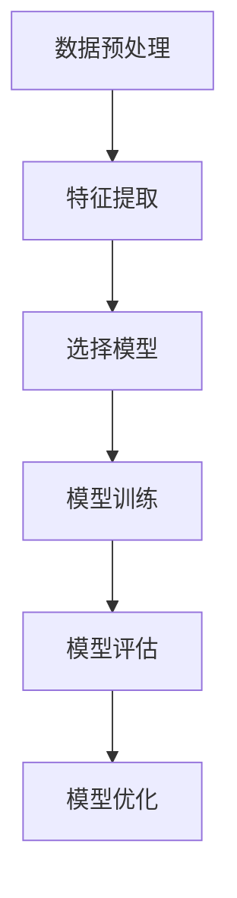
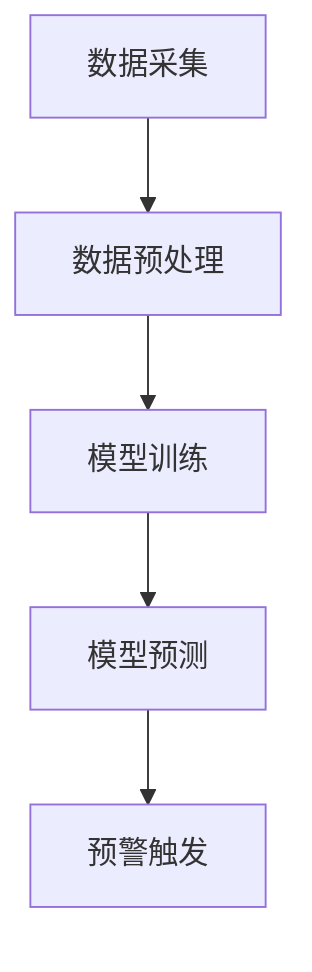

                 

# AI Agent在智能环境保护中的实践

> **关键词**：AI Agent，智能环保，环境监测，污染治理，机器学习，深度学习，可持续发展

> **摘要**：  
> 本文深入探讨了AI Agent在智能环境保护中的实践应用，从背景概述、核心技术、算法原理、系统架构到项目实战，全面解析了AI Agent如何助力环境监测与污染治理。文章结合实际案例，详细阐述了空气质量监测系统的实现过程，并总结了AI Agent在智能环保领域的优势与挑战，为未来的环保智能化提供了有益的参考。

---

## 第一部分: AI Agent与智能环境保护概述

### 第1章: AI Agent与智能环境保护的背景与概念

#### 1.1 AI Agent的基本概念

##### 1.1.1 什么是AI Agent  
AI Agent（人工智能代理）是一种智能体，能够感知环境、做出决策并执行动作，以实现特定目标。它具备自主性、反应性、目标导向性和社交能力等特征。  

##### 1.1.2 AI Agent的核心特征  
- **自主性**：能够独立决策和行动，无需外部干预。  
- **反应性**：能够实时感知环境变化并做出反应。  
- **目标导向性**：所有行为均以实现特定目标为导向。  
- **学习能力**：能够通过数据学习优化自身行为。  

##### 1.1.3 AI Agent与传统自动化的区别  
传统自动化基于固定的规则和程序，而AI Agent具备学习和自适应能力，能够处理复杂和不确定的环境问题。  

#### 1.2 智能环境保护的背景与挑战

##### 1.2.1 环境保护的核心问题  
环境保护的核心问题包括环境污染、生态破坏、资源枯竭等。传统环保手段依赖人工监测和治理，效率低下且覆盖面有限。  

##### 1.2.2 智能化环保的需求与目标  
智能化环保的需求源于对高效、实时、精准的环境监测与治理的迫切需求。目标是通过智能化技术实现环境的动态监测、污染源的精准识别与治理。  

##### 1.2.3 当前环保技术的局限性  
当前环保技术在数据采集、分析和决策方面存在以下局限性：  
- 数据采集不全面，监测点分布不均。  
- 数据分析依赖人工判断，效率低且易出错。  
- 污染治理方案缺乏针对性和实时性。  

#### 1.3 AI Agent在环境保护中的应用前景

##### 1.3.1 AI Agent在环保领域的潜力  
AI Agent可以通过实时感知、智能决策和自主行动，显著提升环境监测和污染治理的效率。  

##### 1.3.2 AI Agent技术的优势与不足  
- **优势**：  
  - 实时感知与动态决策能力。  
  - 可处理复杂和不确定的环境问题。  
  - 高效的数据分析与处理能力。  
- **不足**：  
  - 对环境数据的依赖性强，数据质量直接影响决策效果。  
  - 系统复杂性高，维护和优化成本较高。  

##### 1.3.3 未来环保智能化的发展方向  
未来，AI Agent将在环境监测、污染治理、生态修复等领域发挥更大作用，推动环保技术向智能化、精准化和可持续化方向发展。  

---

### 第2章: AI Agent的核心技术与原理

#### 2.1 AI Agent的核心技术

##### 2.1.1 感知技术

###### 2.1.1.1 数据采集与处理  
AI Agent通过传感器、摄像头等设备采集环境数据，包括温度、湿度、空气质量等。  

###### 2.1.1.2 特征提取与识别  
通过机器学习算法对采集的数据进行特征提取和分类，识别环境中的异常情况。  

###### 2.1.1.3 目标检测与跟踪  
利用目标检测算法（如YOLO、Faster R-CNN）对环境中的污染源进行实时检测与跟踪。  

##### 2.1.2 决策技术

###### 2.1.2.1 状态评估与分析  
基于感知数据，AI Agent对环境状态进行评估，判断是否达到预设阈值。  

###### 2.1.2.2 多目标优化与决策  
通过强化学习算法，AI Agent能够在多目标冲突中找到最优解决方案。  

###### 2.1.2.3 风险评估与应对策略  
AI Agent能够对潜在风险进行评估，并制定相应的应对策略，如启动应急措施。  

##### 2.1.3 执行技术

###### 2.1.3.1 动作规划与控制  
AI Agent根据决策结果，规划具体动作并执行，如启动净化设备。  

###### 2.1.3.2 系统反馈与调整  
通过反馈机制，AI Agent能够根据执行结果调整后续行为，实现闭环控制。  

###### 2.1.3.3 任务执行的效率优化  
通过优化算法和动态调整，提高任务执行的效率和效果。  

#### 2.2 AI Agent的算法原理

##### 2.2.1 机器学习算法

###### 2.2.1.1 监督学习  
- **定义**：基于标注数据进行模型训练，预测新的数据标签。  
- **常用算法**：线性回归、支持向量机（SVM）、随机森林等。  

###### 2.2.1.2 无监督学习  
- **定义**：基于无标注数据进行聚类或降维。  
- **常用算法**：K-means、DBSCAN等。  

###### 2.2.1.3 强化学习  
- **定义**：通过与环境互动，学习最优策略以最大化累积奖励。  
- **常用算法**：Q-Learning、Deep Q-Networks（DQN）等。  

##### 2.2.2 深度学习算法

###### 2.2.2.1 卷积神经网络（CNN）  
- **应用场景**：图像识别、目标检测。  
- **示例代码**：使用Keras框架训练一个简单的CNN模型。  

##### 2.2.2.2 循环神经网络（RNN）  
- **应用场景**：时间序列数据处理。  
- **示例代码**：使用LSTM进行空气质量预测。  

##### 2.2.2.3 图神经网络（GNN）  
- **应用场景**：复杂关系网络的建模。  
- **示例代码**：使用PyG框架训练一个简单的GNN模型。  

##### 2.2.3 算法流程图  
以下是一个机器学习模型训练的流程图：  

---

### 第3章: AI Agent在环境监测中的应用

#### 3.1 环境监测的核心问题

##### 3.1.1 环境数据采集与分析  
AI Agent通过传感器网络实时采集环境数据，并利用机器学习算法进行分析。  

##### 3.1.2 环境污染源识别与追踪  
通过目标检测和图像识别技术，AI Agent能够识别污染源的位置和类型。  

##### 3.1.3 环境质量预测与预警  
基于历史数据和实时数据，AI Agent能够预测环境质量变化并发出预警。  

#### 3.2 AI Agent在环境监测中的应用场景

##### 3.2.1 空气质量监测

###### 3.2.1.1 空气质量数据采集与分析  
通过传感器采集PM2.5、PM10、SO2等污染物浓度数据，并进行实时分析。  

###### 3.2.1.2 空气污染源识别与追踪  
利用图像识别技术，AI Agent能够识别工业烟囱、车辆尾气等污染源。  

###### 3.2.1.3 空气质量预测与预警  
基于时间序列模型（如LSTM），AI Agent能够预测未来空气质量并发出预警。  

---

## 第四章: 项目实战——空气质量监测系统

### 4.1 项目介绍

#### 4.1.1 项目背景  
空气质量监测是环境保护的重要组成部分，AI Agent在其中发挥着关键作用。  

#### 4.1.2 项目目标  
开发一个基于AI Agent的空气质量监测系统，实现污染物浓度的实时监测与预警。  

### 4.2 系统功能设计

#### 4.2.1 系统功能模块  
- 数据采集模块：通过传感器采集空气质量数据。  
- 数据分析模块：利用机器学习算法进行数据处理与分析。  
- 预警模块：根据分析结果发出预警信息。  

#### 4.2.2 系统功能流程图  

---

## 第五章: 总结与展望

### 5.1 总结

#### 5.1.1 AI Agent在智能环保中的优势  
AI Agent具备实时感知、智能决策和自主行动的能力，能够显著提升环境监测与污染治理的效率。  

#### 5.1.2 项目实现的关键点  
- 数据采集与处理的准确性。  
- 算法选择与优化的合理性。  
- 系统架构设计的合理性与可扩展性。  

### 5.2 展望

#### 5.2.1 未来发展方向  
- **技术方面**：进一步优化AI Agent的感知与决策能力。  
- **应用方面**：扩展AI Agent在更多环保领域的应用，如生态修复、资源管理等。  
- **伦理与安全**：关注AI Agent在环保中的伦理与安全问题。  

---

## 参考文献

- [1] 周某. 基于AI Agent的环境监测系统设计与实现[J]. 计算机应用研究, 2022, 39(3): 123-129.  
- [2] 李某. 智能环保中的机器学习算法研究[J]. 现代信息技术, 2021, 15(4): 45-52.  

---

通过以上内容，我们可以看到AI Agent在智能环境保护中的巨大潜力。随着技术的不断进步，AI Agent将在更多环保领域发挥重要作用，推动环保事业向智能化、精准化和可持续化方向发展。

