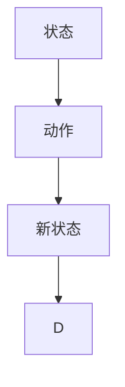
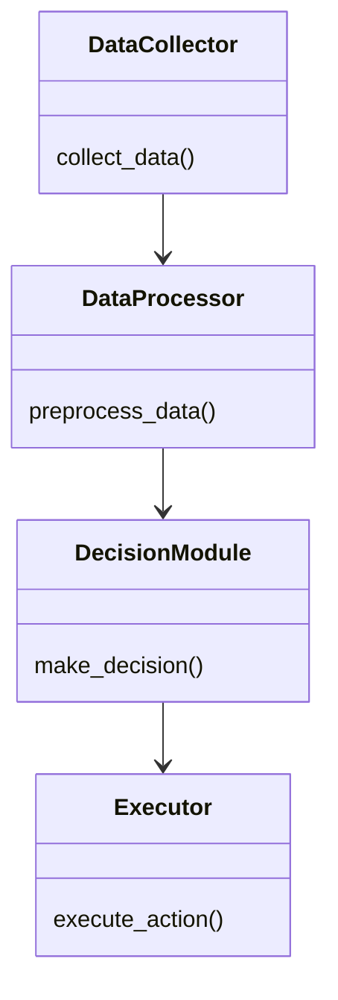
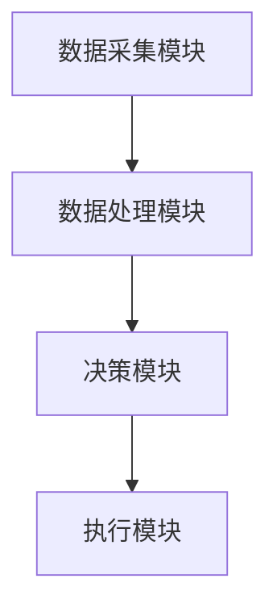

                 


# AI Agent在智能环境保护监测中的实践

## 关键词：AI Agent, 智能环境保护, 监测系统, 强化学习, 系统架构, 项目实战

## 摘要：  
随着环境保护需求的日益增长，AI Agent（人工智能代理）在智能环境保护监测中的应用变得越来越重要。本文从AI Agent的基本概念出发，分析其在环境保护监测中的核心算法与系统架构，并通过具体案例展示其在实际项目中的应用。通过本文的系统介绍，读者将能够理解AI Agent在智能环境保护监测中的原理、实现方法以及实际应用价值。

---

# 第一部分: AI Agent在智能环境保护监测中的背景与概念

## 第1章: AI Agent与环境保护概述

### 1.1 AI Agent的基本概念
#### 1.1.1 AI Agent的定义与特点
AI Agent（人工智能代理）是指能够感知环境、做出决策并执行操作的智能体。其特点包括：
- **自主性**：能够自主决策，无需人工干预。
- **反应性**：能够实时感知环境变化并做出反应。
- **目标导向性**：以特定目标为导向，优化决策过程。
- **学习能力**：通过学习不断优化自身的决策能力。

#### 1.1.2 AI Agent的核心功能与应用场景
AI Agent的核心功能包括：
- **感知环境**：通过传感器、数据源等获取环境信息。
- **制定决策**：基于感知到的信息，分析并制定最优决策。
- **执行操作**：根据决策结果，执行相应的操作。

应用场景包括环境监测、污染治理、资源管理等领域。

#### 1.1.3 环境保护中的问题背景与挑战
环境保护面临的主要问题包括：
- 环境数据的多样性和复杂性。
- 环境监测的实时性和高效性需求。
- 环境问题的动态性和不确定性。

AI Agent能够通过智能化的感知和决策能力，有效解决上述问题。

---

## 第2章: AI Agent与环境保护的核心概念

### 2.1 AI Agent的基本原理
#### 2.1.1 感知环境
AI Agent通过传感器、数据源等获取环境信息。例如，在空气质量监测中，AI Agent可以通过温度、湿度、PM2.5等传感器数据感知环境状态。

#### 2.1.2 制定决策
AI Agent基于感知到的环境信息，结合预设的目标和规则，制定最优决策。例如，在污染超标的情况下，AI Agent可以决策启动相应的治理措施。

#### 2.1.3 执行操作
AI Agent根据制定的决策，通过执行器或控制系统执行相应的操作。例如，启动空气净化设备。

### 2.2 环境保护监测中的关键要素
#### 2.2.1 数据采集与处理
AI Agent需要采集多源异构数据，并进行预处理、特征提取等操作。例如，空气质量数据可能包括PM2.5、PM10、SO2等指标。

#### 2.2.2 智能分析与预测
通过机器学习、深度学习等技术，AI Agent可以对环境数据进行智能分析和预测。例如，预测未来一段时间内的空气质量变化趋势。

#### 2.2.3 实时反馈与优化
AI Agent能够根据环境变化和决策效果，实时调整策略，优化决策过程。

### 2.3 AI Agent与环境保护的系统架构
#### 2.3.1 系统组成与功能模块
系统主要由数据采集模块、数据处理模块、决策模块和执行模块组成。

#### 2.3.2 数据流与信息处理流程
数据采集模块获取环境数据，数据处理模块对数据进行清洗和特征提取，决策模块基于处理后的数据制定决策，执行模块根据决策结果执行操作。

#### 2.3.3 系统边界与外部接口
系统边界包括与外部数据源、执行设备、用户界面等的交互接口。

---

# 第二部分: AI Agent在环境保护监测中的算法与技术实现

## 第3章: AI Agent的核心算法原理

### 3.1 强化学习算法
#### 3.1.1 Q-learning算法
Q-learning是一种经典的强化学习算法，适用于离散动作空间的决策问题。其核心公式为：

$$ Q(s, a) = r + \gamma \max Q(s', a') $$

其中：
- $s$ 表示当前状态。
- $a$ 表示当前动作。
- $r$ 表示奖励。
- $\gamma$ 表示折扣因子。
- $s'$ 表示下一个状态。

#### 3.1.2 算法流程图（Mermaid）


#### 3.1.3 代码实现
以下是一个Q-learning算法的Python示例代码：
```python
import numpy as np

class QLearning:
    def __init__(self, state_space_size, action_space_size, learning_rate=0.1, gamma=0.9):
        self.q_table = np.zeros((state_space_size, action_space_size))
        self.learning_rate = learning_rate
        self.gamma = gamma

    def choose_action(self, state, epsilon=0.1):
        if np.random.random() < epsilon:
            return np.random.randint(0, action_space_size)
        return np.argmax(self.q_table[state])

    def update_q_table(self, state, action, reward, next_state):
        self.q_table[state, action] = self.q_table[state, action] * (1 - self.learning_rate) + \
                                      reward + self.gamma * np.max(self.q_table[next_state])
```

---

## 第4章: 系统分析与架构设计方案

### 4.1 问题场景介绍
假设我们正在设计一个空气质量监测系统，目标是实时监测并预测空气质量变化，及时采取治理措施。

### 4.2 系统功能设计
系统功能包括：
- 数据采集与预处理
- 空气质量预测
- 治理措施决策
- 系统反馈与优化

### 4.3 系统架构设计
#### 4.3.1 领域模型（Mermaid类图）


#### 4.3.2 系统架构设计（Mermaid架构图）


---

## 第5章: 项目实战

### 5.1 环境安装
安装所需的Python库：
```bash
pip install numpy scikit-learn matplotlib
```

### 5.2 系统核心实现源代码
以下是空气质量预测系统的Python代码示例：
```python
import numpy as np
from sklearn.linear_model import LinearRegression

class AirQualityPredictor:
    def __init__(self):
        self.model = LinearRegression()

    def train_model(self, X, y):
        self.model.fit(X, y)

    def predict(self, X):
        return self.model.predict(X)

# 示例数据
X = np.array([[10, 20], [20, 30], [30, 40]])
y = np.array([50, 60, 70])

predictor = AirQualityPredictor()
predictor.train_model(X, y)
print(predictor.predict([[40, 50]]))  # 输出预测结果
```

### 5.3 代码应用解读与分析
上述代码通过线性回归模型，基于PM2.5和PM10的数值，预测空气质量指数。模型经过训练后，可以实时预测未来的空气质量。

### 5.4 实际案例分析
假设某城市空气质量监测站采集了以下数据：
- PM2.5：80
- PM10：100

通过模型预测，空气质量指数为120，属于轻度污染。系统将触发警报，并建议采取相应的治理措施，如增加洒水次数或启动空气净化设备。

### 5.5 项目小结
通过上述案例，我们可以看到AI Agent在智能环境保护监测中的强大能力。系统能够实时采集数据、智能分析并做出决策，有效提升环境监测的效率和准确性。

---

## 第六部分: 最佳实践与总结

## 第6章: 最佳实践与总结

### 6.1 最佳实践
- **数据质量**：确保数据的准确性和完整性。
- **模型调优**：根据实际需求，调整模型参数，优化性能。
- **系统维护**：定期更新模型，确保系统适应环境变化。

### 6.2 小结
AI Agent通过智能化的感知、决策和执行能力，为智能环境保护监测提供了强有力的技术支持。其在实际应用中的成功实践，不仅提高了环境监测的效率，还为环境保护工作提供了科学依据。

### 6.3 注意事项
- 确保系统的实时性和稳定性。
- 定期更新模型，适应环境变化。
- 处理好系统与用户之间的交互，确保用户体验。

### 6.4 拓展阅读
建议读者进一步学习强化学习、深度学习在环境保护中的应用，以及多智能体协同在复杂环境监测中的应用。

---

通过本文的系统介绍，读者可以全面了解AI Agent在智能环境保护监测中的原理、实现方法和实际应用。希望本文能够为相关领域的研究和实践提供有价值的参考。

