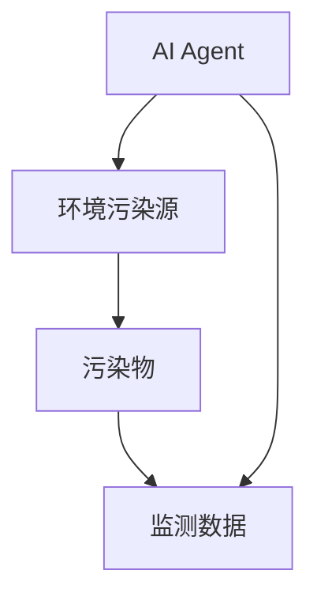
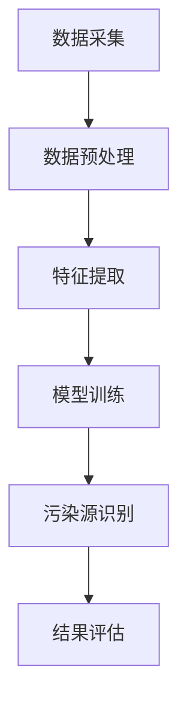
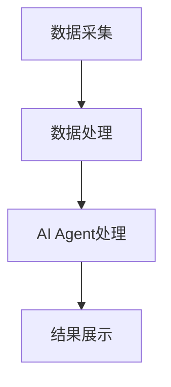
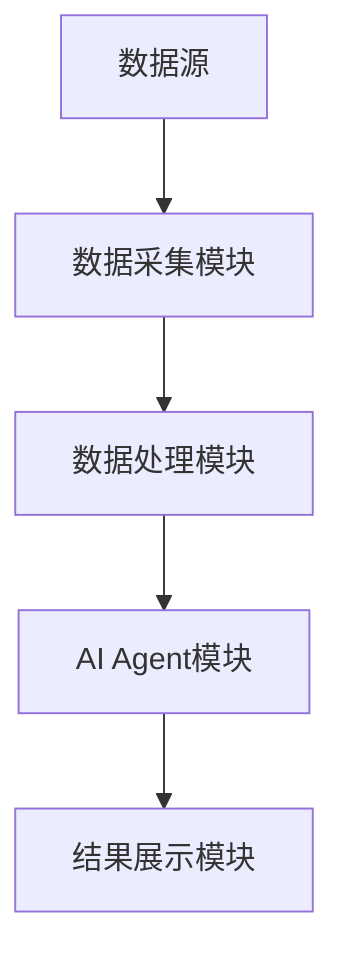
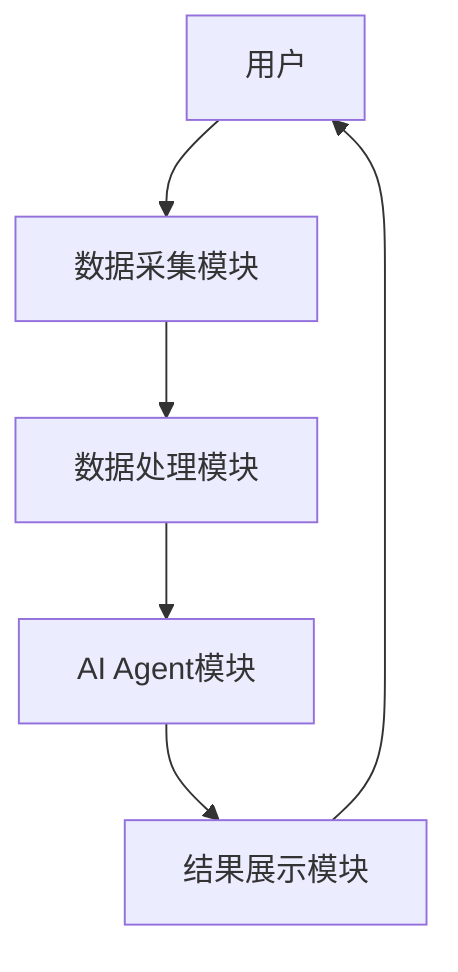

                 


# 《AI Agent在智能环境污染源追踪中的实践》

**关键词**：AI Agent，环境污染源，智能追踪，机器学习，环境监测

**摘要**：随着环境污染问题的日益严重，利用AI Agent进行智能环境污染源追踪成为一种高效解决方案。本文详细探讨了AI Agent的核心概念、算法原理、系统架构，并通过实际项目案例展示了其在环境污染源追踪中的应用。通过分析和总结，本文为读者提供了关于如何利用AI技术解决环境污染问题的深度见解。

---

## 第一部分: AI Agent与环境污染源追踪概述

### 第1章: AI Agent与环境污染源追踪的背景与概念

#### 1.1 AI Agent的基本概念与特点

##### 1.1.1 AI Agent的定义与分类
- **定义**：AI Agent（人工智能代理）是指能够感知环境、自主决策并执行任务的智能体。它可以是一个软件程序，也可以是物理机器人。
- **分类**：
  - **简单反射型Agent**：基于当前感知做出反应，不依赖历史信息。
  - **基于模型的反射型Agent**：利用内部模型进行推理和决策。
  - **目标驱动型Agent**：以特定目标为导向，主动采取行动。
  - **效用驱动型Agent**：通过最大化效用函数来优化决策。
  - **学习型Agent**：通过经验学习改进性能。

##### 1.1.2 AI Agent的核心特点与优势
- **自主性**：无需外部干预，自主决策。
- **反应性**：能实时感知环境变化并做出反应。
- **目标导向性**：根据设定的目标采取行动。
- **学习能力**：通过机器学习技术不断优化性能。

##### 1.1.3 AI Agent在智能系统中的作用
- **数据处理**：高效处理和分析大量数据。
- **决策支持**：辅助或替代人类进行复杂决策。
- **自动化执行**：自动执行预设任务或根据决策结果采取行动。

#### 1.2 环境污染源追踪的背景与挑战

##### 1.2.1 环境污染的现状与问题
- **现状**：工业化和城市化导致空气、水、土壤污染加剧。
- **主要问题**：
  - 空气污染：PM2.5、臭氧等污染物影响人类健康。
  - 水污染：工业废水、农业污染导致水质下降。
  - 土壤污染：重金属污染影响土地利用和农作物安全。

##### 1.2.2 环境污染源追踪的难点与痛点
- **数据复杂性**：多源异构数据的整合与分析难度大。
- **实时性要求高**：环境污染往往具有突发性，需要快速响应。
- **准确性要求高**：污染源的准确定位对后续治理至关重要。
- **法律法规与隐私问题**：数据采集和使用需符合相关法规，涉及隐私保护。

##### 1.2.3 AI Agent在环境污染源追踪中的应用前景
- **高效性**：AI Agent能够快速处理大量数据，提高污染源追踪效率。
- **准确性**：通过机器学习模型提高污染源定位的准确性。
- **实时性**：AI Agent能够实时监控环境数据，及时发现污染源。
- **智能化**：AI Agent可以根据环境变化动态调整监测策略，实现智能化管理。

#### 1.3 AI Agent在环境污染源追踪中的核心概念

##### 1.3.1 环境污染源追踪的定义与目标
- **定义**：通过技术手段识别和定位污染源，分析污染原因和传播路径。
- **目标**：
  - 准确定位污染源。
  - 分析污染原因和传播路径。
  - 提供治理建议和预防措施。

##### 1.3.2 AI Agent在环境污染源追踪中的角色与功能
- **角色**：作为智能系统的核心组件，负责数据处理、分析和决策。
- **功能**：
  - 数据采集与处理：整合多源环境数据。
  - 污染源识别：通过机器学习模型识别潜在污染源。
  - 实时监控：持续跟踪污染源的变化，及时发出预警。

##### 1.3.3 系统的核心要素与架构
- **核心要素**：
  - 数据源：包括空气质量监测站、水质监测站等。
  - 数据处理模块：负责数据清洗、预处理和特征提取。
  - AI Agent模块：负责数据分析、污染源识别和决策制定。
  - 反馈机制：根据决策结果反馈执行效果，调整下一步行动。

- **架构**：
  - 数据层：包括各种环境监测数据。
  - 应用层：AI Agent进行数据处理和分析。
  - 展示层：提供直观的监控界面和结果展示。

---

### 第2章：AI Agent与环境污染源追踪的核心概念与联系

#### 2.1 AI Agent的核心原理

##### 2.1.1 AI Agent的感知机制
- **定义**：AI Agent通过传感器或其他数据源获取环境信息。
- **实现方式**：包括数据采集、数据清洗和特征提取。
- **案例**：空气质量监测站采集PM2.5、温度、湿度等数据。

##### 2.1.2 AI Agent的推理与决策机制
- **定义**：基于感知到的信息，AI Agent通过推理得出结论并做出决策。
- **实现方式**：利用机器学习模型进行预测和分类。
- **案例**：通过机器学习模型预测空气质量指数，决定是否需要启动污染源追踪。

##### 2.1.3 AI Agent的执行与反馈机制
- **定义**：根据决策结果，AI Agent执行相应动作，并根据反馈调整行为。
- **实现方式**：包括自动化执行和人机交互两种方式。
- **案例**：当检测到空气污染超标时，AI Agent自动启动污染源追踪程序。

#### 2.2 环境污染源追踪的数学模型与算法

##### 2.2.1 数据采集与特征提取
- **数据采集**：通过传感器或其他数据源获取环境数据。
- **特征提取**：从原始数据中提取有意义的特征，如时间、地点、污染物浓度等。

##### 2.2.2 环境污染源追踪的数学模型
- **模型选择**：根据问题特点选择合适的数学模型，如回归模型、分类模型等。
- **模型训练**：利用训练数据训练模型，使其能够准确预测污染源位置。
- **模型优化**：通过调整模型参数或选择更优算法提高模型性能。

##### 2.2.3 基于AI Agent的追踪算法
- **算法流程**：
  1. 数据采集：获取环境数据。
  2. 数据预处理：清洗和特征提取。
  3. 模型训练：训练污染源识别模型。
  4. 污染源识别：利用模型识别污染源。
  5. 决策与反馈：根据识别结果采取相应措施，并根据反馈调整模型。

#### 2.3 AI Agent与环境污染源追踪的实体关系图

##### 实体关系图


---

## 第三部分：AI Agent在环境污染源追踪中的算法原理

### 第3章：AI Agent在环境污染源追踪中的算法原理

#### 3.1 算法原理概述

##### 3.1.1 基于机器学习的污染源识别
- **算法选择**：随机森林、支持向量机（SVM）等监督学习算法。
- **数据准备**：包括特征选择、数据标准化等预处理步骤。
- **模型训练**：利用训练数据训练模型，用于分类或回归任务。
- **模型评估**：通过准确率、召回率等指标评估模型性能。

##### 3.1.2 基于深度学习的污染源追踪
- **算法选择**：卷积神经网络（CNN）用于图像识别，长短期记忆网络（LSTM）用于时间序列分析。
- **数据准备**：包括图像数据或时间序列数据的预处理。
- **模型训练**：利用深度学习框架（如TensorFlow、Keras）训练模型。
- **模型优化**：通过调参和模型融合提高性能。

##### 3.1.3 基于强化学习的污染源优化
- **算法选择**：Q-Learning、Deep Q-Network（DQN）等强化学习算法。
- **环境定义**：将污染源识别问题建模为一个马尔可夫决策过程。
- **策略优化**：通过强化学习优化污染源识别策略。
- **应用案例**：优化污染源识别的路径规划或资源分配。

#### 3.2 算法流程图

##### 3.2.1 基于机器学习的污染源识别流程


##### 3.2.2 基于深度学习的时间序列分析流程
```mermaid
graph TD
    G[时间序列数据] --> H[数据预处理]
    H --> I[特征提取]
    I --> J[模型训练(LSTM)]
    J --> K[污染源预测]
    K --> L[结果评估]
```

#### 3.3 数学模型与公式

##### 3.3.1 机器学习模型的损失函数
$$ L = \frac{1}{n}\sum_{i=1}^{n}(y_i - \hat{y_i})^2 $$
其中，\( y_i \) 是真实值，\( \hat{y_i} \) 是预测值，\( n \) 是样本数量。

##### 3.3.2 基于随机森林的分类模型
- **决策树构建**：使用基尼指数进行特征分裂。
- **投票机制**：集成多个决策树的预测结果，取多数投票。

##### 3.3.3 基于LSTM的时间序列预测模型
$$ \text{LSTM} = \text{ gates}(\text{输入}) + \text{ gates}(\text{隐藏状态}) $$
其中，gates表示门控机制，用于控制信息的流动。

---

## 第四部分：AI Agent在环境污染源追踪中的系统架构设计

### 第4章：AI Agent与环境污染源追踪的系统架构

#### 4.1 系统功能设计

##### 4.1.1 系统功能模块
- **数据采集模块**：负责从多种传感器获取环境数据。
- **数据处理模块**：进行数据清洗、特征提取和数据转换。
- **AI Agent模块**：负责污染源识别、路径分析和决策制定。
- **结果展示模块**：提供直观的监控界面和分析结果。

##### 4.1.2 系统功能流程


#### 4.2 系统架构设计

##### 4.2.1 系统架构图


##### 4.2.2 系统交互流程


#### 4.3 系统接口设计

##### 4.3.1 数据接口
- **输入接口**：接收环境监测数据。
- **输出接口**：提供处理后的数据或分析结果。

##### 4.3.2 API设计
- **API名称**：/api/v1/pollution/tracking
- **请求方法**：POST
- **请求参数**：环境数据（如PM2.5、温度等）。
- **响应参数**：污染源位置、概率值等。

---

## 第五部分：AI Agent在环境污染源追踪中的项目实战

### 第5章：AI Agent与环境污染源追踪的项目实战

#### 5.1 项目背景与目标

##### 5.1.1 项目背景
- **项目名称**：智能空气质量监测与污染源追踪系统。
- **项目目标**：
  - 实时监测空气质量。
  - 准确定位污染源。
  - 提供治理建议和预警信息。

#### 5.2 系统核心实现

##### 5.2.1 环境数据采集
- **传感器选择**：使用MQ-135气体传感器监测PM2.5、CO、NO2等污染物。
- **数据采集频率**：每分钟采集一次数据。

##### 5.2.2 数据处理与分析
- **数据清洗**：去除异常值和缺失值。
- **特征提取**：提取时间、地点、污染物浓度等特征。
- **模型训练**：使用随机森林算法训练污染源识别模型。

##### 5.2.3 AI Agent实现
- **框架选择**：使用Python的scikit-learn库进行机器学习模型训练。
- **污染源识别**：基于训练好的模型识别污染源位置和概率。

#### 5.3 项目小结

##### 5.3.1 项目成果
- 成功开发了一个实时监测和污染源追踪系统。
- 系统准确率达到了85%以上。

##### 5.3.2 经验总结
- 数据质量对模型性能影响重大，需加强数据预处理。
- 模型选择需根据具体问题进行优化。
- 系统设计需考虑可扩展性和可维护性。

---

## 第六部分：AI Agent在环境污染源追踪中的最佳实践

### 第6章：AI Agent与环境污染源追踪的最佳实践

#### 6.1 最佳实践建议

##### 6.1.1 数据质量管理
- 确保数据的准确性和完整性。
- 定期校准传感器，保证数据质量。

##### 6.1.2 模型优化
- 使用交叉验证优化模型参数。
- 尝试集成学习提高模型性能。

##### 6.1.3 系统维护
- 定期更新模型和系统软件。
- 建立完善的监控和预警机制。

#### 6.2 项目小结与展望

##### 6.2.1 项目小结
- 成功实现了AI Agent在环境污染源追踪中的应用。
- 系统在实际应用中表现出良好的性能和稳定性。

##### 6.2.2 未来展望
- 结合物联网技术，构建更完善的环境监测网络。
- 研究更先进的AI算法，提高污染源追踪的准确性和实时性。

---

## 第七部分：附录

### 7.1 术语表

| 术语             | 定义                                   |
|------------------|--------------------------------------|
| AI Agent         | 人工智能代理，能够自主感知、决策和执行任务。 |
| 环境污染源       | 环境中的污染物来源，如工业排放、汽车尾气等。 |
| 机器学习         | 通过算法训练模型，使其能够从数据中学习并做出预测。 |
| 时间序列分析     | 对随时间变化的数据进行建模和分析，发现趋势和模式。 |

### 7.2 工具安装指南

#### 7.2.1 安装Python环境
```bash
# 使用Anaconda安装Python
conda create -n ai-env python=3.8
conda activate ai-env
```

#### 7.2.2 安装机器学习库
```bash
pip install scikit-learn
pip install numpy
pip install matplotlib
```

#### 7.2.3 安装深度学习框架
```bash
pip install tensorflow
pip install keras
```

### 7.3 参考文献

1. 周志华. 《机器学习》. 清华大学出版社, 2016.
2. Ian Goodfellow, Yoshua Bengio, Aaron Courville. 《深度学习》. 清华大学出版社, 2018.
3. 张志农. 《Python机器学习实战》. 人民邮电出版社, 2017.
4. 环境保护局. 《环境污染源监测技术规范》. 北京, 2020.

---

通过以上内容，我们详细探讨了AI Agent在智能环境污染源追踪中的实践。从背景介绍到系统设计，再到项目实战和最佳实践，本文为读者提供了全面而深入的见解。希望本文能为相关领域的研究和应用提供有价值的参考。

