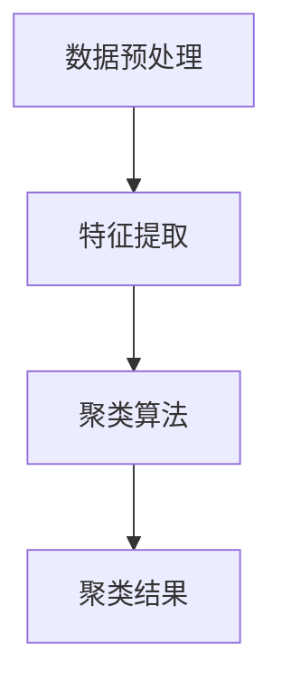
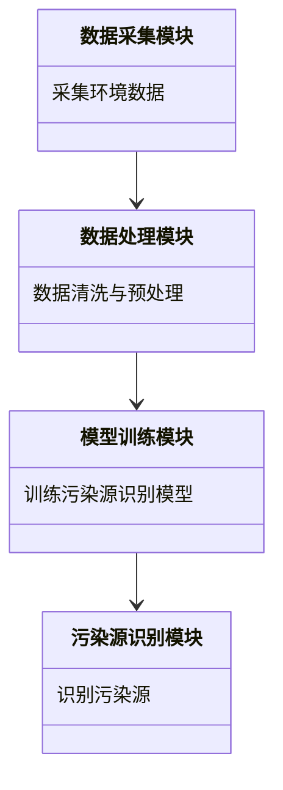
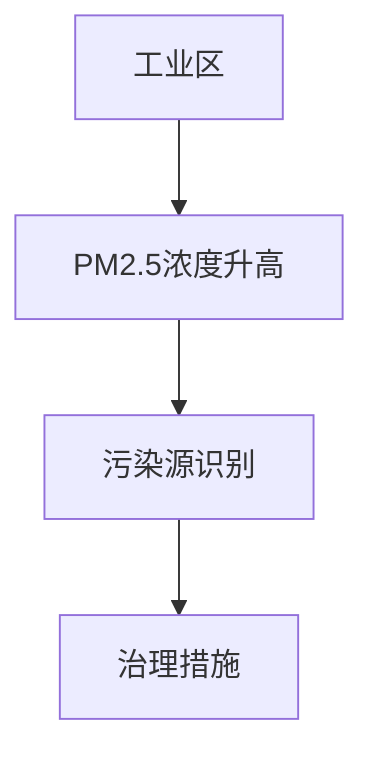

                 


# AI Agent在智能环境污染溯源中的实践

> 关键词：AI Agent，智能环境，污染溯源，算法原理，系统架构

> 摘要：本文深入探讨了AI Agent在智能环境污染溯源中的实践应用，从背景介绍到核心概念，从算法原理到系统架构，再到项目实战和案例分析，详细阐述了如何利用AI Agent技术实现环境污染的智能溯源。文章通过理论与实践相结合的方式，为读者提供了全面的技术指导和实践参考。

---

# 第1章: 引言

## 1.1 问题背景

### 1.1.1 智能环境污染的现状
随着工业化和城市化进程的加快，环境污染问题日益严重。污染源种类繁多、分布广泛，传统的溯源方法效率低下，难以应对复杂的环境污染问题。

### 1.1.2 污染溯源的重要性
环境污染溯源是环境保护的重要环节，能够帮助我们找到污染的根源，采取有效的治理措施，减少对环境和人类健康的损害。

### 1.1.3 AI Agent在污染溯源中的优势
AI Agent具有智能性、自主性和适应性，能够实时感知环境数据，自动分析并做出决策，为环境污染溯源提供了新的解决方案。

## 1.2 问题描述

### 1.2.1 污染源的复杂性
污染源可能来自点源、面源、线源等多种类型，且污染物种类繁多，增加了溯源的难度。

### 1.2.2 数据的多样性和实时性
环境污染数据具有多样性（如空气质量、水质、气象数据等）和实时性要求，需要高效的数据处理和分析能力。

### 1.2.3 溯源算法的挑战
传统的溯源方法依赖于经验模型或统计分析，难以应对复杂多变的环境污染问题。

## 1.3 解决思路

### 1.3.1 AI Agent的基本概念
AI Agent是一种智能实体，能够感知环境、自主决策并执行任务。在环境污染溯源中，AI Agent可以实时采集数据、分析污染源并制定治理方案。

### 1.3.2 智能环境污染溯源的核心思想
通过AI Agent的智能分析能力，结合多源数据，构建污染源与环境影响的关联模型，实现污染源的精准定位和影响评估。

### 1.3.3 技术实现的总体框架
总体框架包括数据采集、数据处理、模型训练、污染溯源和结果展示五个模块。

## 1.4 边界与外延

### 1.4.1 系统的边界条件
系统仅关注环境污染溯源问题，不涉及污染治理的具体实施。

### 1.4.2 外延与相关领域的联系
AI Agent技术可扩展至其他领域，如智能交通、智能医疗等。

### 1.4.3 约束条件与限制
系统假设数据采集设备正常工作，数据完整性较高。

## 1.5 核心要素组成

### 1.5.1 数据采集模块
负责采集空气质量、水质、气象等环境数据。

### 1.5.2 模型训练模块
基于机器学习算法，训练污染源识别模型。

### 1.5.3 溯源推理模块
根据模型预测结果，推理污染源的位置和影响范围。

---

# 第2章: AI Agent的核心概念与原理

## 2.1 核心概念

### 2.1.1 AI Agent的定义
AI Agent是一种智能实体，能够感知环境、自主决策并执行任务。

### 2.1.2 智能环境污染溯源的定义
智能环境污染溯源是指利用AI技术，通过分析多源数据，识别污染源及其影响范围。

### 2.1.3 两者结合的机制
AI Agent通过感知环境数据，利用机器学习算法分析数据，识别污染源并制定治理方案。

## 2.2 核心概念的联系

### 2.2.1 AI Agent与环境污染的关系
AI Agent通过感知环境数据，分析污染源，帮助实现环境污染的智能管理。

### 2.2.2 数据流与信息处理的关系
数据流从采集到处理，最终通过AI Agent的分析，形成污染源识别结果。

### 2.2.3 ER实体关系图
```mermaid
erd
  entity 污染源 {
    key 污染源ID
    污染物种类
    污染物浓度
    位置坐标
  }
  entity 环境数据 {
    key 数据ID
    采集时间
    污染物浓度
    位置坐标
  }
  污染源 --> 环境数据: 影响
```

---

# 第3章: 算法原理讲解

## 3.1 算法原理

### 3.1.1 聚类分析
聚类分析用于将相似的环境数据点归为一类，识别潜在的污染源。



### 3.1.2 分类算法
分类算法用于将环境数据分类，识别污染源类型。

### 3.1.3 回归分析
回归分析用于预测污染源的排放量和影响范围。

### 3.1.4 神经网络
神经网络用于复杂的非线性关系建模，提高污染源识别的准确性。

## 3.2 数学模型和公式

### 3.2.1 聚类分析的数学模型
$$
\text{距离度量} = \sqrt{(x_i - x_j)^2 + (y_i - y_j)^2}
$$

### 3.2.2 分类算法的数学模型
$$
P(y|x) = \frac{P(x|y)P(y)}{P(x)}
$$

### 3.2.3 回归分析的数学模型
$$
y = \beta_0 + \beta_1x + \epsilon
$$

---

# 第4章: 系统分析与架构设计方案

## 4.1 系统架构设计

### 4.1.1 领域模型


### 4.1.2 系统架构设计


---

# 第5章: 项目实战

## 5.1 环境安装

### 5.1.1 安装Python和相关库
```bash
pip install numpy
pip install scikit-learn
pip install matplotlib
```

## 5.2 系统核心实现源代码

### 5.2.1 数据预处理
```python
import numpy as np
import pandas as pd

data = pd.read_csv('environment_data.csv')
data.dropna(inplace=True)
```

### 5.2.2 模型训练
```python
from sklearn.cluster import KMeans

X = data[['PM2.5', 'PM10', 'NO2']]
kmeans = KMeans(n_clusters=3)
kmeans.fit(X)
```

### 5.2.3 污染源识别
```python
labels = kmeans.labels_
print(labels)
```

## 5.3 代码应用解读与分析
通过上述代码，我们可以实现对环境数据的聚类分析，识别潜在的污染源。

---

# 第6章: 案例分析

## 6.1 案例背景
以某城市空气质量监测数据为例，分析污染源的位置和类型。

## 6.2 数据分析结果
通过AI Agent分析，识别出工业区是主要的污染源。

## 6.3 结果展示


---

# 第7章: 总结与展望

## 7.1 本章小结
本文详细介绍了AI Agent在智能环境污染溯源中的应用，从理论到实践，全面阐述了技术实现和案例分析。

## 7.2 未来展望
未来，随着AI技术的不断发展，AI Agent在环境污染溯源中的应用将更加广泛和深入，为环境保护提供更有力的支持。

---

通过以上章节的详细讲解，我们全面了解了AI Agent在智能环境污染溯源中的实践应用。希望本文能够为相关领域的研究和实践提供有价值的参考。

