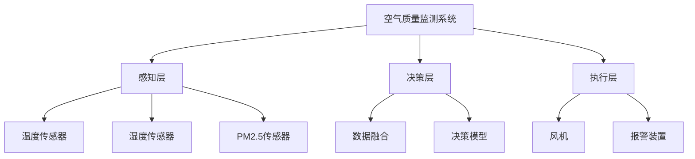

                 


# AI Agent在智能环境监测中的应用

> **关键词**: AI Agent, 智能环境监测, 空气质量监测, 系统架构, 项目实战

> **摘要**: 本文探讨了AI Agent在智能环境监测中的应用，详细分析了其核心技术与原理，包括感知、决策、执行与反馈机制。通过空气质量监测系统的案例，展示了AI Agent的实际应用价值，并提出了系统设计与实现方案。最后，本文展望了AI Agent在环境监测中的未来发展方向。

---

## 第1章: AI Agent的基本概念与特点

### 1.1 AI Agent的定义与核心要素

AI Agent（人工智能代理）是一种能够感知环境并采取行动以实现目标的智能实体。它通过传感器获取信息，利用计算模型进行分析，并通过执行器与环境交互。AI Agent的核心要素包括：

- **自主性**: 能够独立决策和行动。
- **反应性**: 能够实时感知环境变化并做出反应。
- **主动性**: 主动采取行动以实现目标。
- **社会性**: 能够与其他Agent或人类进行交互与协作。

### 1.2 智能环境监测的基本概念

智能环境监测是利用现代信息技术对环境进行实时、准确的监测和评估。AI Agent在其中扮演关键角色，通过数据采集、分析和决策，实现对环境的智能化管理。

### 1.3 AI Agent在智能环境监测中的作用

AI Agent能够实时处理环境数据，提供准确的监测结果，并在异常情况下采取及时的应对措施。它通过自主决策和学习，优化监测系统的性能，提高监测效率。

---

## 第2章: AI Agent在智能环境监测中的应用背景

### 2.1 智能环境监测的现状与挑战

传统环境监测依赖人工操作，存在效率低、响应慢等问题。随着AI技术的发展，智能环境监测成为必然趋势。然而，数据处理的复杂性、系统的实时性要求以及多环境因素的协同处理仍面临挑战。

### 2.2 AI Agent在智能环境监测中的优势

AI Agent通过自主感知和决策，能够快速响应环境变化，提高监测系统的效率和准确性。其智能性和自主性使其在复杂环境中表现优异。

---

## 第3章: AI Agent的核心技术与原理

### 3.1 感知模块

感知模块负责从环境中采集数据并进行预处理。常用的数据采集方法包括传感器网络和物联网技术。

#### 3.1.1 数据采集与预处理

- **数据采集**: 使用多种传感器（如温度、湿度传感器）采集环境数据。
- **数据预处理**: 对采集的数据进行清洗和归一化处理，确保数据质量。

#### 3.1.2 数据特征提取

通过特征提取算法（如主成分分析）提取关键特征，减少数据维度，提高处理效率。

### 3.2 决策模块

决策模块基于感知数据进行分析，生成决策策略。

#### 3.2.1 决策算法

- **基于规则的决策**: 利用预定义的规则进行判断，如“若温度超过阈值，则触发警报”。
- **基于机器学习的决策**: 使用分类器（如支持向量机、随机森林）进行预测和分类。
- **基于强化学习的决策**: 通过奖励机制优化决策策略。

#### 3.2.2 决策流程

1. 数据输入：接收预处理后的特征数据。
2. 特征分析：提取关键特征并进行分类。
3. 决策输出：生成相应的决策指令。

### 3.3 执行与反馈机制

执行模块根据决策指令采取行动，并通过反馈机制调整系统状态。

#### 3.3.1 执行模块

- **执行策略**: 根据决策结果采取相应动作，如启动风机或关闭空调。
- **动作规划**: 优化执行顺序和方式，确保效率最大化。

#### 3.3.2 反馈机制

- **反馈采集**: 采集执行结果并回传至系统。
- **反馈处理**: 分析反馈数据，调整感知和决策模块的参数。

---

## 第4章: 基于AI Agent的空气质量监测系统

### 4.1 系统架构设计

空气质量监测系统由感知层、决策层和执行层组成。

#### 4.1.1 系统架构图



#### 4.1.2 系统功能设计

- **数据采集**: 采集温度、湿度、PM2.5等数据。
- **数据融合**: 综合分析多种数据，生成空气质量指数。
- **决策模型**: 基于机器学习模型预测空气质量。
- **执行控制**: 根据预测结果启动相应设备。

### 4.2 系统实现

#### 4.2.1 环境搭建

- **硬件设备**: 配置温度、湿度和PM2.5传感器。
- **软件环境**: 安装Python、TensorFlow、Scikit-learn等工具。

#### 4.2.2 核心代码实现

```python
import numpy as np
from sklearn.ensemble import RandomForestClassifier

# 数据预处理
def preprocess(data):
    # 假设data为传感器数据
    # 这里进行归一化处理
    normalized_data = (data - np.min(data)) / (np.max(data) - np.min(data))
    return normalized_data

# 特征提取
def extract_features(data):
    # 使用主成分分析提取特征
    from sklearn.decomposition import PCA
    pca = PCA(n_components=3)
    features = pca.fit_transform(data)
    return features

# 决策模型训练
def train_model(features, labels):
    model = RandomForestClassifier()
    model.fit(features, labels)
    return model

# 决策模型预测
def predict(model, features):
    return model.predict(features)

# 执行模块
def execute(action):
    if action == '启动风机':
        print('启动风机')
    elif action == '关闭风机':
        print('关闭风机')
```

#### 4.2.3 测试与优化

- **测试数据**: 使用预留的数据集进行模型测试。
- **性能评估**: 通过准确率、召回率等指标评估模型性能。
- **优化调整**: 根据测试结果优化模型参数和系统架构。

---

## 第5章: 系统优化与扩展

### 5.1 系统优化

- **算法优化**: 使用更高效的算法（如XGBoost）提升预测精度。
- **硬件升级**: 引入边缘计算设备，减少数据传输延迟。

### 5.2 功能扩展

- **多环境因素监测**: 扩展到水质量监测、噪声监测等领域。
- **多Agent协作**: 实现多个AI Agent协同工作，提升整体监测能力。

---

## 第6章: 项目实战总结

### 6.1 项目小结

通过空气质量监测系统的实战，展示了AI Agent在环境监测中的强大能力。系统从数据采集到决策执行的全流程设计，证明了AI Agent在实际应用中的可行性和有效性。

### 6.2 最佳实践 Tips

- **数据质量**: 数据预处理是关键，确保数据准确可靠。
- **算法选择**: 根据实际需求选择合适的算法，避免过度复杂。
- **系统架构**: 设计合理的系统架构，确保扩展性和可维护性。

---

## 第7章: 未来展望

### 7.1 技术趋势

- **边缘计算**: 提高系统的实时性和响应速度。
- **多智能体协作**: 实现更复杂的环境监测任务。
- **深度学习**: 提升模型的预测精度和自适应能力。

### 7.2 挑战与机遇

尽管AI Agent在环境监测中展现出巨大潜力，但仍需克服数据隐私、系统安全等挑战。未来，随着技术的进步，AI Agent将在更多领域发挥重要作用。

---

## 结语

AI Agent在智能环境监测中的应用前景广阔，通过不断的技术创新和实践探索，我们有望构建更智能、更高效的环境监测系统，为人类的可持续发展提供有力支持。

---

**感谢阅读！**

