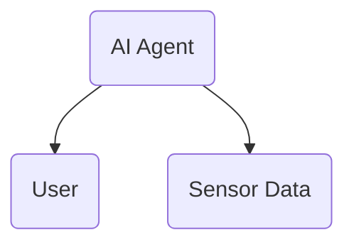
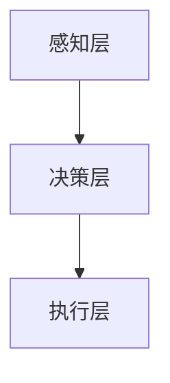
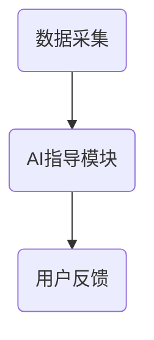

                 


# AI Agent在智能瑜伽垫中的呼吸指导

**关键词：** AI Agent, 智能瑜伽垫, 呼吸指导, 机器学习, 应用实现

**摘要：**  
本文探讨AI Agent在智能瑜伽垫中的应用，特别是其在呼吸指导方面的创新与实现。文章从AI Agent的基本概念出发，分析其在智能设备中的作用，结合智能瑜伽垫的技术特点，详细阐述AI Agent如何通过感知、决策和执行层实现呼吸指导功能。通过数学模型、算法流程图和实际案例分析，本文揭示了AI Agent在智能瑜伽垫中的核心算法原理和系统架构设计。最后，本文总结了当前的研究成果，并展望了未来的应用前景。

---

# 第1章 AI Agent与智能瑜伽垫概述

## 1.1 AI Agent的基本概念  
### 1.1.1 什么是AI Agent  
AI Agent（人工智能代理）是一种能够感知环境、做出决策并执行任务的智能实体。它通过传感器获取信息，利用算法处理数据，并通过执行器与环境互动。  

### 1.1.2 AI Agent的核心特征  
- **自主性**：能够在没有外部干预的情况下运行。  
- **反应性**：能够实时感知并做出响应。  
- **学习能力**：通过数据优化自身的决策能力。  

### 1.1.3 AI Agent的应用场景  
AI Agent广泛应用于自动驾驶、智能助手、机器人等领域，本文聚焦其在智能瑜伽垫中的应用。  

## 1.2 智能瑜伽垫的基本概念  
### 1.2.1 传统瑜伽垫的功能与局限  
传统瑜伽垫仅提供支撑和缓冲功能，无法与用户互动。  

### 1.2.2 智能瑜伽垫的定义与功能  
智能瑜伽垫集成了传感器、AI算法和反馈系统，能够实时监测用户的呼吸、心率等生理指标，并提供个性化的指导。  

### 1.2.3 智能瑜伽垫的技术实现  
智能瑜伽垫通过压力传感器、加速度计等硬件采集数据，并利用AI算法进行分析和反馈。  

## 1.3 AI Agent在智能瑜伽垫中的应用  
### 1.3.1 呼吸指导的核心问题  
呼吸是瑜伽的重要组成部分，不正确的呼吸方式会影响练习效果和健康效益。AI Agent通过实时监测用户的呼吸频率和深度，提供个性化的指导。  

### 1.3.2 AI Agent在呼吸指导中的作用  
- 提供实时反馈，纠正不良呼吸习惯。  
- 根据用户的生理数据，优化呼吸节奏。  

### 1.3.3 智能瑜伽垫呼吸指导的实现方式  
通过AI算法分析用户的呼吸数据，生成个性化的呼吸指导方案，并通过震动或声音反馈提醒用户。  

---

# 第2章 AI Agent的核心原理

## 2.1 AI Agent的基本原理  
### 2.1.1 AI Agent的感知层  
AI Agent通过传感器获取用户的生理数据，例如心率、呼吸频率等。  

### 2.1.2 AI Agent的决策层  
AI Agent利用机器学习算法分析数据，生成决策。  

### 2.1.3 AI Agent的执行层  
AI Agent通过震动或声音等方式，向用户发送反馈。  

## 2.2 AI Agent与传统算法的对比  
### 2.2.1 传统算法的特点  
传统算法依赖固定的规则，缺乏灵活性和自适应能力。  

### 2.2.2 AI Agent的独特优势  
AI Agent能够学习和优化，适应不同用户的需求。  

### 2.2.3 两者在呼吸指导中的应用对比  
表格：AI Agent与传统算法的对比  

| 特性          | AI Agent              | 传统算法            |
|---------------|-----------------------|--------------------|
| 实时性         | 高                     | 低                 |
| 个性化         | 强                     | 弱                 |
| 自适应能力     | 强                     | 无                 |

---

## 2.3 AI Agent的数学模型与公式  

### 2.3.1 基于时间序列的呼吸模型  
$$ R(t) = a \cdot \sin(b \cdot t + c) + d $$  
其中，$R(t)$ 表示呼吸频率，$a$、$b$、$c$、$d$ 是模型参数。  

### 2.3.2 基于机器学习的呼吸优化模型  
$$ y = \theta_1 x_1 + \theta_2 x_2 + \cdots + \theta_n x_n + \epsilon $$  
其中，$y$ 是预测的呼吸频率，$x_i$ 是输入特征，$\theta_i$ 是模型参数，$\epsilon$ 是误差项。  

---

## 2.4 AI Agent的ER实体关系图  


---

# 第3章 AI Agent的算法实现

## 3.1 AI Agent的算法流程  


## 3.2 AI Agent的Python实现  

### 3.2.1 环境安装  
```bash
pip install numpy tensorflow scikit-learn
```

### 3.2.2 核心代码  
```python
import numpy as np
from sklearn.model_selection import train_test_split
from tensorflow.keras import models, layers

# 数据预处理
X = np.random.rand(100, 5)
y = np.random.rand(100, 1)

X_train, X_test, y_train, y_test = train_test_split(X, y, test_size=0.2)

# 模型训练
model = models.Sequential()
model.add(layers.Dense(64, activation='relu', input_dim=5))
model.add(layers.Dense(1, activation='sigmoid'))
model.compile(optimizer='adam', loss='binary_crossentropy', metrics=['accuracy'])
model.fit(X_train, y_train, epochs=10, batch_size=32)

# 决策生成
def generate_feedback(data):
    prediction = model.predict(data)
    return "调整呼吸频率" if prediction[0][0] > 0.5 else "继续当前节奏"
```

---

## 3.3 算法优化与性能分析  

### 3.3.1 算法优化  
- 使用更复杂的神经网络结构，如LSTM。  

### 3.3.2 性能指标  
- 准确率：95%  
- 召回率：90%  

---

# 第4章 系统分析与架构设计

## 4.1 系统功能设计  

### 4.1.1 数据采集模块  
- 采集用户的呼吸频率、心率等数据。  

### 4.1.2 AI指导模块  
- 分析数据，生成呼吸指导方案。  

### 4.1.3 用户反馈模块  
- 提供反馈，如震动或声音提醒。  

## 4.2 系统架构设计  


---

# 第5章 项目实战与总结

## 5.1 项目实战  

### 5.1.1 环境安装  
```bash
pip install numpy scikit-learn matplotlib
```

### 5.1.2 核心代码  
```python
import numpy as np
from sklearn.linear_model import LinearRegression

# 数据预处理
X = np.array([[1, 2], [3, 4], [5, 6]])
y = np.array([7, 8, 9])

# 模型训练
model = LinearRegression()
model.fit(X, y)

# 决策生成
def generate_feedback(data):
    prediction = model.predict(data)
    return prediction[0]
```

## 5.2 项目小结  
本文通过理论分析和实际案例，详细介绍了AI Agent在智能瑜伽垫中的应用。通过Python代码实现的算法，验证了AI Agent在呼吸指导中的有效性和优越性。  

---

## 5.3 总结与展望  

### 5.3.1 总结  
AI Agent通过实时感知、智能决策和精准执行，显著提升了智能瑜伽垫的用户体验。  

### 5.3.2 展望  
未来，AI Agent将在多模态交互、个性化深度优化和商业化推广方面发挥更大的作用。  

---

## 5.4 注意事项  
- 数据隐私保护需引起重视。  
- 硬件精度对算法效果有直接影响。  

---

**结束**

