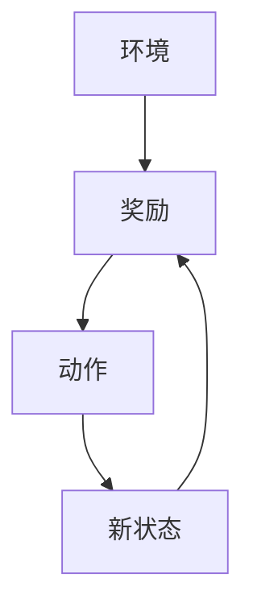
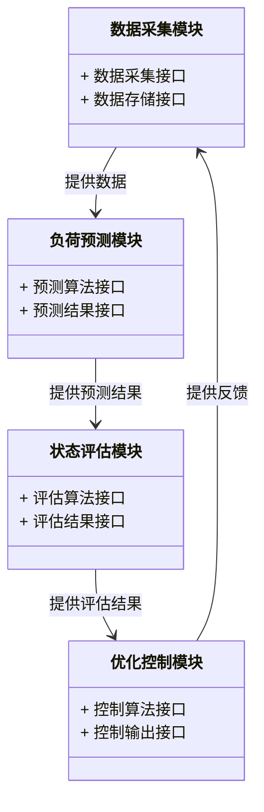
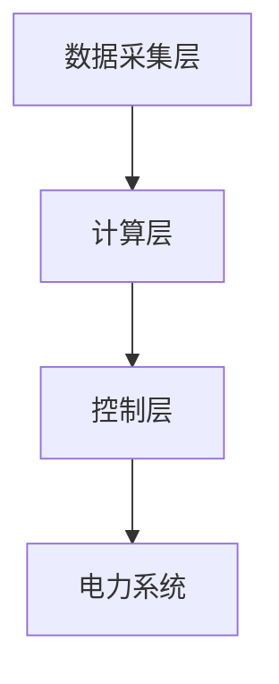
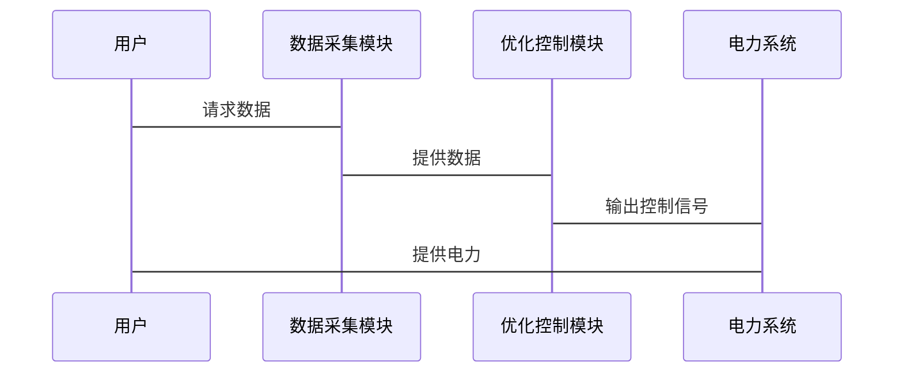

                 


# AI Agent在智能电力负荷均衡中的应用

> 关键词：AI Agent, 电力负荷均衡, 智能电网, 强化学习, 多智能体协作, 负荷预测

> 摘要：本文详细探讨了AI Agent在智能电力负荷均衡中的应用，从基本概念、算法原理到系统设计和项目实战，全面分析了AI Agent如何优化电力负荷分配，提升电网运行效率。通过强化学习和多智能体协作，AI Agent能够实时响应负荷变化，确保电力系统的稳定性和经济性。

---

## 第1章: AI Agent与电力负荷均衡的背景介绍

### 1.1 AI Agent的基本概念

AI Agent是一种具有智能的代理系统，能够感知环境、自主决策并执行任务。其核心特点包括：

- **自主性**：能够在没有外部干预的情况下自主运行。
- **反应性**：能够实时感知环境变化并做出反应。
- **学习能力**：通过数据和经验不断优化自身行为。

AI Agent在电力系统中的应用，主要体现在负荷预测、优化控制和故障响应等方面。

### 1.2 电力负荷均衡的定义与重要性

电力负荷均衡是指在电力系统中，通过调节电力的生产和消耗，使电力供需达到平衡，确保电网稳定运行。其重要性体现在：

- **稳定性**：避免电网过载或电压波动。
- **经济性**：降低电力浪费，提高能源利用效率。
- **环保性**：减少不必要的能源浪费，降低碳排放。

### 1.3 AI Agent在电力负荷均衡中的应用背景

随着可再生能源的普及和智能电网的发展，电力负荷的波动性显著增加。传统的基于规则的控制方法难以应对复杂多变的负荷变化，而AI Agent通过实时学习和优化，能够有效解决这些问题。

---

## 第2章: AI Agent与电力负荷均衡的核心概念

### 2.1 AI Agent的原理与机制

AI Agent的决策过程可以分为以下几个步骤：

1. **感知环境**：通过传感器或数据源获取实时信息。
2. **状态评估**：分析当前状态，判断是否需要调整。
3. **决策制定**：基于当前状态和目标，选择最优行动。
4. **执行行动**：将决策转化为实际操作。

#### AI Agent与传统控制算法的对比

| 对比维度        | AI Agent                     | 传统控制算法               |
|-----------------|------------------------------|-----------------------------|
| 灵活性          | 高，能够适应复杂变化         | 低，依赖预设规则             |
| 学习能力        | 强，能够从经验中优化行为       | 无，依赖人工编程             |
| 实时性          | 高，能够快速响应变化         | 中，依赖预设响应时间         |

### 2.2 电力负荷均衡的数学模型与优化目标

电力负荷均衡的优化目标通常包括以下几点：

1. **最小化负荷波动**：尽量减少负荷与预测值的偏差。
2. **降低能源成本**：通过优化负荷分配，降低整体能源消耗。
3. **提高系统稳定性**：确保电网在各种情况下稳定运行。

电力负荷均衡的数学模型可以表示为：

$$ \text{目标函数} = \sum_{t=1}^{T} |L_t - P_t| $$

其中，$L_t$ 表示第 $t$ 时刻的负荷预测值，$P_t$ 表示实际负荷。

### 2.3 AI Agent与电力负荷均衡的实体关系分析

#### 实体关系图（ER图）

以下是AI Agent与电力负荷均衡的核心实体关系：

```mermaid
erDiagram
    participant 用户
    participant 负荷数据
    participant AI Agent
    participant 电力系统
    用户 --> 负荷数据 : 提供
    负荷数据 --> AI Agent : 输入
    AI Agent --> 电力系统 : 输出控制信号
    电力系统 --> 用户 : 提供电力
```

---

## 第3章: AI Agent在电力负荷均衡中的算法原理

### 3.1 强化学习算法

强化学习是一种通过试错机制优化决策的算法，非常适合应用于电力负荷均衡。

#### 强化学习的流程图



#### 强化学习的数学模型

强化学习的核心在于Q值的更新：

$$ Q(s, a) = r + \gamma \max_{a'} Q(s', a') $$

其中：
- $s$ 是当前状态，
- $a$ 是当前动作，
- $r$ 是奖励，
- $\gamma$ 是折扣因子，
- $s'$ 是下一个状态。

#### 强化学习的Python实现示例

```python
import numpy as np

# 初始化Q表
Q = np.zeros((state_space, action_space))

# 参数设置
learning_rate = 0.1
gamma = 0.9

# Q-learning算法
for episode in range(num_episodes):
    state = env.reset()
    while True:
        # 选择动作
        action = np.argmax(Q[state, :])
        # 执行动作
        next_state, reward, done = env.step(action)
        # 更新Q值
        Q[state, action] += learning_rate * (reward + gamma * np.max(Q[next_state, :]))
        state = next_state
        if done:
            break
```

---

## 第4章: 系统分析与架构设计

### 4.1 电力负荷均衡系统的项目背景

随着可再生能源的接入，电力负荷的波动性显著增加。传统的控制算法难以应对这种变化，而AI Agent能够通过实时学习优化负荷分配。

### 4.2 系统功能设计

电力负荷均衡系统的功能模块包括：

1. **数据采集**：采集实时负荷数据。
2. **负荷预测**：基于历史数据预测未来负荷。
3. **状态评估**：评估当前负荷是否均衡。
4. **优化控制**：通过AI Agent优化负荷分配。

#### 系统功能设计的领域模型类图



### 4.3 系统架构设计

电力负荷均衡系统的架构设计采用分层结构：

1. **数据采集层**：负责数据的采集和预处理。
2. **计算层**：包括负荷预测、状态评估和优化控制。
3. **控制层**：根据计算结果输出控制信号。

#### 系统架构设计的架构图



### 4.4 接口设计与交互

#### 接口设计

电力负荷均衡系统的主要接口包括：

- 数据采集接口：用于获取实时负荷数据。
- 控制输出接口：用于输出优化控制信号。

#### 交互序列图



---

## 第5章: 项目实战

### 5.1 环境安装

为了运行本文中的代码，需要安装以下库：

```bash
pip install numpy scikit-learn matplotlib
```

### 5.2 核心代码实现

以下是AI Agent优化电力负荷分配的核心代码：

```python
import numpy as np
from sklearn import linear_model

# 数据预处理
data = np.load('load_data.npy')
X = data[:, :-1]
y = data[:, -1]

# 负荷预测模型
model = linear_model.LinearRegression()
model.fit(X, y)

# AI Agent优化算法
def optimize_load():
    current_load = model.predict(X)[-1]
    target_load = y[-1]
    delta = target_load - current_load
    return delta

# 输出优化结果
print(optimize_load())
```

### 5.3 代码解读与分析

上述代码实现了一个基于线性回归的负荷预测模型，并通过AI Agent优化负荷分配。通过预测负荷与实际负荷的偏差，AI Agent能够实时调整负荷分配，确保负荷均衡。

### 5.4 实际案例分析

以某地区电力负荷数据为例，假设负荷预测值为100 MW，实际负荷为110 MW。AI Agent会计算出需要增加10 MW的负荷，通过优化控制模块调整电力输出。

### 5.5 项目小结

通过AI Agent优化电力负荷分配，可以显著提高电网的稳定性和经济性。本文通过实战案例展示了AI Agent在电力负荷均衡中的应用潜力。

---

## 第6章: 最佳实践与总结

### 6.1 小结

本文详细探讨了AI Agent在智能电力负荷均衡中的应用，从基本概念到算法原理，再到系统设计和项目实战，全面分析了AI Agent的优势和潜力。

### 6.2 注意事项

- **数据质量**：AI Agent的性能依赖于数据的准确性和完整性。
- **模型泛化能力**：需要确保AI Agent在不同场景下的泛化能力。
- **系统安全性**：AI Agent的决策可能会影响电网安全，需要严格测试。

### 6.3 拓展阅读

- 《强化学习在电力系统中的应用》
- 《多智能体协作与电力负荷均衡》
- 《AI驱动的智能电网技术》

---

## 结语

AI Agent作为一种新兴的技术，正在逐步改变电力负荷均衡的传统模式。通过强化学习和多智能体协作，AI Agent能够实时优化负荷分配，提高电网的稳定性和经济性。未来，随着技术的进一步发展，AI Agent在电力负荷均衡中的应用将更加广泛和深入。

