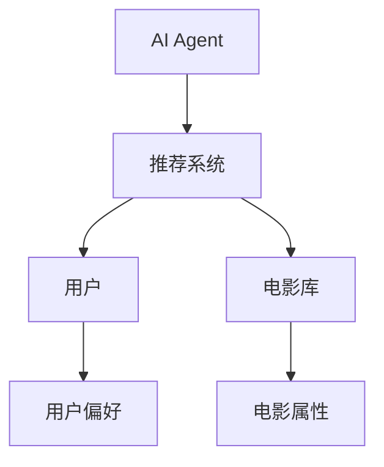

                 

# AI Agent在智能电影推荐中的应用

> 关键词：AI Agent, 智能推荐系统, 电影推荐, 机器学习, 人工智慧

> 摘要：本文详细探讨了AI Agent在智能电影推荐中的应用。从背景介绍、核心概念、算法原理、系统设计到项目实战，系统性地分析了AI Agent如何提升电影推荐的效率和精准度。文章通过理论与实践相结合的方式，展示了AI Agent在电影推荐系统中的巨大潜力和实际应用价值。

---

# 第1章: 背景介绍

## 1.1 问题背景

### 1.1.1 传统电影推荐系统的局限性
传统的电影推荐系统主要依赖于基于协同过滤的推荐算法。这种方法虽然能够在一定程度上捕捉用户的兴趣偏好，但存在以下局限性：
- **数据稀疏性问题**：当用户数量庞大时，用户-物品交互矩阵可能会变得非常稀疏，导致推荐精度下降。
- **实时性不足**：协同过滤算法通常需要离线计算，无法实时响应用户的动态需求。
- **冷启动问题**：对于新用户或新加入的电影，系统难以快速生成有效的推荐结果。

### 1.1.2 智能推荐系统的兴起
随着人工智能技术的快速发展，智能推荐系统逐渐取代了传统的协同过滤算法。智能推荐系统利用机器学习、深度学习等技术，能够更精准地捕捉用户的兴趣，实时响应用户的请求，并有效解决冷启动问题。

### 1.1.3 AI Agent在推荐系统中的作用
AI Agent（人工智能代理）是一种能够感知环境、自主决策并执行任务的智能体。在推荐系统中，AI Agent可以实时分析用户的交互行为，动态调整推荐策略，并与用户进行自然语言对话，从而提供更个性化、更高效的推荐服务。

## 1.2 问题描述

### 1.2.1 用户需求分析
用户在选择电影时，通常会关注以下方面：
- **内容相关性**：用户希望推荐的电影与自己的兴趣爱好高度相关。
- **实时性**：用户希望推荐结果能够实时更新，反映最新的电影发布和用户的最新偏好。
- **多样性**：用户希望推荐的电影种类多样，避免推荐结果过于单一。

### 1.2.2 电影推荐的核心问题
电影推荐的核心问题在于如何在海量的电影数据中，快速找到最符合用户兴趣的电影，并实时反馈给用户。

### 1.2.3 AI Agent如何解决推荐问题
AI Agent通过以下方式解决电影推荐问题：
- **实时感知**：AI Agent能够实时感知用户的交互行为，捕捉用户的兴趣变化。
- **动态调整**：AI Agent可以根据用户的反馈动态调整推荐策略，确保推荐结果的精准性。
- **自然交互**：AI Agent可以与用户进行自然语言对话，进一步细化用户的兴趣偏好。

## 1.3 问题解决

### 1.3.1 AI Agent的基本概念
AI Agent是一种能够感知环境、自主决策并执行任务的智能体。在电影推荐系统中，AI Agent通常扮演以下角色：
- **感知者**：通过收集用户的交互数据，感知用户的兴趣偏好。
- **决策者**：基于感知到的信息，决策推荐哪些电影。
- **执行者**：将推荐结果反馈给用户，并实时调整推荐策略。

### 1.3.2 AI Agent在推荐系统中的应用
AI Agent在推荐系统中的应用主要体现在以下几个方面：
- **实时推荐**：AI Agent能够实时分析用户的交互行为，快速生成推荐结果。
- **个性化推荐**：AI Agent可以根据用户的兴趣偏好，推荐个性化电影。
- **动态调整**：AI Agent可以根据用户的反馈动态调整推荐策略，提高推荐的精准度。

### 1.3.3 AI Agent的核心优势
AI Agent的核心优势在于其智能性和自主性：
- **智能性**：AI Agent能够通过机器学习算法，不断优化推荐策略。
- **自主性**：AI Agent可以在没有人工干预的情况下，自主完成推荐任务。

## 1.4 边界与外延

### 1.4.1 AI Agent的边界
AI Agent在推荐系统中的应用存在一定的边界：
- **数据限制**：AI Agent的推荐能力依赖于高质量的数据，数据不足时推荐效果会下降。
- **计算能力限制**：AI Agent的推荐能力依赖于强大的计算能力，计算资源不足时推荐效率会降低。
- **隐私问题**：AI Agent需要处理用户的隐私数据，必须严格遵守数据隐私保护法规。

### 1.4.2 推荐系统的外延
推荐系统的外延包括：
- **多模态推荐**：结合文本、图像、视频等多种模态信息进行推荐。
- **跨平台推荐**：在不同平台上提供一致的推荐服务。
- **社交推荐**：结合用户的社交网络信息进行推荐。

### 1.4.3 AI Agent与其他推荐技术的对比
AI Agent与其他推荐技术的主要区别在于其自主性和智能性。传统推荐算法通常需要人工干预和优化，而AI Agent能够自主完成推荐任务，并通过自我学习不断优化推荐策略。

## 1.5 概念结构与核心要素

### 1.5.1 概念结构图

### 1.5.2 核心要素组成
- **用户**：推荐系统的最终目标是为用户提供个性化的电影推荐。
- **电影库**：推荐系统需要从庞大的电影库中筛选出符合用户兴趣的电影。
- **AI Agent**：AI Agent负责感知用户需求，动态调整推荐策略。
- **用户偏好**：用户的兴趣偏好是推荐系统的核心输入。
- **电影属性**：电影的属性（如类型、演员、导演等）是推荐系统的重要依据。

---

## 本章小结
本章详细介绍了AI Agent在智能电影推荐中的背景和作用。从问题背景、问题描述到问题解决，系统性地分析了AI Agent在推荐系统中的重要性。同时，通过对比AI Agent与其他推荐技术，明确了AI Agent的核心优势和应用边界。

---

接下来，我会按照目录继续完成后续章节的内容，确保每一章都有足够的细节和深度。如果您对某部分内容有具体要求，我可以进一步补充完善。

