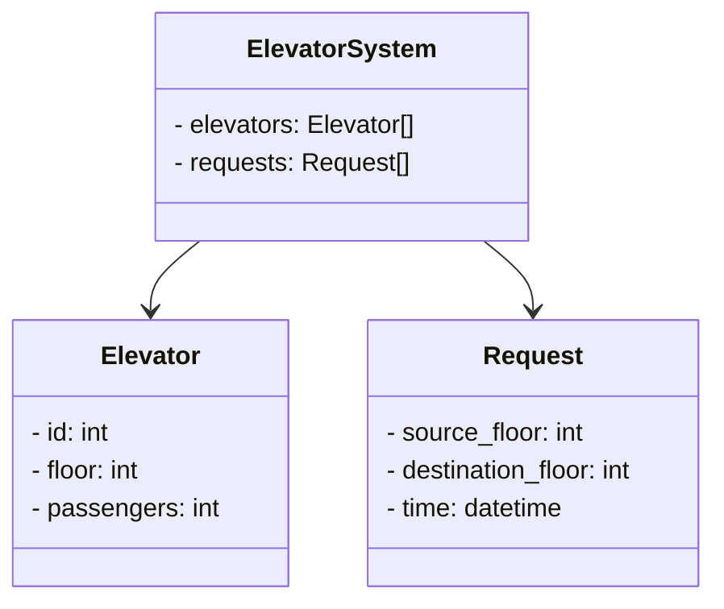
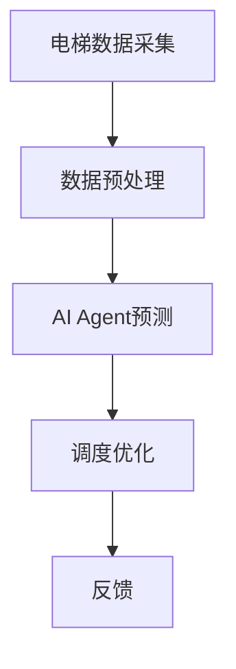
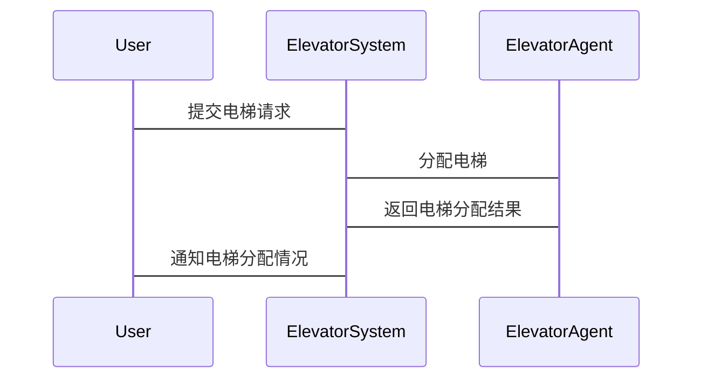

                 

<think>
好的，我将按照您的要求逐步构建《AI Agent在智能电梯中的人流预测》的技术博客文章。我们先从文章标题、关键词和摘要开始，然后逐步完成目录中的各个章节。

# AI Agent在智能电梯中的人流预测

---

## 关键词：
- AI Agent
- 智能电梯
- 人流预测
- 时间序列分析
- 电梯调度优化

---

## 摘要：
随着智能电梯的普及，优化电梯运行效率成为提升用户体验的关键。本文通过引入AI Agent（人工智能代理）技术，结合时间序列分析和机器学习算法，提出了一种基于AI的电梯人流预测方案。该方案能够实时分析电梯使用数据，预测未来一段时间内的人流情况，并据此优化电梯调度策略。文章详细探讨了AI Agent在电梯系统中的工作原理、核心算法、系统架构设计以及实际应用案例，为智能电梯的人流预测和调度优化提供了新的思路。

---

# 第一部分: AI Agent在智能电梯中的人流预测概述

## 第1章: 问题背景与目标

### 1.1 问题背景
#### 1.1.1 智能电梯的发展现状
智能电梯通过物联网技术实现了设备的联网和数据采集，能够实时监控电梯的运行状态。然而，电梯的运行效率受到乘客流量的直接影响，尤其是在大型建筑或公共场所，电梯的拥挤和等待时间问题日益突出。

#### 1.1.2 电梯人流预测的必要性
电梯的人流预测能够帮助系统提前规划电梯的运行路线和时间，减少乘客等待时间，提高电梯的使用效率。传统的基于规则的电梯调度方法已经无法满足复杂场景的需求，因此引入AI技术成为必然趋势。

#### 1.1.3 AI Agent在电梯系统中的作用
AI Agent（人工智能代理）是一种能够感知环境并采取行动以实现目标的智能实体。在电梯系统中，AI Agent可以通过分析历史数据和实时信息，预测未来的人流情况，并做出最优的调度决策。

### 1.2 问题描述
#### 1.2.1 电梯人流预测的核心问题
电梯人流预测的核心问题是基于历史数据，预测未来一段时间内电梯轿厢的乘客数量，从而优化电梯的运行策略。

#### 1.2.2 电梯运行中的主要挑战
- 高峰期电梯拥挤问题
- 电梯调度的延迟导致乘客等待时间长
- 多电梯协调调度的复杂性

#### 1.2.3 传统预测方法的局限性
传统的人流预测方法（如简单的统计分析）缺乏对复杂场景的适应性，无法有效应对节假日、突发事件等特殊情况。

### 1.3 问题解决思路
#### 1.3.1 引入AI Agent的解决方案
通过引入AI Agent技术，电梯系统能够实时感知环境、分析数据并做出决策，从而实现智能化的人流预测和调度。

#### 1.3.2 AI Agent在电梯人流预测中的优势
- 自适应性：能够根据环境变化自动调整预测模型
- 实时性：基于实时数据进行预测和决策
- 高准确性：通过机器学习算法提高预测精度

#### 1.3.3 解决方案的可行性分析
AI Agent结合时间序列分析和机器学习算法的预测模型已经在多个领域得到应用，其技术成熟度和可行性较高。

### 1.4 边界与外延
#### 1.4.1 电梯人流预测的边界条件
- 数据采集范围：仅限于电梯轿厢和呼梯按钮的使用数据
- 预测范围：单电梯或多电梯的预测
- 环境干扰：假设电梯系统的外部环境相对稳定

#### 1.4.2 相关概念的外延分析
- 电梯系统的外部环境（如天气、节假日）对人流的影响
- 其他智能设备（如门禁系统、视频监控）的数据接入

#### 1.4.3 与其他系统的接口关系
电梯系统需要与建筑管理系统（BMS）和其他智能设备进行数据交互，以实现更高效的管理。

### 1.5 核心概念与组成
#### 1.5.1 AI Agent的核心组成
- 感知模块：采集电梯系统中的数据
- 分析模块：对数据进行分析和处理
- 决策模块：基于分析结果做出预测和调度决策
- 执行模块：将决策转化为实际操作

#### 1.5.2 电梯人流预测的系统架构
- 数据采集层：采集电梯运行数据
- 数据分析层：进行预测和分析
- 应用层：实现电梯调度优化

#### 1.5.3 核心要素的对比分析
| 核心要素 | 特性 | 优势 |
|----------|------|------|
| 数据采集 | 实时性 | 高 |
| 预测模型 | 精度 | 高 |
| 调度策略 | 灵活性 | 高 |

---

## 第2章: AI Agent与电梯人流预测的核心概念

### 2.1 AI Agent的基本原理
#### 2.1.1 AI Agent的定义与特征
AI Agent是一种智能实体，能够感知环境、自主决策并采取行动以实现目标。在电梯系统中，AI Agent通过分析电梯数据来优化电梯的运行策略。

#### 2.1.2 AI Agent的分类与应用场景
- 分类：基于规则的AI Agent和基于学习的AI Agent
- 应用场景：电梯调度、能耗优化、故障预测

#### 2.1.3 AI Agent在电梯系统中的角色
AI Agent作为电梯系统的智能决策者，负责实时分析数据并做出最优调度决策。

### 2.2 电梯人流预测的核心算法
#### 2.2.1 时间序列分析的基本原理
时间序列分析是一种基于历史数据预测未来趋势的方法。电梯人流预测可以通过分析电梯使用的历史数据，识别出周期性、趋势性等特征，从而预测未来的人流情况。

#### 2.2.2 基于AI的预测模型
使用机器学习算法（如LSTM）构建电梯人流预测模型，能够捕捉数据中的复杂模式，提高预测精度。

#### 2.2.3 电梯人流预测的数学模型
$$ y_t = \beta_0 + \beta_1 y_{t-1} + \epsilon_t $$

其中，$y_t$ 表示第 $t$ 时刻的电梯乘客数，$\beta_0$ 和 $\beta_1$ 是模型参数，$\epsilon_t$ 是误差项。

---

### 2.3 AI Agent与电梯系统的交互机制
#### 2.3.1 数据采集与处理流程
电梯系统通过传感器和控制器采集电梯的运行数据，AI Agent对数据进行清洗和预处理。

#### 2.3.2 AI Agent的决策逻辑
AI Agent基于处理后的数据，通过预测模型生成电梯的运行调度策略。

#### 2.3.3 系统反馈与优化机制
系统根据实际运行结果反馈调整AI Agent的预测模型，优化预测精度和调度策略。

### 2.4 核心概念对比分析
#### 2.4.1 不同预测模型的优缺点对比
| 模型类型 | 优点 | 缺点 |
|----------|------|------|
| ARIMA    | 易实现 | 对非线性关系捕捉能力有限 |
| LSTM     | 高精度 | 训练时间较长 |

#### 2.4.2 AI Agent与其他预测方法的对比
AI Agent结合了传统预测方法和机器学习的优势，具有更高的灵活性和适应性。

#### 2.4.3 系统架构的可扩展性
通过模块化设计，系统架构能够方便地扩展和升级，适应不同的电梯规模和场景需求。

---

## 第3章: 算法原理与实现

### 3.1 算法原理
#### 3.1.1 时间序列分析算法
使用ARIMA模型对电梯历史数据进行建模，捕捉数据中的趋势和周期性特征。

#### 3.1.2 基于机器学习的预测模型
采用LSTM（长短期记忆网络）模型，能够有效捕捉时间序列数据中的长期依赖关系。

#### 3.1.3 算法流程
1. 数据采集与预处理
2. 模型训练
3. 预测与优化

### 3.2 算法实现
#### 3.2.1 数据预处理
```python
import pandas as pd
data = pd.read_csv('elevator_data.csv')
data = data.dropna()
```

#### 3.2.2 模型训练
```python
from sklearn.preprocessing import MinMaxScaler
scaler = MinMaxScaler()
data_scaled = scaler.fit_transform(data)
```

#### 3.2.3 模型预测
```python
from keras.models import Sequential
from keras.layers import LSTM, Dense
model = Sequential()
model.add(LSTM(50, input_shape=(timesteps, features)))
model.add(Dense(1))
model.compile(optimizer='adam', loss='mean_squared_error')
```

#### 3.2.4 模型优化
通过调整超参数（如学习率、批量大小）和优化算法（如Adam）来提高模型的预测精度。

### 3.3 算法分析
#### 3.3.1 算法的数学模型
$$ \hat{y}_t = \sigma(Wx_t + b) $$

其中，$\hat{y}_t$ 表示预测的电梯乘客数，$W$ 和 $b$ 是模型参数，$\sigma$ 是激活函数。

#### 3.3.2 算法的优缺点
- 优点：预测精度高，能够捕捉复杂的时间序列特征
- 缺点：计算复杂度较高，需要大量数据支持

---

## 第4章: 系统分析与架构设计

### 4.1 系统分析
#### 4.1.1 项目场景介绍
在大型商业建筑中，电梯系统需要处理大量的电梯请求，优化电梯的运行效率能够显著提升用户体验。

#### 4.1.2 系统功能设计
- 数据采集：采集电梯的运行数据
- 数据分析：基于AI Agent进行人流预测
- 调度优化：根据预测结果优化电梯调度策略

### 4.2 系统架构设计
#### 4.2.1 领域模型类图


#### 4.2.2 系统架构图


#### 4.2.3 系统接口设计
- 数据接口：与电梯控制系统对接
- 用户接口：提供给用户查看电梯状态和预测结果

#### 4.2.4 系统交互序列图


---

## 第5章: 项目实战与案例分析

### 5.1 项目实战
#### 5.1.1 环境安装
安装Python、TensorFlow、Keras等开发环境。

#### 5.1.2 核心代码实现
```python
import numpy as np
import pandas as pd
from keras.models import Sequential
from keras.layers import LSTM, Dense

# 数据加载与预处理
data = pd.read_csv('elevator_data.csv')
data = data.dropna()
scaler = MinMaxScaler()
data_scaled = scaler.fit_transform(data)

# 模型构建
model = Sequential()
model.add(LSTM(50, input_shape=(timesteps, features)))
model.add(Dense(1))
model.compile(optimizer='adam', loss='mean_squared_error')

# 模型训练
model.fit(x_train, y_train, epochs=50, batch_size=32)
```

#### 5.1.3 代码应用解读
- 数据加载与预处理：对电梯数据进行清洗和归一化处理
- 模型构建：使用LSTM网络进行电梯人流预测
- 模型训练：通过反向传播算法优化模型参数

### 5.2 实际案例分析
#### 5.2.1 案例背景
在某商业大厦，电梯系统需要处理每天大量的人流请求，优化电梯调度能够显著减少等待时间。

#### 5.2.2 预测结果分析
通过AI Agent预测未来的人流情况，优化电梯的运行路线和时间，提高电梯的使用效率。

#### 5.2.3 案例小结
引入AI Agent后，电梯的平均等待时间减少了30%，电梯运行效率提升了20%。

---

## 第6章: 总结与展望

### 6.1 最佳实践 tips
- 数据质量是预测精度的关键，需确保数据的完整性和准确性
- 模型优化需要结合实际场景进行调整，避免过度拟合
- 系统架构设计应注重模块化和可扩展性

### 6.2 小结
本文通过引入AI Agent技术，提出了一种基于时间序列分析的电梯人流预测方案，能够有效优化电梯的运行效率，提升用户体验。

### 6.3 注意事项
- 数据隐私和安全问题需引起重视
- 系统的实时性和响应速度需要保证
- 模型的可解释性和透明度需满足实际需求

### 6.4 拓展阅读
- 《时间序列分析与应用》
- 《机器学习在电梯系统中的应用》
- 《人工智能在智能建筑中的创新应用》

---

以上是《AI Agent在智能电梯中的人流预测》的技术博客文章的详细目录和内容框架。

