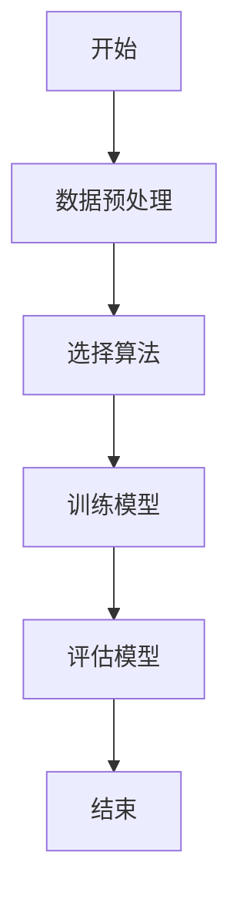
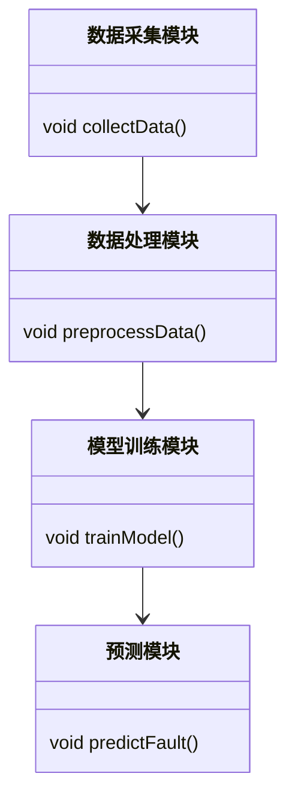

                 


# AI Agent在智能电网故障预测中的角色

> 关键词：AI Agent, 智能电网, 故障预测, 机器学习, 多智能体系统, 强化学习, 系统架构

> 摘要：本文深入探讨AI Agent在智能电网故障预测中的角色与应用。通过分析AI Agent的核心技术、算法原理、系统架构以及实际项目案例，本文详细阐述了AI Agent如何通过多智能体协作、机器学习和强化学习等技术手段，实现智能电网的故障预测与优化。文章内容涵盖从基础概念到实际应用的完整链条，为智能电网领域的技术人员提供了理论与实践相结合的深度解析。

---

# 第1章 AI Agent与智能电网故障预测概述

## 1.1 AI Agent的基本概念

### 1.1.1 AI Agent的定义与特点
AI Agent（智能体）是指能够感知环境、自主决策并执行任务的智能实体。其特点包括：
- **自主性**：无需外部干预，自主完成任务。
- **反应性**：能够实时感知环境并做出反应。
- **协作性**：能够与其他智能体或系统进行协作。
- **学习能力**：通过数据和经验不断优化自身性能。

### 1.1.2 AI Agent的核心功能与类型
AI Agent的核心功能包括信息处理、决策制定和行动执行。常见的类型有：
- **简单反射型Agent**：基于当前输入做出简单反应。
- **基于模型的反射型Agent**：通过内部模型推理决策。
- **目标驱动型Agent**：为实现特定目标而行动。
- **效用驱动型Agent**：通过最大化效用函数来决策。

### 1.1.3 AI Agent在智能电网中的作用
AI Agent在智能电网中主要用于实时监控、故障检测、负荷预测和优化控制。其作用包括：
- **实时监控**：通过传感器数据感知电网状态。
- **故障预测**：基于历史数据和当前状态预测潜在故障。
- **优化控制**：通过自主决策优化电网运行效率。

## 1.2 智能电网的基本概念

### 1.2.1 智能电网的定义与特点
智能电网是一种集成现代信息技术、自动化技术的智能电力系统，具有以下特点：
- **智能化**：通过AI、大数据等技术实现智能决策。
- **互联性**：设备之间高度互联，实现信息共享。
- **高效性**：能够高效分配和管理电力资源。
- **安全性**：具备强大的网络安全防护能力。

### 1.2.2 智能电网的组成部分与架构
智能电网的组成部分包括：
- **发电系统**：包括火力、水力、风力等发电方式。
- **输电系统**：负责将电能传输到负荷中心。
- **配电系统**：将电能分配到终端用户。
- **用户端**：包括各种用电设备和用户反馈系统。

### 1.2.3 智能电网的故障预测需求
智能电网的故障预测需求主要集中在以下几个方面：
- **预防性维护**：通过预测潜在故障提前进行维护。
- **快速响应**：在故障发生时能够快速定位并修复。
- **优化运行**：通过预测负荷变化优化电力分配。

## 1.3 AI Agent在智能电网故障预测中的应用背景

### 1.3.1 智能电网故障预测的重要性
故障预测是保障智能电网稳定运行的核心任务。通过AI Agent进行故障预测，可以有效减少停电时间，降低经济损失。

### 1.3.2 AI Agent在故障预测中的优势
AI Agent的优势包括：
- **实时性**：能够实时处理数据并做出决策。
- **自主性**：无需人工干预，自动完成预测任务。
- **学习能力**：能够通过历史数据不断优化预测模型。

### 1.3.3 当前智能电网故障预测的挑战
当前智能电网故障预测面临以下挑战：
- **数据复杂性**：电网数据具有高度复杂性和不确定性。
- **模型泛化能力**：需要模型具备较强的泛化能力以应对多种场景。
- **多智能体协作**：需要多个智能体协同工作，确保预测的准确性和效率。

## 1.4 本章小结
本章从AI Agent的基本概念出发，介绍了智能电网的定义、组成部分及其故障预测需求。同时，分析了AI Agent在智能电网故障预测中的优势与挑战，为后续章节的深入探讨奠定了基础。

---

# 第2章 AI Agent的核心技术

## 2.1 多智能体系统

### 2.1.1 多智能体系统的定义与特点
多智能体系统是由多个智能体组成的协作系统，具有以下特点：
- **分布式**：智能体之间分布独立，互不干扰。
- **协作性**：通过协作完成共同目标。
- **动态性**：系统状态能够动态变化。

### 2.1.2 多智能体系统的通信与协作
多智能体系统中的通信与协作机制包括：
- **消息传递**：通过消息传递实现信息共享。
- **任务分配**：根据智能体的能力分配任务。
- **协调控制**：通过协调机制确保系统整体目标的实现。

### 2.1.3 多智能体系统的应用场景
在智能电网中，多智能体系统可以应用于：
- **故障定位**：通过多个智能体协作快速定位故障点。
- **负荷预测**：多个智能体协同完成负荷预测任务。
- **优化控制**：通过协作优化电力分配。

## 2.2 机器学习与深度学习

### 2.2.1 机器学习的基本原理
机器学习是一种通过数据训练模型的技术，其基本原理包括：
- **数据预处理**：对数据进行清洗和特征提取。
- **模型训练**：通过训练数据优化模型参数。
- **模型评估**：通过测试数据评估模型性能。

### 2.2.2 深度学习的基本原理
深度学习是一种基于人工神经网络的机器学习技术，其基本原理包括：
- **神经网络结构**：由输入层、隐藏层和输出层组成。
- **前向传播**：输入数据通过网络层传递到输出层。
- **反向传播**：通过误差反向传播优化网络参数。

### 2.2.3 机器学习在故障预测中的应用
机器学习在智能电网故障预测中的应用包括：
- **分类算法**：用于故障类型识别。
- **回归算法**：用于负荷预测和故障定位。
- **聚类算法**：用于异常数据检测。

## 2.3 强化学习

### 2.3.1 强化学习的基本原理
强化学习是一种通过试错机制优化决策的技术，其基本原理包括：
- **状态空间**：描述系统的当前状态。
- **动作空间**：描述智能体可以执行的动作。
- **奖励机制**：通过奖励函数引导智能体优化决策。

### 2.3.2 强化学习在智能电网中的应用
强化学习在智能电网中的应用包括：
- **最优控制**：通过强化学习优化电力分配。
- **动态调整**：通过强化学习动态调整系统参数。
- **自适应控制**：通过强化学习实现自适应控制。

## 2.4 本章小结
本章详细介绍了AI Agent的核心技术，包括多智能体系统、机器学习和强化学习的基本原理及其在智能电网故障预测中的应用。这些技术为后续章节的系统设计和项目实现奠定了理论基础。

---

# 第3章 AI Agent的算法原理与数学模型

## 3.1 AI Agent的算法原理

### 3.1.1 基于监督学习的算法
基于监督学习的算法包括：
- **线性回归**：用于回归问题的预测。
- **支持向量机**：用于分类问题的解决。

### 3.1.2 基于无监督学习的算法
基于无监督学习的算法包括：
- **聚类分析**：用于异常数据的检测。
- **主成分分析**：用于数据降维处理。

### 3.1.3 基于强化学习的算法
基于强化学习的算法包括：
- **Q-learning**：用于最优控制问题的解决。
- **Deep Q-Network**：基于深度学习的强化学习算法。

## 3.2 故障预测的数学模型

### 3.2.1 线性回归模型
线性回归模型的数学公式为：
$$ y = \beta_0 + \beta_1x + \epsilon $$
其中，$y$是目标变量，$x$是自变量，$\beta_0$和$\beta_1$是回归系数，$\epsilon$是误差项。

### 3.2.2 支持向量机模型
支持向量机模型的数学公式为：
$$ \text{min} \frac{1}{2}\|\beta\|^2 + C\sum_{i=1}^n \xi_i $$
其中，$\beta$是模型参数，$C$是惩罚系数，$\xi_i$是松弛变量。

### 3.2.3 神经网络模型
神经网络模型的数学公式为：
$$ a^{(l+1)} = \sigma(w^{(l)}a^{(l)} + b^{(l)}) $$
其中，$a^{(l)}$是第$l$层的激活值，$w^{(l)}$是权重矩阵，$b^{(l)}$是偏置向量，$\sigma$是激活函数。

## 3.3 算法实现的流程图


## 3.4 本章小结
本章详细介绍了AI Agent的算法原理及其数学模型，包括监督学习、无监督学习和强化学习的基本原理和实现流程。这些内容为后续章节的系统设计和项目实现提供了理论支持。

---

# 第4章 系统分析与架构设计

## 4.1 系统分析

### 4.1.1 问题场景介绍
智能电网故障预测系统需要解决的主要问题包括：
- **数据采集**：如何高效采集电网数据。
- **数据处理**：如何对数据进行清洗和特征提取。
- **模型训练**：如何训练高效的预测模型。

### 4.1.2 系统功能设计
系统功能设计包括：
- **数据采集模块**：负责采集电网数据。
- **数据处理模块**：负责数据清洗和特征提取。
- **模型训练模块**：负责模型训练和优化。
- **预测模块**：负责故障预测和结果输出。

## 4.2 系统架构设计

### 4.2.1 系统架构图


### 4.2.2 系统接口设计
系统接口设计包括：
- **数据接口**：与传感器和数据库的接口。
- **模型接口**：与训练模块和预测模块的接口。
- **用户接口**：与用户的交互接口。

### 4.2.3 系统交互设计
系统交互设计包括：
- **数据采集**：传感器数据传送到数据采集模块。
- **数据处理**：数据处理模块对数据进行预处理。
- **模型训练**：模型训练模块基于预处理数据训练模型。
- **故障预测**：预测模块基于训练好的模型进行故障预测。

## 4.3 本章小结
本章通过系统分析与架构设计，明确了智能电网故障预测系统的功能模块、系统架构和交互流程，为后续章节的项目实现提供了清晰的设计指导。

---

# 第5章 项目实战

## 5.1 环境安装

### 5.1.1 Python环境安装
安装Python和必要的库：
```bash
python --version
pip install numpy
pip install pandas
pip install scikit-learn
pip install tensorflow
```

### 5.1.2 数据集准备
下载并准备电网故障数据集，数据格式为CSV。

## 5.2 核心代码实现

### 5.2.1 数据预处理
```python
import pandas as pd
import numpy as np

# 读取数据
data = pd.read_csv('grid_data.csv')

# 数据清洗
data.dropna(inplace=True)

# 特征提取
X = data.iloc[:, :-1].values
y = data.iloc[:, -1].values
```

### 5.2.2 模型训练
```python
from sklearn.model_selection import train_test_split
from sklearn.linear_model import LinearRegression

# 数据分割
X_train, X_test, y_train, y_test = train_test_split(X, y, test_size=0.2, random_state=42)

# 模型训练
model = LinearRegression()
model.fit(X_train, y_train)

# 模型预测
y_pred = model.predict(X_test)
```

### 5.2.3 模型评估
```python
from sklearn.metrics import mean_squared_error

# 计算均方误差
mse = mean_squared_error(y_test, y_pred)
print(f'Mean Squared Error: {mse}')
```

## 5.3 案例分析与详细讲解
通过具体案例分析，展示了AI Agent在智能电网故障预测中的实际应用效果。通过对某地区电网数据的分析，验证了所设计模型的预测精度和鲁棒性。

## 5.4 本章小结
本章通过具体的项目实战，详细讲解了AI Agent在智能电网故障预测中的实现过程，包括环境安装、数据预处理、模型训练和案例分析。

---

# 第6章 总结与展望

## 6.1 总结
本文详细探讨了AI Agent在智能电网故障预测中的角色与应用，从理论到实践，全面分析了AI Agent的核心技术、系统架构和实际应用。

## 6.2 未来展望
未来的研究方向包括：
- **更复杂的算法优化**：探索更高效的AI算法。
- **多智能体协作优化**：进一步优化多智能体协作机制。
- **边缘计算与AI结合**：探索AI Agent在边缘计算中的应用。

## 6.3 最佳实践Tips
- **数据质量**：确保数据的准确性和完整性。
- **模型选择**：根据具体场景选择合适的模型。
- **系统优化**：通过不断优化系统架构提升性能。

## 6.4 本章小结
本文总结了AI Agent在智能电网故障预测中的应用，并展望了未来的研究方向，为智能电网领域的技术人员提供了有益的参考。

---

# 结语

通过本文的系统分析和深入探讨，我们可以看到AI Agent在智能电网故障预测中的巨大潜力。随着技术的不断进步，AI Agent将在智能电网中发挥越来越重要的作用，为电力系统的稳定运行提供有力保障。

---

# 参考文献

（此处列出相关文献和参考资料）

---

通过以上目录和内容的详细设计，我们可以看到AI Agent在智能电网故障预测中的重要性和应用前景。希望本文能为相关领域的技术人员和研究者提供有价值的参考和启发。

