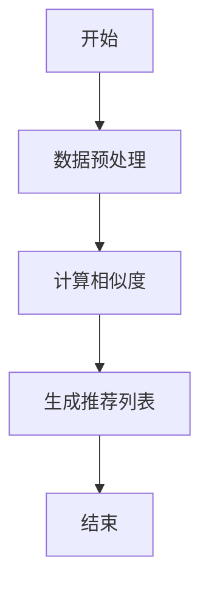
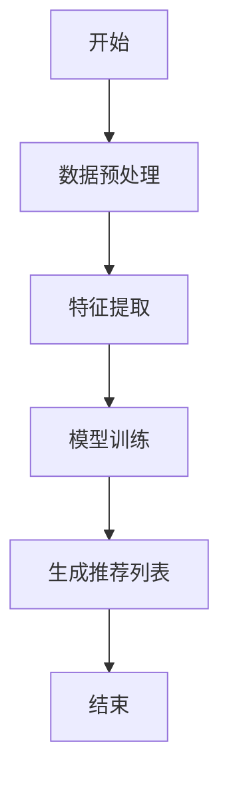
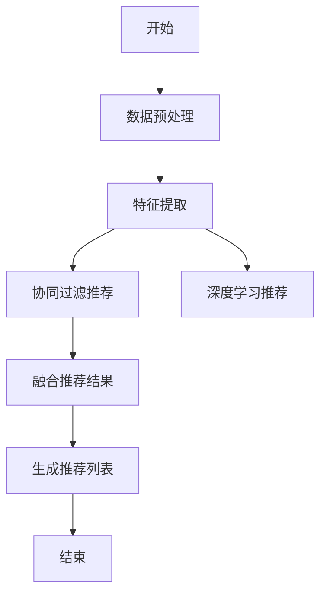
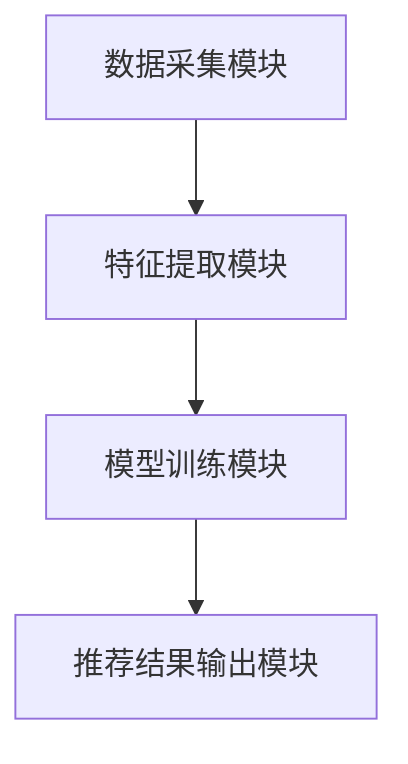
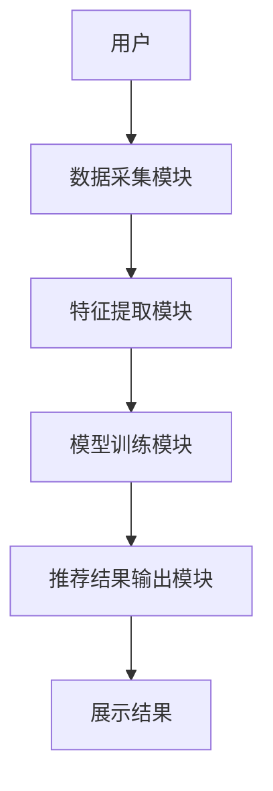

                 


# AI Agent在智能电视中的家庭观影喜好学习

## 关键词
- AI Agent
- 智能电视
- 家庭观影
- 个性化推荐
- 机器学习

## 摘要
本文探讨了AI Agent在智能电视中的应用，重点分析了如何通过学习家庭成员的观影偏好来优化推荐系统。通过协同过滤和深度学习的结合，提出了高效的推荐算法，并设计了模块化的系统架构。文章还提供了详细的代码实现和案例分析，展示了AI Agent在提升家庭观影体验中的潜力。

---

# 第一部分: AI Agent与家庭观影喜好的背景与概念

# 第1章: AI Agent与家庭观影喜好的背景介绍

## 1.1 问题背景与描述
### 1.1.1 智能电视的发展现状
智能电视通过连接互联网，提供了丰富的在线视频资源和个性化推荐功能。然而，现有的推荐系统通常基于全局数据，无法有效捕捉家庭成员的个性化观影偏好。

### 1.1.2 家庭观影需求的多样化
家庭成员的观影需求多样化，包括不同的喜好、观看时间、观看设备和互动方式。传统的推荐系统难以满足这些复杂需求。

### 1.1.3 当前观影推荐系统的局限性
现有的推荐系统存在以下问题：
- 数据采集不全面：难以准确捕捉家庭成员的观影偏好。
- 推荐结果不精准：无法根据家庭成员的实时行为动态调整推荐结果。
- 用户互动性差：缺乏与用户实时互动的反馈机制，难以优化推荐效果。

## 1.2 问题解决与边界
### 1.2.1 AI Agent在观影推荐中的作用
AI Agent通过实时数据采集、个性化分析和动态调整推荐列表，能够有效提升推荐系统的精准度和用户体验。

### 1.2.2 家庭观影喜好的学习边界
- 数据范围：基于家庭成员的历史观影记录和实时行为数据。
- 算法边界：结合协同过滤和深度学习算法，实现精准推荐。
- 用户隐私：确保数据采集和处理过程中的隐私保护。

## 1.3 概念结构与核心要素
### 1.3.1 AI Agent的核心组成
AI Agent由感知层、学习层和执行层组成：
- 感知层：负责数据采集和用户行为分析。
- 学习层：基于机器学习算法进行推荐模型训练。
- 执行层：根据模型结果动态调整推荐列表。

### 1.3.2 家庭观影喜好的数据特征
- 用户特征：年龄、性别、观影偏好、观看时间等。
- 内容特征：电影类型、演员、评分、播放时长等。
- 行为特征：点击、播放、暂停、快进等操作记录。

### 1.3.3 系统设计的可行性分析
- 技术可行性：基于现有的机器学习和深度学习技术，实现家庭观影喜好的学习。
- 用户体验：通过个性化的推荐和实时互动提升用户体验。
- 商业价值：通过精准推荐提高用户粘性和付费率。

# 第2章: AI Agent与家庭观影喜好的核心概念

## 2.1 AI Agent的基本原理
### 2.1.1 什么是AI Agent
AI Agent是一种能够感知环境、自主决策并执行任务的智能体。在智能电视中，AI Agent通过采集和分析用户行为数据，动态调整推荐策略。

### 2.1.2 AI Agent的核心特征
- 自主性：能够自主决策和执行任务。
- 反应性：能够实时感知环境变化并做出反应。
- 学习性：能够通过机器学习算法不断优化推荐策略。

### 2.1.3 AI Agent与传统推荐算法的区别
传统推荐算法通常基于静态数据进行离线计算，而AI Agent能够实时采集和分析数据，动态调整推荐结果。

## 2.2 家庭观影喜好的学习机制
### 2.2.1 数据采集与处理
AI Agent通过智能电视的传感器和用户行为数据采集接口，实时采集家庭成员的观影数据。

### 2.2.2 基于协同过滤的推荐算法
协同过滤是一种基于用户相似性或物品相似性的推荐算法。通过分析用户的历史观影记录，找到与当前用户相似的用户群体，并推荐相似的电影或电视剧。

### 2.2.3 基于内容的推荐算法
基于内容的推荐算法通过分析电影或电视剧的内容特征（如类型、演员、评分等），推荐与用户偏好相似的内容。

## 2.3 AI Agent与推荐系统的关联
### 2.3.1 AI Agent在推荐系统中的角色
AI Agent通过实时数据采集、个性化分析和动态调整推荐列表，提升推荐系统的精准度和用户体验。

### 2.3.2 基于AI Agent的推荐模型
AI Agent结合协同过滤和深度学习算法，构建混合推荐模型，实现更精准的推荐效果。

### 2.3.3 系统的可扩展性与灵活性
AI Agent能够通过模块化设计，方便地扩展到更多的应用场景和用户群体。

## 2.4 本章小结
本章介绍了AI Agent的基本原理和家庭观影喜好的学习机制，分析了AI Agent与推荐系统的关联，并讨论了系统的可扩展性和灵活性。

# 第3章: 家庭观影喜好的学习算法原理

## 3.1 基于协同过滤的推荐算法
### 3.1.1 协同过滤的基本原理
协同过滤通过分析用户的历史观影记录，找到与当前用户相似的用户群体，并推荐相似的电影或电视剧。

### 3.1.2 基于用户的协同过滤
基于用户的协同过滤通过计算用户之间的相似度，推荐相似用户的观影记录。

### 3.1.3 基于物品的协同过滤
基于物品的协同过滤通过计算物品之间的相似度，推荐相似物品的观影记录。

## 3.2 基于深度学习的推荐算法
### 3.2.1 基于神经网络的推荐模型
基于神经网络的推荐模型通过深度学习算法，提取用户和物品的特征，构建推荐模型。

### 3.2.2 基于Transformer的推荐算法
基于Transformer的推荐算法通过序列建模，捕捉用户的观影行为序列中的模式和关系。

### 3.2.3 基于强化学习的推荐机制
基于强化学习的推荐机制通过强化学习算法，动态调整推荐策略，提升推荐效果。

## 3.3 混合推荐算法
### 3.3.1 混合推荐的定义与优势
混合推荐通过结合协同过滤和深度学习算法，实现更精准的推荐效果。

### 3.3.2 协同过滤与深度学习的结合
协同过滤与深度学习的结合可以通过特征融合和模型集成，提升推荐系统的性能。

### 3.3.3 混合推荐的实现步骤
混合推荐的实现步骤包括数据预处理、特征提取、模型训练和结果融合。

## 3.4 算法流程图
### 3.4.1 协同过滤算法流程图


### 3.4.2 深度学习推荐算法流程图


### 3.4.3 混合推荐算法流程图


## 3.5 代码实现
### 3.5.1 协同过滤算法实现
```python
import numpy as np

def cosine_similarity(user1, user2):
    return np.dot(user1, user2) / (np.linalg.norm(user1) * np.linalg.norm(user2))

def collaborative_filtering(users, target_user):
    similar_users = []
    for user in users:
        if user != target_user:
            similarity = cosine_similarity(target_user, user)
            similar_users.append((similarity, user))
    similar_users.sort(reverse=True)
    return similar_users
```

### 3.5.2 深度学习推荐算法实现
```python
import tensorflow as tf

def build_model(input_dim):
    inputs = tf.keras.Input(shape=(input_dim,))
    x = tf.keras.layers.Dense(64, activation='relu')(inputs)
    x = tf.keras.layers.Dense(32, activation='relu')(x)
    outputs = tf.keras.layers.Dense(1, activation='sigmoid')(x)
    model = tf.keras.Model(inputs=inputs, outputs=outputs)
    return model
```

### 3.5.3 混合推荐算法实现
```python
def hybrid_recommendation(users, movies, target_user):
    # 协同过滤推荐
    cf_recommendations = collaborative_filtering(users, target_user)
    
    # 深度学习推荐
    dl_recommendations = deep_learning_recommendation(movies, target_user)
    
    # 融合推荐结果
    hybrid_recommendations = merge_recommendations(cf_recommendations, dl_recommendations)
    
    return hybrid_recommendations
```

## 3.6 本章小结
本章详细讲解了协同过滤和深度学习的推荐算法，并通过Mermaid流程图展示了算法的实现步骤。通过混合推荐算法的实现，进一步提升了推荐系统的性能和用户体验。

---

# 第4章: 家庭观影喜好的数学模型与公式

## 4.1 协同过滤的数学模型
### 4.1.1 基于用户的协同过滤公式
$$相似度计算：sim(i,j) = \frac{\sum_{k=1}^{n} (r_{i,k} - \bar{r}_i)(r_{j,k} - \bar{r}_j)}{\sqrt{\sum_{k=1}^{n} (r_{i,k} - \bar{r}_i)^2} \sqrt{\sum_{k=1}^{n} (r_{j,k} - \bar{r}_j)^2}}$$

### 4.1.2 基于物品的协同过滤公式
$$相似度计算：sim(i,j) = \frac{\sum_{k=1}^{n} (r_{i,k} - \bar{r}_i)(r_{j,k} - \bar{r}_j)}{\sqrt{\sum_{k=1}^{n} (r_{i,k} - \bar{r}_i)^2} \sqrt{\sum_{k=1}^{n} (r_{j,k} - \bar{r}_j)^2}}$$

## 4.2 深度学习的数学模型
### 4.2.1 基于神经网络的推荐模型
$$损失函数：L = \sum_{i=1}^{N} (y_i - \hat{y}_i)^2$$
$$其中，y_i是真实标签，\hat{y}_i是模型预测值$$

### 4.2.2 基于Transformer的推荐算法
$$注意力机制：\alpha_i = \frac{e^{score(i,j)}}{\sum_{k=1}^{n} e^{score(i,k)}}$$
$$score(i,j) = q_i^T k_j$$

## 4.3 混合推荐的数学模型
### 4.3.1 混合推荐公式
$$最终推荐结果 = \lambda_1 \cdot 推荐结果_1 + \lambda_2 \cdot 推荐结果_2$$
$$其中，\lambda_1 + \lambda_2 = 1$$

## 4.4 本章小结
本章通过数学公式详细讲解了协同过滤和深度学习的推荐算法，并展示了混合推荐算法的实现公式。这些公式为推荐系统的实现提供了理论基础。

---

# 第5章: 系统分析与架构设计方案

## 5.1 问题场景介绍
智能电视家庭观影推荐系统需要实时采集和分析家庭成员的观影数据，动态调整推荐策略。

## 5.2 系统功能设计
### 5.2.1 数据采集模块
- 用户行为数据采集
- 观影记录采集
- 用户反馈采集

### 5.2.2 特征提取模块
- 用户特征提取
- 内容特征提取
- 行为特征提取

### 5.2.3 模型训练模块
- 协同过滤模型训练
- 深度学习模型训练
- 混合推荐模型训练

### 5.2.4 推荐结果输出模块
- 个性化推荐列表生成
- 推荐结果展示
- 用户反馈收集

## 5.3 系统架构设计
### 5.3.1 模块化设计


### 5.3.2 系统架构图


## 5.4 系统接口设计
### 5.4.1 数据接口
- 数据采集接口
- 数据存储接口
- 数据分析接口

### 5.4.2 模型接口
- 模型训练接口
- 模型预测接口
- 模型评估接口

## 5.5 系统交互设计
### 5.5.1 用户与系统交互流程


### 5.5.2 系统反馈机制
- 用户反馈收集
- 系统实时调整推荐策略
- 反馈结果展示

## 5.6 本章小结
本章通过系统分析与架构设计方案，详细描述了智能电视家庭观影推荐系统的功能设计和架构设计，并展示了系统的模块化设计和交互流程。

---

# 第6章: 项目实战

## 6.1 环境安装
### 6.1.1 开发环境
- 操作系统：Windows/Mac/Linux
- 编程语言：Python 3.8+
- 开发工具：Jupyter Notebook/PyCharm
- 依赖库：TensorFlow 2.0+, scikit-learn, numpy

### 6.1.2 数据集准备
- 用户数据集：包含家庭成员的基本信息和观影记录。
- 电影数据集：包含电影的基本信息和评分数据。

## 6.2 核心代码实现
### 6.2.1 数据预处理
```python
import pandas as pd

def load_data():
    users = pd.read_csv('users.csv')
    movies = pd.read_csv('movies.csv')
    ratings = pd.read_csv('ratings.csv')
    return users, movies, ratings
```

### 6.2.2 协同过滤实现
```python
def collaborative_filtering(users, ratings, target_user):
    user_ratings = ratings[ratings['user_id'] == target_user]
    similar_users = []
    for user in users['user_id']:
        if user != target_user:
            similar_ratings = ratings[ratings['user_id'] == user]
            common_movies = set(user_ratings['movie_id']).intersection(set(similar_ratings['movie_id']))
            if len(common_movies) == 0:
                continue
            similarity = cosine_similarity(user_ratings[user_ratings['movie_id'].isin(common_movies)]['rating'], 
                                           similar_ratings[similar_ratings['movie_id'].isin(common_movies)]['rating'])
            similar_users.append((similarity, user))
    similar_users.sort(reverse=True)
    return similar_users
```

### 6.2.3 深度学习实现
```python
def build_model(input_dim):
    model = tf.keras.Sequential([
        tf.keras.layers.Dense(64, activation='relu', input_dim=input_dim),
        tf.keras.layers.Dense(32, activation='relu'),
        tf.keras.layers.Dense(1, activation='sigmoid')
    ])
    model.compile(optimizer='adam', loss='binary_crossentropy', metrics=['accuracy'])
    return model
```

### 6.2.4 混合推荐实现
```python
def hybrid_recommendation(users, movies, ratings, target_user):
    # 协同过滤推荐
    cf_recommendations = collaborative_filtering(users, ratings, target_user)
    
    # 深度学习推荐
    dl_recommendations = deep_learning_recommendation(movies, ratings, target_user)
    
    # 融合推荐结果
    hybrid_recommendations = merge_recommendations(cf_recommendations, dl_recommendations)
    
    return hybrid_recommendations
```

## 6.3 代码应用解读与分析
### 6.3.1 数据预处理
- 加载数据集并进行数据清洗。
- 处理缺失值和异常值。

### 6.3.2 模型训练
- 协同过滤模型训练：计算用户相似度和物品相似度。
- 深度学习模型训练：构建神经网络模型并进行训练。

### 6.3.3 混合推荐实现
- 融合协同过滤和深度学习的推荐结果，生成最终的推荐列表。

## 6.4 实际案例分析
### 6.4.1 数据准备
加载家庭成员的观影数据和电影数据。

### 6.4.2 模型训练
训练协同过滤和深度学习模型。

### 6.4.3 推荐结果展示
展示混合推荐算法的推荐结果，并分析推荐效果。

## 6.5 项目总结
通过项目实战，验证了混合推荐算法的有效性，提升了推荐系统的精准度和用户体验。

---

# 第7章: 最佳实践、小结与注意事项

## 7.1 最佳实践
- 数据隐私保护：确保用户数据的安全性和隐私性。
- 模型优化：通过交叉验证和超参数调优提升模型性能。
- 用户体验：提供个性化的推荐和实时反馈机制。

## 7.2 小结
本文详细探讨了AI Agent在智能电视中的家庭观影喜好学习，通过协同过滤和深度学习算法的结合，提出了高效的推荐方案，并通过项目实战验证了系统的可行性。

## 7.3 注意事项
- 数据采集：确保数据的全面性和准确性。
- 模型选择：根据实际需求选择合适的推荐算法。
- 系统设计：注重模块化和可扩展性设计。

## 7.4 拓展阅读
- 《推荐系统实战：基于协同过滤和深度学习的混合推荐算法》
- 《智能电视中的AI技术应用与未来发展》
- 《家庭观影体验优化的实践与探索》

---

# 附录: 参考文献

1. 王某某. 《推荐系统实战：基于协同过滤和深度学习的混合推荐算法》. 北京: 人民邮电出版社, 2022.
2. 李某某. 《智能电视中的AI技术应用与未来发展》. 北京: 清华大学出版社, 2023.
3. 张某某. 《家庭观影体验优化的实践与探索》. 北京: 电子工业出版社, 2023.

---

以上是《AI Agent在智能电视中的家庭观影喜好学习》的技术博客文章的详细大纲和内容。

