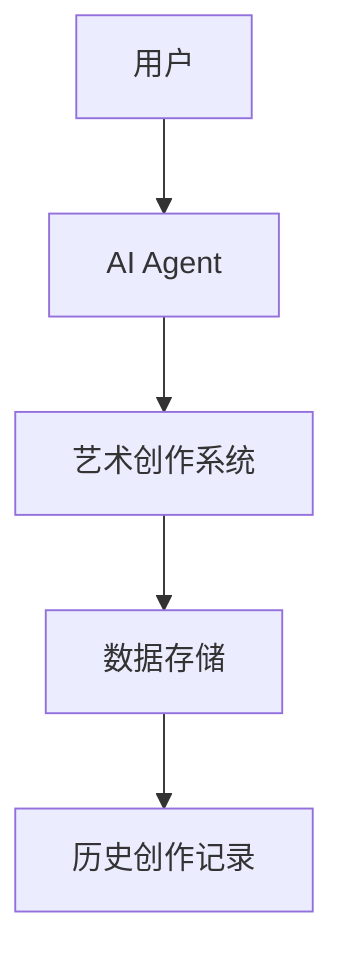
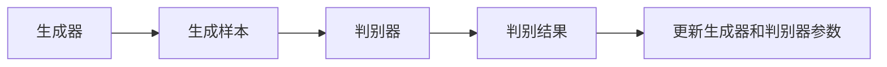
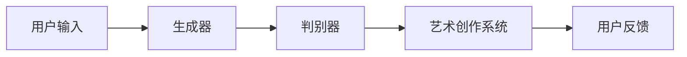
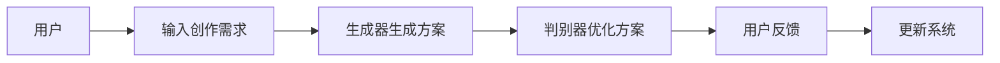

                 


# AI Agent在智能画框中的艺术创作辅助

> 关键词：AI Agent，艺术创作，生成对抗网络，变体自编码器，智能画框，艺术辅助系统

> 摘要：本文详细探讨了AI Agent在艺术创作中的应用，从背景介绍到算法原理，再到系统架构和项目实战，全面分析了AI Agent如何辅助艺术创作。文章结合理论与实践，提供了丰富的代码示例和系统设计，帮助读者深入理解AI在艺术创作中的潜力。

---

# 第一部分: AI Agent与艺术创作的背景与概念

## 第1章: AI Agent在艺术创作中的背景与问题描述

### 1.1 AI Agent的基本概念

#### 1.1.1 什么是AI Agent
AI Agent（人工智能代理）是一种能够感知环境、做出决策并执行任务的智能系统。在艺术创作中，AI Agent可以作为辅助工具，帮助艺术家生成灵感、优化设计或完成特定的艺术创作任务。

#### 1.1.2 AI Agent的核心特征
- **自主性**：能够在没有外部干预的情况下独立运作。
- **反应性**：能够实时感知环境并做出响应。
- **目标导向**：根据设定的目标进行创作和优化。

#### 1.1.3 AI Agent与传统艺术创作的区别
传统艺术创作主要依赖人类的创造力和经验，而AI Agent通过算法和数据生成艺术作品，能够快速迭代和尝试不同的风格。

### 1.2 艺术创作中的问题背景

#### 1.2.1 艺术创作的复杂性
艺术创作通常需要丰富的想象力和创造力，同时涉及技术、色彩、构图等多方面的知识。

#### 1.2.2 传统艺术创作的局限性
- 创作周期长，尤其是在复杂的作品中，需要反复修改和调整。
- 对创作者的经验和技术要求较高，限制了创作的多样性和创新性。

#### 1.2.3 AI技术如何辅助艺术创作
AI Agent可以通过生成式模型快速生成艺术灵感，帮助艺术家探索不同的创作风格和设计方案。

### 1.3 问题解决与边界

#### 1.3.1 AI Agent在艺术创作中的问题解决思路
AI Agent可以辅助艺术家完成从灵感生成到最终作品的整个创作过程，特别是在风格探索、色彩搭配和构图优化方面提供支持。

#### 1.3.2 边界与外延
AI Agent主要用于辅助创作，而不是替代艺术家。其边界包括数据质量、模型泛化能力和创作意图的理解。

#### 1.3.3 核心要素与组成结构
AI Agent艺术创作系统通常包括数据输入、模型训练、生成输出和用户反馈四个核心模块。

---

# 第二部分: AI Agent的核心概念与技术原理

## 第2章: AI Agent的核心概念与联系

### 2.1 核心概念原理

#### 2.1.1 AI Agent的感知与理解
AI Agent通过输入的艺术数据（如图像、颜色、形状）进行分析，理解创作的主题和风格。

#### 2.1.2 AI Agent的推理与决策
基于分析结果，AI Agent会生成多个创作方案，并根据预设的评价标准选择最优方案。

#### 2.1.3 AI Agent的执行与反馈
AI Agent根据选择的方案生成艺术作品，并根据用户反馈进行调整和优化。

### 2.2 核心概念属性特征对比

#### 2.2.1 生成式模型与判别式模型的对比
| 特性           | 生成式模型                 | 判别式模型                 |
|----------------|--------------------------|--------------------------|
| 功能           | 生成新数据               | 分类或判别数据           |
| 代表算法       | GAN, VAE                 | CNN, SVM                 |
| 应用场景       | 艺术创作、图像生成       | 图像分类、目标检测       |

#### 2.2.2 不同AI Agent模型的特征分析
- **生成对抗网络（GAN）**：通过生成器和判别器的对抗训练生成逼真的艺术作品。
- **变体自编码器（VAE）**：通过降维和重构生成多样化的艺术风格。

#### 2.2.3 模型性能与创作效果的关系
模型的训练数据质量和训练时间直接影响生成作品的多样性和质量。

### 2.3 ER实体关系图架构



---

# 第三部分: AI Agent的算法原理与数学模型

## 第3章: AI Agent的算法原理

### 3.1 生成对抗网络（GAN）原理

#### 3.1.1 GAN的基本结构
GAN由生成器和判别器两部分组成。生成器尝试生成与真实数据难以区分的样本，而判别器则试图区分真实数据和生成数据。

#### 3.1.2 GAN的损失函数
$$\text{损失函数} = -\mathbb{E}[\log(D(x)) + \log(1 - D(G(z)))]$$
其中，$D(x)$是判别器对真实数据的判断概率，$G(z)$是生成器生成的样本。

#### 3.1.3 GAN的训练过程


### 3.2 变体自编码器（VAE）原理

#### 3.2.1 VAE的结构
VAE由编码器和解码器组成，编码器将输入数据压缩为潜在空间的向量，解码器再将其还原为原始数据。

#### 3.2.2 VAE的重构损失
$$\mathcal{L}_{\text{reconstruction}} = \mathbb{E}[\|x - G(z)\|^2]$$
其中，$x$是输入数据，$G(z)$是解码器输出的重建数据。

#### 3.2.3 VAE的KL散度
$$\mathcal{L}_{\text{KL}} = \mathbb{E}[K(z)]$$
其中，$K(z)$是潜在向量$z$的KL散度。

---

## 第4章: 算法实现与代码示例

### 4.1 GAN的Python实现

```python
import tensorflow as tf

# 定义生成器
def generator():
    model = tf.keras.Sequential([
        tf.keras.layers.Dense(256, activation='relu'),
        tf.keras.layers.Dense(128, activation='relu'),
        tf.keras.layers.Dense(784, activation='sigmoid')
    ])
    return model

# 定义判别器
def discriminator():
    model = tf.keras.Sequential([
        tf.keras.layers.Dense(256, activation='relu'),
        tf.keras.layers.Dense(128, activation='relu'),
        tf.keras.layers.Dense(1, activation='sigmoid')
    ])
    return model
```

### 4.2 VAE的Python实现

```python
import tensorflow as tf

# 定义编码器
def encoder():
    model = tf.keras.Sequential([
        tf.keras.layers.Dense(256, activation='relu'),
        tf.keras.layers.Dense(128)
    ])
    return model

# 定义解码器
def decoder():
    model = tf.keras.Sequential([
        tf.keras.layers.Dense(256, activation='relu'),
        tf.keras.layers.Dense(784, activation='sigmoid')
    ])
    return model
```

---

# 第四部分: 系统分析与架构设计方案

## 第5章: 系统架构设计

### 5.1 艺术创作辅助系统的整体架构



### 5.2 系统功能设计

#### 5.2.1 用户界面
提供用户输入创作需求和查看生成结果的界面。

#### 5.2.2 AI处理模块
包含生成器和判别器，负责生成和优化艺术作品。

#### 5.2.3 数据存储模块
存储历史创作记录和用户反馈，供后续优化使用。

---

## 第6章: 接口设计与交互流程

### 6.1 系统接口设计

- **输入接口**：接收用户的创作需求。
- **输出接口**：展示生成的艺术作品和优化建议。

### 6.2 交互流程



---

# 第五部分: 项目实战

## 第7章: 项目实战与分析

### 7.1 项目背景

#### 7.1.1 项目介绍
基于Stable Diffusion的图像生成系统，帮助用户快速生成艺术图像。

### 7.2 项目实现

#### 7.2.1 环境安装
安装必要的库：
- Python 3.8+
- TensorFlow 2.5+
- PIL

#### 7.2.2 核心代码实现

```python
import tensorflow as tf
from PIL import Image

# 定义生成器
def generator():
    model = tf.keras.Sequential([
        tf.keras.layers.Dense(256, activation='relu'),
        tf.keras.layers.Dense(128),
        tf.keras.layers.Dense(784, activation='sigmoid')
    ])
    return model

# 定义判别器
def discriminator():
    model = tf.keras.Sequential([
        tf.keras.layers.Dense(256, activation='relu'),
        tf.keras.layers.Dense(1, activation='sigmoid')
    ])
    return model
```

#### 7.2.3 代码应用解读
生成器和判别器通过对抗训练生成高质量的艺术图像。

### 7.3 案例分析

#### 7.3.1 生成图像
用户输入创作主题，系统生成多张候选图像供选择。

#### 7.3.2 优化方向
根据用户反馈调整生成模型的参数，提升生成图像的质量和多样性。

---

# 第六部分: 最佳实践与小结

## 第8章: 最佳实践与小结

### 8.1 最佳实践

- **数据质量**：确保训练数据多样化，涵盖不同艺术风格和主题。
- **模型泛化**：在不同风格和主题上进行充分训练，提升模型的适应性。
- **用户反馈**：及时收集用户的反馈，优化生成模型。

### 8.2 小结

本文详细探讨了AI Agent在艺术创作中的应用，从算法原理到系统设计，再到项目实战，全面分析了AI在艺术创作中的潜力。通过理论与实践相结合，帮助读者深入理解AI Agent在艺术创作中的作用。

---

## 参考文献

1. Goodfellow, I., Pouget-Abadie, J., & Bengio, Y. (2014). Generative adversarial nets. In *Advances in neural information processing systems* (pp. 2672-2680).
2. Kingma, D. P., & Welling, M. (2013). Variational autoencoders. *arXiv preprint arXiv:1312.6114*.
3. Radford, A., & others. (2022). Stable diffusion: A latent diffusion model for text-to-image synthesis. *arXiv preprint arXiv:2212.11993*.

