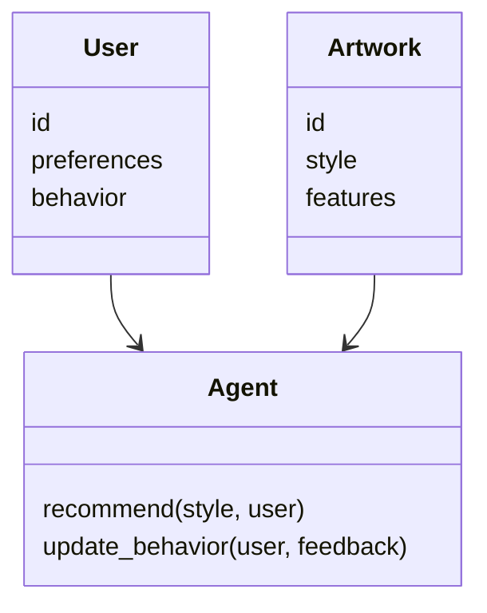
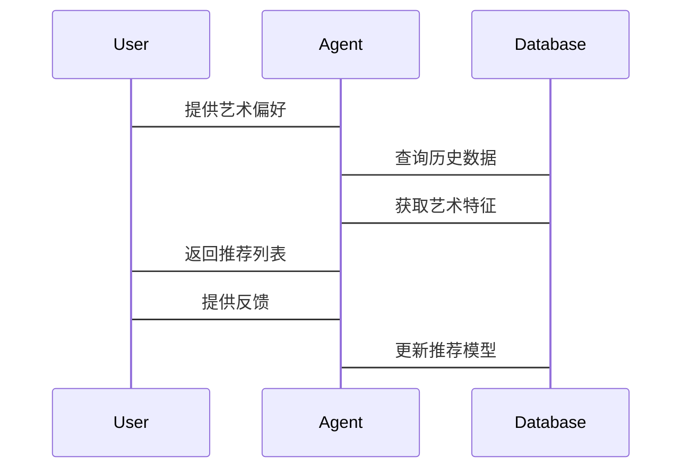

                 


# AI Agent在智能画框中的艺术风格推荐

> 关键词：AI Agent, 艺术风格推荐, 智能画框, 协同过滤, 内容推荐, 混合推荐, 系统架构

> 摘要：本文深入探讨了AI Agent在智能画框中的艺术风格推荐系统，从背景介绍、核心概念、算法原理到系统架构设计，再到项目实战和最佳实践，全面解析了如何利用AI技术实现个性化的艺术风格推荐。

---

# 第一部分: AI Agent与艺术风格推荐的背景介绍

## 第1章: 背景与问题背景

### 1.1 问题背景

#### 1.1.1 AI Agent的定义与核心概念
AI Agent（人工智能代理）是一种能够感知环境、执行任务并做出决策的智能实体。它通过传感器获取信息，利用算法处理数据，并通过执行器与环境交互。AI Agent的核心概念包括：
- **自主性**：能够在没有外部干预的情况下运行。
- **反应性**：能够根据环境变化调整行为。
- **目标导向**：通过设定目标来优化决策。

#### 1.1.2 艺术风格推荐的定义与核心要素
艺术风格推荐是一种基于用户偏好和艺术特征，向用户推荐特定艺术风格的技术。其核心要素包括：
- **用户偏好**：用户的兴趣、历史行为和反馈。
- **艺术特征**：艺术作品的风格、主题和创作背景。
- **推荐算法**：基于协同过滤、内容推荐或混合推荐的算法。

#### 1.1.3 问题的边界与外延
艺术风格推荐的边界在于如何平衡个性化与多样性，避免推荐过于单一的风格。外延则涉及多模态数据（如图像、文本）的融合，以及跨领域的应用。

### 1.2 问题描述与目标
#### 1.2.1 艺术风格推荐的现状与挑战
- **现状**：目前的艺术推荐系统多基于单一模态数据，难以充分捕捉艺术风格的多样性。
- **挑战**：如何在大规模数据中高效地提取艺术特征，并结合用户偏好进行个性化推荐。

#### 1.2.2 AI Agent在艺术风格推荐中的作用
AI Agent可以通过实时感知用户行为、动态调整推荐策略，并结合上下文信息（如时间、地点）来优化推荐结果。

#### 1.2.3 本研究的目标与意义
目标是通过设计一个基于AI Agent的智能画框系统，实现高效、个性化的艺术风格推荐。意义在于提升用户体验，推动AI技术在艺术领域的应用。

### 1.3 本章小结
本章介绍了AI Agent的基本概念及其在艺术风格推荐中的作用，明确了研究的目标和意义。

---

## 第2章: AI Agent与艺术风格推荐的核心概念

### 2.1 AI Agent的核心原理
#### 2.1.1 AI Agent的基本原理
AI Agent通过感知环境、分析数据、制定决策并执行动作来实现目标。其基本流程包括：
1. **感知**：收集环境数据（如用户行为、艺术特征）。
2. **分析**：利用算法处理数据，生成推荐列表。
3. **决策**：根据分析结果选择最优推荐。
4. **执行**：将推荐结果呈现给用户。

#### 2.1.2 AI Agent的分类与特点
AI Agent可以根据智能水平分为**反应式Agent**和**基于模型的Agent**。反应式Agent实时响应环境变化，而基于模型的Agent则依赖内部知识库进行决策。

#### 2.1.3 AI Agent在艺术推荐中的应用
AI Agent可以用于实时调整推荐策略、优化推荐结果并提供个性化用户体验。

### 2.2 艺术风格推荐的核心要素
#### 2.2.1 艺术风格的特征提取
艺术风格的特征提取包括颜色分布、纹理特征、构图方式等。例如，利用深度学习模型提取图像的特征向量。

#### 2.2.2 用户偏好的建模
用户偏好建模包括基于协同过滤的方法（如用户-物品矩阵）和基于内容的推荐（如用户兴趣模型）。

#### 2.2.3 艺术风格与用户偏好的关联
通过构建关联规则（如频繁项集）或使用矩阵分解方法，建立艺术风格与用户偏好的关联。

### 2.3 核心概念的ER实体关系图

```mermaid
er
actor(Agent, User, Artwork)
relation(R1: Agent -> User, R2: Agent -> Artwork, R3: User -> Artwork)
```

### 2.4 本章小结
本章详细阐述了AI Agent的核心原理及其在艺术风格推荐中的应用，并通过ER图展示了核心概念的关系。

---

## 第3章: 艺术风格推荐的算法原理

### 3.1 算法原理概述

#### 3.1.1 基于协同过滤的推荐算法
协同过滤是一种基于用户相似性或物品相似性的推荐方法。其基本公式为：
$$相似度计算公式：sim(i,j) = \frac{\sum_{k} (r_{ik} - \bar{r_i})(r_{jk} - \bar{r_j})}{\sqrt{\sum_{k} (r_{ik} - \bar{r_i})^2} \cdot \sqrt{\sum_{k} (r_{jk} - \bar{r_j})^2}}$$
其中，$r_{ik}$表示用户i对物品k的评分，$\bar{r_i}$表示用户i的平均评分。

#### 3.1.2 基于内容的推荐算法
基于内容的推荐算法通过分析物品的特征来生成推荐。例如，利用文本挖掘技术提取艺术作品的关键词，并计算其相似度。

#### 3.1.3 混合推荐算法
混合推荐算法结合协同过滤和内容推荐的优势，通过加权融合两种方法的结果来提高推荐的准确性和多样性。

### 3.2 AI Agent在推荐系统中的作用

#### 3.2.1 Agent的决策机制
AI Agent通过多目标优化算法（如强化学习）来优化推荐结果，确保推荐的多样性和相关性。

#### 3.2.2 Agent的自适应学习能力
AI Agent能够通过在线学习算法（如在线协同过滤）动态更新推荐模型，适应用户偏好的变化。

#### 3.2.3 Agent的多目标优化
AI Agent可以通过设计多个目标函数（如用户满意度、推荐多样性）来平衡推荐系统的多个目标。

### 3.3 算法实现的数学模型

#### 3.3.1 协同过滤算法的数学模型
协同过滤的数学模型可以表示为：
$$r_{ui} = \bar{r_u} + \bar{r_i} + \sum_{k=1}^{K} w_{uki} \cdot (r_{uk} - \bar{r_u})$$
其中，$r_{ui}$表示用户u对物品i的预测评分，$\bar{r_u}$表示用户u的平均评分，$\bar{r_i}$表示物品i的平均评分，$w_{uki}$表示用户u与物品k的相关性权重。

#### 3.3.2 基于深度学习的推荐模型
基于深度学习的推荐模型（如神经网络协同过滤）通过嵌入层将用户和物品映射到低维空间，并利用非线性变换捕捉复杂的特征关系。

### 3.4 本章小结
本章详细介绍了协同过滤、内容推荐和混合推荐算法的原理，并通过数学模型展示了AI Agent在推荐系统中的优化作用。

---

## 第4章: 艺术风格推荐的系统架构设计

### 4.1 系统分析

#### 4.1.1 问题场景介绍
智能画框系统需要实时处理用户的艺术偏好，并动态调整推荐结果。系统需要支持多模态数据的输入（如图像、文本）和高效的计算能力。

#### 4.1.2 系统功能设计
- 用户画像构建：基于用户行为和偏好生成用户画像。
- 艺术风格识别：通过图像处理技术提取艺术作品的特征。
- 推荐策略优化：结合用户画像和艺术特征生成推荐列表。

### 4.2 系统架构设计

#### 4.2.1 领域模型类图


#### 4.2.2 系统架构图
```mermaid
graph TD
    Agent --> [推荐结果] --> User
    Agent --> [艺术特征] --> Artwork
    Agent --> [用户反馈] --> Database
```

### 4.3 系统接口设计

#### 4.3.1 用户接口
- 输入接口：接收用户的艺术偏好和行为数据。
- 输出接口：呈现推荐的艺术风格列表。

#### 4.3.2 系统交互流程图


### 4.4 本章小结
本章通过系统架构图和交互流程图展示了智能画框系统的整体设计。

---

## 第5章: 项目实战

### 5.1 环境安装

#### 5.1.1 安装Python和相关库
- Python 3.8+
- NumPy、Pandas、Scikit-learn、TensorFlow等。

#### 5.1.2 安装依赖
使用pip安装所需依赖：
```bash
pip install numpy scikit-learn tensorflow
```

### 5.2 系统核心实现

#### 5.2.1 数据预处理代码
```python
import numpy as np
from sklearn.decomposition import NMF

# 假设X为用户-艺术作品评分矩阵
model = NMF(n_components=5, random_state=42)
W = model.fit_transform(X)
H = model.components_
```

#### 5.2.2 推荐算法实现
```python
def recommend(user_id, W, H, top_n=5):
    user_vector = W[user_id]
    similarity = np.dot(user_vector, H.T)
    indices = np.argsort(similarity, axis=0)[::-1][:top_n]
    return indices
```

#### 5.2.3 用户反馈机制
```python
def update_model(user_id, artwork_id, feedback, model):
    # 更新模型参数
    pass
```

### 5.3 案例分析与代码解读

#### 5.3.1 案例分析
以用户A为例，用户A偏好抽象派艺术，系统通过协同过滤算法推荐相似风格的作品。

#### 5.3.2 代码实现
```python
# 示例代码
import numpy as np

X = np.array([[4, 3, 0], [0, 2, 5], [3, 1, 4]])

model = NMF(n_components=2, random_state=42)
W = model.fit_transform(X)
H = model.components_

print("W:", W)
print("H:", H)
```

### 5.4 本章小结
本章通过实际代码实现了一个简单的艺术风格推荐系统，并展示了如何通过用户反馈优化推荐结果。

---

## 第6章: 最佳实践与总结

### 6.1 小结
本文详细探讨了AI Agent在智能画框中的艺术风格推荐系统，从背景介绍、核心概念、算法原理到系统架构设计，再到项目实战，全面解析了如何利用AI技术实现个性化的艺术风格推荐。

### 6.2 注意事项
- 数据质量和多样性直接影响推荐效果。
- 系统设计需要考虑实时性和可扩展性。
- 用户反馈机制是优化推荐结果的关键。

### 6.3 拓展阅读
建议读者进一步阅读以下内容：
- 《推荐系统实战》
- 《深度学习与推荐系统》
- 《人工智能在艺术领域的应用》

### 6.4 本章小结
本章总结了全文的主要内容，并给出了进一步学习和实践的建议。

---

# 结语

通过本文的系统介绍，读者可以深入了解AI Agent在艺术风格推荐中的应用，并掌握从理论到实践的完整流程。未来，随着AI技术的不断发展，艺术风格推荐系统将更加智能化和个性化，为用户带来更好的艺术体验。

