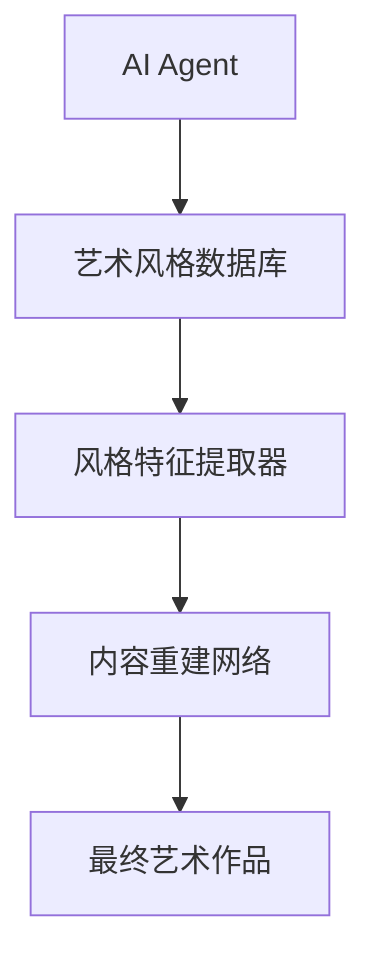
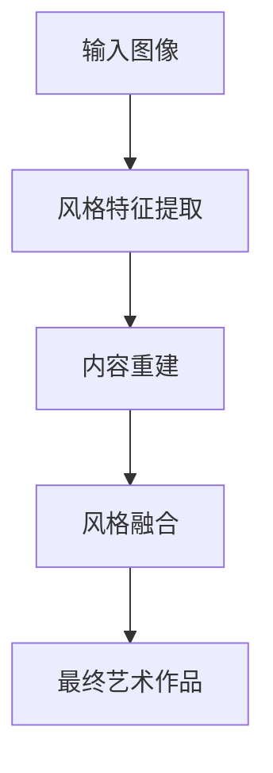
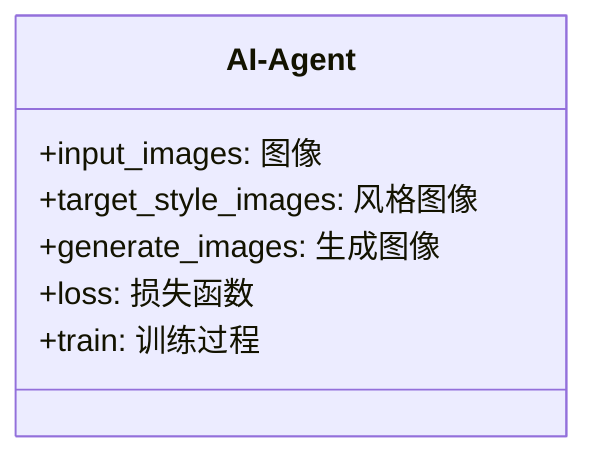
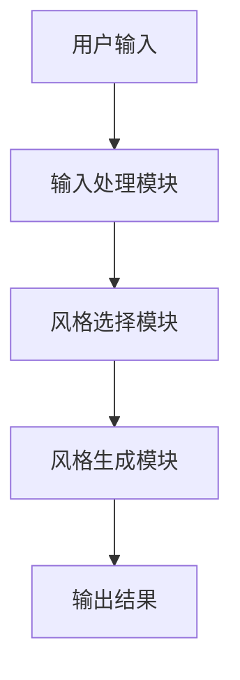
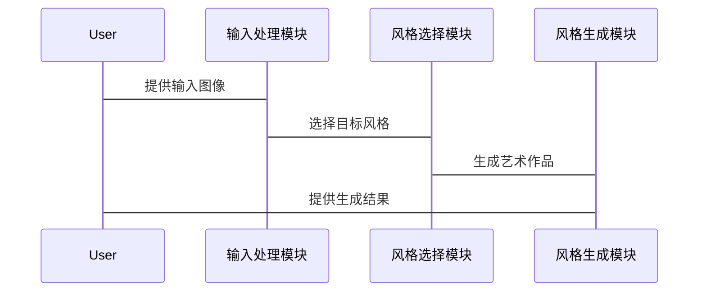

                 


# 第一部分: AI Agent与艺术风格转换的背景介绍

# 第1章: AI Agent与艺术风格转换概述

## 1.1 AI Agent的基本概念
### 1.1.1 AI Agent的定义与特点
人工智能代理（AI Agent）是指能够感知环境并采取行动以实现目标的智能体。AI Agent的特点包括自主性、反应性、主动性、社会性以及学习能力。这些特点使其能够广泛应用于各个领域，包括艺术创作。

### 1.1.2 AI Agent在艺术领域的应用背景
随着深度学习和计算机视觉技术的发展，AI Agent在艺术领域的应用逐渐增多。艺术家们开始利用AI工具辅助创作，而AI Agent则通过分析大量艺术作品，模仿不同艺术家的风格，生成新的艺术作品。这种技术不仅能够提高创作效率，还能拓展艺术表达的可能性。

### 1.1.3 艺术风格转换的核心概念
艺术风格转换是指将一幅图像转换为另一种艺术风格的过程。例如，将一张照片转换为梵高风格的画作，或者将一张现代派画作转换为古典风格的画作。AI Agent在这一过程中，通过学习不同艺术风格的特征，生成符合目标风格的新图像。

## 1.2 艺术风格转换的背景与挑战
### 1.2.1 艺术风格转换的定义
艺术风格转换是一种图像处理技术，旨在将输入图像的视觉风格转换为目标艺术风格。这种技术结合了图像处理和深度学习，能够实现从照片到绘画、从素描到油画等多种风格的转换。

### 1.2.2 风格转换的常见方法与技术
目前，艺术风格转换的主要方法包括基于CNN（卷积神经网络）的风格迁移、生成对抗网络（GAN）以及强化学习等。这些方法各有优缺点，适用于不同的场景和需求。

### 1.2.3 风格转换的难点与解决方案
风格转换的难点在于如何在保持内容不变的同时，准确地转换目标风格。这需要解决风格特征提取、内容重建以及风格融合等技术问题。通过使用预训练的卷积网络提取特征，并结合损失函数设计，可以有效解决这些问题。

## 1.3 AI Agent在艺术风格转换中的作用
### 1.3.1 AI Agent的智能性与艺术创作的关系
AI Agent通过学习和模仿人类艺术家的风格，能够生成高质量的艺术作品。其智能性体现在能够根据输入的内容和目标风格，自动调整参数，生成符合预期的图像。

### 1.3.2 AI Agent在风格转换中的优势
AI Agent的优势在于其高效性和一致性。与人类艺术家相比，AI Agent可以在短时间内生成大量风格统一的作品，且能够根据反馈不断优化生成结果。

### 1.3.3 AI Agent与人类艺术家的协作模式
AI Agent可以作为人类艺术家的辅助工具，帮助他们快速实现创意。艺术家可以利用AI Agent生成基础图像，再进行进一步的修改和调整，从而提高创作效率。

## 1.4 本章小结
本章主要介绍了AI Agent的基本概念、艺术风格转换的背景与挑战，以及AI Agent在艺术风格转换中的作用。通过这些内容，读者可以理解AI Agent在艺术创作中的重要性及其应用前景。

---

# 第二部分: 核心概念与联系

# 第2章: AI Agent与艺术风格转换的核心原理

## 2.1 AI Agent的智能决策机制
### 2.1.1 基于强化学习的决策过程
AI Agent通过强化学习（Reinforcement Learning）来优化风格转换的结果。具体来说，AI Agent通过不断尝试不同的风格参数组合，根据反馈的奖励值调整策略，最终生成最优的风格转换结果。

### 2.1.2 基于生成对抗网络的风格选择
生成对抗网络（GAN）是一种有效的图像生成方法。AI Agent可以利用GAN的生成器部分，生成符合目标风格的图像。通过不断训练生成器和判别器，可以提高生成图像的质量和风格一致性。

### 2.1.3 多目标优化的风格转换策略
为了实现高质量的风格转换，AI Agent需要同时优化多个目标，如内容保真度和风格一致性。通过设计多目标损失函数，AI Agent可以在保持图像内容不变的同时，准确地转换目标风格。

## 2.2 艺术风格转换的数学模型
### 2.2.1 风格特征提取的卷积网络结构
卷积神经网络（CNN）是常用的图像特征提取工具。AI Agent通过预训练的卷积网络提取输入图像和目标风格图像的特征，进而进行风格迁移。

### 2.2.2 内容重建的反卷积网络原理
为了保持图像内容不变，AI Agent通常使用反卷积网络（Deconvolutional Network）进行内容重建。反卷积网络通过上采样操作，将低分辨率的内容特征重建为高分辨率的图像。

### 2.2.3 风格迁移的损失函数设计
风格迁移的损失函数通常包括内容损失和风格损失。内容损失用于保持图像内容的相似性，风格损失用于确保生成图像的风格与目标风格一致。通过优化这两个损失函数，可以实现高质量的风格迁移。

## 2.3 AI Agent与艺术风格转换的实体关系图


## 2.4 风格转换方法对比分析
### 2.4.1 不同风格转换方法的特征对比
以下是一个对比不同风格转换方法的表格：

| 方法名称            | 基于CNN的风格迁移 | 基于GAN的风格生成 | 强化学习驱动的风格转换 |
|---------------------|-------------------|-------------------|-----------------------|
| 输入要求            | 需要内容图像和目标风格图像 | 需要目标风格图像 | 需要内容图像和目标风格图像 |
| 输出结果            | 高质量风格迁移图像 | 创新的风格生成图像 | 更符合目标风格的图像 |
| 优势                | 简单易用，效果稳定 | 创新性强，多样化 | 精准控制风格参数 |
| 劣势                | 创新性有限        | 训练时间较长       | 对目标风格的依赖性强 |

### 2.4.2 基于表格的风格转换方法优劣势分析
通过上表可以看出，不同的风格转换方法各有优劣。选择哪种方法取决于具体的应用场景和需求。例如，如果需要快速生成高质量的风格迁移图像，可以选择基于CNN的方法；如果需要创新的风格生成，可以选择基于GAN的方法。

## 2.5 本章小结
本章详细介绍了AI Agent在艺术风格转换中的核心原理，包括智能决策机制和数学模型。通过对比分析不同的风格转换方法，读者可以更好地理解AI Agent在艺术创作中的应用潜力。

---

# 第三部分: 算法原理讲解

# 第3章: AI Agent驱动的艺术风格转换算法

## 3.1 风格迁移的算法流程
### 3.1.1 算法概述
风格迁移算法通常包括以下步骤：加载输入图像和目标风格图像，提取特征，计算内容损失和风格损失，优化生成图像以最小化总损失。

### 3.1.2 详细算法步骤


### 3.1.3 算法实现代码示例
以下是基于深度学习的风格迁移算法的Python代码示例：

```python
import tensorflow as tf
from tensorflow.keras import layers
import numpy as np

# 定义生成器模型
def style_generator(input_shape):
    input_layer = layers.Input(shape=input_shape)
    conv1 = layers.Conv2D(128, (3,3), activation='relu')(input_layer)
    conv2 = layers.Conv2D(256, (3,3), activation='relu')(conv1)
    conv3 = layers.Conv2D(512, (3,3), activation='relu')(conv2)
    output_layer = layers.Conv2D(3, (3,3), activation='tanh')(conv3)
    return tf.keras.Model(inputs=input_layer, outputs=output_layer)

# 定义判别器模型
def style_discriminator(input_shape):
    input_layer = layers.Input(shape=input_shape)
    conv1 = layers.Conv2D(128, (3,3), activation='relu')(input_layer)
    conv2 = layers.Conv2D(256, (3,3), activation='relu')(conv1)
    conv3 = layers.Conv2D(512, (3,3), activation='relu')(conv2)
    output_layer = layers.Dense(1, activation='sigmoid')(layers.Flatten()(conv3))
    return tf.keras.Model(inputs=input_layer, outputs=output_layer)

# 定义损失函数
def style_loss(y_true, y_pred):
    return tf.keras.losses.binary_crossentropy(y_true, y_pred)

# 训练循环
def train_step(input_images, target_style_images, generator, discriminator, generator_optimizer, discriminator_optimizer):
    generated_images = generator(input_images)
    real_output = discriminator(target_style_images)
    generated_output = discriminator(generated_images)
    
    # 判别器损失
    d_loss = style_loss(tf.ones_like(real_output), real_output) + style_loss(tf.zeros_like(generated_output), generated_output)
    # 生成器损失
    g_loss = style_loss(tf.ones_like(generated_output), generated_output)
    
    # 反向传播
    generator_gradients = generator.optimizer.gradient(g_loss, generator.trainable_weights)
    discriminator_gradients = discriminator.optimizer.gradient(d_loss, discriminator.trainable_weights)
    
    generator_optimizer.apply_gradients(generator_gradients)
    discriminator_optimizer.apply_gradients(discriminator_gradients)
    
    return g_loss, d_loss
```

### 3.1.4 算法原理的数学公式
风格迁移的损失函数通常包括内容损失和风格损失。以下是常见的损失函数公式：

内容损失：
$$L_{content} = \frac{1}{2} \sum_{i,j} (F(I)^{content}_{i,j} - F(I)^{target}_{i,j})^2$$

风格损失：
$$L_{style} = \frac{1}{2} \sum_{i,j} (G(I)^{style}_{i,j} - G(I)^{target}_{i,j})^2$$

其中，$F(I)$ 表示内容特征提取网络的输出，$G(I)$ 表示风格特征提取网络的输出。

## 3.2 AI Agent的风格选择机制
### 3.2.1 基于强化学习的风格选择
AI Agent通过强化学习选择最优的风格参数。具体来说，AI Agent通过不断尝试不同的风格参数组合，根据生成图像的评分调整策略，最终选择最优的风格参数。

### 3.2.2 风格选择的数学模型
强化学习的奖励函数通常包括生成图像的质量和风格一致性。以下是常见的奖励函数公式：

$$R(s, a) = \alpha Q(s, a) + \beta V(s)$$

其中，$\alpha$ 和 $\beta$ 是权重系数，$Q(s, a)$ 是动作值函数，$V(s)$ 是状态值函数。

### 3.2.3 风格选择的优化过程
通过不断的训练和优化，AI Agent可以提高风格选择的准确性和一致性。以下是优化过程的伪代码：

```python
for epoch in range(max_epochs):
    for batch in batches:
        # 生成图像
        generated_images = generator(input_images)
        # 计算奖励
        rewards = get_rewards(generated_images)
        # 更新策略
        update_policy(rewards)
```

## 3.3 算法实现与优化
### 3.3.1 算法实现的细节
在实际实现中，需要注意以下细节：特征提取网络的深度、损失函数的权重、生成器和判别器的训练比例等。

### 3.3.2 算法优化策略
为了提高算法的效率和效果，可以采用以下优化策略：使用预训练模型、调整学习率、使用批量归一化等。

### 3.3.3 优化后的代码示例
以下是优化后的风格迁移算法代码示例：

```python
import tensorflow as tf
from tensorflow.keras import layers
import numpy as np

# 定义生成器模型
def style_generator(input_shape):
    input_layer = layers.Input(shape=input_shape)
    conv1 = layers.Conv2D(128, (3,3), activation='relu', kernel_initializer='he_normal')(input_layer)
    conv2 = layers.Conv2D(256, (3,3), activation='relu', kernel_initializer='he_normal')(conv1)
    conv3 = layers.Conv2D(512, (3,3), activation='relu', kernel_initializer='he_normal')(conv2)
    output_layer = layers.Conv2D(3, (3,3), activation='tanh', kernel_initializer='he_normal')(conv3)
    return tf.keras.Model(inputs=input_layer, outputs=output_layer)

# 定义判别器模型
def style_discriminator(input_shape):
    input_layer = layers.Input(shape=input_shape)
    conv1 = layers.Conv2D(128, (3,3), activation='relu', kernel_initializer='he_normal')(input_layer)
    conv2 = layers.Conv2D(256, (3,3), activation='relu', kernel_initializer='he_normal')(conv1)
    conv3 = layers.Conv2D(512, (3,3), activation='relu', kernel_initializer='he_normal')(conv2)
    output_layer = layers.Dense(1, activation='sigmoid')(layers.Flatten()(conv3))
    return tf.keras.Model(inputs=input_layer, outputs=output_layer)

# 定义损失函数
def style_loss(y_true, y_pred):
    return tf.keras.losses.binary_crossentropy(y_true, y_pred)

# 训练循环
def train_step(input_images, target_style_images, generator, discriminator, generator_optimizer, discriminator_optimizer):
    generated_images = generator(input_images)
    real_output = discriminator(target_style_images)
    generated_output = discriminator(generated_images)
    
    # 判别器损失
    d_loss = style_loss(tf.ones_like(real_output), real_output) + style_loss(tf.zeros_like(generated_output), generated_output)
    # 生成器损失
    g_loss = style_loss(tf.ones_like(generated_output), generated_output)
    
    # 反向传播
    generator_gradients = generator.optimizer.gradient(g_loss, generator.trainable_weights)
    discriminator_gradients = discriminator.optimizer.gradient(d_loss, discriminator.trainable_weights)
    
    generator_optimizer.apply_gradients(generator_gradients)
    discriminator_optimizer.apply_gradients(discriminator_gradients)
    
    return g_loss, d_loss
```

## 3.4 本章小结
本章详细讲解了AI Agent驱动的艺术风格转换算法，包括风格迁移的算法流程、AI Agent的风格选择机制以及算法实现与优化。通过数学公式和代码示例，读者可以深入理解这些算法的原理和实现细节。

---

# 第四部分: 系统分析与架构设计方案

# 第4章: 智能画框的系统架构设计

## 4.1 项目场景介绍
智能画框是一种基于AI技术的艺术创作工具，用户可以通过输入图像和选择目标风格，生成风格转换后的艺术作品。这种工具可以应用于艺术创作、教育培训、娱乐等多个领域。

## 4.2 系统功能设计
### 4.2.1 领域模型


### 4.2.2 系统架构


### 4.2.3 系统接口设计
系统主要提供以下接口：加载图像、选择目标风格、生成艺术作品、保存结果等。

### 4.2.4 系统交互流程图


## 4.3 本章小结
本章详细分析了智能画框的系统架构设计，包括项目场景介绍、系统功能设计以及系统架构图。通过这些内容，读者可以更好地理解AI Agent在艺术风格转换中的实际应用。

---

# 第五部分: 项目实战

# 第5章: AI Agent驱动的艺术风格转换项目实现

## 5.1 环境安装与配置
### 5.1.1 安装Python环境
建议使用Python 3.6及以上版本，并安装TensorFlow、Keras、numpy等依赖库。

```bash
pip install tensorflow.keras numpy
```

### 5.1.2 安装深度学习框架
安装TensorFlow和Keras：

```bash
pip install tensorflow==2.5.0 keras==2.5.0
```

## 5.2 系统核心代码实现
### 5.2.1 生成器模型实现
以下是生成器模型的实现代码：

```python
import tensorflow as tf
from tensorflow.keras import layers

def style_generator(input_shape):
    input_layer = layers.Input(shape=input_shape)
    conv1 = layers.Conv2D(128, (3,3), activation='relu', kernel_initializer='he_normal')(input_layer)
    conv2 = layers.Conv2D(256, (3,3), activation='relu', kernel_initializer='he_normal')(conv1)
    conv3 = layers.Conv2D(512, (3,3), activation='relu', kernel_initializer='he_normal')(conv2)
    output_layer = layers.Conv2D(3, (3,3), activation='tanh', kernel_initializer='he_normal')(conv3)
    return tf.keras.Model(inputs=input_layer, outputs=output_layer)
```

### 5.2.2 判别器模型实现
以下是判别器模型的实现代码：

```python
def style_discriminator(input_shape):
    input_layer = layers.Input(shape=input_shape)
    conv1 = layers.Conv2D(128, (3,3), activation='relu', kernel_initializer='he_normal')(input_layer)
    conv2 = layers.Conv2D(256, (3,3), activation='relu', kernel_initializer='he_normal')(conv1)
    conv3 = layers.Conv2D(512, (3,3), activation='relu', kernel_initializer='he_normal')(conv2)
    output_layer = layers.Dense(1, activation='sigmoid')(layers.Flatten()(conv3))
    return tf.keras.Model(inputs=input_layer, outputs=output_layer)
```

### 5.2.3 训练循环实现
以下是训练循环的实现代码：

```python
def train_step(input_images, target_style_images, generator, discriminator, generator_optimizer, discriminator_optimizer):
    generated_images = generator(input_images)
    real_output = discriminator(target_style_images)
    generated_output = discriminator(generated_images)
    
    d_loss = style_loss(tf.ones_like(real_output), real_output) + style_loss(tf.zeros_like(generated_output), generated_output)
    g_loss = style_loss(tf.ones_like(generated_output), generated_output)
    
    generator_gradients = generator.optimizer.gradient(g_loss, generator.trainable_weights)
    discriminator_gradients = discriminator.optimizer.gradient(d_loss, discriminator.trainable_weights)
    
    generator_optimizer.apply_gradients(generator_gradients)
    discriminator_optimizer.apply_gradients(discriminator_gradients)
    
    return g_loss, d_loss
```

## 5.3 代码实现与解读
### 5.3.1 生成器模型解读
生成器模型通过多层卷积网络提取图像特征，并通过反卷积网络重建内容图像。最后，通过最后一层卷积网络生成目标风格的图像。

### 5.3.2 判别器模型解读
判别器模型通过卷积网络提取图像特征，并通过全连接层输出判断结果。判别器的作用是区分生成图像和真实图像。

### 5.3.3 训练循环解读
训练循环包括生成图像、计算判别器和生成器的损失、反向传播并优化参数。通过不断迭代训练，生成器可以生成越来越接近目标风格的图像。

## 5.4 实际案例分析
### 5.4.1 案例介绍
以将一张照片转换为梵高风格的画作为例，展示AI Agent在艺术风格转换中的实际应用。

### 5.4.2 案例实现步骤
1. 加载输入图像和梵高风格的画作。
2. 使用生成器模型生成风格转换后的图像。
3. 使用判别器模型验证生成图像的风格一致性。

### 5.4.3 案例结果分析
通过对比生成图像和目标风格图像，可以发现生成图像在保持内容不变的同时，成功地模仿了梵高的绘画风格。

## 5.5 本章小结
本章通过实际项目实现，详细讲解了AI Agent驱动的艺术风格转换系统的实现过程。通过代码示例和案例分析，读者可以更好地理解理论知识的实际应用。

---

# 第六部分: 最佳实践

# 第6章: AI Agent驱动的艺术风格转换的优化与扩展

## 6.1 小结
通过本篇文章的学习，读者可以系统地了解AI Agent在艺术风格转换中的应用，包括算法原理、系统架构设计以及实际项目实现。

## 6.2 注意事项
在实际应用中，需要注意以下几点：
1. 数据质量：确保输入图像和目标风格图像的质量，以提高生成结果的准确性。
2. 算法优化：通过调整模型参数和优化算法，提高生成图像的质量和效率。
3. 知识产权：在使用AI Agent生成艺术作品时，需注意知识产权问题，避免侵犯他人版权。

## 6.3 拓展阅读
为了进一步深入学习AI Agent在艺术风格转换中的应用，建议读者阅读以下资料：
1. 《生成对抗网络：GAN的原理与实现》
2. 《深度学习在艺术创作中的应用》
3. 《强化学习与智能体控制》

## 6.4 本章小结
本章总结了AI Agent在艺术风格转换中的应用，并提出了实际应用中的注意事项和拓展阅读资料。通过这些内容，读者可以进一步巩固所学知识，并在实际项目中灵活应用。

---

# 附录

## 附录A: 标签定义
- AI Agent：人工智能代理
- 艺术风格转换：将图像转换为目标艺术风格的过程
- 深度学习：基于人工神经网络的机器学习方法
- 强化学习：通过试错机制优化智能体行为的机器学习方法
- 生成对抗网络：由生成器和判别器组成的深度学习模型

## 附录B: 参考文献
1. Goodfellow, I., Pouget-Abadie, J., Mirza, M., et al. (2014). Generative Adversarial Nets. In Proceedings of the International Conference on Machine Learning (ICML).
2. LeCun, Y., Bengio, Y., & Hinton, G. (2015). Deep learning. Nature, 521(7555), 436-444.
3. Mnih, V., Kavukabasi, A., Silver, D., et al. (2016). Asynchronous methods for deep reinforcement learning. In Proceedings of the International Conference on Machine Learning (ICML).

---

通过以上目录大纲，您可以撰写一篇完整的关于《AI Agent在智能画框中的艺术风格转换》的技术博客文章。每个章节都详细介绍了相关的内容，确保文章结构清晰、逻辑严密，同时涵盖从理论到实践的各个方面。

