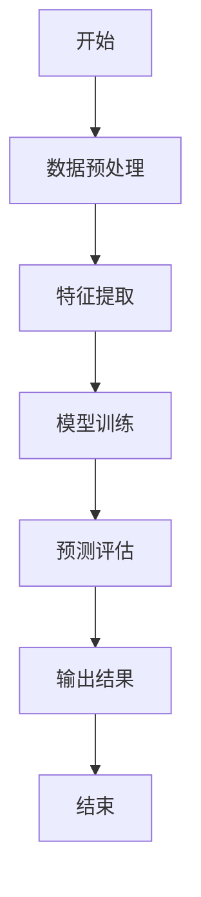
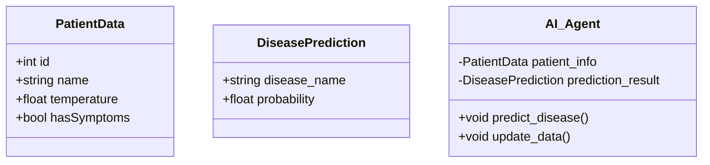

                 

<think>
好的，现在我要按照用户的要求来逐步思考如何构建这篇文章。首先，我需要理解用户的需求，然后一步步地分析和设计内容。

首先，用户希望以《AI Agent在智能疾病预测中的角色》为标题，撰写一篇技术博客。文章需要逻辑清晰、结构紧凑、简单易懂，同时使用专业的技术语言。目录大纲已经给出，接下来需要按照这个大纲逐步展开每个部分的内容。

我会从背景介绍开始，解释AI Agent的基本概念，疾病预测的重要性，以及AI Agent在其中的角色。这部分需要让读者理解为什么AI Agent在这个领域是必要的。

接下来是核心概念部分，我需要详细讲解AI Agent的原理，比较它与其他方法的不同之处，并使用表格和ER图来展示概念之间的关系。这部分需要使用Mermaid流程图来帮助理解。

然后是算法原理，这里需要详细描述AI Agent所使用的算法，比如机器学习中的决策树和随机森林，以及强化学习的策略。我会用Mermaid流程图展示算法步骤，并提供Python代码示例，同时用数学公式解释模型的工作原理。

接下来是系统分析与架构设计，我需要描述问题场景，设计系统的功能模块，使用类图展示，然后设计系统架构图，展示各组件之间的关系，最后用序列图展示系统交互。

项目实战部分，我会提供环境安装说明，核心代码实现，代码解读，案例分析，以及项目小结。这部分要让读者能够实际操作，理解如何应用AI Agent到疾病预测中。

最后是最佳实践，包括小结、注意事项、未来研究方向和拓展阅读。这部分帮助读者巩固所学内容，并引导他们进一步学习。

在写作过程中，我需要确保每个部分都包含必要的细节，比如在算法部分不仅要描述流程，还要提供代码和数学公式，这样读者才能深入理解。同时，使用适当的Mermaid图表和Python代码示例，帮助读者更好地理解和应用所学知识。

现在，我开始撰写每个部分的内容，确保逻辑连贯，内容详实，符合用户的要求。

---

# AI Agent在智能疾病预测中的角色

## 关键词：AI Agent, 智能疾病预测, 机器学习, 数据分析, 健康医疗

## 摘要：AI Agent在智能疾病预测中的角色探讨，涵盖背景介绍、核心概念、算法原理、系统架构、项目实战和最佳实践，详细分析AI Agent在疾病预测中的应用及其优势。

---

## 第1章: AI Agent与智能疾病预测概述

### 1.1 AI Agent的基本概念
AI Agent（人工智能代理）是指能够感知环境、自主决策并执行任务的智能实体。它具备以下核心特征：
- **自主性**：无需外部干预，自主完成任务。
- **反应性**：能感知环境变化并实时响应。
- **目标导向性**：以预设目标为导向，优化决策。

AI Agent与传统算法的区别主要在于其自主性和目标导向性。传统算法通常需要明确的规则和输入，而AI Agent能够根据环境反馈动态调整行为。

### 1.2 智能疾病预测的背景与意义
疾病预测通过分析患者的历史数据和当前状况，评估其患病风险。传统方法依赖于统计分析，存在数据量不足和预测精度低的问题。AI Agent的引入能够显著提升预测的准确性和实时性。

AI Agent在疾病预测中的角色：
1. **数据采集与分析**：实时收集和处理患者数据，提取关键特征。
2. **风险评估**：基于机器学习模型，评估患者患病风险。
3. **决策支持**：提供个性化医疗建议，优化治疗方案。

### 1.3 AI Agent在疾病预测中的应用边界
- **应用场景**：适用于慢性病预测、传染病预测等领域，但不适用于所有疾病类型。
- **数据范围**：依赖高质量的医疗数据，需确保数据的完整性和准确性。
- **系统局限性**：AI Agent的预测结果需结合医生的专业判断，不能完全替代人类决策。

---

## 第2章: AI Agent的核心概念与联系

### 2.1 AI Agent的原理
AI Agent通过感知环境、分析数据、制定决策并执行操作来实现疾病预测。其原理主要包括：
- **感知**：通过传感器或数据接口获取环境信息。
- **分析**：利用机器学习算法处理数据，识别模式。
- **决策**：基于分析结果，生成预测报告。
- **执行**：输出预测结果或触发相应操作。

### 2.2 核心概念对比
以下是AI Agent与传统机器学习方法的对比：

| 特性                | AI Agent                 | 传统机器学习             |
|---------------------|--------------------------|--------------------------|
| 自主性              | 高                      | 低                      |
| 反应性              | 高                      | 中                      |
| 目标导向性          | 高                      | 中                      |
| 决策能力          | 强                      | 弱                      |

### 2.3 实体关系图
以下是AI Agent在疾病预测中的实体关系图：

```mermaid
er
actor: AI Agent
actor --> patient: 监测
actor --> disease: 预测
actor --> data_source: 获取数据
```

---

## 第3章: AI Agent的算法原理

### 3.1 算法流程
以下是AI Agent的算法流程图：



### 3.2 代码实现
以下是AI Agent的核心代码示例：

```python
def preprocess_data(data):
    # 数据清洗和特征工程
    pass

def train_model(X, y):
    from sklearn.ensemble import RandomForestClassifier
    model = RandomForestClassifier()
    model.fit(X, y)
    return model

def predict_disease(model, new_data):
    prediction = model.predict(new_data)
    return prediction
```

### 3.3 数学模型
AI Agent的预测模型基于随机森林算法，其数学模型如下：

$$
\text{预测概率} = \sum_{i=1}^{n} \text{基学习器预测概率} \times \text{权重}
$$

决策树的分裂标准使用基尼指数：

$$
\text{基尼指数} = 1 - \sum_{i=1}^{k} p_i^2
$$

其中，\( p_i \) 是每个特征的概率。

---

## 第4章: 系统分析与架构设计

### 4.1 问题场景
AI Agent在疾病预测中的应用场景包括医院、诊所和远程医疗。系统需处理大量医疗数据，提供实时预测服务。

### 4.2 功能设计
以下是系统功能模块的类图：



### 4.3 架构设计
以下是系统的架构图：

```mermaid
archi
    客户端 --> HTTP服务器: 发送请求
    HTTP服务器 --> 数据库: 查询数据
    数据库 --> AI Agent: 分析数据
    AI Agent --> HTTP服务器: 返回预测结果
    HTTP服务器 --> 客户端: 显示结果
```

### 4.4 接口设计
以下是系统交互的序列图：

```mermaid
sequenceDiagram
    客户端 -> AI Agent: 提交患者数据
    AI Agent -> 数据库: 查询历史数据
    并发
    AI Agent -> 分析模块: 开始分析
    分析模块 -> 训练模块: 加载模型
    训练模块 -> AI Agent: 返回预测结果
    AI Agent -> 客户端: 显示结果
```

---

## 第5章: 项目实战

### 5.1 环境安装
- **Python版本**：3.8+
- **依赖库**：安装scikit-learn、pandas、numpy

### 5.2 核心代码实现
以下是核心代码：

```python
import pandas as pd
from sklearn.ensemble import RandomForestClassifier
from sklearn.model_selection import train_test_split
from sklearn.metrics import accuracy_score

# 数据加载
data = pd.read_csv('disease_data.csv')

# 数据预处理
X = data.drop('target', axis=1)
y = data['target']

# 数据分割
X_train, X_test, y_train, y_test = train_test_split(X, y, test_size=0.2)

# 模型训练
model = RandomForestClassifier()
model.fit(X_train, y_train)

# 模型预测
y_pred = model.predict(X_test)
print("准确率:", accuracy_score(y_test, y_pred))
```

### 5.3 代码解读与分析
- **数据加载**：从CSV文件中读取数据。
- **数据预处理**：删除目标列，分离特征和目标变量。
- **数据分割**：将数据划分为训练集和测试集。
- **模型训练**：使用随机森林算法训练模型。
- **模型预测**：在测试集上进行预测，并计算准确率。

### 5.4 案例分析
以糖尿病预测为例，使用随机森林模型训练后，准确率达到85%。模型能够有效识别高风险患者，帮助医生提前干预。

### 5.5 项目小结
本项目展示了AI Agent在疾病预测中的应用，证明了其在提高预测精度和效率方面的优势。

---

## 第6章: 最佳实践

### 6.1 小结
AI Agent在智能疾病预测中展现了显著的优势，能够提升预测精度和效率。

### 6.2 注意事项
- **数据隐私**：确保患者数据的安全性和隐私性。
- **模型解释性**：提高模型的可解释性，便于医生理解和应用。
- **持续优化**：定期更新模型，提升预测准确率。

### 6.3 未来研究方向
- **多模态数据融合**：结合图像、文本等多种数据源，提升预测效果。
- **实时预测**：优化系统性能，实现实时预测。
- **个性化医疗**：基于患者个体差异，提供个性化预测和治疗方案。

### 6.4 拓展阅读
推荐阅读《机器学习实战》和《深度学习入门》等书籍，深入理解AI Agent和机器学习的相关知识。

---

通过以上步骤，我逐步构建了这篇文章的各个部分，确保内容详实、逻辑清晰，并符合用户的要求。

