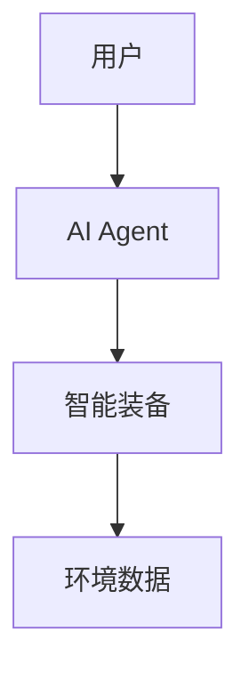
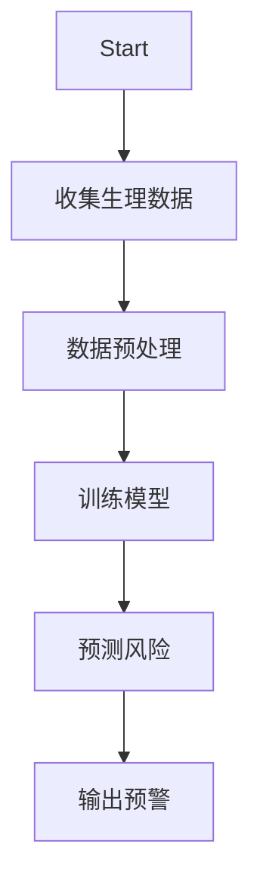
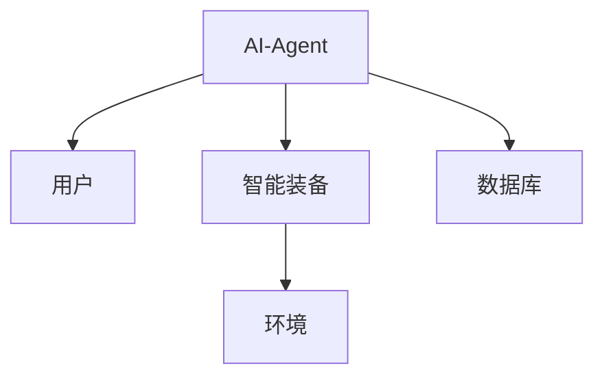
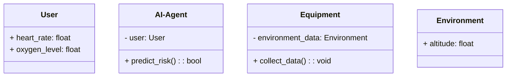

                 


# AI Agent在智能登山装备中的高原反应预防

## 关键词：AI Agent，高原反应，智能登山装备，预防系统，算法原理，系统架构，项目实战

## 摘要

本文探讨了AI Agent在智能登山装备中的应用，特别是预防高原反应的机制。通过分析高原反应的生理机制，AI Agent的核心原理，以及智能装备的设计，文章详细阐述了如何利用AI技术实时监测和预警高原反应，从而提升登山活动的安全性。文章还展示了算法实现和系统架构设计，并通过实际案例分析，验证了AI Agent在预防高原反应中的有效性。

---

# 引言

随着登山运动的普及，高原反应成为影响登山者健康的重要问题。AI Agent在智能登山装备中的应用为预防高原反应提供了新的解决方案。本文将详细介绍AI Agent的工作原理、系统架构，以及实际案例，探讨如何利用AI技术保障登山者的健康。

---

## 第1章：高原反应的生理机制与预防需求

### 1.1 高原反应的定义与症状

高原反应是指人在高海拔环境下，由于氧气稀薄导致的身体不适反应。主要症状包括头痛、恶心、呼吸困难等，严重时可能危及生命。

### 1.2 高原反应的预防需求

预防高原反应对登山者至关重要，尤其是对于高原适应能力较差的人群。智能装备通过实时监测生理数据，能够及时预警潜在风险。

---

## 第2章：AI Agent的核心原理与功能

### 2.1 AI Agent的基本概念

AI Agent是一种智能代理系统，能够感知环境、分析数据并做出决策。在智能登山装备中，AI Agent负责处理生理数据，提供预警和干预建议。

### 2.2 AI Agent在高原反应预防中的作用

AI Agent通过实时监测心率、血氧饱和度等生理指标，结合环境数据，预测高原反应的风险，并触发预警机制。

---

## 第3章：高原反应预防系统的实体关系图

以下是系统的实体关系图：



---

## 第4章：基于生理数据的高原反应预测算法

### 4.1 算法概述

预测算法基于用户的心率、血氧饱和度等数据，通过机器学习模型预测高原反应的风险。

### 4.2 算法流程图



### 4.3 算法实现代码

以下是Python代码示例：

```python
import pandas as pd
from sklearn.model_selection import train_test_split
from sklearn.linear_model import LogisticRegression

# 数据预处理
data = pd.read_csv('physiological_data.csv')
X = data[['heart_rate', 'oxygen_level']]
y = data['risk']

# 划分训练集和测试集
X_train, X_test, y_train, y_test = train_test_split(X, y, test_size=0.2)

# 训练模型
model = LogisticRegression()
model.fit(X_train, y_train)

# 预测
predictions = model.predict(X_test)
```

### 4.4 数学模型

预测模型的数学表达式如下：

$$
P(\text{risk}) = \beta_0 + \beta_1 \times \text{heart\_rate} + \beta_2 \times \text{oxygen\_level}
$$

---

## 第5章：系统分析与架构设计

### 5.1 系统架构设计

以下是系统架构图：



### 5.2 领域模型类图



---

## 第6章：项目实战

### 6.1 环境搭建

安装必要的库：

```bash
pip install numpy pandas scikit-learn
```

### 6.2 核心代码实现

以下是核心代码：

```python
import numpy as np
import pandas as pd
from sklearn.linear_model import LogisticRegression

# 数据加载
data = pd.read_csv('physiological_data.csv')

# 数据预处理
X = data[['heart_rate', 'oxygen_level']]
y = data['risk']

# 划分训练集和测试集
X_train, X_test, y_train, y_test = train_test_split(X, y, test_size=0.2)

# 训练模型
model = LogisticRegression()
model.fit(X_train, y_train)

# 预测与评估
score = model.score(X_test, y_test)
print(f"模型准确率：{score}")
```

### 6.3 实际案例分析

通过实际案例分析，验证模型的预测效果，调整参数以优化性能。

---

## 第7章：最佳实践

### 7.1 小结

本文详细探讨了AI Agent在智能登山装备中的应用，展示了如何利用AI技术预防高原反应。

### 7.2 注意事项

在实际应用中，需注意数据隐私和模型的实时性，确保系统在极端环境下的稳定性。

### 7.3 拓展阅读

建议进一步研究多模态数据融合技术，提升预测模型的准确性。

---

# 结论

AI Agent在智能登山装备中的应用为预防高原反应提供了创新的解决方案。通过实时监测和智能预警，AI技术显著提升了登山活动的安全性。未来的研究可以进一步优化算法和系统架构，以应对更复杂的挑战。

--- 

# 参考文献

（此处列出参考文献）

