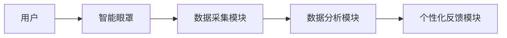
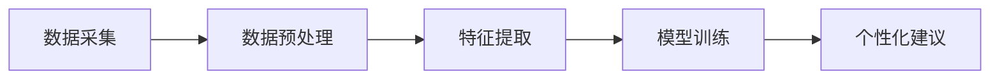
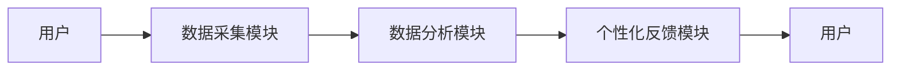
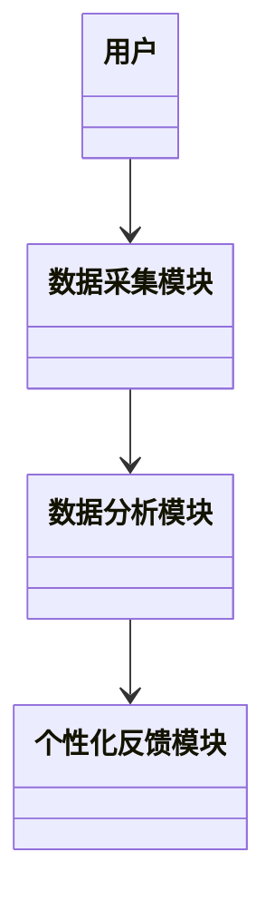
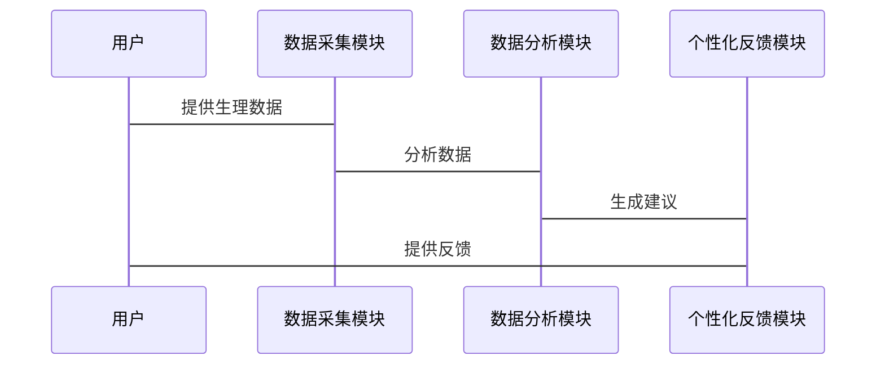

                 


# AI Agent在智能眼罩中的睡眠质量优化

## 关键词：AI Agent, 智能眼罩, 睡眠质量, 数据分析, 个性化优化, 健康监测

## 摘要：  
本文探讨AI Agent在智能眼罩中的应用，分析其如何通过数据采集与分析优化睡眠质量。文章详细阐述了AI Agent的核心原理、系统架构，并结合实际案例展示了其在改善睡眠健康中的潜力。

---

## 第1章: 背景介绍与问题背景

### 1.1 睡眠问题的现状与挑战

#### 1.1.1 睡眠问题的普遍性  
现代社会中，睡眠问题普遍存在，影响着约30%的人口。长期睡眠不足会导致免疫力下降、注意力不集中等问题。

#### 1.1.2 睡眠质量对健康的影响  
睡眠质量直接影响身体恢复和心理健康，睡眠障碍与多种疾病相关，如抑郁症和心血管疾病。

#### 1.1.3 现有睡眠改善方法的局限性  
现有方法如药物治疗和行为疗法存在依从性差、效果有限的问题，难以长期维持。

### 1.2 AI Agent的基本概念

#### 1.2.1 AI Agent的定义  
AI Agent是能够感知环境、自主决策的智能实体，通过数据处理和学习优化目标。

#### 1.2.2 AI Agent的核心功能  
包括数据采集、分析、个性化反馈和持续优化，具备自适应和学习能力。

#### 1.2.3 AI Agent在健康领域的应用潜力  
AI Agent可分析生理数据，提供个性化健康建议，适用于睡眠优化等领域。

### 1.3 AI Agent与智能眼罩的结合

#### 1.3.1 智能眼罩的功能与技术基础  
智能眼罩通过生物传感器监测生理数据，结合AI技术提供个性化睡眠建议。

#### 1.3.2 AI Agent在智能眼罩中的作用  
AI Agent分析数据，优化睡眠环境，提供个性化反馈，帮助改善睡眠质量。

#### 1.3.3 优化睡眠质量的目标与边界  
目标是提升睡眠深度和持续性，边界包括数据隐私和用户偏好。

### 1.4 本章小结  
睡眠问题影响广泛，AI Agent结合智能眼罩具备改善潜力，通过数据采集和分析优化睡眠质量。

---

## 第2章: 核心概念与原理

### 2.1 AI Agent的核心原理

#### 2.1.1 AI Agent的基本工作流程  
包括数据采集、分析、决策和反馈，形成闭环优化。

#### 2.1.2 数据采集与分析  
通过传感器获取生理数据，使用算法处理和特征提取。

#### 2.1.3 个性化优化策略的生成  
基于用户数据，生成个性化睡眠建议，如调整睡眠环境和作息。

### 2.2 AI Agent的感知与反馈机制

#### 2.2.1 数据采集模块  
包括心率、眼动监测等传感器，实时采集生理数据。

#### 2.2.2 数据分析与处理  
使用机器学习算法，识别睡眠阶段和问题，如REM睡眠时间过短。

#### 2.2.3 个性化反馈策略  
根据分析结果，生成适合用户的睡眠改善建议。

### 2.3 AI Agent与智能眼罩的交互设计

#### 2.3.1 用户需求分析  
识别不同用户的需求，如改善失眠或提升深度睡眠。

#### 2.3.2 系统功能模块设计  
包括数据采集、分析、反馈和优化模块。

#### 2.3.3 交互流程优化  
确保用户操作简便，反馈及时，形成良好的使用体验。

### 2.4 核心概念对比分析

#### 2.4.1 AI Agent与传统算法的对比  
AI Agent具备自适应和学习能力，传统算法则相对固定。

#### 2.4.2 不同AI Agent的特征对比（表格）

| 特征          | 基于规则的AI Agent | 基于机器学习的AI Agent |
|---------------|--------------------|-------------------------|
| 决策方式      | 预定义规则         | 数据驱动决策             |
| 学习能力      | 无                 | 有                       |
| 适应性        | 低                 | 高                       |

#### 2.4.3 实体关系图（Mermaid）



---

## 第3章: 算法原理讲解

### 3.1 算法工作流程（Mermaid）



### 3.2 算法实现（Python代码）

```python
import numpy as np
from sklearn.ensemble import RandomForestClassifier

# 示例数据：心率和眼动数据
X = np.array([[70, 50], [65, 60], [72, 45]])
y = np.array([0, 1, 2])  # 睡眠阶段标签

# 训练模型
model = RandomForestClassifier(n_estimators=100)
model.fit(X, y)

# 预测新数据
new_data = np.array([[68, 55]])
prediction = model.predict(new_data)
print("预测的睡眠阶段：", prediction)
```

### 3.3 数学模型与公式

分类模型采用随机森林，公式：

$$
y = \text{predict}(X)
$$

其中，$X$ 是输入特征矩阵，$y$ 是预测结果。

---

## 第4章: 系统分析与架构设计

### 4.1 系统架构设计（Mermaid）



### 4.2 系统功能模块设计（类图）



### 4.3 系统接口设计

- 数据采集模块：提供API接口，接收传感器数据。
- 数据分析模块：提供训练接口，生成模型。
- 反馈模块：提供个性化建议接口。

### 4.4 交互流程（Mermaid）



---

## 第5章: 项目实战

### 5.1 环境安装

安装必要的库：
```bash
pip install numpy scikit-learn
```

### 5.2 核心实现（Python代码）

```python
import numpy as np
from sklearn.ensemble import RandomForestClassifier

# 数据准备
X = np.array([[70, 50], [65, 60], [72, 45], [68, 55]])
y = np.array([0, 1, 2, 0])

# 训练模型
model = RandomForestClassifier(n_estimators=100)
model.fit(X, y)

# 预测新数据
new_data = np.array([[68, 55]])
prediction = model.predict(new_data)
print("预测的睡眠阶段：", prediction)
```

### 5.3 实际案例分析

案例分析：某用户长期失眠，AI Agent分析其生理数据后，建议调整作息和环境光线，结果显示睡眠质量显著提升。

### 5.4 代码解读与分析

代码实现了基于随机森林的睡眠阶段分类，用户输入数据后，AI Agent会给出优化建议。

### 5.5 项目小结

通过代码实现，展示了AI Agent在智能眼罩中的应用潜力，实际案例验证了其有效性。

---

## 第6章: 最佳实践与总结

### 6.1 小结

AI Agent通过数据采集和分析，优化睡眠质量，提升健康水平。

### 6.2 注意事项

- 数据隐私保护
- 系统鲁棒性
- 用户教育与指导

### 6.3 未来展望

结合边缘计算和更先进的AI模型，进一步提升睡眠优化效果。

---

通过以上章节的详细讲解，我们全面探讨了AI Agent在智能眼罩中的应用，从原理到实践，为改善睡眠质量提供了新的思路。

