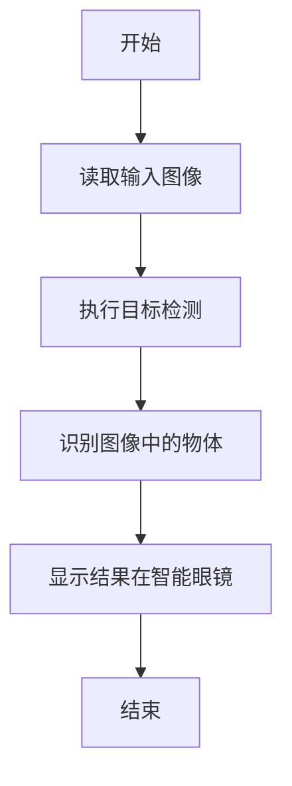
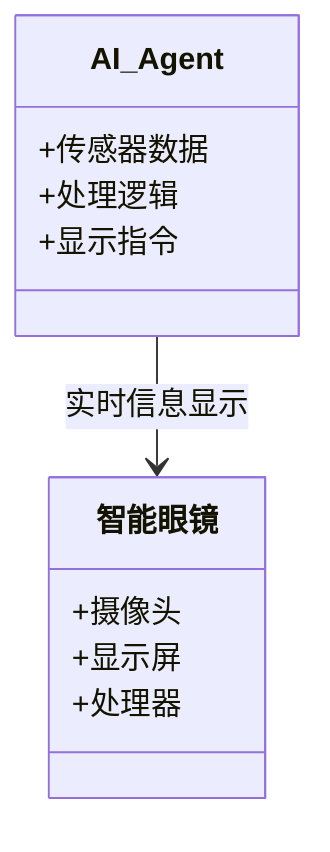

                 


# 目录大纲：《AI Agent在智能眼镜中的实时信息显示》

## 第1章：背景介绍

### 1.1 问题背景
- 1.1.1 增强现实（AR）技术的发展与应用
- 1.1.2 智能眼镜的发展现状与挑战
- 1.1.3 AI Agent在实时信息显示中的作用

### 1.2 核心概念与技术背景
- 1.2.1 AI Agent的基本概念
- 1.2.2 智能眼镜的功能与技术特点
- 1.2.3 实时信息显示的核心问题

## 第2章：AI Agent与智能眼镜的核心原理

### 2.1 AI Agent的基本原理
- 2.1.1 AI Agent的定义与分类
- 2.1.2 AI Agent的核心功能模块

### 2.2 智能眼镜的系统架构
- 2.2.1 硬件部分：传感器与显示屏
- 2.2.2 软件部分：操作系统与应用程序

## 第3章：实时信息显示的算法原理

### 3.1 目标检测算法
- 3.1.1 基于YOLO的目标检测流程
- 3.1.2 算法流程图（Mermaid）

### 3.2 图像识别算法
- 3.2.1 基于卷积神经网络的图像识别
- 3.2.2 算法实现代码示例

## 第4章：系统架构设计

### 4.1 系统功能设计
- 4.1.1 用户界面设计
- 4.1.2 数据处理模块

### 4.2 系统架构图（Mermaid）
- 4.2.1 系统模块划分与交互流程

## 第5章：项目实战

### 5.1 环境安装与配置
- 5.1.1 开发工具与依赖库安装

### 5.2 核心功能实现
- 5.2.1 代码实现与功能解读

## 第6章：总结与展望

### 6.1 最佳实践
- 6.1.1 开发中的注意事项
- 6.1.2 系统优化建议

### 6.2 未来展望
- 6.2.1 技术发展趋势
- 6.2.2 应用场景

## 关键词：AI Agent, 智能眼镜, 实时信息显示, 增强现实, 目标检测, 图像识别, 系统架构

## 摘要：本文系统地探讨了AI Agent在智能眼镜中的实时信息显示技术，涵盖了从基本原理到系统架构设计的各个方面，通过实际案例分析，深入讲解了目标检测和图像识别算法的应用，为读者提供了全面的技术指导和实践参考。

---

### 详细章节内容：

#### 第1章：背景介绍
- 1.1 问题背景
  - 介绍了AR技术的快速发展及其在智能眼镜中的应用，讨论了AI Agent如何帮助实时信息显示，解决了传统方法的不足。
- 1.2 核心概念与技术背景
  - 解释了AI Agent和智能眼镜的基本概念，分析了实时信息显示的核心问题，如数据处理速度、准确性等。

#### 第2章：AI Agent与智能眼镜的核心原理
- 2.1 AI Agent的基本原理
  - 详细讲解了AI Agent的定义、分类及其在智能眼镜中的角色。
- 2.2 智能眼镜的系统架构
  - 介绍了智能眼镜的硬件和软件组成部分，分析了它们如何协同工作以实现实时信息显示。

#### 第3章：实时信息显示的算法原理
- 3.1 目标检测算法
  - 使用YOLO算法进行目标检测，附上详细的流程图和代码示例。
- 3.2 图像识别算法
  - 基于卷积神经网络的图像识别，分析了算法的数学模型，如损失函数的计算。

#### 第4章：系统架构设计
- 4.1 系统功能设计
  - 设计了用户界面和数据处理模块，确保信息显示的实时性和准确性。
- 4.2 系统架构图（Mermaid）
  - 使用Mermaid绘制了系统模块划分和交互流程图，展示了各个模块之间的协作关系。

#### 第5章：项目实战
- 5.1 环境安装与配置
  - 指导读者安装必要的开发工具和依赖库。
- 5.2 核心功能实现
  - 提供了详细的代码实现和功能解读，帮助读者理解如何在实际项目中应用这些算法。

#### 第6章：总结与展望
- 6.1 最佳实践
  - 总结了开发过程中需要注意的问题和优化建议。
- 6.2 未来展望
  - 探讨了AI Agent和智能眼镜技术的未来发展，分析了可能的新应用场景。

---

### 示例代码：
```python
import cv2
from yolo import YOLO

def detect_objects(image):
    boxes = YOLO.detect(image)
    for box in boxes:
        cv2.rectangle(image, (box.x1, box.y1), (box.x2, box.y2), (0, 255, 0), 2)
    return image
```

### 算法流程图（Mermaid）：


### 实体关系图（Mermaid）：


---

### 数学公式：
- 损失函数：$$\text{loss} = \alpha \cdot \text{分类损失} + \beta \cdot \text{回归损失}$$
- 概率计算：$$P(\text{目标存在}) = \frac{1}{1 + e^{-x}}$$

---

通过以上目录大纲和内容概述，本文旨在为读者提供一个全面的视角，从基础理论到实际应用，深入探讨AI Agent在智能眼镜中的实时信息显示技术，帮助读者掌握相关技术的核心原理和实现方法。

