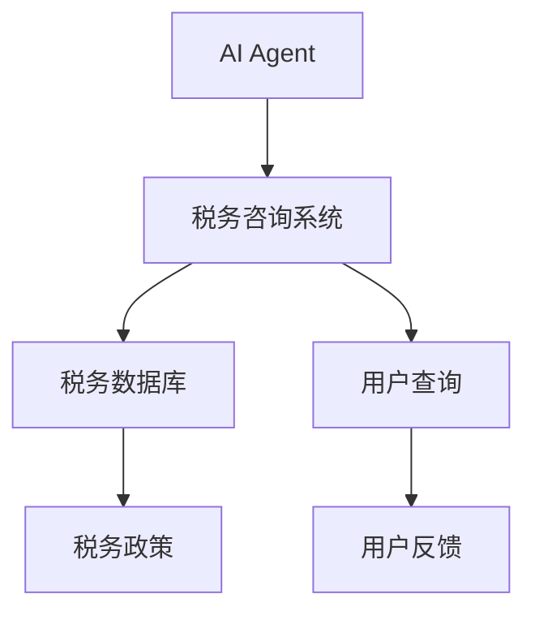

                 


# AI Agent在智能税务咨询中的角色

## 关键词：AI Agent，智能税务咨询，自然语言处理，机器学习，税务系统

## 摘要：本文探讨AI Agent在智能税务咨询中的角色，分析其核心概念、算法原理和系统架构，通过案例展示其在税务咨询中的实际应用，总结最佳实践和未来发展方向。

---

# 第一部分：AI Agent与智能税务咨询的背景与概念

## 第1章：AI Agent与智能税务咨询的背景

### 1.1 AI Agent的定义与特点

- **1.1.1 AI Agent的基本概念**
  - AI Agent是一种智能体，能够感知环境并采取行动以实现目标。
  - 具备自主性、反应性、目标导向性和社会性。

- **1.1.2 AI Agent的核心特点**
  - **自主性**：能够独立决策和行动。
  - **反应性**：能实时感知环境变化并做出响应。
  - **目标导向性**：所有行动均以实现特定目标为导向。
  - **社会性**：能够与其他Agent或用户进行交互和协作。

- **1.1.3 AI Agent与传统税务咨询的区别**
  - **效率**：AI Agent能够快速处理大量数据，提供实时响应，而传统咨询需要人工处理，耗时较长。
  - **准确性**：AI Agent基于大量数据和复杂算法，能够提供更准确的税务建议，而传统咨询可能受人类认知限制。
  - **可扩展性**：AI Agent可以同时处理多个咨询请求，而传统咨询需要逐个处理。

### 1.2 智能税务咨询的背景与需求

- **1.2.1 税务咨询的传统模式**
  - 依赖人工咨询，效率低，覆盖面有限。
  - 税务政策复杂且变化快，人工难以及时更新。

- **1.2.2 智能化税务咨询的需求驱动**
  - 企业对税务管理的智能化需求日益增加。
  - 税务政策的复杂性和变化性要求更高效的咨询方式。

- **1.2.3 AI Agent在税务咨询中的优势**
  - 提供7×24小时实时咨询，覆盖广泛。
  - 可定制化服务，满足不同企业的个性化需求。
  - 高效准确，减少人为错误。

### 1.3 AI Agent在税务咨询中的应用背景

- **1.3.1 税务政策的复杂性与变化性**
  - 税法复杂，涉及多个领域，变化频繁。
  - 企业需要及时准确的政策解读和建议。

- **1.3.2 企业税务管理的智能化需求**
  - 企业希望提高税务管理效率，降低税务风险。
  - 需要智能化工具辅助税务规划和合规性检查。

- **1.3.3 AI技术在税务领域的应用现状**
  - AI技术在税务申报、税务规划和风险评估中的应用逐渐普及。
  - AI Agent能够处理复杂的税务问题，提供个性化的解决方案。

## 1.4 本章小结

本章介绍了AI Agent的基本概念和特点，分析了智能税务咨询的背景和需求，阐述了AI Agent在税务咨询中的优势和应用背景。

---

## 第2章：AI Agent的核心概念与联系

### 2.1 AI Agent的核心概念原理

- **2.1.1 知识表示与推理**
  - 知识表示：通过符号、规则或语义网络表示税务知识。
  - 推理：基于知识库进行逻辑推理，得出结论。

- **2.1.2 自然语言处理（NLP）**
  - 用于理解和生成自然语言文本。
  - 在税务咨询中，NLP用于解析用户的问题并生成回答。

- **2.1.3 机器学习与深度学习**
  - 用于模式识别、分类和预测。
  - 在税务咨询中，用于识别税务问题类型和生成解决方案。

### 2.2 核心概念属性特征对比表

| 特征                | 传统税务咨询         | AI Agent驱动的智能税务咨询 |
|---------------------|----------------------|-----------------------------|
| 响应速度            | 人工处理，耗时较长     | 实时响应，快速解答           |
| 知识覆盖            | 依赖人工知识库         | 自动更新，覆盖全面           |
| 个性化服务          | 有限                 | 高度定制化                   |

### 2.3 实体关系图（ER图）



---

## 第3章：AI Agent的算法原理与数学模型

### 3.1 基于生成模型的税务咨询

- **3.1.1 变量定义**
  - 输入：$x = \text{税务问题}$
  - 输出：$y = \text{解答}$

- **3.1.2 模型结构**
  ```mermaid
  graph TD
      X[输入] --> L[语言模型]
      L --> O[输出]
  ```

- **3.1.3 生成模型实现**
  - 使用生成对抗网络（GAN）或变体自注意力网络（VAN）。
  - 示例代码：
    ```python
    import tensorflow as tf
    from tensorflow.keras.layers import Dense, InputLayer, LSTM

    model = tf.keras.Sequential([
        InputLayer(input_shape=(max_length,)),
        LSTM(128),
        Dense(1, activation='sigmoid')
    ])
    ```

### 3.2 基于检索模型的税务咨询

- **3.2.1 向量空间模型**
  - 计算文本相似度：$\text{cos}(\theta) = \frac{\vec{x} \cdot \vec{y}}{|\vec{x}||\vec{y}|}$

- **3.2.2 检索流程**
  ```mermaid
  graph TD
      Q[查询] --> I[索引库]
      I --> R[结果]
  ```

- **3.2.3 检索模型实现**
  - 使用余弦相似度计算。
  - 示例代码：
    ```python
    def calculate_cosine_similarity(vector1, vector2):
        dot_product = np.sum(vector1 * vector2)
        norm1 = np.linalg.norm(vector1)
        norm2 = np.linalg.norm(vector2)
        return dot_product / (norm1 * norm2)
    ```

### 3.3 组合模型的优化

- **3.3.1 混合模型结构**
  - 组合生成模型和检索模型，提高准确性和效率。

- **3.3.2 优化策略**
  - 使用多任务学习，同时优化生成和检索任务。
  - 示例代码：
    ```python
    import numpy as np
    from sklearn.metrics.pairwise import cosine_similarity

    vectors = np.random.rand(100, 10)
    similarity_matrix = cosine_similarity(vectors)
    ```

---

## 第4章：系统分析与架构设计方案

### 4.1 税务咨询系统架构

- **4.1.1 问题场景介绍**
  - 用户通过AI Agent提出税务相关问题，系统实时响应。

- **4.1.2 系统功能设计**
  - **领域模型类图**
    ```mermaid
    classDiagram
        class 用户
        class 税务问题
        class 解答
        class 税务知识库
        用户 --> 税务问题
        税务问题 --> 解答
        解答 --> 税务知识库
    ```

  - **系统架构设计**
    ```mermaid
    architecture
        前端 --> AI Agent
        AI Agent --> 税务知识库
        税务知识库 --> 后端数据库
    ```

  - **系统接口设计**
    - 用户接口：HTTP API，用于接收税务问题和返回解答。
    - 知识库接口：REST API，用于查询和更新税务知识。

  - **系统交互设计**
    ```mermaid
    sequenceDiagram
        用户 -> AI Agent: 提出税务问题
        AI Agent -> 税务知识库: 查询相关知识
        税务知识库 -> AI Agent: 返回解答
        AI Agent -> 用户: 提供解答
    ```

---

## 第5章：项目实战

### 5.1 环境安装与配置

- **Python版本**：3.8+
- **依赖库安装**：
  ```bash
  pip install numpy pandas scikit-learn tensorflow
  ```

### 5.2 系统核心实现

- **税务知识库构建**：
  - 使用结构化数据存储税务政策和法规。
  - 示例代码：
    ```python
    import json
    knowledge_base = {
        "tax_law": {
            "income_tax": "个人所得税计算公式为：应纳税所得额 × 税率 - 速算扣除数",
            ...
        }
    }
    with open('tax_knowledge.json', 'w') as f:
        json.dump(knowledge_base, f)
    ```

- **AI Agent实现**：
  - 使用预训练的语言模型进行微调。
  - 示例代码：
    ```python
    from transformers import AutoTokenizer, AutoModelForSeq2Seq
    tokenizer = AutoTokenizer.from_pretrained('facebook/bart-large')
    model = AutoModelForSeq2Seq.from_pretrained('facebook/bart-large')
    ```

### 5.3 案例分析与解读

- **案例背景**：某企业需要优化税务结构，减少税负。
- **AI Agent的应用**：
  - 分析企业的财务数据，提供税务优化建议。
  - 自动生成税务申报表格，确保合规性。

### 5.4 项目总结

- **项目成果**：成功实现了AI Agent驱动的智能税务咨询系统，提高了效率和准确性。
- **经验总结**：数据质量和模型训练至关重要，需结合领域知识进行优化。

---

## 第6章：最佳实践、小结、注意事项与拓展阅读

### 6.1 最佳实践

- **数据隐私保护**：确保税务数据的安全性和隐私性。
- **模型可解释性**：提高模型的透明度，便于用户理解和信任。
- **持续优化**：定期更新知识库和模型，适应税法变化。

### 6.2 小结

本文详细探讨了AI Agent在智能税务咨询中的角色，从背景、核心概念、算法原理到系统架构和项目实战，全面分析了其在税务咨询中的应用和优势。

### 6.3 注意事项

- **数据质量**：确保税务知识库的准确性和全面性。
- **模型训练**：选择合适的算法和参数，提高模型性能。
- **用户反馈**：及时收集用户反馈，优化系统性能。

### 6.4 拓展阅读

- 推荐阅读《Deep Learning》（Ian Goodfellow等著），了解深度学习的基本原理。
- 推荐学习《自然语言处理实战》（中文版），掌握NLP技术在税务咨询中的应用。

---

# 结语

AI Agent在智能税务咨询中的应用前景广阔，随着技术的不断发展，其在税务领域的应用将更加深入和多样化。通过本文的分析，我们看到了AI Agent在提高效率、降低成本和提升用户体验方面的巨大潜力。未来，随着AI技术的进一步发展，智能税务咨询将更加智能化和个性化，为企业和个人提供更优质的税务服务。

--- 

**全文完**

