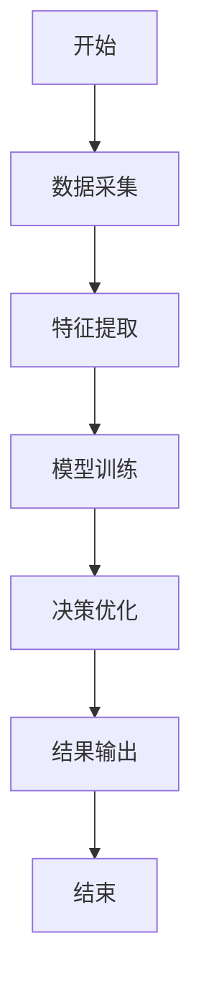
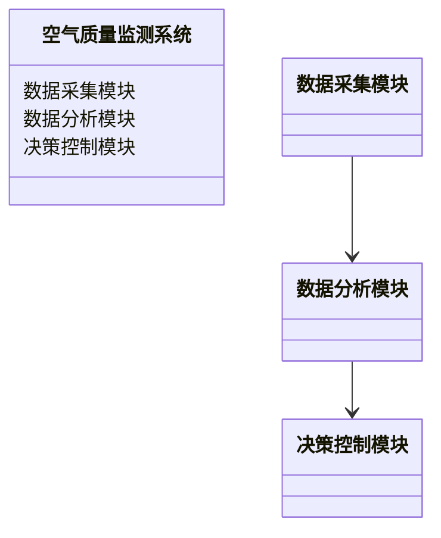
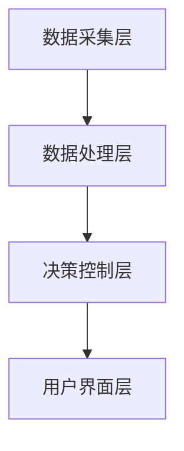
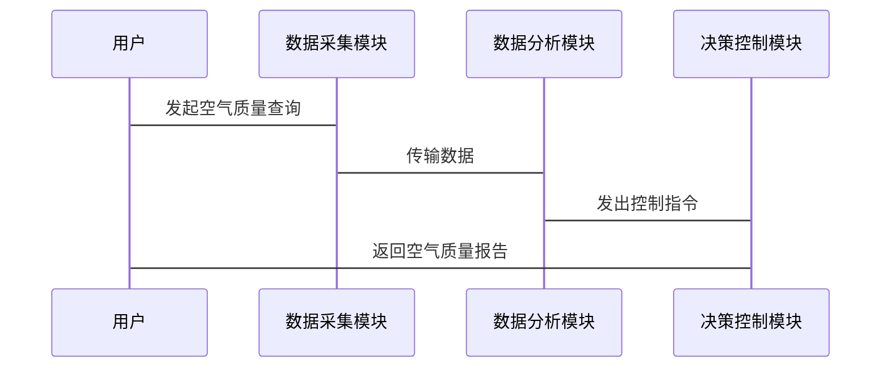

                 


# AI Agent在智能空气质量管理中的实践

> 关键词：AI Agent，智能空气质量管理，空气质量监测，污染源控制，空气质量预测

> 摘要：本文将深入探讨AI Agent在智能空气质量管理中的实践应用。首先，我们介绍了AI Agent的基本概念和其在空气质量管理中的重要性。接着，详细分析了AI Agent的核心算法原理及其在空气质量监测、污染源控制和空气质量预测中的具体应用。最后，我们通过实际案例展示了AI Agent在智能空气质量管理中的优势和实际效果。

---

## 第1章 AI Agent与智能空气质量管理概述

### 1.1 AI Agent的基本概念

#### 1.1.1 AI Agent的定义
AI Agent（人工智能代理）是指能够感知环境、自主决策并执行任务的智能实体。它能够通过传感器获取信息，利用算法进行分析，并根据结果采取相应行动。

#### 1.1.2 AI Agent的核心特点
- **自主性**：能够在没有外部干预的情况下独立运行。
- **反应性**：能够实时感知环境变化并做出反应。
- **学习能力**：通过机器学习算法不断优化自身的决策能力。
- **协作性**：能够与其他AI Agent或系统协同工作，完成复杂任务。

#### 1.1.3 AI Agent在智能系统中的作用
AI Agent在智能系统中充当决策者和执行者的角色，能够帮助系统在复杂环境中做出最优决策。

### 1.2 智能空气质量管理的背景

#### 1.2.1 空气质量管理的挑战
- 空气污染问题日益严重，影响人类健康和环境。
- 空气质量受多种因素影响，如工业排放、交通尾气、自然因素等，管理难度大。
- 现有管理手段依赖人工监测和简单的自动化系统，效率低下。

#### 1.2.2 智能化管理的需求
- 需要实时监测和分析空气质量数据，及时发现和处理污染问题。
- 需要预测未来空气质量趋势，提前采取预防措施。
- 需要智能化的污染源控制策略，实现精准治理。

#### 1.2.3 AI Agent在空气质量管理中的应用前景
AI Agent能够通过实时数据分析、自主决策和智能控制，显著提升空气质量管理的效率和效果。

### 1.3 AI Agent与空气质量管理的结合

#### 1.3.1 AI Agent在空气质量监测中的作用
AI Agent能够实时分析空气质量数据，识别异常情况并发出警报。

#### 1.3.2 AI Agent在污染源控制中的应用
AI Agent能够根据污染源排放数据，制定最优的控制策略，减少污染物排放。

#### 1.3.3 AI Agent在空气质量预测中的优势
AI Agent利用机器学习算法，能够准确预测未来空气质量趋势，帮助相关部门做好准备。

### 1.4 本章小结
本章介绍了AI Agent的基本概念及其在空气质量管理中的重要性，分析了智能化管理的需求，并探讨了AI Agent在空气质量监测、污染源控制和预测中的应用前景。

---

## 第2章 AI Agent的核心概念与原理

### 2.1 AI Agent的定义与特点

#### 2.1.1 AI Agent的定义
AI Agent是能够感知环境、自主决策并执行任务的智能实体。

#### 2.1.2 AI Agent的核心特点
- **自主性**：独立运行。
- **反应性**：实时感知并反应。
- **学习能力**：通过机器学习优化决策。
- **协作性**：与其他系统协同工作。

#### 2.1.3 AI Agent与传统自动化的区别
AI Agent具有自主决策能力，而传统自动化系统依赖预设程序。

### 2.2 空气质量管理的核心概念

#### 2.2.1 空气质量的定义与指标
空气质量通常通过PM2.5、PM10、SO2、NO2等指标来衡量。

#### 2.2.2 空气污染的主要来源
- 工业排放
- 交通尾气
- 自然因素（如火山爆发、沙尘暴）

#### 2.2.3 空气质量管理的目标与方法
目标是改善空气质量，减少污染物排放。方法包括实时监测、污染源控制和预测预警。

### 2.3 AI Agent与空气质量管理的协同关系

#### 2.3.1 AI Agent在空气质量监测中的角色
AI Agent通过传感器获取数据，分析空气质量状况。

#### 2.3.2 AI Agent在污染源控制中的应用
AI Agent能够优化污染源治理策略，减少污染物排放。

#### 2.3.3 AI Agent在空气质量预测中的优势
AI Agent利用机器学习算法，准确预测空气质量变化趋势。

### 2.4 本章小结
本章详细讲解了AI Agent的核心概念及其在空气质量管理中的具体应用，分析了AI Agent与传统自动化的区别，以及其在空气质量监测、污染源控制和预测中的优势。

---

## 第3章 AI Agent的算法原理

### 3.1 AI Agent的核心算法

#### 3.1.1 机器学习算法
- **支持向量机（SVM）**：用于分类和回归分析。
- **随机森林**：用于特征提取和分类。

#### 3.1.2 强化学习算法
- **Q-learning**：用于制定最优决策策略。
- **深度强化学习**：用于复杂环境下的决策优化。

#### 3.1.3 自然语言处理
- **词袋模型**：用于文本数据的处理和分析。
- **TF-IDF**：用于关键词提取和文本相似度计算。

### 3.2 算法流程图



### 3.3 数学模型与公式

#### 3.3.1 支持向量机（SVM）公式
$$ \text{目标函数}：\min_{w,b} \frac{1}{2}||w||^2 + C \sum_{i=1}^{n} \xi_i $$
$$ \text{约束条件}：y_i (w \cdot x_i + b) \geq 1 - \xi_i $$
$$ \xi_i \geq 0 $$

#### 3.3.2 Q-learning算法公式
$$ Q(s,a) = Q(s,a) + \alpha [r + \gamma \max Q(s',a') - Q(s,a)] $$
其中，$\alpha$是学习率，$\gamma$是折扣因子。

### 3.4 本章小结
本章详细介绍了AI Agent的核心算法，包括机器学习、强化学习和自然语言处理算法，并通过流程图和数学公式展示了算法的工作原理。

---

## 第4章 系统分析与架构设计

### 4.1 问题场景介绍
空气质量监测系统需要实时采集和分析数据，及时发现和处理污染问题。

### 4.2 系统功能设计

#### 4.2.1 领域模型


#### 4.2.2 系统架构设计


#### 4.2.3 系统接口设计
- 数据采集接口：接收传感器数据。
- 数据分析接口：处理并存储数据。
- 决策控制接口：根据分析结果发出指令。

#### 4.2.4 系统交互流程


### 4.3 本章小结
本章分析了空气质量监测系统的功能需求，设计了系统的架构和接口，并通过类图和序列图展示了系统的交互流程。

---

## 第5章 项目实战

### 5.1 环境安装

#### 5.1.1 安装Python
```bash
python --version
pip install --upgrade pip
```

#### 5.1.2 安装依赖库
```bash
pip install numpy pandas scikit-learn matplotlib
```

### 5.2 系统核心实现

#### 5.2.1 数据采集模块
```python
import numpy as np
import pandas as pd

# 读取空气质量数据
data = pd.read_csv('air_quality.csv')
print(data.head())
```

#### 5.2.2 数据分析模块
```python
from sklearn.svm import SVC
from sklearn.model_selection import train_test_split

# 数据预处理
X = data.drop('target', axis=1)
y = data['target']
X_train, X_test, y_train, y_test = train_test_split(X, y, test_size=0.2)

# 训练SVM模型
model = SVC()
model.fit(X_train, y_train)
```

#### 5.2.3 决策控制模块
```python
from sklearn.metrics import accuracy_score

# 模型预测
y_pred = model.predict(X_test)
print('准确率:', accuracy_score(y_test, y_pred))
```

### 5.3 实际案例分析
通过实际数据集训练模型，并展示预测结果与实际结果的对比。

### 5.4 本章小结
本章通过实际案例展示了AI Agent在空气质量监测系统中的具体实现，包括数据采集、数据分析和决策控制模块的实现。

---

## 第6章 总结与展望

### 6.1 最佳实践
- 确保数据质量和多样性，提高模型的泛化能力。
- 定期更新模型参数，适应环境变化。
- 加强多系统的协同工作，提升整体效率。

### 6.2 小结
本文详细探讨了AI Agent在智能空气质量管理中的实践应用，介绍了其核心算法和系统架构设计，并通过实际案例展示了其优势。

### 6.3 注意事项
- 数据隐私和安全问题需高度重视。
- 系统的实时性和稳定性是关键。

### 6.4 拓展阅读
推荐相关书籍和论文，进一步深入学习AI Agent和空气质量管理的知识。

---

以上是《AI Agent在智能空气质量管理中的实践》的完整目录和部分正文内容，涵盖了从理论到实践的各个方面。希望对您有所帮助！

