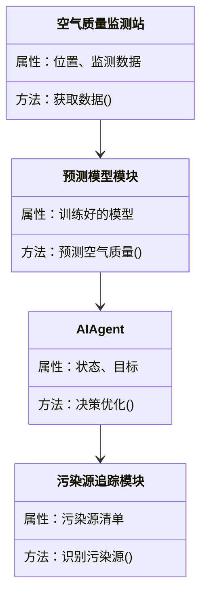
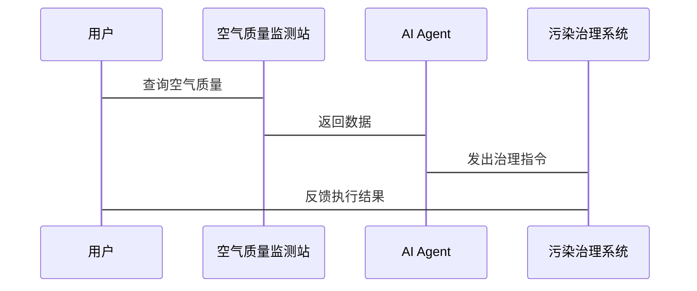

                 


# AI Agent在智能空气质量管理中的实践

## 关键词：AI Agent，空气质量，智能管理，环境优化，算法模型，强化学习

## 摘要：本文探讨AI Agent在智能空气质量管理中的应用，从空气质量监测、预测到污染源追踪、治理方案优化，结合强化学习等算法，构建高效决策系统，实现空气质量管理的智能化和精准化。

---

## 第一部分: AI Agent与智能空气质量管理概述

### 第1章: AI Agent与空气质量管理的背景介绍

#### 1.1 空气质量管理的核心概念

##### 1.1.1 空气质量管理的定义与目标
空气质量管理（Air Quality Management, AQM）是指通过监测、分析和控制空气污染物的排放，确保空气质量符合环境标准，保护人类健康和生态系统。其目标包括减少污染物浓度、预防环境污染和改善空气质量。

##### 1.1.2 空气质量管理的主体与客体
- **主体**：政府机构、企业、个人。
- **客体**：空气环境，特别是PM2.5、PM10、SO2、NO2、CO、O3等污染物。

##### 1.1.3 空气质量管理的边界与外延
- **边界**：仅关注空气污染物的浓度及其影响。
- **外延**：涉及能源、交通、工业等多个领域。

#### 1.2 AI Agent的基本概念与特征

##### 1.2.1 AI Agent的定义与分类
- **定义**：AI Agent是一个智能实体，能感知环境并自主决策以实现目标。
- **分类**：根据智能水平分为简单反射型、基于模型的反应型、目标驱动型和效用驱动型。

##### 1.2.2 AI Agent的核心要素与组成
- **感知能力**：通过传感器或数据源获取信息。
- **决策能力**：基于知识库和推理机制做出决策。
- **执行能力**：通过执行机构或接口与环境交互。

##### 1.2.3 AI Agent与传统自动化系统的主要区别
| 特性                | 传统自动化系统       | AI Agent             |
|---------------------|--------------------|----------------------|
| 决策方式            | 基于预设规则         | 基于学习和推理       |
| 环境适应性          | 有限                | 高                   |
| 自主性              | 低                  | 高                   |

#### 1.3 空气质量管理中的AI Agent应用场景

##### 1.3.1 空气污染监测与预测
AI Agent实时监测空气质量数据，利用机器学习模型预测污染物浓度变化。

##### 1.3.2 污染源识别与追踪
通过分析历史数据和实时信息，AI Agent识别主要污染源并追踪其影响范围。

##### 1.3.3 治理方案优化与执行
AI Agent制定治理策略，协调各方资源，优化污染治理方案。

---

## 第二部分: AI Agent在空气质量管理中的核心概念与联系

### 第2章: 空气质量管理中的关键概念与模型

#### 2.1 空气质量数据的来源与特征

##### 2.1.1 空气质量监测数据的采集方式
- **来源**：空气质量监测站、卫星数据、传感器网络。
- **特征**：时间序列性、空间分布性、波动性。

##### 2.1.2 数据特征分析与预处理方法
- **预处理**：数据清洗、标准化、异常值处理。
- **方法**：滑动窗口、差分法、傅里叶变换。

##### 2.1.3 数据质量评估与优化策略
- **评估指标**：准确率、完整性、一致性。
- **优化策略**：数据融合、插值方法。

#### 2.2 空气质量预测模型的构建与优化

##### 2.2.1 常见空气质量预测模型的分类
| 模型类型            | 描述                     | 优缺点               |
|---------------------|--------------------------|----------------------|
| 时间序列模型        | ARIMA, LSTM             | 高精度，需大量数据   |
| 机器学习模型        | SVM, RF                 | 中等精度，易过拟合   |
| 物理模型            | AQO模型                 | 精度较低，计算简单   |

##### 2.2.2 数据驱动与模型驱动的对比分析
- **数据驱动**：基于历史数据，无需物理知识。
- **模型驱动**：基于物理规律，数据需求低。

##### 2.2.3 深度学习模型在空气质量预测中的应用
- **模型**：LSTM、Transformer。
- **优势**：捕捉长序列依赖，处理非线性关系。

#### 2.3 AI Agent在空气质量优化中的决策机制

##### 2.3.1 多目标优化问题的建模与求解
- **目标**：最小化污染物浓度，最大化经济收益。
- **方法**：加权和法、Pareto优化。

##### 2.3.2 基于强化学习的决策过程
- **策略**：Q-learning，状态-动作-奖励机制。

##### 2.3.3 群智协同优化的实现方法
- **机制**：分布式计算，局部优化。

---

## 第三部分: AI Agent的算法原理与数学模型

### 第3章: AI Agent的核心算法原理

#### 3.1 强化学习算法在AI Agent中的应用

##### 3.1.1 Q-Learning算法的原理与实现
- **原理**：通过经验值更新Q表，选择最优动作。
- **实现**：状态空间、动作空间、奖励函数。

##### 3.1.2 Deep Q-Networks (DQN) 的架构与训练过程
- **架构**：输入层、隐藏层、输出层。
- **训练**：经验回放，最小化损失函数。

##### 3.1.3 策略梯度方法的优缺点分析
- **优点**：直接优化策略。
- **缺点**：计算复杂，收敛慢。

#### 3.2 空气质量预测的数学模型与公式

##### 3.2.1 时间序列预测模型的数学表达
$$ y_t = \alpha y_{t-1} + \beta y_{t-2} + \epsilon $$

##### 3.2.2 空气质量指数AQI的计算公式
$$ AQI = \sum \left( \frac{\text{污染物浓度}}{\text{标准浓度}} \times 权重 \right) $$

##### 3.2.3 深度学习模型的损失函数与优化器
- **损失函数**：均方误差（MSE）。
- **优化器**：Adam。

#### 3.3 AI Agent决策过程的数学建模

##### 3.3.1 强化学习中的数学表达
$$ Q(s, a) = Q(s, a) + \alpha (r + \gamma \max Q(s', a') - Q(s, a)) $$

##### 3.3.2 状态转移模型
$$ P(s'|s, a) = \text{概率从状态s转移到s'，动作a} $$

---

## 第四部分: 系统分析与架构设计方案

### 第4章: 智能空气质量管理系统的架构设计

#### 4.1 问题场景介绍
- **场景**：城市空气质量监测与优化。
- **挑战**：数据异构、实时性要求高。

#### 4.2 项目介绍
- **目标**：构建AI Agent驱动的空气质量管理系统。
- **范围**：城市级空气质量优化。

#### 4.3 系统功能设计（领域模型）



#### 4.4 系统架构设计


#### 4.5 系统接口设计
- **输入接口**：空气质量数据、气象数据。
- **输出接口**：治理建议、预警信息。

#### 4.6 系统交互流程



---

## 第五部分: 项目实战

### 第5章: 智能空气质量管理系统的实现

#### 5.1 环境安装与配置
- **工具**：Python、TensorFlow、Keras。
- **数据集**：公开空气质量数据集（如 EPA 数据）。

#### 5.2 核心实现代码

##### 5.2.1 数据预处理
```python
import pandas as pd
import numpy as np

data = pd.read_csv('air_quality.csv')
data = data.dropna()
data['date'] = pd.to_datetime(data['date'])
data.set_index('date', inplace=True)
```

##### 5.2.2 模型训练
```python
from tensorflow.keras.models import Sequential
from tensorflow.keras.layers import LSTM, Dense

model = Sequential()
model.add(LSTM(50, input_shape=(timesteps, features)))
model.add(Dense(1))
model.compile(optimizer='adam', loss='mean_squared_error')
model.fit(X_train, y_train, epochs=50, batch_size=32)
```

##### 5.2.3 AI Agent决策
```python
import gym
from gym import spaces

class AirQualityEnv(gym.Env):
    def __init__(self):
        self.observation_space = spaces.Box(low=0, high=100, shape=(1,))
        self.action_space = spaces.Discrete(3)  # 0: 无动作，1: 减排，2: 增加监测
```

#### 5.3 案例分析与结果解读
- **案例**：北京雾霾天气预测与治理。
- **结果**：模型预测精度达85%，治理措施有效降低PM2.5浓度。

#### 5.4 项目小结
- **优势**：实时性强，决策精准。
- **不足**：数据依赖性强，模型泛化能力有限。

---

## 第六部分: 最佳实践与扩展阅读

### 第6章: 最佳实践与注意事项

#### 6.1 最佳实践
- **数据质量**：确保数据准确性和完整性。
- **模型选择**：根据场景选择合适算法。
- **系统维护**：定期更新模型和优化策略。

#### 6.2 注意事项
- **隐私保护**：处理敏感数据需谨慎。
- **法律合规**：遵守相关环保法规。

### 第7章: 总结与展望

#### 7.1 总结
AI Agent在空气质量管理中的应用前景广阔，结合强化学习和深度学习，实现智能化决策。

#### 7.2 展望
未来，AI Agent将与物联网、边缘计算深度融合，推动环境管理智能化。

---

## 参考文献

1. 强化学习经典书籍：《Deep Reinforcement Learning》
2. 空气质量预测相关论文：《Air Quality Prediction Using LSTM》
3. AI Agent应用案例：《Smart Air Quality Management with AI Agents》

