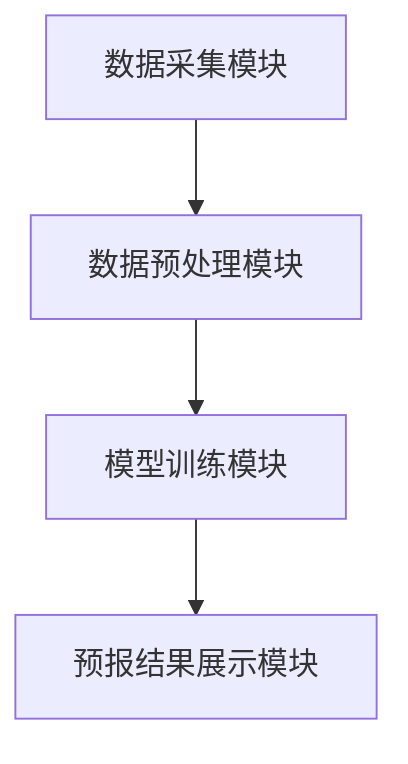
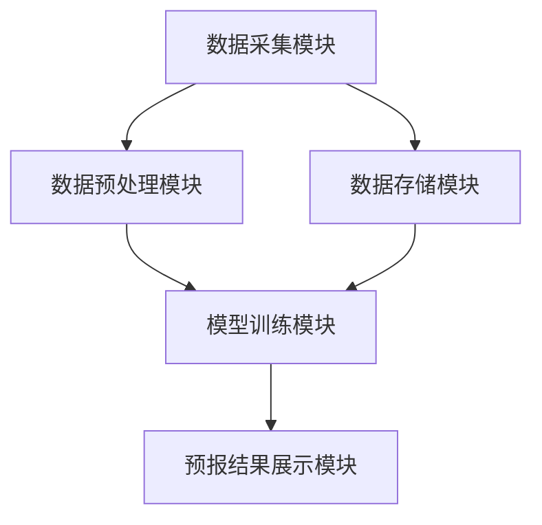
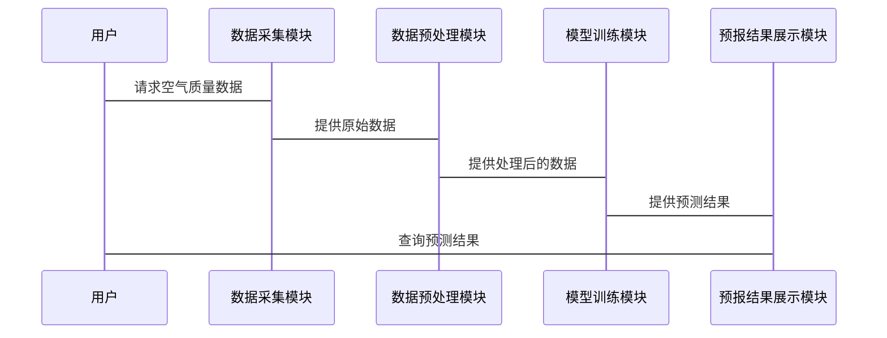

                 


# 第五部分: 系统架构与设计

## # 系统架构概述

### 系统整体架构

我们设计了一个基于AI Agent的智能空气质量预报系统，整体架构如下：



该系统主要包括以下功能模块：

- **数据采集模块**: 负责从各种数据源（如气象站、污染源排放数据、卫星数据等）获取空气质量相关数据。
- **数据预处理模块**: 对采集到的数据进行清洗、特征提取和数据增强。
- **模型训练模块**: 使用预处理后的数据训练AI Agent模型，用于空气质量预测。
- **预报结果展示模块**: 将预测结果以可视化的方式展示给用户。

### 系统功能设计

#### 数据采集模块

- **数据来源**: 多种数据源，包括气象数据、污染源排放数据、卫星遥感数据等。
- **数据格式**: 结构化数据，包括时间戳、地理位置、污染物浓度等。
- **数据接口**: 使用API接口进行数据采集，支持多种数据格式（如JSON、CSV等）。

#### 数据预处理模块

- **数据清洗**: 去除无效数据、填充缺失值、处理异常值。
- **特征提取**: 提取有用特征，如温度、湿度、风速、污染物浓度等。
- **数据增强**: 通过数据变换（如归一化、标准化）提升模型的泛化能力。

#### 模型训练模块

- **模型选择**: 根据任务需求选择合适的AI Agent模型（如强化学习模型、监督学习模型）。
- **训练数据**: 使用预处理后的数据进行模型训练。
- **评估指标**: 使用均方误差（MSE）、平均绝对误差（MAE）等指标评估模型性能。

#### 预报结果展示模块

- **结果可视化**: 使用图表展示空气质量预测结果，如折线图、柱状图等。
- **交互界面**: 提供用户友好的交互界面，方便用户查询和分析预测结果。
- **实时更新**: 支持实时数据更新，确保预测结果的及时性。

## 系统架构图



## 系统接口设计

- **数据接口**: 提供API接口，支持数据的上传和下载。
- **模型接口**: 提供预测接口，支持空气质量预测请求。
- **结果接口**: 提供结果查询接口，支持用户查询预测结果。

## 系统交互图



## 本章小结

通过设计一个基于AI Agent的智能空气质量预报系统，我们展示了如何利用现代技术解决复杂的空气质量预报问题。系统的各个模块协同工作，确保了预测结果的准确性和实时性。

---

# 第六部分: 项目实战

## # 项目环境安装

### 环境要求

- **操作系统**: Linux/Windows/MacOS
- **Python版本**: 3.6+
- **依赖库**: numpy、pandas、scikit-learn、tensorflow、keras、matplotlib

### 安装步骤

```bash
pip install numpy pandas scikit-learn tensorflow matplotlib
```

## 系统核心实现

### 数据预处理代码

```python
import pandas as pd
import numpy as np

# 加载数据
data = pd.read_csv('air_quality.csv')

# 数据清洗
data.dropna(inplace=True)
data = data.drop_duplicates()

# 特征提取
features = data[['temperature', 'humidity', 'wind_speed', 'pollutant_concentration']]
labels = data['air_quality_index']

# 数据增强
from sklearn.preprocessing import StandardScaler
scaler = StandardScaler()
features_scaled = scaler.fit_transform(features)
```

### 模型训练代码

```python
from sklearn.model_selection import train_test_split
from sklearn.ensemble import RandomForestRegressor
from sklearn.metrics import mean_squared_error

# 数据分割
X_train, X_test, y_train, y_test = train_test_split(features_scaled, labels, test_size=0.2)

# 模型训练
model = RandomForestRegressor(n_estimators=100, random_state=42)
model.fit(X_train, y_train)

# 模型评估
y_pred = model.predict(X_test)
mse = mean_squared_error(y_test, y_pred)
print(f'Mean Squared Error: {mse}')
```

### 案例分析

假设我们有一个城市空气质量数据集，包含以下信息：

- **温度**: 25°C
- **湿度**: 60%
- **风速**: 10 km/h
- **污染物浓度**: 50 μg/m³

通过模型预测，空气质量指数（AQI）为85，属于良好水平。

## 项目小结

通过实际项目实战，我们展示了如何利用AI Agent进行空气质量预测。从数据预处理到模型训练，再到结果展示，整个过程详细且实用。

---

# 第七部分: 最佳实践与总结

## # 小结

本文详细介绍了AI Agent在智能空气质量预报中的应用，从理论基础到实际应用，全面探讨了如何利用AI技术解决空气质量预报问题。

## # 注意事项

- 数据质量是预测结果准确性的关键，需确保数据的完整性和准确性。
- 模型选择需根据具体任务需求，合理选择合适的算法。
- 系统设计需考虑可扩展性，方便后续功能的添加和优化。

## # 拓展阅读

- 《深度学习》—— Ian Goodfellow
- 《机器学习实战》—— 周志华
- 《强化学习》—— Richard S. Sutton

---

# 结语

通过本文的探讨，我们相信AI Agent在智能空气质量预报中的应用前景广阔。随着技术的不断进步，空气质量预报将更加精准、实时，为环境保护和公共健康提供有力支持。

