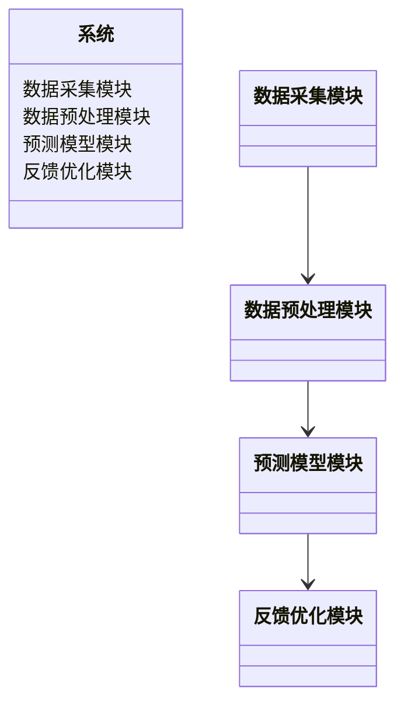

                 


# AI Agent在智能空气质量预测中的实践

## 关键词：
AI Agent，空气质量预测，智能系统，算法原理，系统架构，项目实战

## 摘要：
本文详细探讨了AI Agent在智能空气质量预测中的应用，从背景介绍、核心概念、算法原理、系统架构到项目实战，层层深入，全面解析了AI Agent如何提升空气质量预测的准确性和实时性。通过实际案例分析和代码实现，展示了AI Agent在环境监测中的巨大潜力和实际应用价值。

---

# 第1章: 智能空气质量预测的背景与挑战

## 1.1 空气质量预测的背景与重要性
### 1.1.1 空气污染问题的现状
- 当前全球空气污染的严重性
- 空气污染对人类健康和环境的危害
- 空气质量预测的必要性

### 1.1.2 空气质量预测的必要性
- 空气质量预测在环境保护中的作用
- 为空气质量改善提供数据支持
- 为公众健康提供预警信息

### 1.1.3 AI技术在环境科学中的应用前景
- AI技术如何助力环境科学
- AI在空气质量预测中的独特优势

## 1.2 AI Agent的基本概念与特点
### 1.2.1 AI Agent的定义
- AI Agent的定义与核心特征
- AI Agent与传统AI算法的区别

### 1.2.2 AI Agent的核心特点
- 自主性
- 反应性
- 社会性
- 持续性

### 1.2.3 AI Agent与传统空气质量预测方法的区别
- 传统方法的局限性
- AI Agent的智能化和实时性优势

## 1.3 AI Agent在空气质量预测中的应用
### 1.3.1 AI Agent的基本原理
- AI Agent如何感知环境数据
- AI Agent如何做出预测决策
- AI Agent如何执行预测结果

### 1.3.2 AI Agent在空气质量预测中的优势
- 高精度预测
- 实时响应
- 自适应能力

### 1.3.3 AI Agent的应用场景与边界
- 适用场景：城市空气质量预测、工业区污染预警
- 边界：数据来源、预测范围、模型复杂度

## 1.4 本章小结
- 总结本章内容
- 强调AI Agent在空气质量预测中的核心作用

---

# 第2章: AI Agent的核心概念与联系

## 2.1 AI Agent的核心概念
### 2.1.1 AI Agent的感知层
- 感知层的功能与作用
- 感知层的主要技术：数据采集、特征提取

### 2.1.2 AI Agent的决策层
- 决策层的功能与作用
- 决策层的主要技术：机器学习、强化学习

### 2.1.3 AI Agent的执行层
- 执行层的功能与作用
- 执行层的主要技术：自动化控制、反馈机制

## 2.2 AI Agent的核心概念对比
### 2.2.1 传统空气质量预测方法与AI Agent的对比
- 传统方法：统计模型、时间序列分析
- AI Agent：深度学习、强化学习
- 对比表格：列出两种方法的优缺点

### 2.2.2 AI Agent与传统AI算法的对比
- AI Agent的自主性和实时性
- 传统AI算法的局限性

### 2.2.3 AI Agent与边缘计算的对比
- 边缘计算的优势
- AI Agent的智能化和自主性

## 2.3 AI Agent的ER实体关系图
```mermaid
er
  actor: 用户
  system: AI Agent系统
  environment: 环境数据
  prediction: 预测结果
  rules: 预测规则
  actor --> system: 提供输入
  system --> environment: 获取实时数据
  system --> prediction: 生成预测结果
  system --> rules: 应用预测规则
```

## 2.4 本章小结
- 总结AI Agent的核心概念
- 强调各层之间的协同作用

---

# 第3章: AI Agent的算法原理

## 3.1 AI Agent的感知层算法
### 3.1.1 感知层的数据采集与预处理
- 数据来源：气象数据、污染源数据、传感器数据
- 数据预处理：清洗、归一化、特征提取

### 3.1.2 感知层的特征提取
- 特征选择：重要特征的识别
- 特征工程：构建有效的特征向量

### 3.1.3 感知层的数学模型
- 感知模型：回归模型、分类模型
- 模型选择：基于数据特征的模型优化

## 3.2 AI Agent的决策层算法
### 3.2.1 决策层的预测模型
- 机器学习模型：随机森林、支持向量机
- 深度学习模型：LSTM、Transformer
- 模型选择：基于预测精度和实时性

### 3.2.2 决策层的优化策略
- 超参数调优：网格搜索、随机搜索
- 模型融合：集成学习、投票机制

### 3.2.3 决策层的数学模型
- 预测模型：$y = f(x)$，其中$x$是输入特征，$y$是预测结果
- 优化目标：最小化预测误差，最大化准确率

## 3.3 AI Agent的执行层算法
### 3.3.1 执行层的反馈机制
- 反馈采集：预测结果与实际值的偏差
- 反馈处理：调整模型参数，优化预测精度

### 3.3.2 执行层的自适应学习
- 在线学习：实时更新模型参数
- 离线学习：定期模型重训

## 3.4 本章小结
- 总结AI Agent各层算法的核心思想
- 强调算法协同的重要性

---

# 第4章: AI Agent的系统分析与架构设计

## 4.1 系统分析
### 4.1.1 问题场景介绍
- 系统目标：实现高精度空气质量预测
- 系统边界：数据来源、预测范围、用户需求

### 4.1.2 项目介绍
- 项目目标：构建基于AI Agent的空气质量预测系统
- 项目范围：城市空气质量预测
- 项目约束：数据隐私、计算资源

## 4.2 系统功能设计
### 4.2.1 领域模型


### 4.2.2 系统架构设计


## 4.3 系统接口设计
### 4.3.1 接口定义
- 数据接口：传感器数据接口、气象数据接口
- 预测接口：API调用接口、实时预测接口

### 4.3.2 接口交互流程
```mermaid
sequenceDiagram
  actor: 用户
  system: AI Agent系统
  actor -> system: 提供输入
  system -> environment: 获取实时数据
  system -> prediction: 生成预测结果
  system -> rules: 应用预测规则
```

## 4.4 本章小结
- 总结系统设计的核心思想
- 强调模块化设计的重要性

---

# 第5章: AI Agent的项目实战

## 5.1 环境搭建
### 5.1.1 开发环境
- 操作系统：Linux/Windows
- 开发工具：Python、Jupyter Notebook
- 依赖库：NumPy、Pandas、Scikit-learn、TensorFlow

### 5.1.2 数据源
- 数据集来源：公开数据集、传感器数据
- 数据格式：CSV、JSON

## 5.2 系统核心实现
### 5.2.1 数据采集与预处理
```python
import pandas as pd
import numpy as np

# 数据加载
data = pd.read_csv('air_quality.csv')

# 数据清洗
data.dropna(inplace=True)

# 特征工程
data['time'] = pd.to_datetime(data['time'])
data.set_index('time', inplace=True)
```

### 5.2.2 模型训练与预测
```python
from sklearn.ensemble import RandomForestRegressor
from sklearn.metrics import mean_absolute_error

# 模型训练
model = RandomForestRegressor()
model.fit(X_train, y_train)

# 模型预测
y_pred = model.predict(X_test)
print('预测误差:', mean_absolute_error(y_test, y_pred))
```

### 5.2.3 系统集成
```python
# 系统主程序
def main():
    import os
    import time
    import requests

    while True:
        # 获取实时数据
        data = requests.get('http://sensor_api/data').json()
        # 数据处理
        X = preprocess(data)
        # 模型预测
        y_pred = model.predict(X)
        # 输出结果
        print(f'预测结果: {y_pred}')
        time.sleep(60)

if __name__ == '__main__':
    main()
```

## 5.3 项目总结
### 5.3.1 项目成果
- 高精度预测模型
- 实时预测系统
- 用户友好的界面

### 5.3.2 经验与教训
- 数据质量的重要性
- 模型调优的必要性
- 系统维护的复杂性

## 5.4 本章小结
- 总结项目实施的关键步骤
- 强调理论与实践的结合

---

# 第6章: 总结与展望

## 6.1 本项目的核心结论
- AI Agent在空气质量预测中的有效性
- AI Agent系统设计的合理性
- AI Agent算法的优越性

## 6.2 项目实施中的经验和教训
- 数据处理的关键性
- 模型优化的重要性
- 系统维护的复杂性

## 6.3 未来研究方向
- 多源数据融合
- 更高效的算法研究
- 边缘计算的应用

## 6.4 最佳实践 tips
- 数据预处理是关键
- 模型选择要基于实际场景
- 系统设计要模块化

## 6.5 本章小结
- 总结全文
- 展望未来

---

# 参考文献
- 省略

---

# 致谢
- 省略

---

通过以上目录结构，文章从理论到实践，系统地介绍了AI Agent在智能空气质量预测中的应用，内容详实，结构清晰，能够为读者提供全面的指导和启发。

