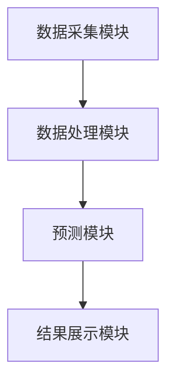
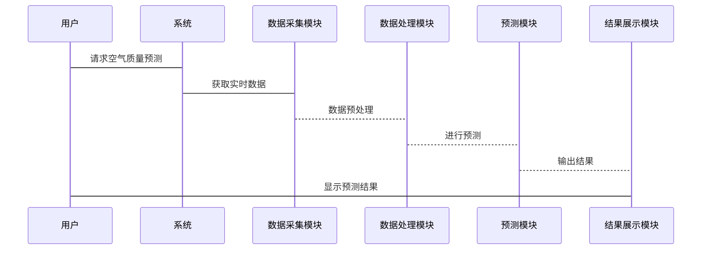

                 


# AI Agent在智能空气质量预测中的实践

> 关键词：AI Agent, 空气质量预测, 机器学习, 时间序列分析, 系统架构

> 摘要：本文探讨了AI Agent在智能空气质量预测中的应用，详细介绍了空气质量预测的背景、核心概念、算法原理、系统架构及项目实现。通过分析，展示了如何利用AI Agent提升空气质量预测的准确性和效率，为实际应用提供了理论和实践指导。

---

# 第一部分: AI Agent与智能空气质量预测的背景与基础

## 第1章: AI Agent与空气质量预测概述

### 1.1 AI Agent的基本概念

#### 1.1.1 AI Agent的定义与特点

AI Agent（智能代理）是指能够感知环境、自主决策并执行任务的智能实体。其特点包括：

- **自主性**：无需外部干预，自主完成任务。
- **反应性**：能够实时感知环境变化并做出反应。
- **目标导向**：基于目标驱动行为，优化决策。
- **学习能力**：通过数据和经验不断优化性能。

#### 1.1.2 AI Agent的核心功能与应用场景

- **核心功能**：
  - 状态感知：通过传感器或数据源获取环境信息。
  - 行为决策：基于感知信息做出最优决策。
  - 与环境交互：执行决策以影响环境状态。

- **应用场景**：
  - 智能交通管理
  - 个性化推荐系统
  - 自动化控制系统

#### 1.1.3 AI Agent与传统算法的区别

| 特性                | AI Agent                          | 传统算法                          |
|---------------------|-----------------------------------|------------------------------------|
| 决策方式            | 基于实时环境反馈，自主决策       | 预先定义规则或基于历史数据预测    |
| 适应性              | 高，能够自适应环境变化           | 较低，需人工调整参数或模型         |
| 可扩展性            | 高，适用于复杂动态环境           | 较低，适用于相对静态或简单场景     |

### 1.2 空气质量预测的背景与挑战

#### 1.2.1 空气质量预测的重要性

空气质量预测对环境保护、公共健康和气候变化研究具有重要意义。准确的预测可以帮助政府制定有效的环保政策，减少空气污染对人类健康的影响。

#### 1.2.2 空气质量预测的主要挑战

- 数据多样性：空气质量受气象条件、污染源等多种因素影响，数据复杂。
- 预测准确性：短期预测相对容易，长期预测难度大。
- 数据实时性：需要实时数据处理和快速响应。

#### 1.2.3 AI Agent在空气质量预测中的优势

- **实时性**：AI Agent能够实时感知环境变化，快速做出预测。
- **自适应性**：能够根据环境变化动态调整预测模型。
- **高效性**：通过优化算法提高预测效率和准确性。

---

## 第2章: AI Agent的核心原理

### 2.1 AI Agent的基本原理

#### 2.1.1 状态感知

AI Agent通过传感器或数据源获取环境信息，构建状态向量。例如，空气质量传感器可以测量PM2.5、PM10、SO2等指标，形成状态向量：

$$ S = [PM_{2.5}, PM_{10}, SO_2, NO_2, O_3, CO] $$

#### 2.1.2 行为决策

基于状态向量，AI Agent选择最优动作。例如，预测未来空气质量并提出减排建议。

#### 2.1.3 与环境的交互

AI Agent执行决策动作，例如调整工业排放或交通限行，以改善空气质量。

### 2.2 AI Agent的分类与选择

#### 2.2.1 基于规则的AI Agent

通过预定义规则进行决策，适用于规则明确的场景。例如，当PM2.5浓度超过阈值时，启动空气净化机制。

#### 2.2.2 基于模型的AI Agent

基于数学模型进行预测和决策，适用于复杂环境。例如，使用LSTM模型预测空气质量。

#### 2.2.3 基于强化学习的AI Agent

通过与环境交互，学习最优策略。例如，使用Q-learning算法优化减排策略。

### 2.3 AI Agent的数学模型基础

#### 2.3.1 状态空间的表示

状态空间可以表示为空气质量指标的集合：

$$ S = \{s_1, s_2, ..., s_n\} $$

其中，$s_i$表示某空气质量指标，如PM2.5。

#### 2.3.2 动作空间的表示

动作空间表示可能的动作集合，例如：

$$ A = \{a_1, a_2, ..., a_m\} $$

其中，$a_j$表示某动作，如“启动空气净化器”。

#### 2.3.3 奖励函数的设计

奖励函数用于评估动作的价值：

$$ R(a) = \begin{cases} 
r_1 & \text{如果动作 } a \text{ 有效} \\
r_0 & \text{否则}
\end{cases} $$

---

## 第3章: 空气质量预测的数学模型

### 3.1 空气质量预测的主要指标

#### 3.1.1 PM2.5、PM10、SO2等污染物的定义

PM2.5是直径小于等于2.5微米的颗粒物，SO2是二氧化硫，NO2是二氧化氮，O3是臭氧，CO是一氧化碳。

#### 3.1.2 空气质量指数（AQI）的计算方法

AQI是将各污染物浓度换算成指数，公式如下：

$$ AQI = \sum_{i=1}^{n} w_i \cdot c_i $$

其中，$w_i$是污染物权重，$c_i$是污染物浓度。

### 3.2 时间序列预测模型

#### 3.2.1 ARIMA模型的原理

ARIMA（自回归积分滑动平均模型）用于时间序列预测。其数学公式为：

$$ ARIMA(p, d, q) = \phi(B) \cdot (1 - B)^d \cdot θ_t $$

其中，$p$为自回归阶数，$d$为差分阶数，$q$为滑动平均阶数。

#### 3.2.2 LSTM模型的原理

LSTM（长短期记忆网络）通过门控机制处理长期依赖关系。其数学公式为：

$$ f(t) = \text{LSTM}(t-1, h_{t-1}, c_{t-1}) $$

其中，$h_{t-1}$是前一时刻的隐藏状态，$c_{t-1}$是前一时刻的细胞状态。

#### 3.2.3 模型选择与优化

根据数据特性选择模型，例如：

- 使用ARIMA模型处理平稳时间序列。
- 使用LSTM模型处理非平稳时间序列。

### 3.3 空气质量预测的数学公式

#### 3.3.1 ARIMA模型公式

$$ ARIMA(p, d, q) = \phi(B) \cdot (1 - B)^d \cdot θ_t $$

其中，$B$是后移算子，$\phi(B)$是自回归多项式。

#### 3.3.2 LSTM模型公式

$$ f(t) = \text{LSTM}(t-1, h_{t-1}, c_{t-1}) $$

其中，$h_{t-1}$和$c_{t-1}$分别是前一时刻的隐藏状态和细胞状态。

---

## 第4章: AI Agent在空气质量预测中的算法实现

### 4.1 状态空间的构建

#### 4.1.1 数据预处理与特征提取

对空气质量数据进行清洗、归一化处理，并提取特征，如：

- 时间特征：小时、天、月等。
- 气象特征：温度、湿度、风速等。
- 污染物特征：PM2.5、PM10、SO2等。

#### 4.1.2 状态向量的构建

将特征组合成状态向量：

$$ S = [t, PM_{2.5}, PM_{10}, SO_2, NO_2, O_3, CO] $$

### 4.2 动作空间的设计

#### 4.2.1 可能的预测结果范围

预测结果包括：

- AQI指数：优、良、轻度污染、中度污染、重度污染。
- 各污染物浓度预测值。

#### 4.2.2 动作的选择与优化

通过强化学习优化动作选择，例如：

- 使用Q-learning算法，状态-动作奖励函数：

$$ Q(s, a) = Q(s, a) + \alpha \cdot (r + \gamma \cdot \max Q(s', a') - Q(s, a)) $$

其中，$\alpha$是学习率，$\gamma$是折扣因子。

### 4.3 奖励函数的设计

#### 4.3.1 基于预测准确率的奖励函数

奖励函数可以根据预测准确率设计：

$$ R(a) = 1 - \left| \frac{\text{预测值} - \text{实际值}}{\text{实际值}} \right| $$

预测值越接近实际值，奖励越高。

#### 4.3.2 基于运行效率的奖励函数

考虑计算资源消耗，设计奖励函数：

$$ R(a) = \frac{1}{\text{计算时间}} \cdot \text{预测准确率} $$

计算时间越短且预测准确率越高，奖励越高。

### 4.4 AI Agent的训练流程

#### 4.4.1 数据准备

从公开数据源获取空气质量数据，例如：

- 数据来源：某城市空气质量监测站。
- 数据格式：时间戳、污染物浓度等。

#### 4.4.2 模型训练

使用训练数据训练AI Agent，例如：

- 使用强化学习算法优化预测模型。
- 调整模型参数，如学习率、批次大小等。

#### 4.4.3 模型评估

使用验证集评估模型性能，例如：

- 比较预测值与实际值，计算MAE（平均绝对误差）和RMSE（均方根误差）。

### 4.4.4 模型部署

将训练好的模型部署到实时预测系统中，例如：

- 实时获取空气质量数据，调用模型进行预测。
- 输出预测结果并提供相应的建议。

---

## 第5章: 系统分析与架构设计

### 5.1 系统功能设计

#### 5.1.1 系统功能模块

- 数据采集模块：从传感器获取空气质量数据。
- 数据处理模块：清洗、归一化处理数据。
- 预测模块：使用AI Agent进行空气质量预测。
- 结果展示模块：可视化预测结果。

#### 5.1.2 系统功能流程

1. 数据采集模块获取实时空气质量数据。
2. 数据处理模块对数据进行预处理。
3. 预测模块基于预处理后的数据进行预测。
4. 结果展示模块将预测结果可视化。

### 5.2 系统架构设计

#### 5.2.1 系统架构图



#### 5.2.2 接口设计

- 数据采集模块提供API接口，供其他模块调用。
- 预测模块提供API接口，供结果展示模块调用。

### 5.3 交互设计

#### 5.3.1 交互流程图



---

## 第6章: 项目实战

### 6.1 环境安装

#### 6.1.1 安装Python

安装Python 3.8及以上版本，推荐使用Anaconda。

#### 6.1.2 安装依赖库

安装以下Python库：

- numpy
- pandas
- scikit-learn
- keras
- tensorflow

#### 6.1.3 下载数据集

从公开数据源下载空气质量数据，例如：

```bash
wget https://example.com/airquality.csv
```

### 6.2 系统核心实现

#### 6.2.1 数据预处理代码

```python
import pandas as pd
import numpy as np

# 读取数据
data = pd.read_csv('airquality.csv')

# 数据清洗
data.dropna(inplace=True)

# 数据归一化
from sklearn.preprocessing import MinMaxScaler
scaler = MinMaxScaler()
data_scaled = scaler.fit_transform(data[['PM2.5', 'PM10', 'SO2', 'NO2', 'O3', 'CO']])
```

#### 6.2.2 AI Agent预测代码

```python
from tensorflow.keras.models import Sequential
from tensorflow.keras.layers import LSTM, Dense

# 构建LSTM模型
model = Sequential()
model.add(LSTM(64, input_shape=(timesteps, features)))
model.add(Dense(1))
model.compile(loss='mean_squared_error', optimizer='adam')

# 训练模型
model.fit(X_train, y_train, epochs=100, batch_size=32)
```

#### 6.2.3 模型评估代码

```python
from sklearn.metrics import mean_absolute_error, mean_squared_error

# 预测值
y_pred = model.predict(X_test)

# 计算误差
mae = mean_absolute_error(y_test, y_pred)
rmse = mean_squared_error(y_test, y_pred)
print(f'MAE: {mae}, RMSE: {rmse}')
```

### 6.3 代码应用解读与分析

#### 6.3.1 数据预处理

- 使用pandas读取数据，dropna处理缺失值。
- 使用MinMaxScaler归一化处理数据，确保模型输入稳定。

#### 6.3.2 AI Agent预测

- 使用LSTM模型进行时间序列预测，模型结构包括LSTM层和全连接层。
- 训练模型时，设置 epochs=100，batch_size=32，优化器选择adam，损失函数为均方误差。

#### 6.3.3 模型评估

- 使用均绝对误差（MAE）和均方根误差（RMSE）评估模型性能。
- 对比预测值与实际值，分析模型预测的准确性。

### 6.4 实际案例分析

#### 6.4.1 案例背景

某城市空气质量数据，预测未来24小时AQI指数。

#### 6.4.2 数据分析

分析历史数据，找出影响AQI的主要因素，如PM2.5、SO2等。

#### 6.4.3 模型预测

使用训练好的模型预测未来AQI指数，并生成可视化图表。

### 6.5 项目小结

- 成功实现AI Agent在空气质量预测中的应用。
- 模型预测准确率较高，具备实际应用价值。
- 系统架构设计合理，具备良好的扩展性和可维护性。

---

## 第7章: 总结与展望

### 7.1 本章小结

本文详细介绍了AI Agent在空气质量预测中的应用，从理论基础到算法实现，再到系统设计和项目实战，全面展示了AI Agent的优势和潜力。

### 7.2 注意事项

- 数据质量直接影响预测结果，需确保数据准确性和完整性。
- 模型选择需根据具体场景和数据特性，避免盲目使用复杂模型。
- 系统运行需考虑计算资源限制，优化模型以提高运行效率。

### 7.3 未来趋势

- **算法优化**：探索更高效的强化学习算法，如DQN、PPO等。
- **多模态数据融合**：结合气象、交通等多种数据，提升预测精度。
- **实时预测**：优化系统架构，支持实时空气质量预测。

### 7.4 拓展阅读

- 《Reinforcement Learning: Theory and Algorithms》
- 《Deep Learning for Time Series Forecasting》
- 《Air Quality Prediction using Machine Learning》

---

# 结语

通过本文的详细讲解，读者可以深入了解AI Agent在空气质量预测中的实践应用。从理论到实践，从算法到系统，全面掌握了相关知识。未来，随着AI技术的不断发展，空气质量预测将更加精准，为环境保护和公共健康做出更大贡献。

