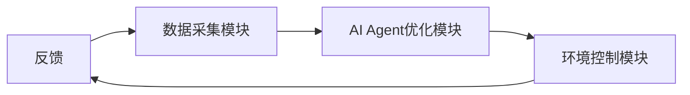
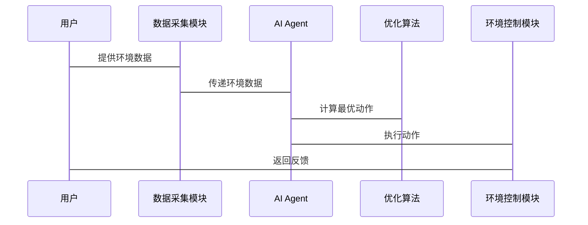

                 


# AI Agent在智能空调中的个性化舒适度优化

## 关键词：AI Agent，智能空调，个性化舒适度，强化学习，系统架构，项目实战

## 摘要：  
本文探讨了AI Agent在智能空调中的应用，重点分析了如何通过AI Agent实现个性化舒适度优化。从背景介绍到系统架构设计，再到项目实战，详细阐述了AI Agent在智能空调中的工作原理、算法实现和实际应用。通过案例分析和代码实现，展示了AI Agent如何根据用户需求和环境变化，实时调整空调参数，实现个性化的舒适体验。

---

## 第一部分: AI Agent在智能空调中的个性化舒适度优化背景介绍

### 第1章: AI Agent与个性化舒适度优化概述

#### 1.1 AI Agent的基本概念
##### 1.1.1 AI Agent的定义  
AI Agent（人工智能代理）是一种能够感知环境、做出决策并执行任务的智能实体。它可以理解用户需求，主动优化系统行为，以实现目标。

##### 1.1.2 AI Agent的核心特征  
- **自主性**：能够独立运行，无需人工干预。  
- **反应性**：能实时感知环境变化并做出反应。  
- **学习能力**：通过数据和反馈不断优化性能。  

##### 1.1.3 AI Agent与传统控制系统的区别  
AI Agent能够主动学习和优化，而传统控制系统仅根据预设规则运行。AI Agent能够根据用户需求动态调整，而传统系统则固定执行预设逻辑。

#### 1.2 舒适度优化的背景与意义
##### 1.2.1 舒适度评价模型  
舒适度评价模型基于用户的感知，考虑温度、湿度、空气质量等多种因素，通过数学模型计算出用户的舒适度得分。

##### 1.2.2 现有空调系统的局限性  
传统空调系统基于固定的温度设置运行，无法根据用户的个性化需求和环境变化进行实时调整。

##### 1.2.3 AI Agent在舒适度优化中的作用  
AI Agent通过实时感知用户需求和环境数据，动态调整空调参数，实现个性化舒适度优化。

#### 1.3 AI Agent在智能空调中的应用
##### 1.3.1 智能空调的发展现状  
当前智能空调已具备联网功能，能够通过手机APP远程控制，但缺乏智能化的个性化舒适度优化能力。

##### 1.3.2 AI Agent在智能空调中的具体应用  
- 根据用户行为模式优化空调运行策略。  
- 实时感知环境数据，动态调整温度、湿度等参数。  
- 提供个性化舒适度建议，如基于用户习惯推荐最佳温度设置。  

##### 1.3.3 个性化舒适度优化的目标与边界  
目标是通过AI Agent实现个性化的舒适体验，边界包括用户隐私保护和系统安全。

---

## 第2章: 个性化舒适度优化的核心概念与联系

### 2.1 核心概念原理
#### 2.1.1 舒适度评价模型  
舒适度评价模型将用户感知的舒适度转化为数学模型，考虑温度、湿度、空气质量等多个因素。

#### 2.1.2 AI Agent的感知与决策机制  
AI Agent通过传感器获取环境数据，结合用户需求，使用强化学习算法做出决策。

#### 2.1.3 个性化需求的动态变化  
用户的个性化需求会随着时间变化，如不同时间的温度偏好。

### 2.2 核心概念属性特征对比
#### 2.2.1 不同舒适度优化方法的对比分析  
| 方法             | 优点                          | 缺点                          |
|------------------|-------------------------------|-------------------------------|
| 基于规则的优化   | 实现简单，易于部署             | 需人工调整规则，缺乏灵活性     |
| 基于模型的优化   | 能够自动学习优化策略           | 需大量数据训练，计算成本高     |

#### 2.2.2 AI Agent与其他优化算法的对比  
| 算法             | 优点                          | 缺点                          |
|------------------|-------------------------------|-------------------------------|
| 强化学习          | 能够自主学习优化策略           | 需大量数据和计算资源            |
| 监督学习          | 可以根据历史数据预测最优解     | 无法实时调整策略               |

#### 2.2.3 用户需求与环境因素的对比  
用户需求是个性化舒适度优化的核心，环境因素是实现优化的基础。

### 2.3 ER实体关系图架构
```mermaid
er
    actor 用户 {
        key 用户ID
        属性 个性化需求
    }
    actor 环境 {
        key 环境ID
        属性 温度, 湿度, 光线
    }
    actor AI Agent {
        key 代理ID
        属性 优化策略, 决策模型
    }
    用户 --> 环境: 提供需求
    环境 --> AI Agent: 提供环境数据
    AI Agent --> 用户: 提供舒适度建议
```

---

## 第三部分: AI Agent在个性化舒适度优化中的算法原理

### 第3章: 强化学习算法实现舒适度优化

#### 3.1 强化学习算法的原理
- AI Agent通过与环境交互，学习最优策略。  
- 算法通过奖励机制优化动作选择。

#### 3.2 算法实现步骤


#### 3.3 Python实现代码
```python
import numpy as np
from collections import deque

class AI-Agent:
    def __init__(self):
        self.Q = np.zeros((state_space, action_space))
    
    def choose_action(self, state):
        # 探索与利用策略
        if np.random.random() < 0.1:
            return np.random.randint(action_space)
        else:
            return np.argmax(self.Q[state])
    
    def update_Q(self, state, action, reward):
        self.Q[state][action] = self.Q[state][action] * 0.9 + reward
```

#### 3.4 数学模型与公式
- 状态转移概率：$P(s' | s, a)$  
- 奖励函数：$R(s, a)$  
- Q-learning更新公式：$$ Q(s, a) = Q(s, a) \times \alpha + (R + \gamma \max Q(s', a')) $$  

---

## 第四部分: 系统分析与架构设计方案

### 第4章: 个性化舒适度优化系统分析

#### 4.1 系统功能设计
- 数据采集：温度、湿度、用户反馈。  
- 优化算法：强化学习模型。  
- 用户界面：显示舒适度建议。

#### 4.2 系统架构设计


#### 4.3 交互序列图


---

## 第五部分: 项目实战

### 第5章: 个性化舒适度优化项目实现

#### 5.1 环境安装
```bash
pip install numpy
pip install matplotlib
```

#### 5.2 核心代码实现
```python
import numpy as np
import matplotlib.pyplot as plt

class ComfortOptimizer:
    def __init__(self):
        self.temperature = 25  # 初始温度
        self.humidity = 50     # 初始湿度
    
    def calculate_comfort(self):
        # 舒适度计算公式
        return 0.6 * self.temperature + 0.4 * self.humidity
    
    def optimize(self, desired_comfort):
        # 模拟优化过程
        while self.calculate_comfort() < desired_comfort:
            self.temperature += 0.5
            self.humidity += 0.3
        return self.temperature, self.humidity

# 示例
optimizer = ComfortOptimizer()
target_comfort = 80
optimized_temp, optimized_hum = optimizer.optimize(target_comfort)
print(f"优化后的温度：{optimized_temp}，湿度：{optimized_hum}")
```

#### 5.3 案例分析
```python
# 案例：用户偏好较高的温度和较低的湿度
user_preference = {'temperature': 27, 'humidity': 40}
optimizer = ComfortOptimizer()
optimized_temp, optimized_hum = optimizer.optimize(user_preference['temperature'] * 0.6 + user_preference['humidity'] * 0.4)
print(f"优化后的温度：{optimized_temp}，湿度：{optimized_hum}")
```

---

## 第六部分: 最佳实践

### 第6章: 个性化舒适度优化的经验总结

#### 6.1 小结
AI Agent能够有效优化智能空调的个性化舒适度，通过强化学习算法实现动态调整。

#### 6.2 注意事项
- 数据隐私保护  
- 系统稳定性保障  
- 用户反馈的及时性  

#### 6.3 扩展阅读
- 《强化学习：理论与算法》  
- 《智能系统设计与实现》  

---

## 结语  
通过本文的详细讲解，读者可以全面了解AI Agent在智能空调中的个性化舒适度优化的原理、算法实现和实际应用。希望本文能为相关领域的研究和实践提供有价值的参考。

