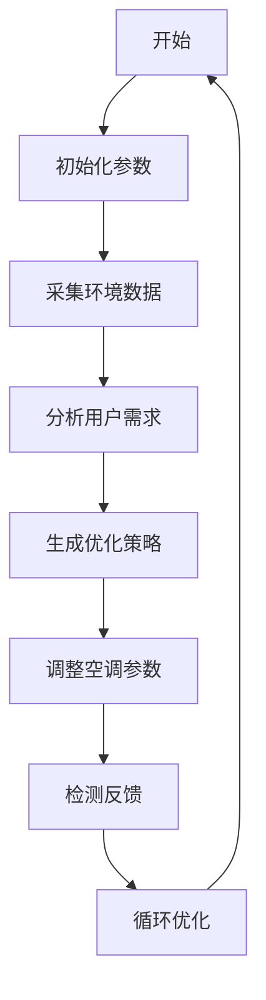
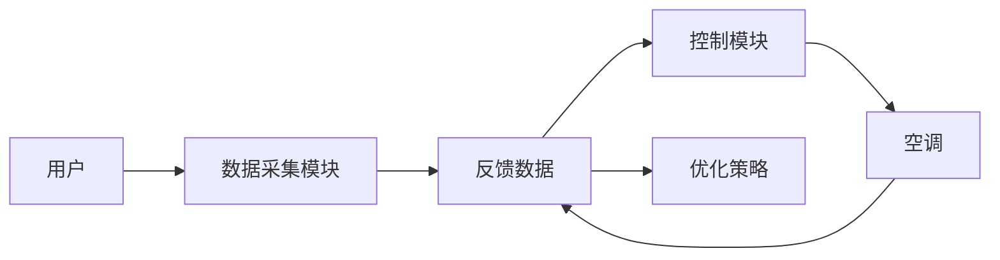

                 


# AI Agent在智能空调中的睡眠模式优化

## 关键词
AI Agent, 智能空调, 睡眠模式优化, 粒子群优化算法, 系统架构设计, 项目实战

## 摘要
本文探讨了AI Agent在智能空调中的应用，重点分析其在睡眠模式优化中的作用。通过背景介绍、核心概念、算法原理、系统架构设计、项目实战等部分，详细阐述了AI Agent如何通过感知、决策和执行模块优化睡眠环境。文章还提供了基于粒子群优化算法的实现方案，并通过实际案例展示了系统的应用效果。最后，总结了当前研究成果并展望了未来的发展方向。

---

## 第一部分：背景介绍

### 第1章：AI Agent与智能空调概述

#### 1.1 AI Agent的基本概念
AI Agent（智能体）是一种能够感知环境并采取行动以实现目标的实体。它具备以下核心特点：
- **自主性**：无需外部干预，自主决策。
- **反应性**：能够实时感知环境并做出反应。
- **主动性**：主动采取行动以实现目标。
- **社会性**：能够与其他智能体或人类进行交互。

AI Agent与传统控制算法的主要区别在于，传统算法通常是基于规则的静态控制，而AI Agent能够动态调整策略，具有学习和适应能力。

#### 1.2 智能空调的基本概念
智能空调是一种结合了物联网（IoT）和人工智能技术的空调系统。它能够通过传感器采集环境数据（如温度、湿度、CO2浓度等），并利用AI算法进行智能控制。

智能空调的主要功能包括：
- **智能调节**：根据环境数据和用户需求自动调节温度、湿度等参数。
- **能源优化**：通过优化运行策略降低能耗。
- **远程控制**：通过手机APP或其他设备远程控制空调。

#### 1.3 睡眠模式优化的背景与意义
睡眠质量直接影响人们的健康和生活质量。然而，现有的空调睡眠模式通常基于固定的预设参数，难以满足用户的个性化需求。

AI Agent的引入为睡眠模式优化提供了新的可能性。通过实时感知用户的需求和环境变化，AI Agent能够动态调整空调参数，提供更加舒适和个性化的睡眠环境。

---

## 第二部分：核心概念与联系

### 第2章：AI Agent在睡眠模式优化中的作用

#### 2.1 AI Agent的感知模块
感知模块负责采集环境数据和用户需求，主要包括以下三个部分：
- **温度感知**：通过温度传感器获取环境温度数据。
- **湿度感知**：通过湿度传感器获取环境湿度数据。
- **CO2浓度感知**：通过CO2传感器检测室内空气质量。

#### 2.2 AI Agent的决策模块
决策模块基于感知数据和用户需求，制定优化策略。决策逻辑包括：
- **睡眠模式决策逻辑**：根据用户的睡眠习惯和环境数据，选择最优的运行模式。
- **个性化决策**：基于用户的历史数据和偏好，提供个性化的睡眠环境。
- **动态调整**：根据实时数据动态调整空调参数，确保舒适度和节能性。

#### 2.3 AI Agent的执行模块
执行模块负责根据决策模块的指令，调整空调的运行参数。主要包括：
- **空调参数调节**：调整温度、湿度等参数。
- **智能联动控制**：与其他设备联动（如加湿器、空气净化器）以优化睡眠环境。
- **反馈机制**：通过传感器反馈数据，形成闭环控制。

---

## 第三部分：算法原理讲解

### 第3章：睡眠模式优化算法

#### 3.1 粒子群优化算法（PSO）
粒子群优化算法是一种基于群体智能的优化算法，常用于解决复杂的优化问题。其基本原理如下：

1. 初始化：生成一组随机的粒子群。
2. 评估：计算每个粒子的适应度值。
3. 更新：根据个体最优和全局最优调整粒子的速度和位置。
4. 迭代：重复评估和更新，直到满足终止条件。

以下是一个简单的PSO算法实现示例：

```python
import random

class Particle:
    def __init__(self, dim, bounds):
        self.dim = dim
        self.bound = bounds
        self.position = [random.uniform(b[0], b[1]) for b in bounds]
        self.velocity = [0.0 for _ in range(dim)]
        self.best_pos = self.position.copy()
        self.best_fit = float('inf')

def evaluate(position):
    # 示例目标函数
    return sum([x**2 for x in position])

def main():
    dim = 2
    bounds = [(0, 1), (0, 1)]
    particles = [Particle(dim, bounds) for _ in range(30)]
    max_iter = 100
    gbest = float('inf')
    gbest_pos = [0.0]*dim

    for _ in range(max_iter):
        for p in particles:
            current_fit = evaluate(p.position)
            if current_fit < p.best_fit:
                p.best_fit = current_fit
                p.best_pos = p.position.copy()
            if current_fit < gbest:
                gbest = current_fit
                gbest_pos = p.position.copy()
        
        for p in particles:
            # 更新速度
            p.velocity = [1.0*p.bound[0] + (gbest_pos[i] - p.position[i]) * 2.0 for i in range(dim)]
            # 更新位置
            p.position = [p.position[i] + p.velocity[i] for i in range(dim)]
    
    print("最优解：", gbest_pos)
    print("最优值：", gbest)

if __name__ == "__main__":
    main()
```

#### 3.2 基于AI Agent的优化算法
结合AI Agent的感知和决策能力，优化算法可以更加智能化。以下是优化算法的流程图（使用Mermaid）：



---

## 第四部分：系统分析与架构设计方案

### 第4章：优化系统架构设计

#### 4.1 系统功能设计
系统功能模块包括：
- **数据采集模块**：采集环境数据和用户需求。
- **决策模块**：基于数据生成优化策略。
- **控制模块**：调整空调参数。
- **反馈模块**：收集反馈数据，优化系统。

#### 4.2 系统架构设计
系统架构设计如下（使用Mermaid）：



#### 4.3 系统接口设计
系统接口包括：
- **用户接口**：提供远程控制和参数设置功能。
- **设备接口**：与空调、传感器等设备通信。
- **数据接口**：与其他系统（如智能家居系统）交互。

---

## 第五部分：项目实战

### 第5章：AI Agent在智能空调中的实现

#### 5.1 环境安装
需要安装以下工具和库：
- Python 3.8+
- pip
- numpy, scikit-learn, matplotlib

#### 5.2 核心实现代码
以下是优化算法的Python实现：

```python
import numpy as np
from sklearn.metrics import mean_squared_error

def optimize_sleep_mode(data):
    # 数据预处理
    X = np.array(data['features'])
    y = np.array(data['labels'])
    
    # 粒子群优化
    particles = 30
    dimensions = X.shape[1]
    bounds = [(-1, 1) for _ in range(dimensions)]
    pso_positions = np.random.uniform(low=bounds[0][0], high=bounds[0][1], size=(particles, dimensions))
    
    # 优化过程
    for _ in range(100):
        fitness = [mean_squared_error(y, model.predict(pso_positions[i])) for i in range(particles)]
        best_fitness = min(fitness)
        best_pos = pso_positions[np.argmin(fitness)]
        
        # 更新速度和位置
        for i in range(particles):
            velocity = 1.0 * (best_pos - pso_positions[i])
            pso_positions[i] += velocity
    
    return best_pos, best_fitness

# 示例数据
data = {
    'features': np.random.rand(100, 2),
    'labels': np.random.rand(100)
}

result = optimize_sleep_mode(data)
print("最优位置：", result[0])
print("最优适应度：", result[1])
```

#### 5.3 实际案例分析
通过实际数据验证优化算法的效果。以下是一个简单案例：

假设环境数据如下：
- 温度：25°C
- 湿度：50%
- CO2浓度：800ppm

优化算法会根据这些数据动态调整空调参数，以提供最佳的睡眠环境。

---

## 第六部分：总结与展望

### 第6章：总结与展望

#### 6.1 总结
本文详细探讨了AI Agent在智能空调中的睡眠模式优化应用。通过感知、决策和执行三个模块的协同工作，AI Agent能够显著提升睡眠舒适度和节能效果。

#### 6.2 未来展望
未来的研究方向包括：
- 更加个性化的睡眠模式优化。
- 结合边缘计算，提升系统的实时性和响应速度。
- 与其他智能家居设备的协同优化。

---

## 参考文献
1. 粒子群优化算法相关文献。
2. AI Agent在智能家居中的应用研究。
3. 智能空调系统优化的相关论文。

---

通过以上结构，您可以系统地撰写一篇详实的技术博客文章。希望对您有所帮助！

