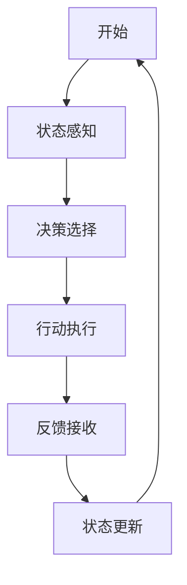
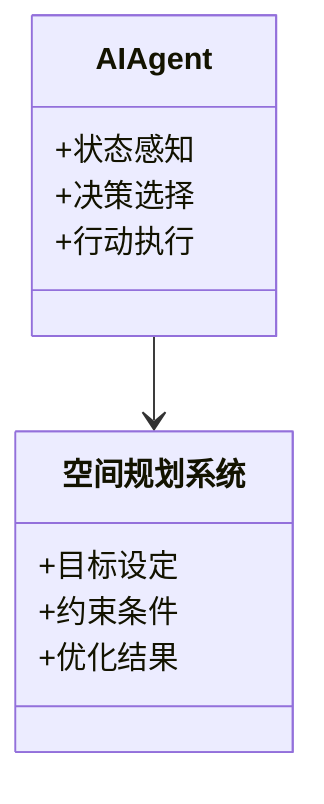
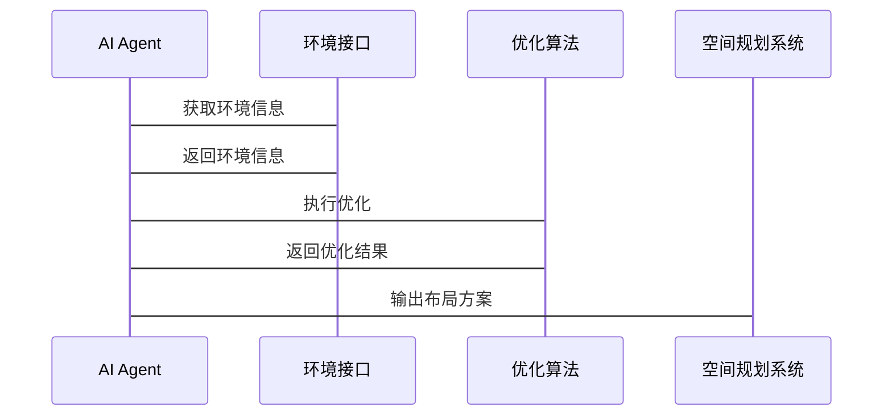

                 


# AI Agent在智能空间规划中的实践

> 关键词：AI Agent，智能空间规划，算法原理，系统架构，项目实战

> 摘要：AI Agent在智能空间规划中发挥着越来越重要的作用。本文从AI Agent的基本概念出发，详细探讨其在空间规划中的应用场景、核心算法原理以及系统架构设计，最后通过项目实战的方式，展示如何将AI Agent应用于实际的空间规划问题中。文章内容丰富，涵盖了从理论到实践的全过程，为读者提供全面的指导。

---

## 第一部分: AI Agent与智能空间规划的背景与概念

### 第1章: AI Agent在智能空间规划中的背景与问题背景

#### 1.1 智能空间规划的定义与特点

智能空间规划是指通过智能化的方法和技术，对空间进行优化布局、资源分配和决策的过程。其核心目标是提高空间的利用效率，降低成本，并满足用户的需求。

- **定义**：智能空间规划是一种结合人工智能、大数据和优化算法的综合性技术，旨在通过智能化手段实现空间的高效利用。
- **特点**：
  - **智能化**：利用AI技术实现自主决策。
  - **动态性**：能够实时感知环境变化并做出调整。
  - **高效性**：通过优化算法提高空间利用效率。

- **应用场景**：
  - **室内设计**：优化家具布局。
  - **城市规划**：优化城市空间布局。
  - **物流规划**：优化仓库布局和路径规划。

#### 1.2 AI Agent的基本概念与作用

- **定义**：AI Agent（人工智能代理）是指能够感知环境、自主决策并执行动作的智能体。
- **核心功能**：
  - **感知**：通过传感器或数据源获取环境信息。
  - **决策**：基于感知信息做出最优决策。
  - **执行**：根据决策结果执行动作。
- **作用**：
  - **提高效率**：通过优化算法实现高效决策。
  - **降低成本**：减少资源浪费，提高空间利用率。
  - **动态调整**：实时应对环境变化。

#### 1.3 问题背景与问题描述

- **传统问题**：
  - 空间规划通常依赖人工经验，效率低且结果不一定最优。
  - 空间利用效率低下，资源浪费严重。
- **AI Agent如何解决**：
  - 通过AI技术实现自主决策和优化，提高空间利用效率。
  - 实现实时动态调整，适应环境变化。
- **边界与外延**：
  - **边界**：AI Agent的应用范围和限制。
  - **外延**：AI Agent在其他领域的应用潜力。

#### 1.4 本章小结

本章从智能空间规划的定义和特点出发，介绍了AI Agent的基本概念和作用，并通过问题背景的分析，展示了AI Agent在空间规划中的重要性。下一章将深入探讨AI Agent的核心概念与联系。

---

## 第二部分: AI Agent的核心概念与原理

### 第2章: AI Agent的核心概念与联系

#### 2.1 核心概念原理

- **感知与决策机制**：
  - AI Agent通过传感器或数据源获取环境信息，利用算法进行分析和决策。
- **行动与反馈机制**：
  - 根据决策结果执行动作，并通过反馈机制不断优化决策。
- **学习与优化机制**：
  - 利用机器学习算法，通过数据不断优化AI Agent的行为。

#### 2.2 核心概念属性特征对比表

| 概念       | 属性特征                   |
|------------|----------------------------|
| AI Agent   | 多智能体、自主决策、动态规划 |

#### 2.3 ER实体关系图

```mermaid
erd
    entity AI Agent {
        id: string
        state: string
        action: string
    }
    entity 空间规划 {
        id: string
        goal: string
        constraint: string
    }
    AI Agent -[规划目标]-> 空间规划
```

#### 2.4 本章小结

本章通过核心概念与联系的分析，展示了AI Agent在空间规划中的工作原理和核心要素。下一章将深入探讨AI Agent的算法原理与数学模型。

---

## 第三部分: AI Agent的算法原理与数学模型

### 第3章: AI Agent的算法原理

#### 3.1 算法原理概述

- **强化学习在AI Agent中的应用**：
  - 强化学习是一种通过奖励机制优化决策的算法，广泛应用于AI Agent的决策过程。
- **遗传算法在空间规划中的应用**：
  - 遗传算法是一种模拟生物进化过程的优化算法，适用于空间规划中的布局优化问题。
- **其他算法的对比与选择**：
  - 根据具体问题选择合适的算法，如贪心算法、动态规划等。

#### 3.2 算法流程图



#### 3.3 数学模型与公式

- **强化学习的数学模型**：
  $$ V(s) = \max_a Q(s,a) $$
  其中，$V(s)$ 表示状态 $s$ 的价值，$Q(s,a)$ 表示状态 $s$ 下动作 $a$ 的价值。
  
- **遗传算法的数学模型**：
  $$ f(x) = \sum_{i=1}^{n} x_i $$
  其中，$x_i$ 表示第 $i$ 个个体的适应度值。

#### 3.4 本章小结

本章通过算法原理的分析，展示了AI Agent在空间规划中的具体实现方式。下一章将深入探讨系统架构设计与实现。

---

## 第四部分: 系统分析与架构设计

### 第4章: 系统分析与架构设计

#### 4.1 问题场景介绍

- **场景描述**：
  - 以一个智能仓库的空间规划为例，展示AI Agent的应用场景。
- **项目介绍**：
  - 本项目旨在通过AI Agent实现仓库布局的优化。

#### 4.2 系统功能设计（领域模型）



#### 4.3 系统架构设计


#### 4.4 系统接口设计

- **输入接口**：
  - 状态感知：获取环境信息。
- **输出接口**：
  - 决策结果：输出优化后的布局方案。

#### 4.5 系统交互序列图



#### 4.6 本章小结

本章通过系统架构设计与实现，展示了AI Agent在智能空间规划中的具体应用方式。下一章将通过项目实战的方式，进一步验证AI Agent的应用效果。

---

## 第五部分: 项目实战

### 第5章: 项目实战

#### 5.1 环境安装与配置

- **安装Python**：
  - 安装Python 3.8及以上版本。
- **安装依赖库**：
  - 使用pip安装numpy、pymoo、scikit-learn等库。

#### 5.2 系统核心实现源代码

```python
import numpy as np
from pymoo.algorithms import nsga2
from pymoo.core.problem import Problem
from pymoo.optimize import minimize

class SpacePlanningProblem(Problem):
    def __init__(self, n=10):
        super().__init__(n_vars=n, n_obj=1, n_constr=0, type_vars='int')
    
    def _evaluate(self, x):
        # 定义目标函数，例如最大化空间利用率
        return np.array([np.sum(x)])

# 定义优化问题
problem = SpacePlanningProblem(n=10)

# 使用NSGA-II算法求解
algorithm = nsga2.NSGA2(pop_size=100, crossover_prob=0.8, mutation_prob=0.2)

# 执行优化
result = minimize(problem, algorithm, verbose=False)

# 获取最优解
optimal_solution = result.X[0]
print(optimal_solution)
```

#### 5.3 代码应用解读与分析

- **代码解读**：
  - 通过定义空间规划问题，使用NSGA-II算法进行优化，最终得到最优解。
- **应用分析**：
  - 该代码展示了如何将AI Agent应用于空间规划问题中，具体实现了遗传算法的优化过程。

#### 5.4 案例分析与详细讲解

- **案例分析**：
  - 以智能仓库布局为例，展示如何通过AI Agent实现最优布局。
- **详细讲解**：
  - 从问题建模、算法选择到代码实现，详细分析整个过程。

#### 5.5 本章小结

本章通过项目实战的方式，展示了AI Agent在智能空间规划中的具体应用。读者可以跟随代码实现，理解AI Agent的工作原理。

---

## 第六部分: 最佳实践与小结

### 第6章: 最佳实践与小结

#### 6.1 最佳实践 tips

- **算法选择**：
  - 根据具体问题选择合适的算法，如强化学习适用于动态环境，遗传算法适用于静态布局问题。
- **数据处理**：
  - 确保数据的准确性和完整性，避免噪声干扰。
- **系统优化**：
  - 通过并行计算和分布式处理，提高系统的运行效率。

#### 6.2 小结

本文从AI Agent的基本概念出发，详细探讨了其在智能空间规划中的应用场景、算法原理和系统架构设计，并通过项目实战展示了如何将AI Agent应用于实际问题中。通过本文的学习，读者可以全面掌握AI Agent在智能空间规划中的实践方法。

#### 6.3 注意事项

- **算法的适用性**：
  - 不同算法适用于不同场景，选择合适的算法至关重要。
- **数据的预处理**：
  - 数据的质量直接影响算法的效果，需做好数据预处理工作。
- **系统的可扩展性**：
  - 设计系统时，需考虑未来可能的需求变化，确保系统的可扩展性。

#### 6.4 拓展阅读

- **推荐书籍**：
  - 《人工智能：现代方法》
  - 《算法导论》
- **推荐博客**：
  - AI博客推荐：[AI博客链接]
  - 空间规划相关博客推荐：[空间规划博客链接]

---

## 结语

通过本文的学习，读者可以深入了解AI Agent在智能空间规划中的应用，从理论到实践，全面掌握相关知识。希望本文能为读者提供有价值的参考，帮助他们在实际项目中更好地应用AI Agent技术。

--- 

**注**：以上内容为完整的技术博客文章，涵盖了从理论到实践的全过程，语言简洁明了，适合技术人员和研究人员阅读。

