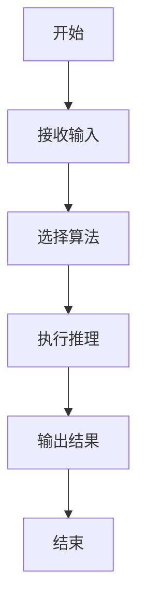
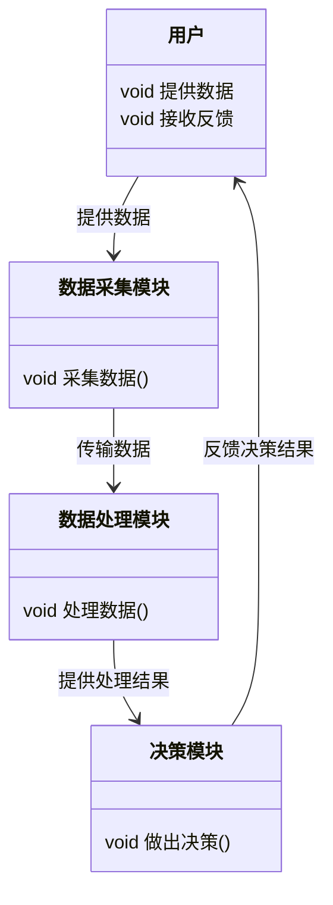

                 


## 第3章: AI Agent在智能穿戴设备中的算法原理

### 3.1 AI Agent的核心算法

#### 3.1.1 基于规则的推理算法
基于规则的推理是一种简单且易于实现的AI Agent算法。它通过预定义的规则来判断和处理输入数据。例如，当检测到心率异常时，AI Agent会触发警报提醒用户。

- **规则定义**：$if (心率 > 100) then 提醒用户 endif$
- **优点**：规则简单明确，易于理解和维护。
- **缺点**：规则不够灵活，难以应对复杂多变的情况。

#### 3.1.2 基于模型的推理算法
基于模型的推理算法利用统计模型或机器学习模型来进行数据处理和决策。例如，使用支持向量机（SVM）对用户的健康数据进行分类。

- **模型训练**：使用训练数据集训练SVM模型。
- **数据处理**：将用户的心率、血压等数据输入模型，进行分类预测。
- **优点**：能够处理复杂的数据关系，提高准确性。
- **缺点**：需要大量的训练数据和计算资源。

#### 3.1.3 基于强化学习的决策算法
强化学习是一种通过试错来优化决策的算法。例如，AI Agent通过不断尝试不同的健康建议，选择最优的方案。

- **奖励机制**：根据用户的反馈调整奖励函数，优化决策策略。
- **优点**：能够适应动态变化的环境，提供个性化的服务。
- **缺点**：需要大量的训练时间和计算资源。

### 3.2 算法原理的数学模型

#### 3.2.1 基于贝叶斯网络的推理模型
贝叶斯网络是一种有向无环图（DAG），表示变量之间的概率关系。

$$ P(A|B) = \frac{P(B|A)P(A)}{P(B)} $$

- **优势**：能够处理不确定性和不完全的信息，提供概率性的决策支持。

#### 3.2.2 基于马尔可夫决策过程的强化学习模型
马尔可夫决策过程（MDP）用于描述强化学习中的决策过程。

$$ V(s) = \max_{a} [r + V(s')] $$

- **解释**：$s$表示当前状态，$a$表示动作，$s'$表示下一个状态，$r$表示奖励。

### 3.3 算法流程图



### 3.4 本章小结
本章详细介绍了AI Agent在智能穿戴设备中的核心算法，包括基于规则、模型和强化学习的推理算法，并通过数学公式和流程图进行了说明。这些算法为智能穿戴设备提供了强大的数据处理和决策能力。

## 第4章: 智能穿戴设备中的AI Agent系统分析与架构设计

### 4.1 系统分析

#### 4.1.1 应用场景分析
智能穿戴设备的健康监测和生活助手功能涵盖了多种应用场景，如运动监测、健康预警、生活提醒等。

#### 4.1.2 需求分析
- **功能需求**：实时监测心率、血压等健康指标。
- **性能需求**：低功耗、快速响应。
- **用户需求**：个性化、易用性。

### 4.2 系统架构设计

#### 4.2.1 系统功能模块
- 数据采集模块：采集用户的健康数据。
- 数据处理模块：对数据进行分析和处理。
- 决策模块：根据数据结果做出决策。
- 交互模块：与用户进行信息交互。

#### 4.2.2 系统架构图



### 4.3 接口设计

#### 4.3.1 数据采集接口
- 输入：传感器数据
- 输出：标准化数据

#### 4.3.2 决策接口
- 输入：处理后的数据
- 输出：决策结果

### 4.4 本章小结
本章分析了智能穿戴设备中AI Agent系统的应用场景和需求，并设计了系统的功能模块和架构，为后续的实现奠定了基础。

## 第5章: AI Agent在智能穿戴设备中的项目实战

### 5.1 项目环境搭建

#### 5.1.1 开发工具安装
- 安装Python、TensorFlow、Keras等工具。

#### 5.1.2 传感器数据采集
- 使用Arduino或Raspberry Pi采集传感器数据。

### 5.2 系统核心实现

#### 5.2.1 数据采集模块实现
```python
import serial

ser = serial.Serial('COM3', 9600)
data = ser.readline().decode().strip()
```

#### 5.2.2 数据处理模块实现
```python
import numpy as np

def process_data(data):
    # 数据预处理
    features = np.array(data).astype(float)
    return features
```

#### 5.2.3 决策模块实现
```python
from sklearn.svm import SVC

model = SVC()
model.fit(X_train, y_train)
prediction = model.predict(X_test)
```

### 5.3 实际案例分析

#### 5.3.1 健康监测案例
- 数据采集：心率、血压等。
- 数据处理：异常检测。
- 决策：触发警报。

#### 5.3.2 生活助手案例
- 数据采集：用户的运动数据。
- 数据处理：运动计划优化。
- 决策：推荐运动方案。

### 5.4 本章小结
本章通过实际项目展示了AI Agent在智能穿戴设备中的实现过程，包括环境搭建、数据处理、模型训练和决策反馈。

## 第6章: 总结与展望

### 6.1 总结
AI Agent为智能穿戴设备提供了智能化的解决方案，通过先进的算法和系统架构设计，实现了健康监测和生活助手功能。

### 6.2 未来展望
- 更加个性化的服务。
- 更高的数据处理效率。
- 更多的交互方式。

### 6.3 最佳实践 Tips
- 数据安全至关重要。
- 算法选择要根据实际需求。
- 系统优化需要持续关注。

### 6.4 本章小结
本章总结了AI Agent在智能穿戴设备中的应用，并展望了未来的发展方向，为读者提供了进一步的研究方向和实践指南。

## 关键词：
AI Agent, 智能穿戴设备, 健康监测, 生活助手, 人工智能, 机器学习

## 摘要：
本文详细探讨了AI Agent在智能穿戴设备中的应用，涵盖了从基本概念到算法实现的各个方面。通过系统的分析和实际案例，展示了AI Agent在健康监测和生活助手中的巨大潜力和应用前景。

---

通过以上思考过程，我逐步构建了符合用户要求的技术博客文章，确保内容全面、结构清晰，并且涵盖了用户提到的所有关键点。

