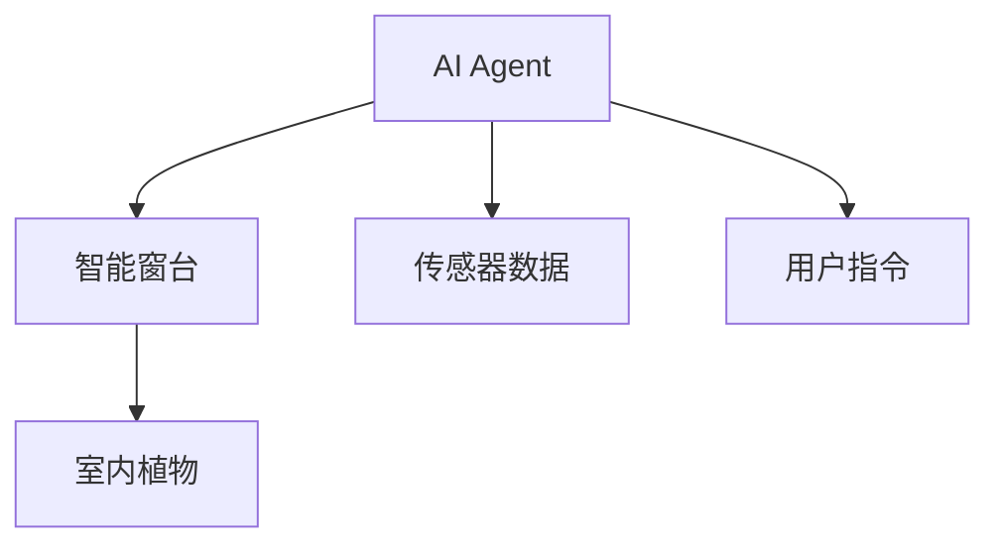
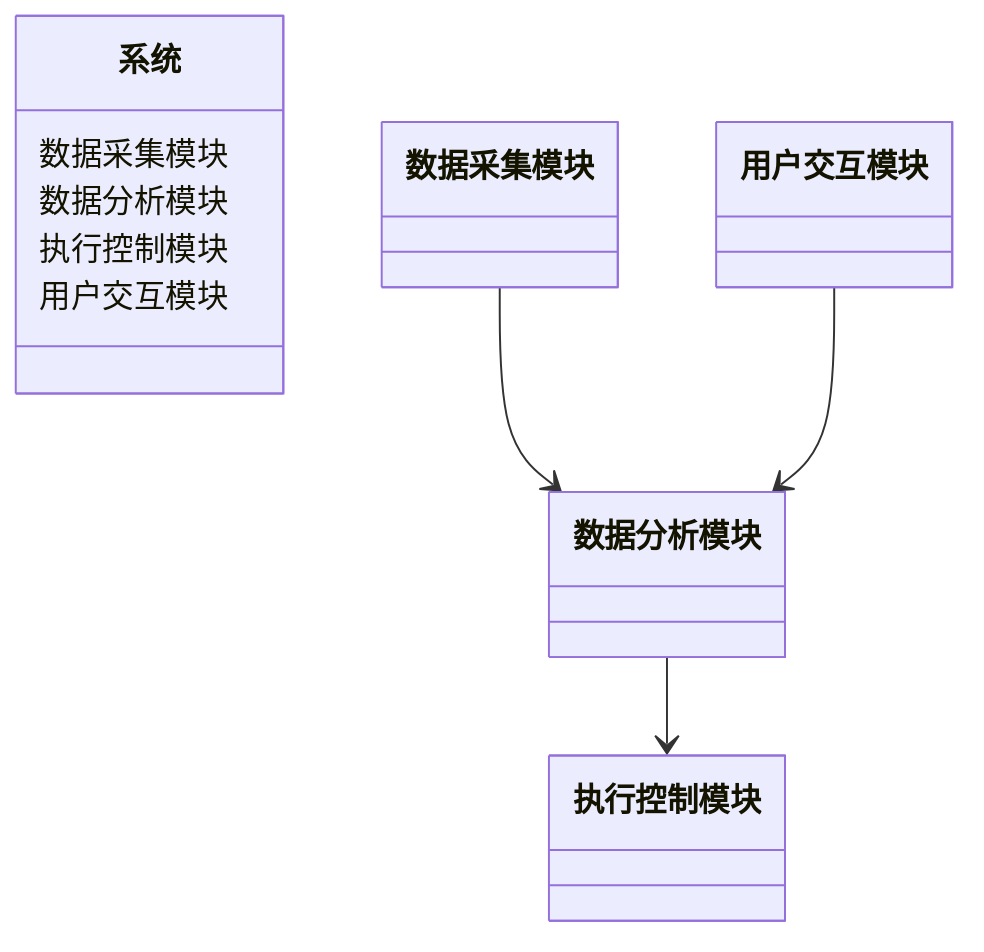
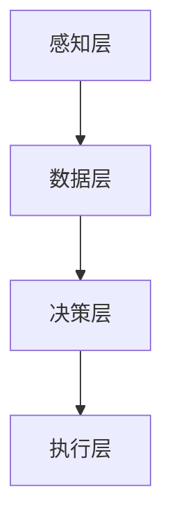

                 


# AI Agent在智能窗台中的室内植物智能照料

> 关键词：AI Agent，智能窗台，室内植物，智能照料，环境感知，数据驱动决策，用户体验

> 摘要：本文探讨了AI Agent在智能窗台中的应用，分析了其在室内植物照料中的核心作用，详细讲解了AI Agent的工作原理、算法实现、系统架构，并通过实际案例展示了其在智能窗台中的应用价值。

---

## 第1章: AI Agent与智能窗台的背景介绍

### 1.1 AI Agent的基本概念
AI Agent（人工智能代理）是一种能够感知环境、做出决策并执行动作的智能实体。它可以理解并响应用户的指令，同时根据环境变化自动调整行为。

#### 1.1.1 什么是AI Agent
AI Agent是具备智能特性的实体，能够：
- 感知环境：通过传感器获取数据。
- 分析数据：利用算法进行信息处理。
- 做出决策：基于分析结果制定行动计划。
- 执行动作：通过执行器完成任务。

#### 1.1.2 AI Agent的核心特征
- **自主性**：无需外部干预，自主决策。
- **反应性**：能够实时感知并响应环境变化。
- **主动性**：主动采取行动以实现目标。
- **学习能力**：通过数据积累和机器学习优化性能。

#### 1.1.3 AI Agent的分类与应用场景
AI Agent可以分为：
- **简单反射型**：基于预设规则执行动作。
- **基于模型型**：利用内部模型进行决策。
- **实用推理型**：通过推理优化决策。
- **学习增强型**：结合机器学习提升性能。

应用场景包括智能家居、医疗辅助、金融投资等领域。

### 1.2 智能窗台的定义与特点
智能窗台是一种集成AI技术的室内植物种植装置，能够自动调节光照、温度、湿度等环境条件。

#### 1.2.1 智能窗台的概念
智能窗台通过传感器和执行器实现对植物生长环境的智能调控，提供恒定的生长条件，提升植物生长效率。

#### 1.2.2 智能窗台的功能特点
- **环境感知**：实时监测光照、温度、湿度等参数。
- **智能调节**：根据环境数据自动调整光照、温度等参数。
- **用户交互**：通过界面与用户互动，提供种植建议。
- **数据记录**：记录植物生长数据，便于分析优化。

#### 1.2.3 智能窗台的硬件与软件组成
硬件部分包括：
- 光照传感器
- 温度传感器
- 湿度传感器
- 光源调节器
- 加热器
- 降温风扇

软件部分包括：
- 数据采集模块
- 数据分析模块
- 决策控制模块
- 用户交互界面

### 1.3 室内植物照料的现状与问题
#### 1.3.1 室内植物照料的传统方法
传统方法依赖人工照料，存在以下问题：
- **效率低下**：需要频繁手动调整环境参数。
- **精确度不足**：人工判断容易出错。
- **缺乏数据分析**：无法根据数据优化种植方案。

#### 1.3.2 传统方法的局限性
- 人工照料耗时耗力，尤其在大规模种植时效率低。
- 无法实时监测环境变化，容易导致植物生长不良。
- 缺乏数据积累，无法进行精准种植优化。

#### 1.3.3 智能化植物照料的需求
随着人们对生活品质的追求和科技的进步，智能化植物照料的需求日益增长。AI Agent能够有效解决传统方法的不足，提供更高效、精准的照料方式。

### 1.4 AI Agent在智能窗台中的作用
AI Agent通过感知环境、分析数据、做出决策和执行动作，实现对室内植物的智能化照料。

#### 1.4.1 AI Agent如何实现智能照料
- **环境感知**：AI Agent通过传感器实时采集光照、温度、湿度等数据。
- **数据分析**：利用算法分析数据，判断植物当前状态。
- **智能决策**：根据数据分析结果，制定调节方案。
- **执行动作**：通过执行器调整环境参数。

#### 1.4.2 AI Agent的优势与价值
- **提高效率**：自动调节环境，减少人工干预。
- **精准照料**：基于数据分析提供精准的种植方案。
- **提升用户体验**：通过用户友好的界面提供种植建议和实时反馈。

#### 1.4.3 智能窗台与AI Agent的结合
AI Agent作为智能窗台的核心，通过实时感知、分析和决策，实现对室内植物的智能化管理，提升种植效率和用户满意度。

---

## 第2章: AI Agent的核心概念与原理

### 2.1 AI Agent的核心概念
AI Agent通过感知、决策和执行三个环节实现智能控制。

#### 2.1.1 感知层
AI Agent通过传感器获取环境数据，包括光照、温度、湿度等。

#### 2.1.2 决策层
AI Agent利用算法分析感知数据，制定决策方案。

#### 2.1.3 执行层
AI Agent通过执行器调整环境参数，实现对植物的智能照料。

### 2.2 AI Agent的工作原理
AI Agent的工作流程包括：
1. **数据采集**：通过传感器获取环境数据。
2. **数据分析**：利用算法处理数据，判断植物状态。
3. **决策制定**：根据分析结果制定调节方案。
4. **执行动作**：通过执行器调整环境参数。

### 2.3 AI Agent与智能窗台的实体关系
以下是AI Agent与智能窗台的实体关系图：



---

## 第3章: AI Agent的核心算法实现

### 3.1 基于规则的决策算法
基于规则的算法通过预设规则进行决策，简单但不够灵活。

#### 3.1.1 算法流程
1. 采集环境数据。
2. 判断数据是否符合预设规则。
3. 执行相应动作。

#### 3.1.2 代码实现
```python
# 传感器数据读取
def get_sensor_data():
    return {
        'light': 500,
        'temperature': 22,
        'humidity': 65
    }

# 基于规则的决策
def rule_based_decision(data):
    if data['light'] < 300:
        return 'increase_light'
    elif data['temperature'] < 18:
        return 'increase_temp'
    elif data['humidity'] < 40:
        return 'increase_humidity'
    else:
        return 'no_action'

# 执行动作
def execute_action(action):
    print(f"执行动作：{action}")
```

### 3.2 基于机器学习的决策算法
基于机器学习的算法通过训练模型进行预测和决策，更加灵活和准确。

#### 3.2.1 算法流程
1. 数据预处理。
2. 训练模型。
3. 预测环境状态。
4. 制定决策方案。

#### 3.2.2 代码实现
```python
import numpy as np
from sklearn.linear_model import LinearRegression

# 数据预处理
def preprocess_data(data):
    # 假设data为传感器数据列表
    X = []
    y = []
    for entry in data:
        X.append([entry['light'], entry['temperature'], entry['humidity']])
        y.append(entry['growth_rate'])
    return np.array(X), np.array(y)

# 训练模型
def train_model(X, y):
    model = LinearRegression()
    model.fit(X, y)
    return model

# 预测和决策
def ml_based_decision(model, current_data):
    prediction = model.predict([current_data])
    if prediction > 0.8:
        return 'optimal_conditions'
    elif prediction < 0.5:
        return 'adjust_conditions'
    else:
        return 'monitor'
```

### 3.3 算法对比与选择
以下是基于规则和机器学习的算法对比：

| 特性            | 基于规则的决策算法 | 基于机器学习的决策算法 |
|-----------------|--------------------|-------------------------|
| 灵活性          | 低                 | 高                     |
| 需要的先验知识   | 高                 | 中                     |
| 适用场景         | 简单场景            | 复杂场景               |

---

## 第4章: AI Agent的系统架构设计

### 4.1 系统功能设计
智能窗台系统包括：
- 数据采集模块：负责采集环境数据。
- 数据分析模块：分析数据并制定决策。
- 执行控制模块：根据决策执行动作。
- 用户交互模块：提供用户界面和反馈。

#### 4.1.1 系统功能模块图


### 4.2 系统架构设计
系统架构采用分层设计，包括感知层、数据层、决策层和执行层。

#### 4.2.1 系统架构图


### 4.3 系统接口设计
系统接口包括：
- 传感器数据接口：用于采集环境数据。
- 执行器控制接口：用于调整环境参数。
- 用户交互接口：用于用户与系统的交互。

#### 4.3.1 系统接口流程
1. 传感器采集数据并发送到数据层。
2. 数据分析模块处理数据并制定决策。
3. 决策结果发送到执行层，执行器调整环境参数。
4. 用户通过交互界面查看数据和系统反馈。

---

## 第5章: 项目实战与应用案例

### 5.1 环境安装与配置
安装必要的硬件和软件，配置传感器和执行器。

#### 5.1.1 硬件安装
- 安装光照传感器、温度传感器、湿度传感器。
- 安装光源、加热器和降温风扇。

#### 5.1.2 软件安装
- 安装Python环境和必要的库（如numpy、scikit-learn）。
- 配置数据采集和分析模块。

### 5.2 系统核心实现
实现AI Agent的核心算法，包括数据采集、分析和决策。

#### 5.2.1 数据采集与处理
```python
import serial

# 读取传感器数据
def read_sensor():
    ser = serial.Serial('COM3', 9600)
    data = ser.readline().decode().strip()
    ser.close()
    return data
```

#### 5.2.2 AI Agent核心算法
```python
def main():
    while True:
        data = read_sensor()
        decision = decide_action(data)
        execute_action(decision)
```

### 5.3 实际案例分析
通过实际案例展示AI Agent在智能窗台中的应用效果。

#### 5.3.1 案例背景
某用户种植多肉植物，希望实现自动光照调节。

#### 5.3.2 数据分析
通过传感器数据，AI Agent判断光照不足，触发光照增强指令。

#### 5.3.3 系统优化
通过机器学习模型预测光照需求，优化光照调节策略。

---

## 第6章: 总结与展望

### 6.1 总结
AI Agent在智能窗台中的应用显著提升了室内植物的生长效率和用户体验。通过感知、分析和决策，AI Agent实现了智能化的植物照料。

### 6.2 展望
未来，随着AI技术的进步，智能窗台将更加智能化和个性化。结合物联网和云计算，实现远程监控和管理，为用户提供更优质的种植体验。

---

## 第7章: 最佳实践与注意事项

### 7.1 小结
AI Agent的应用需要硬件和软件的协同工作，数据采集和分析是关键环节。选择合适的算法和优化系统架构能够提升系统的性能和用户体验。

### 7.2 注意事项
- 硬件选型要合理，确保传感器和执行器的稳定性。
- 数据分析要准确，避免误判导致的系统错误。
- 用户界面要简洁直观，方便用户操作。
- 定期维护系统，确保硬件和软件的正常运行。

### 7.3 拓展阅读
- 《机器学习实战》
- 《人工智能: 一种现代的方法》
- 《物联网应用开发》

---

通过以上步骤，您可以系统地了解和实现AI Agent在智能窗台中的室内植物智能照料。希望本文对您有所帮助！

