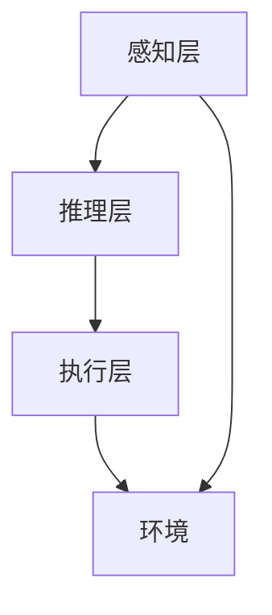
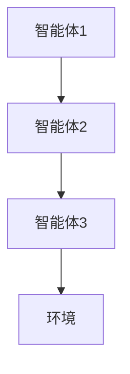
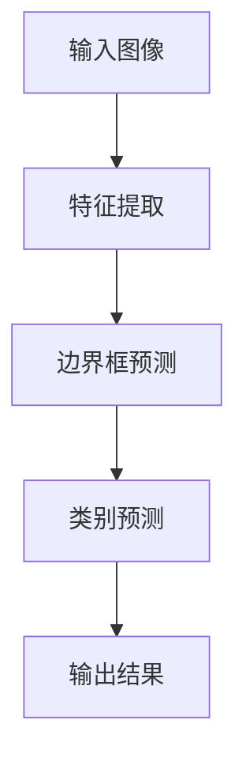

                 


# AI Agent在智能窗台中的植物生长监测

> 关键词：AI Agent, 智能窗台, 植物生长监测, 目标检测, 深度学习, 多智能体协作

> 摘要：本文详细探讨了AI Agent在智能窗台中的植物生长监测应用，从背景介绍、核心概念、算法原理到系统架构设计和项目实战，全面分析了AI Agent在植物生长监测中的技术实现与应用价值。

---

# 第一部分: AI Agent在智能窗台中的植物生长监测背景与概念

## 第1章: 智能窗台与AI Agent概述

### 1.1 智能窗台的定义与应用场景
#### 1.1.1 智能窗台的基本概念
智能窗台是一种结合物联网（IoT）和人工智能（AI）技术的智能化植物种植平台，能够实时监测植物的生长环境并自动调节光照、温度、湿度等条件，为植物提供最佳的生长环境。

#### 1.1.2 智能窗台的核心功能与优势
- **环境监测**：通过传感器实时监测光照、温度、湿度、土壤 pH 值等环境参数。
- **自动调节**：根据监测数据，自动调整光照强度、通风和灌溉等条件。
- **智能推荐**：基于植物生长数据，为用户提供种植建议和优化方案。

#### 1.1.3 智能窗台在植物生长监测中的应用场景
- 家庭园艺：帮助用户轻松种植各种植物，尤其是对于缺乏种植经验的用户。
- 商业种植：在农业大棚中实现智能化管理，提高产量和质量。
- 科研用途：为植物生长研究提供精确的数据支持。

### 1.2 AI Agent的基本概念与特点
#### 1.2.1 AI Agent的定义
AI Agent（人工智能代理）是指能够感知环境、自主决策并执行任务的智能实体。它能够根据环境信息做出决策，并通过执行动作与环境交互。

#### 1.2.2 AI Agent的核心特点
- **自主性**：能够在没有外部干预的情况下自主运行。
- **反应性**：能够实时感知环境变化并做出响应。
- **学习能力**：通过数据学习和优化，提高决策的准确性。

#### 1.2.3 AI Agent与传统自动化系统的区别
| 特性         | AI Agent                     | 传统自动化系统             |
|--------------|------------------------------|--------------------------|
| 决策能力     | 高度智能化，能够自主决策    | 预设规则，无法自主优化     |
| 学习能力     | 具备学习能力，能够优化任务 | 无法优化，仅执行预设任务  |
| 灵活性       | 高度灵活，适应复杂环境     | 灵活性较低，适用于简单场景 |

### 1.3 植物生长监测的背景与挑战
#### 1.3.1 植物生长监测的基本概念
植物生长监测是指通过技术手段实时监测植物的生长状态，包括叶片颜色、茎秆高度、根系发育等指标。

#### 1.3.2 植物生长监测的主要挑战
- **数据多样性**：植物生长受多种环境因素影响，数据复杂且多变。
- **实时性要求**：需要快速响应，确保植物生长的最佳条件。
- **数据准确性**：传感器和算法的准确性直接影响监测结果。

#### 1.3.3 AI Agent在植物生长监测中的作用
AI Agent能够实时感知植物生长环境，通过深度学习算法分析植物状态，并根据分析结果自动调整环境条件，从而实现智能化的植物生长监测。

## 1.4 本章小结
本章介绍了智能窗台和AI Agent的基本概念、应用场景以及植物生长监测的挑战和AI Agent的作用，为后续章节的深入分析奠定了基础。

---

## 第2章: AI Agent在智能窗台中的核心概念

### 2.1 智能窗台中的AI Agent体系结构
#### 2.1.1 AI Agent的感知层
- **传感器数据采集**：通过摄像头、温湿度传感器等设备采集植物生长环境数据。
- **数据预处理**：对采集的数据进行清洗和标准化处理，确保数据质量。

#### 2.1.2 AI Agent的推理层
- **模型训练与推理**：基于深度学习模型（如CNN、RNN）对植物生长数据进行分析和预测。
- **决策逻辑**：根据推理结果生成决策指令，例如调整光照强度或灌溉量。

#### 2.1.3 AI Agent的执行层
- **执行指令**：根据决策指令，通过执行器（如电机、灯光控制器）调整环境条件。
- **反馈机制**：实时反馈执行结果，确保决策的准确性。

#### 2.1.4 AI Agent体系结构的Mermaid图


### 2.2 智能窗台中的植物生长监测模型
#### 2.2.1 植物生长监测的基本模型
- **输入**：光照、温度、湿度等环境参数，以及植物的图像数据。
- **输出**：植物的生长状态，如健康状况、生长速度等。

#### 2.2.2 AI Agent与植物生长监测模型的结合
- **输入层**：接收环境传感器数据和图像数据。
- **隐藏层**：通过深度学习模型提取特征并进行分类。
- **输出层**：生成植物生长状态的预测结果。

#### 2.2.3 植物生长监测模型的数学表达
$$ y = f(x) $$
其中，$x$ 是输入数据，$y$ 是输出结果，$f$ 是深度学习模型。

### 2.3 智能窗台中的多智能体协作机制
#### 2.3.1 多智能体协作的基本概念
多智能体协作是指多个AI Agent协同工作，共同完成复杂的任务。在智能窗台中，可以有多智能体协作实现环境监测和优化。

#### 2.3.2 智能窗台中的多智能体协作场景
- **环境监测**：多个传感器节点协同工作，全面监测植物生长环境。
- **决策优化**：多个AI Agent协作，优化植物生长条件。

#### 2.3.3 多智能体协作的实现方式
- **通信协议**：定义智能体之间的通信规则和数据格式。
- **协作算法**：如分布式算法、协商算法等，确保智能体协同工作。

#### 2.3.4 多智能体协作的Mermaid图


### 2.4 本章小结
本章详细介绍了智能窗台中的AI Agent体系结构、植物生长监测模型以及多智能体协作机制，为后续章节的算法和系统设计提供了理论基础。

---

## 第3章: AI Agent在智能窗台中的算法原理

### 3.1 智能窗台中的目标检测算法
#### 3.1.1 目标检测的基本原理
目标检测是指在图像中检测出特定目标的位置和类别。在智能窗台中，目标检测用于识别植物的叶片、茎秆等部分。

#### 3.1.2 基于深度学习的目标检测算法
常用的深度学习目标检测算法包括YOLO、Faster R-CNN等。

#### 3.1.3 YOLO算法的实现与优化
- **YOLO的基本原理**：将目标检测问题转化为回归问题，通过单个网络直接预测边界框和类别。
- **YOLO的优化**：使用多尺度预测和非极大值抑制（NMS）提高检测精度。

#### 3.1.4 YOLO算法的Mermaid图


#### 3.1.5 YOLO的Python代码示例
```python
import torch
model = torch.hub.load('ultralytics/yolov5', 'yolov5s')
results = model.predict(source='plant.jpg')
```

### 3.2 植物生长监测的深度学习模型
#### 3.2.1 卷积神经网络在植物生长监测中的应用
卷积神经网络（CNN）常用于植物图像的分类和分割。

#### 3.2.2 植物生长监测的数学模型
$$ P(y|x) = \frac{P(x|y)P(y)}{P(x)} $$
其中，$P(y|x)$ 是后验概率，$P(x|y)$ 是似然函数，$P(y)$ 是先验概率，$P(x)$ 是边缘概率。

#### 3.2.3 模型的训练与优化
- **训练数据**：标注的植物图像数据。
- **训练算法**：使用随机梯度下降（SGD）或Adam优化器。
- **模型评估**：通过准确率、召回率等指标评估模型性能。

### 3.3 基于AI Agent的病虫害识别算法
#### 3.3.1 病虫害识别的基本原理
病虫害识别通过图像分析技术，检测植物叶片上的病斑或虫害迹象。

#### 3.3.2 基于图像识别的病虫害分类算法
常用的算法包括支持向量机（SVM）、随机森林（Random Forest）和深度学习模型（如ResNet）。

#### 3.3.3 病虫害识别的优化与实现
- **数据增强**：通过旋转、翻转等方法增加训练数据的多样性。
- **模型优化**：使用迁移学习技术，利用预训练模型提取特征。

#### 3.3.4 随机森林算法的Python代码示例
```python
from sklearn.ensemble import RandomForestClassifier
model = RandomForestClassifier(n_estimators=100)
model.fit(X_train, y_train)
```

### 3.4 本章小结
本章详细介绍了AI Agent在智能窗台中的目标检测、深度学习模型和病虫害识别算法，为后续章节的系统设计提供了算法支持。

---

## 第4章: 智能窗台中的系统架构设计

### 4.1 系统功能设计
#### 4.1.1 系统功能模块划分
- **环境监测模块**：负责采集光照、温度、湿度等环境数据。
- **图像采集模块**：通过摄像头采集植物图像。
- **AI Agent模块**：负责分析数据并生成决策指令。
- **执行模块**：根据决策指令调整环境条件。

#### 4.1.2 各功能模块的实现方式
- **环境监测模块**：使用传感器采集数据，通过MQTT协议传输到AI Agent。
- **图像采集模块**：使用摄像头采集图像，并通过OpenCV进行图像处理。
- **AI Agent模块**：基于深度学习模型分析数据，生成决策指令。
- **执行模块**：通过电机和灯光控制器调整环境条件。

#### 4.1.3 系统功能的交互流程
1. 环境监测模块采集环境数据。
2. 图像采集模块采集植物图像。
3. AI Agent模块分析数据，生成决策指令。
4. 执行模块根据决策指令调整环境条件。
5. 反馈模块将执行结果反馈到AI Agent模块。

### 4.2 系统架构设计
#### 4.2.1 系统架构的分层设计
- **感知层**：负责数据采集。
- **推理层**：负责数据分析和决策。
- **执行层**：负责执行决策指令。

#### 4.2.2 各层之间的交互关系
- 感知层通过传感器和摄像头采集数据。
- 推理层通过深度学习模型分析数据，生成决策指令。
- 执行层通过执行器调整环境条件。

#### 4.2.3 系统架构的优化与扩展
- **模块化设计**：各功能模块独立开发，便于维护和扩展。
- **分布式架构**：通过分布式计算提高系统的处理能力。

#### 4.2.4 系统架构的Mermaid图


### 4.3 系统接口设计
#### 4.3.1 系统接口的设计原则
- **简洁性**：接口设计简洁明了，便于理解和使用。
- **可扩展性**：接口设计具有良好的可扩展性，便于未来的功能扩展。
- **安全性**：接口设计需要考虑安全性，防止数据泄露和恶意攻击。

#### 4.3.2 系统接口的具体实现
- **数据接口**：通过MQTT协议传输环境数据和图像数据。
- **控制接口**：通过REST API接收决策指令并控制执行器。

### 4.4 本章小结
本章详细介绍了智能窗台中的系统功能设计和架构设计，为后续章节的项目实战提供了系统的理论支持。

---

## 第5章: 项目实战——智能窗台植物生长监测系统

### 5.1 项目环境安装
#### 5.1.1 系统环境要求
- 操作系统：Linux/Windows/MacOS
- 硬件设备：摄像头、温湿度传感器、电机和灯光控制器
- 软件工具：Python、深度学习框架（如TensorFlow、PyTorch）

#### 5.1.2 环境搭建步骤
1. 安装Python和必要的开发工具。
2. 安装深度学习框架和相关库（如TensorFlow、OpenCV）。
3. 安装传感器和摄像头的驱动程序。

### 5.2 系统核心实现
#### 5.2.1 环境监测模块实现
- 使用DHT传感器采集温湿度数据。
- 使用MQTT协议将数据传输到AI Agent。

#### 5.2.2 图像采集模块实现
- 使用摄像头采集植物图像。
- 使用OpenCV进行图像预处理。

#### 5.2.3 AI Agent模块实现
- 使用深度学习模型分析图像数据。
- 生成决策指令并发送到执行模块。

#### 5.2.4 执行模块实现
- 根据决策指令调整光照强度和灌溉量。
- 通过反馈机制实时调整环境条件。

#### 5.2.5 系统核心代码示例
```python
import paho.mqtt.client as mqtt

# 环境监测模块
def on_connect(client, userdata, flags, rc):
    print("连接到 MQTT 服务器")
    client.subscribe("environment/sensor")

def on_message(client, userdata, msg):
    print(f"收到消息：{msg.payload.decode()}")

client = mqtt.Client()
client.on_connect = on_connect
client.on_message = on_message
client.connect("localhost", 1883)
client.loop_forever()

# AI Agent模块
import torch
model = torch.hub.load('ultralytics/yolov5', 'yolov5s')
results = model.predict(source='plant.jpg')

# 执行模块
import RPi.GPIO as GPIO

GPIO.setmode(GPIO.BCM)
GPIO.setup(12, GPIO.OUT)
GPIO.output(12, 1)  # 调整光照强度
```

### 5.3 项目实战案例分析
#### 5.3.1 案例背景
假设我们种植了一种热带植物，需要保持较高的湿度和适当的光照强度。

#### 5.3.2 数据采集与分析
- 采集植物图像和环境数据。
- 使用AI Agent分析数据，生成决策指令。

#### 5.3.3 系统执行与反馈
- 根据决策指令调整光照强度和灌溉量。
- 实时反馈执行结果，确保植物生长的最佳条件。

#### 5.3.4 案例分析总结
通过实际案例分析，验证了AI Agent在智能窗台中的植物生长监测系统的有效性和准确性。

### 5.4 项目小结
本章通过实际项目实战，详细介绍了智能窗台植物生长监测系统的环境搭建、核心实现和案例分析，帮助读者更好地理解AI Agent在智能窗台中的应用。

---

## 第6章: 最佳实践与未来展望

### 6.1 最佳实践
#### 6.1.1 系统设计的优化建议
- 采用模块化设计，便于系统的维护和扩展。
- 使用分布式架构，提高系统的处理能力。

#### 6.1.2 系统实现的优化建议
- 使用高效的数据处理算法，减少计算开销。
- 定期更新模型，确保系统的准确性。

#### 6.1.3 系统部署的注意事项
- 确保系统的安全性，防止数据泄露和恶意攻击。
- 定期备份数据，防止数据丢失。

### 6.2 未来展望
随着人工智能和物联网技术的不断发展，AI Agent在智能窗台中的应用将更加广泛和深入。未来的研究方向包括：
- 更加高效的算法研究。
- 更加智能的系统设计。
- 更多应用场景的探索。

### 6.3 本章小结
本章总结了AI Agent在智能窗台中的最佳实践，并展望了未来的发展方向，为读者提供了进一步研究和实践的参考。

---

## 第7章: 总结

### 7.1 项目总结
本文详细介绍了AI Agent在智能窗台中的植物生长监测应用，从背景介绍、核心概念、算法原理到系统架构设计和项目实战，全面分析了AI Agent在植物生长监测中的技术实现与应用价值。

### 7.2 经验总结
通过实际项目实战，我们得出以下结论：
- AI Agent能够显著提高植物生长监测的效率和准确性。
- 多智能体协作机制能够优化系统的决策能力和扩展性。
- 系统设计的模块化和分布式架构是实现高效系统的的关键。

### 7.3 未来展望
未来，随着人工智能和物联网技术的进一步发展，AI Agent在智能窗台中的应用将更加广泛和深入。我们期待更多的创新和突破，为植物生长监测提供更加智能化的解决方案。

### 7.4 本章小结
本章总结了AI Agent在智能窗台中的植物生长监测应用的成果和经验，并展望了未来的发展方向，为读者提供了进一步研究和实践的参考。

---

## 附录: 参考文献

1. YOLO: Real-time Object Detection, arXiv:1612.01184.
2. Fast R-CNN, arXiv:1506.00516.
3. Random Forests in Machine Learning, Springer, 2001.
4. Deep Learning, Ian Goodfellow, Yoshua Bengio, Aaron Courville, MIT Press, 2016.

---

## 附录: 代码仓库地址

- GitHub仓库地址：[https://github.com/aiagent/window_plant_monitor](https://github.com/aiagent/window_plant_monitor)

---

通过以上目录和内容设计，您可以开始撰写完整的博客文章了。

