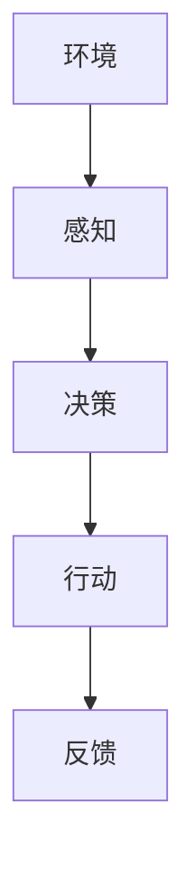
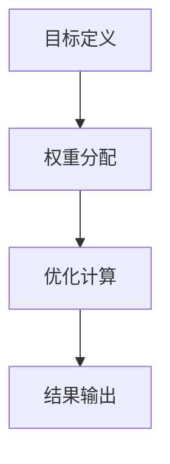
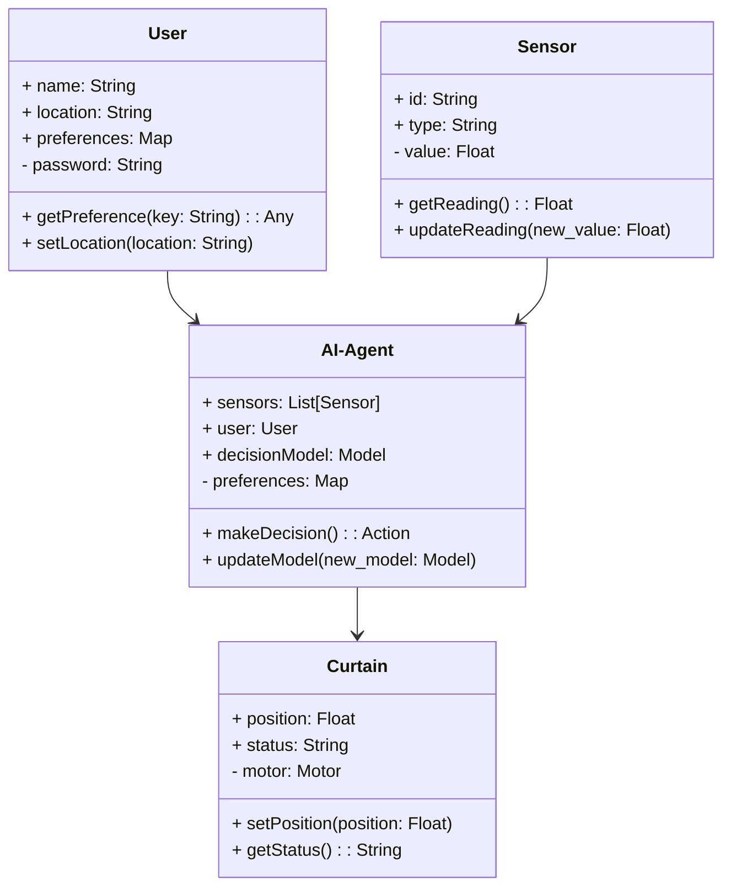
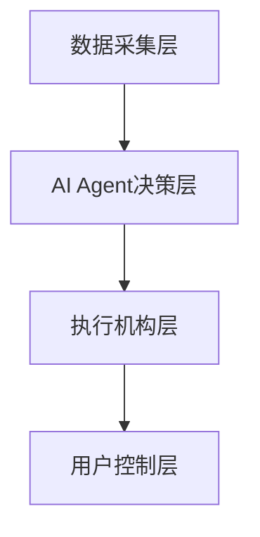
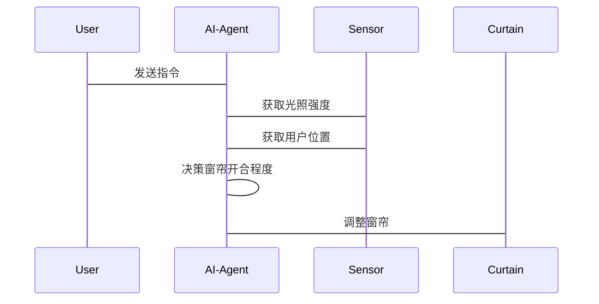

                 


```markdown
# AI Agent在智能窗帘中的日光与隐私平衡

> 关键词：AI Agent，智能窗帘，日光调节，隐私保护，多目标优化

> 摘要：本文探讨了AI Agent在智能窗帘中的应用，特别是在日光调节与隐私保护的平衡问题。通过分析AI Agent的核心概念、算法原理和系统架构，提出了实现日光调节与隐私保护平衡的解决方案，并通过项目实战展示了如何将理论应用于实际。文章最后给出了最佳实践建议，为智能窗帘的设计和优化提供了参考。

---

## 第1章：问题背景与需求分析

### 1.1 问题背景

#### 1.1.1 智能窗帘的发展现状
智能窗帘作为一种智能家居设备，近年来发展迅速。市场上常见的智能窗帘支持远程控制、语音助手操作和自动化功能，如根据日出日落时间自动开关。然而，这些功能在带来便利的同时，也引发了隐私保护和日光调节不够智能化的问题。

#### 1.1.2 日光调节与隐私保护的矛盾
传统智能窗帘的日光调节功能通常基于固定的定时规则，无法根据实际光照条件动态调整。此外，智能窗帘通常需要连接互联网，通过云端服务进行控制，这可能导致用户隐私信息的泄露。例如，窗帘的开关记录可能被不法分子利用，推断用户的作息习惯。

#### 1.1.3 AI Agent在智能窗帘中的应用前景
AI Agent（智能代理）是一种能够感知环境并自主决策的智能体。将其应用于智能窗帘，可以通过实时感知光照强度、用户习惯和环境安全等信息，动态调整窗帘的开合状态，从而实现智能化的日光调节和隐私保护。

### 1.2 需求分析

#### 1.2.1 用户需求分析
用户对智能窗帘的主要需求包括：方便控制、智能化调节、安全性高和隐私保护。例如，用户希望智能窗帘能够根据室内光照需求自动调整开合程度，同时防止未经授权的访问。

#### 1.2.2 功能需求分解
为了实现智能化的日光调节和隐私保护，智能窗帘需要具备以下功能：光照传感器、人体传感器、环境安全监测、AI Agent决策模块、用户控制接口（如手机APP、语音助手）。

#### 1.2.3 隐私保护的边界与外延
隐私保护不仅涉及防止未经授权的访问，还包括数据的加密传输、存储安全和用户权限管理。例如，用户可以选择是否共享某些数据，或者是否开启某些功能。

### 1.3 问题解决思路

#### 1.3.1 AI Agent的核心作用
AI Agent在智能窗帘中的作用是通过感知环境信息，动态调整窗帘的开合状态，从而实现日光调节和隐私保护的双重目标。例如，AI Agent可以根据室内光照需求和用户习惯，决定窗帘的开合程度。

#### 1.3.2 日光与隐私平衡的实现路径
实现日光与隐私的平衡需要综合考虑多个因素：光照调节需要最大化利用自然光，同时避免阳光直射导致的不适；隐私保护需要防止未经授权的访问，同时确保数据的安全性。AI Agent可以通过多目标优化算法，在这两者之间找到最佳平衡点。

#### 1.3.3 系统设计的初步框架
初步框架包括以下几个部分：数据采集（光照传感器、人体传感器、环境安全监测）、AI Agent决策模块、执行机构（电机驱动窗帘）、用户控制接口（手机APP、语音助手）、数据存储与分析。这些部分需要协同工作，实现智能化的日光调节和隐私保护。

### 1.4 本章小结
本章介绍了智能窗帘的发展现状，分析了日光调节与隐私保护之间的矛盾，并提出了AI Agent在智能窗帘中的应用前景。最后，明确了系统设计的初步框架，为后续章节的详细分析奠定了基础。

---

## 第2章：AI Agent的核心概念与原理

### 2.1 AI Agent的基本定义

#### 2.1.1 AI Agent的定义与特征
AI Agent是一种智能体，能够感知环境并自主决策。其主要特征包括自主性、反应性、目标导向和社交能力。在智能窗帘中，AI Agent需要具备感知环境（光照强度、用户位置、环境安全）和自主决策的能力。

#### 2.1.2 AI Agent的分类与应用场景
AI Agent可以分为简单反射型、基于模型的反射型、目标驱动型和效用驱动型。在智能窗帘中，AI Agent主要属于目标驱动型，其应用场景包括日光调节、隐私保护和用户行为预测。

#### 2.1.3 AI Agent在智能窗帘中的角色
AI Agent在智能窗帘中扮演决策者的角色，负责根据实时数据做出最优决策。例如，AI Agent可以根据室内光照需求和用户位置，决定窗帘的开合程度。

### 2.2 AI Agent的核心原理

#### 2.2.1 智能决策机制
AI Agent通过感知环境信息（光照强度、用户位置、环境安全）和历史数据，利用决策算法（如强化学习、多目标优化）做出最优决策。例如，AI Agent可以根据室内光照需求和用户习惯，决定窗帘的开合程度。

#### 2.2.2 多目标优化算法
在日光调节与隐私保护的平衡中，AI Agent需要同时优化多个目标（如最大化日光利用、最小化隐私泄露风险）。多目标优化算法可以帮助AI Agent在多个目标之间找到最佳平衡点。

#### 2.2.3 隐私保护机制
为了保护用户隐私，AI Agent需要具备数据加密、访问控制和匿名化处理等功能。例如，AI Agent可以在传输数据之前进行加密，确保数据的安全性。

### 2.3 AI Agent与智能窗帘的结合

#### 2.3.1 系统架构的初步设计
初步设计包括数据采集层（光照传感器、人体传感器、环境安全监测）、AI Agent决策层、执行机构层（电机驱动窗帘）、用户控制层（手机APP、语音助手）。各层之间通过通信协议（如MQTT）进行数据交互。

#### 2.3.2 AI Agent的功能模块划分
AI Agent的功能模块包括数据感知模块、决策模块和执行模块。数据感知模块负责收集环境信息，决策模块负责根据信息做出决策，执行模块负责将决策转化为实际行动。

#### 2.3.3 日光调节与隐私保护的平衡策略
AI Agent需要同时考虑日光调节和隐私保护的需求，通过多目标优化算法找到最佳平衡点。例如，AI Agent可以根据光照强度和用户隐私需求，动态调整窗帘的开合程度。

### 2.4 本章小结
本章详细介绍了AI Agent的基本定义、核心原理及其在智能窗帘中的应用。通过分析AI Agent的功能模块和系统架构，明确了AI Agent在实现日光调节与隐私保护平衡中的重要作用。

---

## 第3章：AI Agent的算法原理与数学模型

### 3.1 算法原理

#### 3.1.1 基于强化学习的决策算法
强化学习是一种通过试错机制优化决策的算法。AI Agent可以通过强化学习算法，在日光调节与隐私保护之间找到平衡点。例如，AI Agent可以通过奖励机制，鼓励最大化日光利用和最小化隐私泄露风险的行为。

#### 3.1.2 多目标优化算法
多目标优化算法是一种同时优化多个目标的算法。在智能窗帘中，AI Agent需要同时优化日光调节和隐私保护两个目标。通过多目标优化算法，AI Agent可以在两者之间找到最佳平衡点。

#### 3.1.3 隐私保护的数学模型
隐私保护的数学模型通常包括数据加密、访问控制等机制。例如，AI Agent可以通过加密算法（如AES）对敏感数据进行加密，确保数据的安全性。

### 3.2 算法流程图

#### 3.2.1 强化学习算法流程图


#### 3.2.2 多目标优化算法流程图


### 3.3 数学模型

#### 3.3.1 强化学习数学模型
强化学习的数学模型通常包括状态空间、动作空间和奖励函数。例如，状态空间可以表示为光照强度、用户位置、环境安全等；动作空间可以表示为窗帘的开合程度；奖励函数可以根据日光调节和隐私保护的综合效果进行定义。

#### 3.3.2 多目标优化数学模型
多目标优化的数学模型通常包括目标函数、约束条件和决策变量。例如，目标函数可以是最大化日光利用和最小化隐私泄露风险；约束条件可以是窗帘的开合范围、数据传输的安全性等。

### 3.4 本章小结
本章详细介绍了AI Agent的算法原理与数学模型，包括强化学习、多目标优化算法以及隐私保护的数学模型。通过流程图和数学公式，明确了AI Agent在智能窗帘中的决策机制。

---

## 第4章：系统分析与架构设计方案

### 4.1 问题场景介绍

#### 4.1.1 系统场景描述
智能窗帘系统需要在不同的光照条件下，动态调整窗帘的开合程度，同时保护用户隐私。例如，早晨阳光充足时，AI Agent可以自动调整窗帘的开合程度，以充分利用自然光；在晚上，AI Agent可以根据用户的活动情况，自动关闭窗帘以保护隐私。

#### 4.1.2 项目介绍
本项目旨在开发一款智能化的智能窗帘系统，通过AI Agent实现日光调节与隐私保护的平衡。系统主要包括数据采集、AI Agent决策、执行机构、用户控制等部分。

### 4.2 系统功能设计

#### 4.2.1 领域模型类图


#### 4.2.2 系统架构设计图


#### 4.2.3 系统接口设计
系统接口设计包括传感器接口、用户控制接口、数据存储接口等。例如，AI Agent可以通过传感器接口获取光照强度和用户位置信息，通过用户控制接口接收用户的指令，通过数据存储接口记录系统的运行数据。

#### 4.2.4 系统交互序列图


### 4.3 本章小结
本章详细介绍了智能窗帘系统的场景描述、功能设计、系统架构设计以及系统交互流程。通过Mermaid图和类图，明确了系统的各个组成部分及其相互关系。

---

## 第5章：项目实战

### 5.1 环境安装

#### 5.1.1 开发环境要求
项目实战需要安装Python编程语言、相关库（如TensorFlow、Keras、OpenCV）、传感器驱动、物联网平台（如MQTT）等。读者需要确保计算机上已经安装了这些软件和库。

#### 5.1.2 安装步骤说明
详细说明如何安装Python、相关库以及传感器驱动。例如，如何通过pip命令安装Python库，如何配置传感器驱动。

### 5.2 系统核心实现源代码

#### 5.2.1 AI Agent核心代码
提供AI Agent的核心代码，包括数据采集、决策算法、执行机构控制等部分。例如，如何通过传感器获取光照强度和用户位置信息，如何通过强化学习算法做出决策，如何通过电机控制窗帘的开合程度。

#### 5.2.2 代码解读与分析
对核心代码进行详细解读，说明每个部分的功能和实现方式。例如，代码中的数据采集模块如何与传感器通信，决策模块如何实现强化学习算法，执行机构如何根据决策结果调整窗帘的开合程度。

#### 5.2.3 代码实现的细节与注意事项
详细说明代码实现的细节，包括数据格式的处理、传感器数据的解析、算法的实现等。例如，如何将传感器数据转换为AI Agent可以处理的格式，如何实现强化学习算法的训练和推理。同时，提醒读者在代码实现过程中需要注意的问题，例如数据安全、代码优化、异常处理等。

### 5.3 实际案例分析

#### 5.3.1 案例背景介绍
介绍一个实际案例，例如一个家庭用户安装了智能窗帘系统，AI Agent通过感知光照强度和用户位置，动态调整窗帘的开合程度。

#### 5.3.2 案例实施过程
详细描述案例的实施过程，包括数据采集、AI Agent决策、执行机构控制等步骤。例如，AI Agent如何根据光照强度和用户位置，决定窗帘的开合程度。

#### 5.3.3 案例结果与分析
分析案例的结果，例如智能窗帘系统在实际使用中的效果，包括日光调节的效果、隐私保护的效果等。

### 5.4 项目小结
总结项目实战的成果，包括系统功能实现、代码实现的细节、案例分析的结果等。同时，提出改进建议，例如如何进一步优化AI Agent的决策算法，如何提高系统的安全性等。

---

## 第6章：最佳实践与总结

### 6.1 最佳实践 tips

#### 6.1.1 数据安全
建议读者在实现智能窗帘系统时，高度重视数据安全，确保传感器数据的加密传输和存储安全。例如，可以通过HTTPS协议进行数据传输，采用加密算法对数据进行加密存储。

#### 6.1.2 系统优化
建议读者在实现系统时，注重系统的可扩展性和可维护性。例如，可以通过模块化设计，将系统分为数据采集模块、决策模块、执行机构模块等，方便后续的功能扩展和维护。

#### 6.1.3 用户体验
建议读者在实现系统时，注重用户体验，例如通过友好的用户界面、智能的决策算法等，提高用户的使用体验。

### 6.2 小结
总结全文内容，回顾AI Agent在智能窗帘中的应用，强调实现日光调节与隐私保护平衡的重要性。

### 6.3 注意事项

#### 6.3.1 数据隐私保护
提醒读者在系统设计和实现过程中，必须重视数据隐私保护，防止用户数据被未经授权的访问或泄露。例如，可以通过设置访问权限、加密存储等方式保护用户隐私。

#### 6.3.2 系统安全性
提醒读者在系统实现过程中，注重系统的安全性，防止系统被黑客攻击或恶意篡改。例如，可以通过防火墙、入侵检测系统等措施提高系统的安全性。

#### 6.3.3 用户体验优化
提醒读者在系统设计和实现过程中，注重用户体验的优化，例如通过友好的用户界面、智能的决策算法等，提高用户的使用体验。

### 6.4 拓展阅读
推荐一些与AI Agent、智能系统设计相关的书籍和学术论文，例如《人工智能：一种现代方法》、《软件体系结构设计》等。

---

## 附录：AI Agent在智能窗帘中的日光与隐私平衡项目代码示例

```python
# 示例代码：AI Agent核心代码片段
import numpy as np
import tensorflow as tf
import json
import mqtt

# 数据采集模块
class SensorCollector:
    def __init__(self):
        self.light_sensor = LightSensor()
        self.user_sensor = UserSensor()

    def collect_data(self):
        light_intensity = self.light_sensor.read()
        user_presence = self.user_sensor.read()
        return {"light_intensity": light_intensity, "user_presence": user_presence}

# 决策模块
class AI-Agent:
    def __init__(self):
        self.model = self.build_model()
        self.model.load_weights("ai_agent_model.h5")

    def build_model(self):
        # 构建强化学习模型，例如DQN网络
        # 输入层、隐藏层、输出层的定义
        pass

    def decide_action(self, state):
        # 根据当前状态，决定窗帘的开合程度
        pass

# 执行机构模块
class CurtainController:
    def __init__(self):
        self.motor = Motor()

    def set_position(self, position):
        # 设置窗帘的开合程度
        self.motor.move(position)

# 用户控制模块
class UserController:
    def __init__(self):
        self.mqtt_client = mqtt.Client()
        self.mqtt_client.connect("localhost", 1883)

    def send_command(self, command):
        # 发送指令到MQTT Broker
        self.mqtt_client.publish("curtain_command", command)
```

---

### 总结
通过以上内容，我们详细探讨了AI Agent在智能窗帘中的日光与隐私平衡问题。从系统设计到算法实现，再到项目实战，逐步分析了如何通过AI Agent实现智能化的日光调节和隐私保护。同时，通过最佳实践和拓展阅读，为读者提供了进一步学习和实践的方向。希望这篇文章能够为智能窗帘的设计和优化提供有价值的参考。
```

